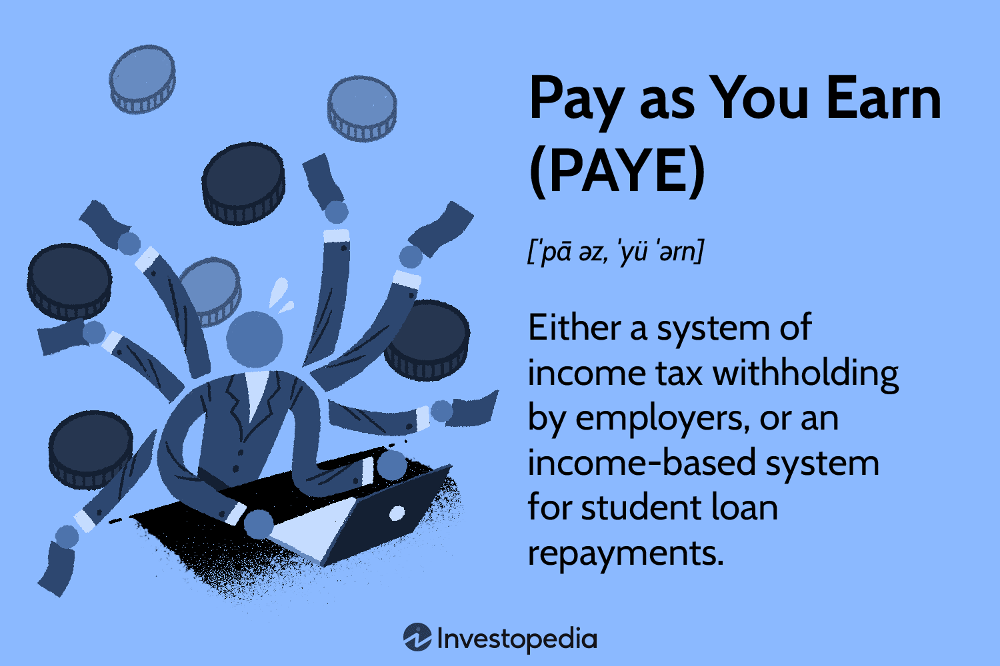

Pay As You Earn (PAYE) is a cornerstone in the landscape of income tax systems worldwide, playing a vital role in the efficient collection and management of taxes. For both employees and employers, understanding the dynamics of PAYE is essential for navigating the complexities of income tax compliance and personal financial management. PAYE typically requires employers to withhold income tax from their employees' wages or salaries, a method designed to streamline tax collection by ensuring taxes are paid regularly throughout the year rather than in a lump sum at the end of it.

This article aims to provide a comprehensive understanding of how PAYE operates in different contexts, including its role in income tax withholding and how it facilitates student loan repayments. In some regions, such as the United States, PAYE also refers to an income-driven plan for student loan repayment, where payment amounts are calculated based on an individual's income, offering flexibility and relief for those managing education-related debt.

Moreover, the rapidly growing trend of algorithmic trading, or algo trading, adds another layer of complexity to PAYE's impact on financial strategies. Algorithmic trading, which involves using computer algorithms to execute trades at high speeds, is reshaping financial markets and has tax implications that align with the principles of PAYE. Understanding the intersection between PAYE and algo trading is crucial for traders and financial professionals who must account for tax obligations that influence their net earnings and strategic decisions.

By examining these diverse aspects, we aim to shed light on the broader implications of PAYE, highlighting its significance and utility in modern financial and employment landscapes.

## Table of Contents

## What is Pay As You Earn (PAYE)?

Pay As You Earn (PAYE) is a dual-faceted system designed to manage income-related financial obligations effectively. It primarily functions as a method of withholding income tax at the source, where employers deduct the appropriate amount of tax directly from employees' wages before they are paid. This system ensures a streamlined taxation process that relieves employees from the complexities of calculating and remitting their tax liabilities independently. By facilitating tax payments at the time of [earning](/wiki/earning-announcement), PAYE helps in mitigating the risk of non-compliance and large tax bills at the end of the fiscal year.

In addition to its role in income tax, PAYE also refers to a student loan repayment strategy, particularly prominent in the United States. Under this scheme, the repayment of federal student loans is adjusted according to the borrower's income level rather than a predetermined fixed amount. This flexibility allows borrowers to make payments that are manageable relative to their earnings, typically constituting around 10% of their discretionary income. Discretionary income is calculated as the difference between the borrower's annual income and 150% of the poverty guideline for their family size and state of residence.

Mathematically, the monthly payment under the PAYE student loan plan can be expressed as:

$$
\text{Monthly Payment} = \frac{\text{Discretionary Income} \times 0.10}{12}
$$

Here, Discretionary Income is given by:

$$
\text{Discretionary Income} = \text{Annual Income} - 1.5 \times \text{Poverty Guideline}
$$

Furthermore, PAYE offers a pathway to loan forgiveness. Any remaining balance on the loan after 20 years of qualifying payments may be forgiven, offering substantial relief to borrowers who have yet to repay their debt due to low income. This aspect of PAYE provides essential financial relief to individuals who might otherwise struggle with the burden of educational debt.

By understanding the dual roles of PAYE, individuals can navigate their personal finances with greater efficacy, ensuring that their tax liabilities and loan repayment obligations are both manageable and aligned with their income levels.

## Understanding PAYE in Different Countries

The Pay As You Earn (PAYE) system varies across countries, each adapting the core principles of withholding taxes at the source to suit local tax laws and requirements. Despite these differences, the primary objective remains consistent: to facilitate efficient tax collection and ensure compliance among taxpayers.

In the United Kingdom, PAYE is compulsory for all salaried employees. Employers are responsible for deducting taxes directly from employees' paychecks. The system is designed to collect not only income tax but also National Insurance contributions. This automatic deduction method simplifies tax compliance for individuals and ensures that tax liabilities are settled incrementally throughout the year, reducing the risk of large tax bills at the end of the fiscal period.

Ireland, New Zealand, and South Africa also implement PAYE systems that operate on similar foundational principles, though the terminology and specific administrative processes may vary. In Ireland, for instance, PAYE is integral to the Revenue Commissioners' approach to collecting income tax, Universal Social Charge (USC), and Pay Related Social Insurance (PRSI) directly through payroll deductions. 

Australia offers an analogous system known as the "Pay As You Go Withholding" (PAYGW) scheme. While it shares the fundamental principle of withholding tax at the source, PAYGW encompasses a broader spectrum of income beyond wages, including pensions and investment returns. This system requires employers and other entities to calculate and withhold expected tax contributions regularly, ensuring consistent revenue inflow to the Australian Taxation Office (ATO) and minimizing compliance challenges for taxpayers.

The uniformity of these systematic withholding methods across different countries largely achieves two critical goals: it provides a steady revenue stream for governments and eases the financial burden on taxpayers by preventing unexpected tax liabilities. By withholding taxes throughout the year based on earnings, these systems aid individuals in managing their finances more effectively, thereby promoting smoother compliance with tax obligations.

## PAYE and Student Loan Repayments

In the United States, the Pay As You Earn (PAYE) plan serves as a borrower-friendly repayment option specifically for federal student loans, tailored to alleviate financial pressure based on individual income. Under PAYE, borrowers are generally required to contribute 10% of their discretionary income towards loan repayments, with a cap on the repayment duration, typically set at 20 years. Discretionary income is calculated as the difference between a borrower's annual income and 150% of the poverty guideline for their family size and state of residence.

The PAYE plan provides a pathway to debt forgiveness. If a borrower remains compliant with the terms of the PAYE plan and a debt balance remains after 20 years, the remaining debt can be forgiven. This aspect of PAYE significantly reduces the burden for those with substantial student loans, offering a safeguard against financial strain and enabling more manageable repayment schedules.

Alongside PAYE, alternative income-driven repayment plans exist, including the Revised Pay As You Earn Plan (REPAYE) and the Income-Based Repayment Plan (IBR). REPAYE extends eligibility to a broader range of borrowers compared to PAYE and calculates payments similarly, yet does not cap the payment amount relative to the standard repayment plan. Additionally, REPAYE offers debt forgiveness for undergraduate loans after 20 years and graduate loans after 25 years. Meanwhile, IBR sets monthly payments at 10-15% of discretionary income, based on when the loans were issued, with a forgiveness timeline of 20-25 years.

These income-driven plans demonstrate a strategic policy approach aimed at reducing student debt stress, promoting economic stability, and allowing borrowers to manage their educational debts with greater flexibility and foresight.

## Algorithmic Trading and Its Interplay with PAYE

Algorithmic trading, also known as algo trading, uses sophisticated algorithms to execute trades at speeds and frequencies exceeding human capabilities. This practice has revolutionized the financial markets by enhancing efficiency and accuracy in trade execution. While the primary focus of Pay As You Earn (PAYE) is typically on income-related finances, its implications extend to earnings derived from [algorithmic trading](/wiki/algorithmic-trading) in jurisdictions where PAYE systems are applicable. 

In regions where PAYE is enforced, income generated from algorithmic trading activities is considered taxable. This taxation directly influences traders' net earnings, as taxes are withheld at the source under PAYE systems, ensuring compliance with national tax laws. Therefore, for traders engaged in algorithmic trading, understanding how these tax obligations impact their overall financial picture is crucial.

As the adoption of algorithmic trading continues to grow, becoming informed about related tax implications like PAYE has become increasingly important. Traders and investors must consider these statutory tax obligations when developing their financial strategies to remain compliant and optimize their net income. This necessitates a comprehensive understanding of the intersection between algorithmic trading income and PAYE tax requirements.

To achieve effective compliance and optimization, financial strategies must account for PAYE obligations. For instance, algorithmic traders might incorporate tax-efficient investment strategies or utilize tax software to accurately calculate their taxable income and ensure precise PAYE deductions. Additionally, professional tax consultation can aid in navigating complex tax scenarios specific to algorithmic trading.

Overall, as algorithmic trading reshapes the financial landscape, understanding and managing the interplay between such activities and PAYE systems is essential for optimizing financial returns. This approach not only aids in adherence to tax regulations but also facilitates strategic financial planning tailored to the evolving dynamics of algorithmic trading.

## Conclusion and Key Takeaways

PAYE serves as a pivotal system for income tax collection and student loan repayment, integral to individual financial management. Understanding the intricacies of PAYE systems and their regulations is essential, especially as they interact with evolving financial practices like algorithmic trading. For professionals managing income through wages or investments, incorporating PAYE considerations into financial strategies is crucial to optimize net earnings and ensure compliance. 

Remaining informed about PAYE-related updates allows both employers and employees to take advantage of potential tax benefits and avoid non-compliance penalties. Employers are responsible for correctly implementing PAYE deductions, while employees should be aware of how such deductions impact their take-home pay. In regions like the U.S., where PAYE impacts student loan repayments, borrowers can benefit from understanding these programs to mitigate their debt burden effectively.

Overall, a well-informed approach to PAYE enhances financial planning and management. By staying up-to-date with regulatory changes and aligning strategies with tax obligations, individuals and organizations can achieve better fiscal outcomes and financial stability.

## References & Further Reading

[1]: ["Pay As You Earn (PAYE)."](https://studentaid.gov/help-center/answers/article/paye-plan) Information on PAYE from the UK Government.

[2]: ["Income-Driven Plans."](https://studentaid.gov/manage-loans/repayment/plans/income-driven?os=vb.&ref=app) Federal Student Aid, U.S. Department of Education.

[3]: ["Algorithmic Trading: Winning Strategies and Their Rationale"](https://onlinelibrary.wiley.com/doi/pdf/10.1002/9781118676998.fmatter) by Ernie Chan.

[4]: ["Taxation and Principles in Algorithmic Trading"](https://www.investopedia.com/articles/active-trading/101014/basics-algorithmic-trading-concepts-and-examples.asp) by J. Farmer in Springer Journals.

[5]: ["Technical Aspects of Algorithmic Trading: Concepts and Techniques"](https://www.investopedia.com/terms/a/algorithmictrading.asp) in Finance Train.