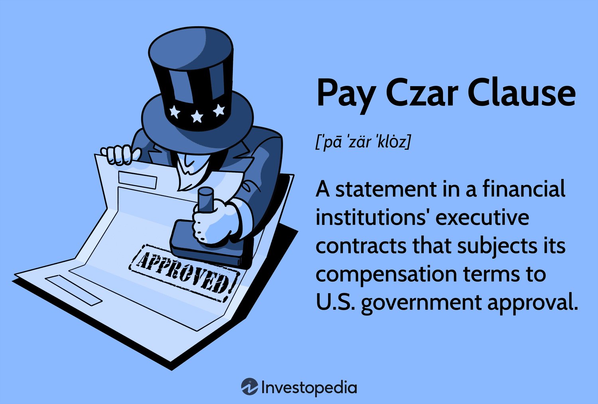

## Table of Contents

## What is a Pay Czar?

A Pay Czar is a person appointed by the government to control and oversee the salaries and bonuses of executives in companies that receive government help, like bailouts. This job started during the 2008 financial crisis when many big banks and companies needed money from the government to stay afloat. The Pay Czar makes sure that the executives at these companies don't get paid too much, especially when the companies are struggling and getting help from taxpayers.

The idea behind having a Pay Czar is to make sure that the money given by the government is used wisely and fairly. It helps to prevent executives from getting big bonuses while their companies are in trouble. By setting limits on pay, the Pay Czar aims to protect the interests of the public and ensure that the companies focus on getting better, not just on paying their top people a lot of money.

## Why was the position of Pay Czar created?

The position of Pay Czar was created because of the 2008 financial crisis. During this time, many big companies and banks were in trouble and needed money from the government to survive. The government gave them bailouts, which are big loans or help to keep them going. But people were worried that the executives at these companies might still get big salaries and bonuses, even though their companies were doing badly and getting help from taxpayers.

To stop this from happening, the government decided to create the Pay Czar. The Pay Czar's job is to watch over the pay of these executives and make sure it is fair. This way, the money from the government is used to help the companies get better, not just to pay the top people a lot. The Pay Czar helps make sure that the public's money is spent wisely and that the companies focus on fixing their problems.

## Who was the first Pay Czar in the United States?

The first Pay Czar in the United States was Kenneth Feinberg. He was appointed in 2009 by the U.S. Treasury Department. His job was to look at the pay of top executives at companies that got money from the government during the 2008 financial crisis.

Feinberg's role was important because he had to make sure that the executives at these companies did not get paid too much. This was to make sure that the money from taxpayers was used to help the companies get better, not just to give big bonuses to the top people. He worked hard to make the pay fair and to help the companies focus on getting back on their feet.

## What are the main responsibilities of a Pay Czar?

The main job of a Pay Czar is to watch over the pay of top executives at companies that get help from the government. This means they look at how much money these executives get paid, including their salaries and bonuses. The Pay Czar makes sure that the pay is fair and not too high, especially when the company is struggling and getting money from taxpayers. This helps to make sure that the government's money is used in a good way and not just to give big bonuses to the top people.

Another important responsibility of a Pay Czar is to make rules about how much executives can be paid. They set limits on salaries and bonuses to stop the executives from getting too much money when their company is in trouble. By doing this, the Pay Czar helps to protect the interests of the public and makes sure that the companies focus on getting better, not just on paying their top people a lot of money. This way, the money from the government can be used to help the company recover and become strong again.

## How does a Pay Czar influence executive compensation?

A Pay Czar influences executive compensation by setting rules and limits on how much money top executives can earn. When a company gets help from the government, like during the 2008 financial crisis, the Pay Czar steps in to make sure the executives don't get paid too much. They look at the salaries and bonuses and decide what is fair. This helps to make sure that the money from taxpayers is used wisely and not just to give big bonuses to the top people.

By setting these limits, the Pay Czar helps to protect the interests of the public. They make sure that the companies focus on getting better and not just on paying their executives a lot of money. This way, the money from the government can be used to help the company recover and become strong again. The Pay Czar's role is important because it helps to make sure that the pay is fair and that the company uses the government's help in the right way.

## What industries are most affected by the decisions of a Pay Czar?

The industries most affected by a Pay Czar are usually the ones that get help from the government, like banks and big companies that were in trouble during the 2008 financial crisis. These companies needed money from the government to stay afloat, and the Pay Czar made sure that the executives at these companies didn't get paid too much. This was important because the money came from taxpayers, and people wanted to make sure it was used wisely.

The Pay Czar's decisions mainly impact the financial sector, like banks and insurance companies, because they were the ones that got a lot of government help. But other industries that get government bailouts can also be affected. The Pay Czar helps to make sure that the pay for executives in these industries is fair and that the companies focus on getting better, not just on giving big bonuses to their top people.

## Can you explain a notable case where a Pay Czar intervened?

One notable case where a Pay Czar intervened was with the company AIG, which is an insurance company. During the 2008 financial crisis, AIG got a lot of money from the government to help it stay in business. But people were upset because AIG wanted to give big bonuses to its executives even though the company was in trouble. So, the Pay Czar, Kenneth Feinberg, stepped in to look at the bonuses and make them smaller.

Feinberg decided that the bonuses at AIG were too big and needed to be cut down. He worked hard to make the pay fair and to make sure that the money from taxpayers was used to help AIG get better, not just to pay the top people a lot. This case showed how important the Pay Czar's job is in making sure that companies use government help the right way and that the executives don't get paid too much when their company is struggling.

## What are the legal powers of a Pay Czar?

A Pay Czar has the legal power to look at and change the pay of top executives in companies that get help from the government. This means they can set limits on how much money these executives can earn, including their salaries and bonuses. The Pay Czar makes sure that the pay is fair and not too high, especially when the company is in trouble and getting money from taxpayers. This helps to make sure that the government's money is used in a good way and not just to give big bonuses to the top people.

The Pay Czar's powers come from the government and are meant to protect the interests of the public. They can make rules about how much executives can be paid and can stop companies from giving out too much money to their top people. By doing this, the Pay Czar helps to make sure that the companies focus on getting better and not just on paying their executives a lot of money. This way, the money from the government can be used to help the company recover and become strong again.

## How do companies react to the regulations set by a Pay Czar?

Companies usually don't like the rules set by a Pay Czar. They think the Pay Czar is too strict and that it's not fair for the government to tell them how much they can pay their top people. The companies feel that they should be able to decide on their own how much to pay their executives. They also worry that if they can't pay their top people well, those people might leave and go work somewhere else. This can make it hard for the company to keep good leaders.

But sometimes, companies see that the Pay Czar's rules can help them too. If the public sees that the company is being fair with its pay, it can make people trust the company more. This can be good for the company's reputation, especially when they are getting help from the government. So, even though they might not like the rules at first, some companies learn to work with them and see the good side of having a Pay Czar.

## What are the criticisms and controversies surrounding the role of a Pay Czar?

People have different opinions about the Pay Czar. Some say it's not right for the government to tell companies how much they can pay their top people. They think companies should be able to decide on their own. They also worry that if the Pay Czar makes the pay too low, good leaders might leave the company. This can make it hard for the company to get better. Some also think that the Pay Czar's rules can be too strict and not fair to the executives who are trying to help their company.

On the other hand, some people like the idea of a Pay Czar. They think it's important to make sure that companies use the government's money wisely. They believe that the Pay Czar helps to stop executives from getting big bonuses when their company is in trouble. This can make people trust the company more, especially when it's getting help from taxpayers. But even those who support the Pay Czar sometimes think that the rules can be hard to follow and might not always be the best way to help the company get better.

## How does the role of a Pay Czar vary internationally?

The role of a Pay Czar can be different in different countries. In the United States, the Pay Czar was created to watch over the pay of executives in companies that got help from the government during the 2008 financial crisis. The Pay Czar made sure that the pay was fair and not too high, especially when the company was struggling. This helped to make sure that the money from taxpayers was used wisely and not just to give big bonuses to the top people.

In other countries, the idea of a Pay Czar might not exist at all, or it might work in a different way. For example, some countries might have laws that limit how much executives can be paid, but they don't have a special person like a Pay Czar to watch over it. Other countries might have a similar role, but it could be called something different and have different rules. The main idea is the same—to make sure that the pay is fair and that companies use government help the right way—but how it's done can be different from one country to another.

## What is the future outlook for the position of Pay Czar?

The future of the Pay Czar position is not clear. It was created during a big financial crisis to help control the pay of executives in companies that got help from the government. Since the crisis is over, there might not be a need for a Pay Czar all the time. But if there is another big financial problem, the government might bring back the Pay Czar to make sure that the money they give to companies is used wisely and not just to pay the top people a lot.

Even though the Pay Czar might not be needed all the time, the idea of watching over executive pay could still be important. Some people think that having rules about how much executives can be paid is a good way to make sure that companies are fair and use government help the right way. So, even if there isn't a Pay Czar, the government might still make rules about pay to protect the interests of the public and make sure that companies focus on getting better, not just on giving big bonuses to their top people.

## References & Further Reading

[1]: ["Too Big to Fail: The Inside Story of How Wall Street and Washington Fought to Save the Financial System—and Themselves"](https://www.amazon.com/Too-Big-Fail-Washington-System/dp/0143118242) by Andrew Ross Sorkin

[2]: ["The Pay Czar: Oversight and Accountability in the Troubled Asset Relief Program"](https://en.wikipedia.org/wiki/Troubled_Asset_Relief_Program) by Michael V. Seitzinger, Congressional Research Service. 

[3]: ["After the Music Stopped: The Financial Crisis, the Response, and the Work Ahead"](https://www.tandfonline.com/doi/full/10.1080/14697688.2014.949836) by Alan S. Blinder

[4]: ["Financial Crisis Inquiry Report: Final Report of the National Commission on the Causes of the Financial and Economic Crisis in the United States"](https://www.govinfo.gov/app/details/GPO-FCIC/) by The Financial Crisis Inquiry Commission

[5]: ["Kenneth R. Feinberg: Special Master for TARP Executive Compensation: Hearings Before the Congressional Oversight Panel"](https://home.treasury.gov/sites/default/files/initiatives/financial-stability/TARP-Programs/executive-comp/Documents/Final%20Report%20of%20Kenneth%20Feinberg%20-%20FINAL.PDF) by United States Congressional Oversight Panel

[6]: Bianchi, Godvind, & Kitamura, Yoichi, ["Executive compensation and systemic risk"](https://www.aeaweb.org/articles?id=10.1257/mic.20200325), Journal of Banking & Finance, Volume 58, July 2015, Pages 225-239.

[7]: Murphy, Kevin J. (2013). ["Regulating Banking Bonuses in the European Union: A Case Study in Unintended Consequences"](https://papers.ssrn.com/sol3/papers.cfm?abstract_id=2235395), European Financial Management, 19(4), 631-657.