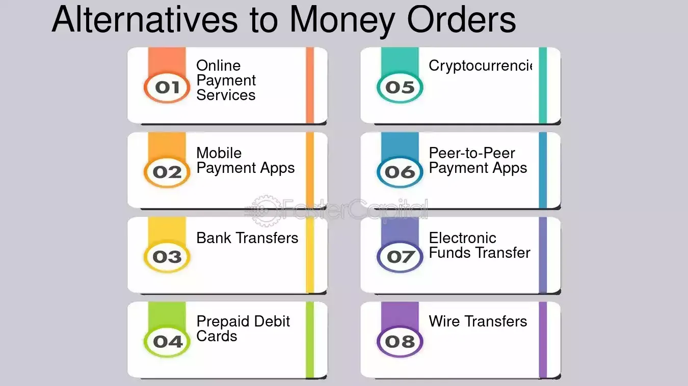

## Table of Contents

## What is a pay-to-bearer instrument?

A pay-to-bearer instrument is a type of financial document that allows anyone who holds it to receive the money or value it represents. This means you don't need to prove who you are to cash it. Common examples include bearer bonds and certain types of checks. If you find one, you can take it to a bank and get the money without needing to show any ID.

These instruments can be risky because if they are lost or stolen, anyone can cash them. This makes them less secure than other types of financial documents that require identification. However, they can also be useful in situations where quick and easy access to funds is needed, like in emergencies or for certain business transactions.

## How does a pay-to-bearer instrument work?

A pay-to-bearer instrument is a piece of paper that says whoever has it can get the money it's worth. You don't need to show any ID or prove who you are. If you find one, you can go to a bank and get the money. It's like a ticket that anyone can use.

These instruments can be risky because if you lose it, anyone who finds it can take the money. That's why they are not as safe as other types of money that need your ID. But they can be helpful in emergencies or when you need money fast without any hassle.

## What are the common types of pay-to-bearer instruments?

Common types of pay-to-bearer instruments include bearer bonds and certain types of checks. Bearer bonds are like IOUs that anyone can cash. If you have the bond, you can go to the issuer and get the money it's worth. They are not used much anymore because they can be risky if lost or stolen. Certain checks, like those marked "pay to the order of cash" or "bearer," work the same way. Anyone who has the check can cash it at a bank without needing to show ID.

Another type is traveler's checks. These are special checks you can buy to use when traveling. If you lose them, you can usually get your money back, but until then, anyone who finds them can use them. They are safer than regular checks because they have extra security features. However, like other pay-to-bearer instruments, they can still be risky if not handled carefully.

## What are the advantages of using pay-to-bearer instruments?

Pay-to-bearer instruments are easy to use because you don't need to show any ID to get the money. This makes them great for emergencies or when you need money fast. For example, if you're traveling and need cash quickly, a bearer bond or a traveler's check can be very helpful. They are like instant money that anyone can use, which can be a big advantage in certain situations.

Another advantage is that they can be used in places where banks or other financial services are not easily available. If you're in a remote area or a country with strict banking rules, a pay-to-bearer instrument can help you get money without any hassle. This makes them useful for people who travel a lot or work in areas where traditional banking is hard to access.

## What are the risks associated with pay-to-bearer instruments?

Pay-to-bearer instruments can be risky because if you lose them, anyone who finds them can take the money. This makes them less safe than other types of money that need your ID to cash. For example, if you lose a bearer bond or a check that says "pay to the order of cash," someone else can go to the bank and get the money before you even know it's gone.

Another risk is that these instruments can be used for illegal activities. Because they don't need ID, they can be used to hide money or move it around without anyone knowing. This can make it hard for the police to track down criminals who use them. So, while pay-to-bearer instruments can be helpful in some situations, they also come with big risks that you need to be aware of.

## How is the ownership of a pay-to-bearer instrument transferred?

The ownership of a pay-to-bearer instrument is transferred simply by handing it over to someone else. If you give the instrument to another person, they become the new owner and can cash it at a bank without needing to show any ID. This makes it very easy to move the instrument from one person to another, but it also means you need to be careful not to lose it.

Because anyone who has the instrument can use it, you have to trust the person you give it to. If they lose it or it gets stolen, anyone who finds it can take the money. This is why it's important to keep pay-to-bearer instruments safe and only give them to people you trust.

## What legal frameworks govern pay-to-bearer instruments?

Pay-to-bearer instruments are governed by laws that vary from country to country. In the United States, the Uniform Commercial Code (UCC) sets rules for how these instruments work. The UCC says that anyone who has a pay-to-bearer instrument can cash it, but it also has rules to protect people if the instrument is lost or stolen. For example, if you lose a traveler's check, you can report it and get your money back, but you have to act quickly.

In other countries, similar laws might apply, but they can be different. For example, in the European Union, the rules might be set by each country's own laws, but there are also some common rules across the EU to help make things more consistent. These laws are important because they help make sure that pay-to-bearer instruments are used fairly and safely, even though they can be risky.

## How do pay-to-bearer instruments compare to pay-to-order instruments?

Pay-to-bearer instruments and pay-to-order instruments are two different ways to handle money. A pay-to-bearer instrument lets anyone who has it cash it without showing ID. It's like a ticket that anyone can use. This makes it easy to use in emergencies or when you need money fast, but it's also risky because if you lose it, anyone can take the money. Examples include bearer bonds and certain types of checks.

On the other hand, a pay-to-order instrument requires you to show ID to cash it. It's safer because only the person named on the instrument can get the money. If you lose it, no one else can use it. This makes it a better choice for everyday use, but it can be less convenient if you need money quickly without any hassle. Common examples are personal checks and money orders.

Both types of instruments have their uses, but they work differently. Pay-to-bearer instruments are good for quick access to money but come with more risk. Pay-to-order instruments are safer but require more steps to use. Choosing between them depends on what you need the money for and how much risk you're willing to take.

## What historical events have influenced the use of pay-to-bearer instruments?

Pay-to-bearer instruments have been around for a long time, and their use has been shaped by many historical events. One big event was the financial crisis in the late 2000s. During this time, people started to worry more about the risks of these instruments. They realized that if someone lost a bearer bond or a check, anyone could take the money. This made banks and governments think about making rules to make them safer. As a result, many countries started to use them less and moved to safer types of money that need ID to cash.

Another important event was the fight against money laundering and terrorism financing. Governments around the world wanted to stop criminals from using pay-to-bearer instruments to hide money. They made new laws to track money better and make it harder for bad people to use these instruments. This led to even less use of pay-to-bearer instruments because they were seen as too risky and hard to control. Today, while they are still used in some places, they are much less common than they used to be.

## How have technological advancements affected the use of pay-to-bearer instruments?

Technological advancements have made pay-to-bearer instruments less popular. With the rise of digital banking and electronic payments, people can now move money quickly and safely without using paper instruments. For example, you can send money through apps on your phone or use online banking to pay bills. These methods are safer because they need your ID or a password to work. This means that pay-to-bearer instruments, which anyone can use without ID, are not as useful anymore.

Also, technology has helped make other types of money safer and easier to use. For instance, checks and money orders now often have security features like watermarks and special inks that make them harder to fake. Banks can also track these instruments better with computers, which makes them less risky. Because of these changes, people are more likely to use safer, electronic ways to handle money instead of pay-to-bearer instruments.

## What are the international regulations concerning pay-to-bearer instruments?

International regulations on pay-to-bearer instruments vary from country to country, but there are some common rules that many countries follow. The main goal of these rules is to stop people from using these instruments for illegal activities like money laundering and terrorism financing. For example, the Financial Action Task Force (FATF), an international group, sets guidelines that many countries use to make their own laws. These guidelines say that countries should keep track of who is using pay-to-bearer instruments and make sure they are not being used to hide money.

Because of these international efforts, many countries have made their own rules to control pay-to-bearer instruments. In the European Union, for example, there are strict rules about who can use them and how they can be used. Some countries have even stopped using them altogether because they are seen as too risky. These rules help make sure that pay-to-bearer instruments are used safely and legally, even though they can still be used in some places around the world.

## What future trends might impact the use of pay-to-bearer instruments?

In the future, the use of pay-to-bearer instruments might go down even more because of new technology. More and more people are using digital ways to send and receive money, like apps on their phones or online banking. These methods are safer because they need your ID or a password to work. This makes pay-to-bearer instruments, which anyone can use without ID, less useful. Also, as technology gets better, banks and governments can track money better, making it harder for people to use pay-to-bearer instruments for illegal things like hiding money.

Another trend that might affect pay-to-bearer instruments is stricter rules from governments around the world. Many countries are working together to stop money laundering and terrorism financing. They might make even tougher laws about who can use pay-to-bearer instruments and how they can be used. This could make these instruments even less common. As a result, people might choose safer and more controlled ways to handle money, like electronic payments or checks that need ID to cash.

## References & Further Reading

1. Hull, J.C. (2018). *Options, Futures, and Other Derivatives*. Pearson. This book provides an extensive overview of various financial instruments, including derivatives, which are crucial in understanding capital allocation and risk management.

2. Fabozzi, F.J., Modigliani, F., & Jones, F.J. (2010). *Foundations of Financial Markets and Institutions*. Pearson. This text offers a comprehensive foundation on financial markets and instruments, essential for grasping fundamental concepts relevant to equities, fixed income, and more.

3. Text of the MiFID II Directive, European Commission. Official Journal of the European Union, L 173, 12 June 2014. This document outlines the regulations that significantly impact algorithmic trading practices and the broader financial market environment.

4. Durbin, M. (2010). *All About High-Frequency Trading*. McGraw-Hill. The book provides insights into the workings of algorithmic trading, highlighting different strategies and the role of technology in enhancing market operations.

5. Bank for International Settlements (BIS). (2019). *OTC Derivatives Market Activity*. This report offers a detailed examination of the changes in the derivatives market, reflecting technological impacts and regulatory considerations.

6. Zitzewitz, E. (2003). *“Who Cares About Shareholders? Arbitrage-Proofing Mutual Funds.”* Journal of Law, Economics, & Organization, 19(2), 245-280. This paper evaluates the mechanics of financial instruments such as mutual funds and their regulatory environment.

7. Pietersz, G. (2005). *The Basics of Financial Derivatives*. Investopedia. This article is a helpful introduction to financial derivatives, providing fundamental definitions and operational insight.

8. United States Department of the Treasury. *Report on Bearer Bonds and Their Influence on Money Laundering and Terrorist Financing*. Available through the official government website. This report discusses regulatory interventions that have influenced the use and decline of bearer bonds over time.

9. Narang, R.K. (2013). *Inside the Black Box: The Simple Truth About Quantitative Trading*. Wiley. This book offers a clear understanding of algorithmic trading systems, presenting their benefits, challenges, and impact on market liquidity and efficiency.

10. Tapscott, D., & Tapscott, A. (2016). *Blockchain Revolution: How the Technology Behind Bitcoin Is Changing Money, Business, and the World*. Penguin. This book dives into digital transformations within financial systems, discussing potential applications to bearer instruments through technologies like blockchain.

