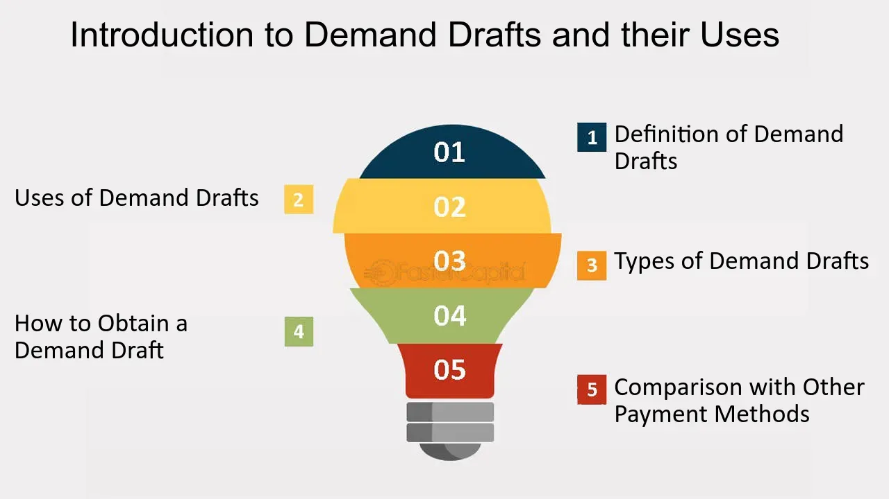

## Table of Contents

## What is a Payable-Through-Draft (PTD)?

A Payable-Through-Draft (PTD) is a type of financial instrument that allows a person or business to make payments through a bank. It works like a check, but it is issued by a bank on behalf of a customer. When someone wants to use a PTD, they fill it out with the amount and the name of the person or business they want to pay. Then, they give it to the bank, and the bank makes sure the money is taken from the customer's account and sent to the right place.

PTDs are often used in international trade because they help make payments easier and safer. For example, if a business in one country wants to buy goods from a business in another country, they can use a PTD to pay for the goods. This way, the seller knows the payment is coming from a trusted bank, and the buyer can be sure the payment will only be made if the goods are delivered as promised. This makes both the buyer and the seller feel more secure about the transaction.

## How does a Payable-Through-Draft work?

A Payable-Through-Draft (PTD) is like a special kind of check that a bank gives to a customer to pay someone else. When a person or a business wants to use a PTD, they write down the amount of money they want to pay and the name of the person or business they are paying. Then, they give the PTD to their bank. The bank checks if the customer has enough money in their account. If they do, the bank takes the money from the customer's account and sends it to the person or business named on the PTD.

PTDs are really helpful in international trade. Imagine a business in one country wants to buy things from a business in another country. They can use a PTD to make the payment. This way, the seller knows the money is coming from a trusted bank, so they feel safe. The buyer also feels safe because the bank will only send the money if the goods are delivered correctly. This makes trading between different countries easier and more secure for everyone involved.

## What are the key components of a Payable-Through-Draft?

A Payable-Through-Draft (PTD) has several important parts that make it work. The first part is the amount of money that needs to be paid. This is written clearly on the PTD so everyone knows how much money is being sent. The second part is the name of the person or business that will receive the money. This is important because it tells the bank exactly where to send the payment. The third part is the signature of the person who is sending the money. This shows that they agree to the payment and helps prevent fraud.

Another key component is the bank that issues the PTD. The bank's name and details are on the draft, which shows that it is a trusted financial institution handling the transaction. The bank also checks if the person sending the money has enough funds in their account before sending the payment. This step is crucial to make sure the payment can be completed successfully. Together, these parts make the PTD a secure and reliable way to make payments, especially in international trade.

## Who are the typical users of Payable-Through-Drafts?

Payable-Through-Drafts (PTDs) are often used by businesses that buy and sell things across different countries. These businesses like using PTDs because they make international payments easier and safer. When a business in one country wants to pay a business in another country for goods or services, they can use a PTD. This way, the seller knows the payment is coming from a trusted bank, and the buyer can be sure the payment will only be made if the goods are delivered as promised.

Sometimes, individual people also use PTDs, especially if they need to make a big payment to someone in another country. For example, if someone is buying a house or a car from another country, they might use a PTD to make the payment. This helps them feel more secure because the bank is involved in the transaction, making sure everything goes smoothly.

## What are the benefits of using a Payable-Through-Draft?

Using a Payable-Through-Draft (PTD) has many benefits, especially for businesses that trade across different countries. One big benefit is that PTDs make payments safer. When a business uses a PTD, the payment comes from a trusted bank. This makes the seller feel more secure because they know the money is coming from a reliable source. Also, the buyer feels safe because the bank will only send the money if the goods are delivered correctly. This helps both the buyer and the seller trust each other more during the trade.

Another benefit of using a PTD is that it makes international payments easier. When businesses in different countries need to pay each other, using a PTD can simplify the process. The bank handles the payment, so the businesses don't have to worry about different currencies or complicated payment systems. This can save time and reduce the stress of making payments across borders. Overall, PTDs help make international trade smoother and more secure for everyone involved.

## What are the potential risks associated with Payable-Through-Drafts?

Using Payable-Through-Drafts (PTDs) can have some risks. One risk is that the person or business sending the money might not have enough money in their account. If the bank finds out that there isn't enough money, the PTD might not be paid, and this can cause problems for the person or business expecting the payment. Another risk is that someone might try to use a fake PTD. If someone makes a fake draft and tries to use it, it can lead to fraud and financial loss for the person or business that accepts it.

Another risk with PTDs is that there can be delays in the payment process. Sometimes, the bank might take longer to check the details or to move the money, and this can slow down the whole transaction. This can be a problem, especially in international trade where timing is important. Also, if there are mistakes in the PTD, like the wrong amount or the wrong name, it can cause confusion and delays. These risks show why it's important to be careful and check everything carefully when using PTDs.

## How does a Payable-Through-Draft differ from a regular check?

A Payable-Through-Draft (PTD) and a regular check are similar because they both let you pay someone by writing down the amount and the person's name. But, a PTD is different because it is issued by a bank on behalf of a customer. This means the bank is more involved in the process. With a PTD, the bank checks if the customer has enough money before sending the payment, which makes it safer for the person receiving the money.

Another difference is that PTDs are often used for international payments. They help make these payments easier and more secure because the payment comes from a trusted bank. Regular checks are usually used for local payments and don't have the same level of bank involvement. So, while both PTDs and regular checks are used to pay people, PTDs offer more security and are better for international trade.

## What are the legal and regulatory considerations for using Payable-Through-Drafts?

Using Payable-Through-Drafts (PTDs) involves following certain legal and regulatory rules. These rules can be different in each country, so it's important to know the laws where the PTD is being used. For example, banks that issue PTDs need to follow rules about checking if the person sending the money has enough funds. They also need to make sure they are not helping with any illegal activities, like money laundering. This means they have to check the details of the PTD carefully and keep records of the transactions.

Another important thing to think about is that PTDs can be affected by international laws and regulations. When PTDs are used for payments between different countries, the banks have to follow the rules of both countries involved. This can include rules about how to handle different currencies and how to report the transactions to the right authorities. It's a good idea for businesses and individuals using PTDs to work with their banks to make sure they are following all the necessary legal and regulatory requirements.

## How can businesses implement Payable-Through-Drafts in their operations?

Businesses can start using Payable-Through-Drafts (PTDs) by working closely with their bank. They need to talk to their bank about how PTDs work and how they can help with their international payments. The bank will help them set up the process, which includes making sure the business has enough money in their account to cover the payments. The business will then fill out the PTD with the amount and the name of the person or business they want to pay, and give it to the bank. The bank will check everything and send the money to the right place.

Using PTDs can make international trade easier and safer for businesses. When a business in one country wants to buy things from a business in another country, they can use a PTD to make the payment. This way, the seller knows the money is coming from a trusted bank, so they feel more secure. The buyer also feels safe because the bank will only send the money if the goods are delivered correctly. By using PTDs, businesses can make their international payments smoother and build trust with their trading partners.

## What technological systems support the processing of Payable-Through-Drafts?

Payable-Through-Drafts (PTDs) are supported by banking systems that handle payments and transactions. These systems are like special computer programs that banks use to check if someone has enough money in their account to send a PTD. They also help the bank keep track of the PTDs they issue and make sure the money goes to the right place. These systems are important because they help make the process of using PTDs fast and safe.

Some banks also use special software for international payments. This software can handle different currencies and make sure the payments follow the rules of different countries. It helps the bank process PTDs smoothly, even when the payment is going to another country. By using these technological systems, banks can make sure that PTDs work well and that businesses and individuals can trust them for their payments.

## How do financial institutions manage and mitigate fraud related to Payable-Through-Drafts?

Financial institutions use different ways to stop fraud with Payable-Through-Drafts (PTDs). They check the details of each PTD carefully to make sure it's real and that the person sending the money has enough money in their account. They also use special computer programs to watch for any strange activity that might be a sign of fraud. If they see something that doesn't look right, they can stop the PTD from being paid until they check it more.

Another way banks fight fraud is by keeping good records of all PTDs. This helps them see if someone is trying to use the same PTD more than once or if someone is using a fake PTD. Banks also train their workers to know the signs of fraud and to be careful when they handle PTDs. By doing all these things, banks can make PTDs safer and help stop fraud from happening.

## What future trends might impact the use of Payable-Through-Drafts?

In the future, the way Payable-Through-Drafts (PTDs) are used might change because of new technology. More businesses might start using digital PTDs instead of paper ones. This could make things faster and easier because everything would be done online. Also, new computer systems might be able to check for fraud even better than before, making PTDs safer to use. As more people and businesses get used to doing things online, PTDs might become a part of this digital world.

Another trend that could affect PTDs is the growth of international trade. As more businesses start buying and selling things across different countries, the need for safe and easy ways to make payments will grow. PTDs could become more popular because they help make these payments safer and easier. But, the rules and laws about international payments might also change, so businesses and banks will need to keep up with these changes to use PTDs correctly.

## References & Further Reading

[1]: Lopez de Prado, Marcos. ["Advances in Financial Machine Learning."](https://www.amazon.com/Advances-Financial-Machine-Learning-Marcos/dp/1119482089) Wiley, 2018.

[2]: Chan, Ernest P. ["Algorithmic Trading: Winning Strategies and Their Rationale."](https://github.com/ftvision/quant_trading_echan_book) Wiley, 2013.

[3]: Jansen, Stefan. ["Machine Learning for Algorithmic Trading."](https://github.com/stefan-jansen/machine-learning-for-trading) Packt Publishing, 2018.

[4]: Aronson, David. ["Evidence-Based Technical Analysis: Applying the Scientific Method and Statistical Inference to Trading Signals."](https://www.amazon.com/Evidence-Based-Technical-Analysis-Scientific-Statistical/dp/0470008741) Wiley, 2006.

[5]: ["The Role of Payment Systems in Financial Stability."](https://www.seacen.org/file/file/2014/RP90/RPSS%20-%20chapter%206.pdf) Bank for International Settlements, Committee on Payment and Settlement Systems, 2006.