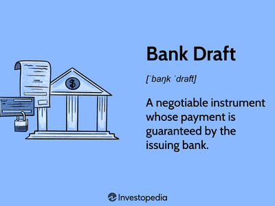

A Payable-Through-Draft (PTD) represents an instrument used within the banking sector to facilitate transactions between businesses and individuals through a draft that is payable through a bank. This mechanism has become significant in modern banking practices due to its ability to streamline payment processes, enhancing efficiency and security in financial transactions. PTDs are utilized by corporations to settle accounts in a secure manner, without relying solely on electronic banking systems or traditional checks.

The integration of PTDs within banking mechanisms allows businesses to leverage a trusted method of payment that seamlessly connects business operations with financial institutions. This instrument promotes greater liquidity and financial control for corporations, as well as ensures that payments are managed through a regulated banking system, thereby reducing the risks associated with direct transactions.



The significance of PTDs extends into Algorithmic (Algo) trading, where the speed and reliability of executing transactions are paramount. In algo trading, PTDs can be used to ensure that payments are processed with precision and assurance, minimizing the potential for errors that can arise during high-volume trading activities. Algorithmic trading relies on algorithms to make quick trading decisions, often based on a set of predefined parameters. Incorporating PTDs into this environment allows traders to optimize their operational efficiency by ensuring that each transaction or trade settlement is completed promptly and accurately, aligning with the automated nature of such trading systems.

Understanding financial tools like PTDs is essential in modern financial markets, where the landscape is perpetually evolving with the introduction of new technologies and strategies. Financial professionals, including traders and business entities, must grasp how instruments like PTDs function to secure and expedite financial transactions. This knowledge ensures they remain competitive and compliant within the global financial infrastructure. As financial markets become more interconnected and complex, the ability to employ robust and reliable financial instruments, such as PTDs, becomes increasingly critical for successful financial operations and risk management.

## Table of Contents

## Understanding Payable-Through-Draft (PTD)

Payable-Through-Draft (PTD) is a financial instrument used for facilitating transactions through banks, primarily serving the functions of payments and remittances. It is a draft issued by a bank on behalf of a corporation, allowing the payee to draw funds directly from the bank, which ensures the reliability and security of the payment process. PTD serves not only as a medium for straightforward transactions but also as a tool for efficient fund transfers across different sectors, including insurance and payroll distribution for remote employees.

The primary purpose of PTD is to streamline the disbursement of funds for corporations by using the credibility and infrastructure of the banking system. A crucial feature of PTDs is their issuance by banks that act as intermediaries between the remitter and the payee. This involvement of banks confers a level of trust in the transaction, as the bank guarantees the payment, which significantly reduces the risk for the payee compared to traditional checks.

Key features of PTD include:

1. **Bank Involvement:** Banks play a vital role in PTD transactions, acting on behalf of businesses to issue drafts that are essentially equivalent to guaranteed checks. This process ensures that the payee receives the exact payment specified in the draft.

2. **Corporate Authorization:** The drafts are typically issued by corporations for payments such as salaries, insurance claims, or vendor payments. The involvement of businesses means that there is a formal request and authorization process, ensuring that funds are appropriately managed.

3. **Secure Payment Mechanism:** Given that PTDs are supported by banks, they offer a level of security that surpasses ordinary checks. The bank's credibility assures the payee of receiving payment, minimizing the incidence of default.

Common uses of PTDs include their application in insurance and remote employee payments. In the insurance sector, PTDs are employed to expedite claim settlements, allowing claimants to receive their payments directly through bank-issued drafts. This method simplifies the transaction for both insurance companies and their clients, ensuring prompt and reliable settlement of claims.

For businesses with a geographically dispersed workforce, PTDs offer an effective mechanism for distributing salaries to remote employees. Companies can issue PTDs through their banking partners, enabling employees to readily access their funds without geographical hindrance. This operation is particularly advantageous in today's work environment, where remote work has become increasingly prevalent.

In summary, PTD serves as a pivotal tool in modern financial transactions, offering reliability, security, and efficiency by leveraging the infrastructure and trustworthiness of the banking sector. Its application in various industries highlights its versatility and value as a financial instrument.

## How Payable-Through-Draft Works in Banking

The Payable-Through-Draft (PTD) mechanism is a financial tool used in banking to facilitate transactions between businesses and banks efficiently. First and foremost, PTDs operate as a payment instrument, allowing businesses to leverage the credibility and infrastructure of banks to manage their disbursements. This process generally involves two key players: banks, which serve as the intermediaries, and issuing corporations, such as businesses or agencies, which create the drafts.

When a corporation initiates a PTD, it essentially instructs a bank to pay a specified amount to a third party (the payee) on its behalf. The PTD serves as a negotiable instrument, similar to a check, but with distinctions that offer unique advantages in certain scenarios. The issuing corporation provides the bank with the necessary funds to cover the PTD, ensuring that payments are honored when they are presented.

Banks [carry](/wiki/carry-trading) out a pivotal role in processing PTDs by ensuring that these drafts are verified and settled efficiently. They manage the clearing process, which involves the verification and authorization of the PTD, ensuring that the funds are available and correctly transferred. This not only facilitates smooth transactions but also enhances trust between the involved parties.

PTDs can take various forms, each serving specific purposes based on the transaction's nature and requirements. Among the types of PTDs are bank drafts, demand drafts, and share drafts. Bank drafts are issued by banks on behalf of their customers and are considered to be secure as the funds are guaranteed by the issuing bank. Demand drafts are similar but are typically used in a context where there is a direct demand for payment and are often used in international transactions. Share drafts are used by credit unions and operate akin to checks, providing a secure way for account holders to access their funds.

The PTD mechanism offers notable advantages over traditional payment methods such as checks, including enhanced security and reliability, given that PTDs are processed through trustworthy banking channels. This makes PTDs particularly suitable for corporate transactions involving large sums or cross-border dealings, where the assurance of payment and reduction in risk are paramount.

## PTD vs. Traditional Checks

Payable-Through-Drafts (PTDs) and traditional checks are both instruments used to facilitate financial transactions, but they vary significantly in functionality and security. 

PTDs are financial instruments issued by banks on behalf of corporations or businesses to allow third parties to draw funds from the issuer's account. This mechanism ensures that the bank essentially stands as an intermediary, offering a layer of assurance and control over the funds' release. In contrast, traditional checks are direct payment orders from the issuer's bank account to the payee, with the responsibility primarily on the account holder to manage and authorize the transaction.

Functionally, PTDs are often utilized in scenarios where enhanced control and monitoring of transactions are required. They are particularly beneficial in corporate transactions for several reasons:

1. **Controlled Disbursement**: PTDs allow issuing corporations to maintain control over large sums of money, making them ideal for business-to-business transactions or large-scale disbursements, such as in insurance settlements or financing activities.

2. **Fraud Prevention**: By leveraging bank oversight, PTDs typically offer higher security against fraud compared to traditional checks. The bank's involvement provides an additional layer of validation before funds are released, reducing the risk of unauthorized or fraudulent transactions.

3. **Streamlining Multi-party Payments**: In cases where multiple parties are involved or need payment assurance, PTDs can simplify the process by allowing the bank to mediate payments, ensuring all parties are paid correctly without the need for multiple individual transactions.

In contrast, traditional checks offer simplicity and ease of use for everyday transactions. They remain popular in personal finance due to their straightforward nature. However, they may expose users to security risks, such as check forgery or alteration, and often involve a longer clearing process.

PTDs are preferred over conventional checks in various scenarios, such as:

- **International Transactions**: PTDs can be more efficient for international transactions because the bank's involvement can help mitigate issues related to currency exchange and cross-border regulations.

- **High-value Transactions**: For high-value transactions, PTDs provide an additional assurance level that can reduce the likelihood of fund misappropriation.

- **Payment Scheduling**: When precise payment scheduling and tracking are crucial, such as in payroll for remote employees or contractors, PTDs offer reliable scheduling and tracking mechanisms.

While traditional checks remain a staple in many financial interactions, the unique features of PTDs make them a robust option for secure, large, and complex transactions, allowing businesses to leverage enhanced security and control.

## Integration of PTD in Algorithmic Trading

Payable-Through-Draft (PTD) plays an increasingly significant role in [algorithmic trading](/wiki/algorithmic-trading), a technology-driven trading strategy that relies heavily on speed and efficiency. PTDs contribute to enhancing financial operations by offering a streamlined method of payment that complements the rapid decision-making and transaction execution inherent in algorithmic trading.

In algorithmic trading, where transactions are executed at high speeds, the ability to settle payments efficiently is crucial. PTDs facilitate this by providing a reliable mechanism that can automate the payment processes, reducing delays associated with traditional payment methods. The use of PTDs can minimize settlement times, thereby supporting the quick turnover of positions that is often required in high-frequency trading environments.

The integration of PTDs can enhance the speed and reliability of payments within algorithmic trading systems. By employing PTDs, trading entities can automate the clearing and settlement phase, which traditionally involves manual processes. This automation reduces the risk of human error, expedites transaction processing, and ensures that trades are settled more quickly, aligning with the rapid pace of algorithmic trading strategies.

Moreover, PTDs contribute to improving [liquidity](/wiki/liquidity-risk-premium) management in algo trading. The immediate availability of funds upon the execution of a PTD allows trading firms to respond swiftly to market opportunities without being constrained by payment bottlenecks. This feature is particularly advantageous in markets where price fluctuations occur rapidly, providing a competitive edge to traders who can settle transactions promptly.

However, the adoption of PTD in high-frequency trading introduces certain risks and challenges. The primary risk involves security, as the digital nature of PTDs makes them susceptible to cyber threats. Ensuring the integrity and confidentiality of PTD transactions demands robust cybersecurity measures.

Additionally, implementing PTDs in algorithmic trading systems requires seamless integration with existing trading platforms and payment infrastructures. This integration can be complex and may require significant investment in technology and expertise. Furthermore, the reliance on PTDs must be balanced with the need for regulatory compliance in various jurisdictions, considering the evolving nature of financial regulations.

In conclusion, while integrating PTDs into algorithmic trading offers substantial benefits in terms of speed, reliability, and liquidity management, it also necessitates careful consideration of security measures and regulatory compliance. As financial markets continue to evolve, the use of PTDs in algorithmic trading will likely expand, influencing the efficiency and dynamics of global trading systems.

## Challenges and Regulatory Considerations

Payable-Through-Draft (PTD) systems, while offering numerous benefits in efficiency and adaptability in financial transactions, present a set of challenges primarily centered around security and regulatory compliance. Understanding these challenges is crucial for businesses and financial institutions to harness PTDs effectively.

### Security Concerns

Security is a significant challenge in the usage of PTDs. Unlike traditional paper checks, PTDs in a digital format have a vulnerability to cyber threats, such as hacking, phishing, and other forms of cyber fraud. The authentication processes can occasionally be bypassed by sophisticated cyber attacks, potentially leading to substantial financial losses. Ensuring data protection is pivotal, which often requires advanced encryption and secure transmission channels.

For example, encryption algorithms like AES (Advanced Encryption Standard) are commonly used to encrypt the data associated with PTDs. Python libraries such as `pycryptodome` can implement such encryption:

```python
from Crypto.Cipher import AES
from Crypto.Random import get_random_bytes

key = get_random_bytes(16)  # 128-bit key
cipher = AES.new(key, AES.MODE_EAX)
data = b"Sensitive Transaction Data"
ciphertext, tag = cipher.encrypt_and_digest(data)
```

Businesses are encouraged to adopt multi-[factor](/wiki/factor-investing) authentication (MFA) systems and regular security audits to mitigate security threats and ensure that all transactional data remain secure.

### Regulatory Environment

The regulatory landscape for PTDs varies significantly across jurisdictions, impacting how these financial instruments are utilized globally. In the United States, PTDs fall under the purview of various financial regulatory bodies, such as the Financial Industry Regulatory Authority (FINRA) and the Office of the Comptroller of the Currency (OCC). These agencies establish standards to ensure PTDs' integrity and security, requiring compliance with anti-money laundering (AML) and know your customer (KYC) regulations.

In the European Union, the General Data Protection Regulation (GDPR) affects how PTDs handle personal data, emphasizing data protection and privacy standards. Financial entities must adhere to the Payment Services Directive (PSD2), mandating strong customer authentication and open banking standards.

Navigating these regulations requires businesses to:

1. **Stay Informed:** Regularly update themselves with current legislation and upcoming regulatory changes in all regions they operate in.
2. **Develop Compliance Programs:** Implement comprehensive compliance management systems that include employee training, risk assessments, and internal controls aligned with international and local laws.
3. **Engage Legal Expertise:** Collaborate with legal experts familiar with financial regulations to address compliance issues expediently.

### Navigating Challenges

To effectively navigate the complexities of PTD related challenges, businesses can adopt several strategies:

- **Investment in Technology:** Employ cutting-edge cybersecurity tools and techniques to safeguard transactions against unauthorized access and fraud.
- **Regular Audits and Assessments:** Perform frequent audits and assessments to identify vulnerabilities in systems and processes, enabling timely resolutions before issues escalate.
- **Cross-Jurisdictional Strategies:** Develop strategies that consider the regulations of multiple jurisdictions for businesses operating internationally, ensuring uniform compliance and operational consistency.

In conclusion, while PTDs offer significant advantages, addressing their associated challenges is vital. Businesses that effectively manage security risks and comply with regulatory requirements can leverage PTDs to enhance their financial operations and maintain competitive advantages in the financial sector.

## Future Prospects of PTD in Banking and Trading

The utilization of Payable-Through-Draft (PTD) mechanisms has grown in the financial sector, driven by technological advancements and an increasing demand for efficient payment methods. As financial markets evolve, several trends are likely to influence the future prospects of PTD in banking and trading.

Emerging trends emphasize the integration of PTD systems with advanced digital platforms, facilitating seamless, secure, and rapid transactions. Financial institutions are progressively leveraging blockchain technology to enhance the transparency and traceability of PTD transactions. The decentralized nature of blockchain can potentially address security concerns associated with PTDs, offering immutable records that ensure trust and accountability.

Another promising development is the integration of PTD mechanisms with [artificial intelligence](/wiki/ai-artificial-intelligence) (AI) and [machine learning](/wiki/machine-learning). These technologies could optimize transactional processes, predicting payment patterns and anomalies. This predictive capability enhances risk management, especially relevant in high-frequency trading scenarios where speed and accuracy are crucial.

Regarding algorithmic trading, PTDs can significantly enhance the efficiency of payment settlements, reducing latency and transaction costs. By automating complex trading transactions through smart contracts, PTDs can ensure that large-scale, instantaneous transfers occur without human intervention. This can be particularly advantageous in [arbitrage](/wiki/arbitrage) opportunities where delays can lead to substantial financial losses.

Python integration in PTD systems could further enhance their utility in algo trading. For example, a Python script could automate the execution of PTD transactions based on real-time market data:

```python
import requests

def fetch_market_data(api_url):
    response = requests.get(api_url)
    return response.json()

def execute_ptd_transaction(market_data):
    if market_data['condition'] == 'buy':
        # Code to initiate PTD transaction
        print("Initiating PTD transaction to buy")
    elif market_data['condition'] == 'sell':
        # Code to initiate PTD transaction
        print("Initiating PTD transaction to sell")

api_url = "https://api.finance.com/market_data"
market_data = fetch_market_data(api_url)
execute_ptd_transaction(market_data)
```

This simple model illustrates how PTDs can be automated based on market conditions, streamlining the algo trading processes.

Looking ahead, the financial landscape is expected to witness a deeper integration of PTD technologies with global payment systems. This integration is likely to standardize cross-border transactions, reducing the friction caused by different banking protocols and currencies. Consequently, PTDs might play a crucial role in enhancing financial inclusivity, granting underserved markets better access to banking services.

The expanding role of PTDs in banking and trading signals a transformative shift towards more efficient, secure, and transparent financial ecosystems. As technology progresses, these tools are likely to reshape the global financial markets, fostering innovation and driving economic growth.

## References & Further Reading

[1]: Lopez de Prado, Marcos. ["Advances in Financial Machine Learning."](https://www.amazon.com/Advances-Financial-Machine-Learning-Marcos/dp/1119482089) Wiley, 2018.

[2]: Chan, Ernest P. ["Algorithmic Trading: Winning Strategies and Their Rationale."](https://github.com/ftvision/quant_trading_echan_book) Wiley, 2013.

[3]: Jansen, Stefan. ["Machine Learning for Algorithmic Trading."](https://github.com/stefan-jansen/machine-learning-for-trading) Packt Publishing, 2018.

[4]: Aronson, David. ["Evidence-Based Technical Analysis: Applying the Scientific Method and Statistical Inference to Trading Signals."](https://www.amazon.com/Evidence-Based-Technical-Analysis-Scientific-Statistical/dp/0470008741) Wiley, 2006.

[5]: ["The Role of Payment Systems in Financial Stability."](https://www.seacen.org/file/file/2014/RP90/RPSS%20-%20chapter%206.pdf) Bank for International Settlements, Committee on Payment and Settlement Systems, 2006.