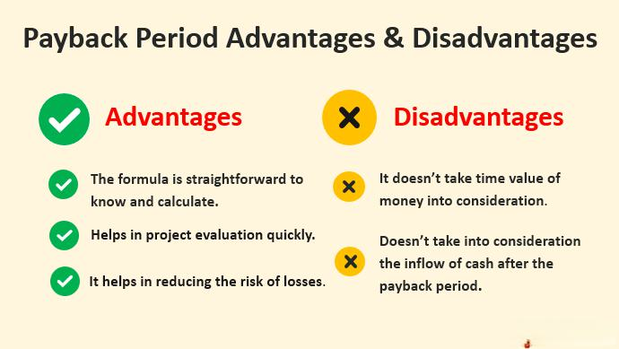

The payback period is a critical concept in investment analysis, representing the time required for an investment to generate cash flows sufficient to recover its initial cost. It is essentially a measure of liquidity, indicating how quickly an investor can expect to break even on a particular venture. The payback period can be calculated by dividing the initial investment by the annual cash inflow. For instance, if an investment costs $10,000 and yields $2,000 annually, the payback period would be 5 years.

Understanding the payback period is crucial for investors because it provides a clear indication of the time frame within which they can recover their investment. This metric is particularly valuable for assessing the risk associated with investments, as shorter payback periods are generally less risky, offering quicker recovery of funds. It serves as a straightforward tool for comparing projects, especially when capital resources are limited, thereby aiding in making informed financial decisions.



Algo trading, short for algorithmic trading, represents a sophisticated method of investment analysis that uses computer algorithms to make swift, data-driven decisions. This form of trading automates processes that would typically require significant time and human intervention, offering speed and precision in executing trades. The integration of such technology in investment strategies is becoming increasingly relevant as financial markets grow more complex and data-intensive.

Analyzing financial limitations is a critical aspect of investment, as it ensures investors are aware of potential pitfalls and constraints associated with their decisions. Understanding the limitations of tools like the payback period helps to avoid over-reliance on a single metric, promoting a more balanced and comprehensive approach to investment analysis.

The objective of this article is to explore the concept of the payback period, its financial limitations, and the role of algo trading in modern investment analysis. By examining these components, the article aims to provide investors with a nuanced understanding of how to effectively integrate traditional and cutting-edge analytic tools to optimize their investment strategies.

## Table of Contents

## What is the Payback Period?

The payback period measures the time it takes for an investment to generate enough cash flow to recover its initial cost. It is a straightforward metric used by investors to assess how quickly an investment can 'pay back' its original expenses. The payback period is calculated by dividing the initial investment by the annual cash inflow. For instance, with an investment of $100,000 expected to yield $20,000 annually, the payback period would be 5 years.

There are two primary types of payback period calculations: undiscounted and discounted. The undiscounted payback period does not account for the time value of money; it simply tallies annual cash inflows until the initial investment cost is recovered. Conversely, the discounted payback period considers the present value of future cash inflows. This adjustment reflects the fact that money today is worth more than the same amount in the future. Here is how you can calculate the discounted payback period using Python:

```python
def discounted_payback_period(initial_investment, cash_flows, discount_rate):
    cumulative_cash_flow = 0
    year = 0

    for cash_flow in cash_flows:
        year += 1
        discounted_cash_flow = cash_flow / (1 + discount_rate) ** year
        cumulative_cash_flow += discounted_cash_flow

        if cumulative_cash_flow >= initial_investment:
            return year

    return None  # Payback period exceeds projection

# Example usage
initial_investment = 100000
cash_flows = [20000, 25000, 30000, 35000, 40000]
discount_rate = 0.05
payback_period = discounted_payback_period(initial_investment, cash_flows, discount_rate)
```

Investors often use the payback period as a preliminary gauge of investment risk, preferring projects with shorter payback periods, which are perceived as less risky. This tool is especially common in industries like manufacturing, oil and gas, and real estate, where large capital expenditures are prevalent, and quick recovery of cash inflows is critical.

However, relying solely on the payback period poses significant limitations. It does not measure the overall profitability of a project, ignore potential cash flows beyond the payback period, and lacks considerations for the time value of money in its simplest form. Additionally, it may not account for the full operational risks associated with longer-term investments. Thus, while valuable, the payback period should be used in conjunction with other financial metrics, such as net present value (NPV) and internal rate of return (IRR), to provide a more holistic view of an investment's potential.

## Financial Limitations of Payback Period Analysis

The payback period is a straightforward investment evaluation tool that measures the time it takes for an investor to recoup their initial investment from cash inflows. Despite its simplicity and practicality in certain scenarios, the payback period is accompanied by several financial limitations that investors need to consider.

One major limitation of the traditional payback period is its failure to account for the time value of money (TVM). The time value of money is a critical financial concept indicating that a dollar today is worth more than a dollar in the future due to its potential [earning](/wiki/earning-announcement) capacity. Consequently, standard payback period calculations can be misleading as they treat all cash flows equally, regardless of when they occur. To overcome this issue, investors can employ the discounted payback period, which incorporates a discount rate to adjust future cash flows and provide a more accurate reflection of an investment’s worth over time. The formula for a discounted payback period requires calculating the present value of each cash inflow:

$$
\text{PV} = \frac{\text{Cash Flow}}{(1 + r)^n}
$$

where $r$ is the discount rate and $n$ is the time period.

Another significant drawback of the payback period is its disregard for cash flows occurring after the payback threshold is reached. Investments typically generate benefits for years beyond an initial payback period, and ignoring these benefits can result in an incomplete analysis, leading to potentially suboptimal investment decisions. To mitigate this limitation, investors should integrate other financial metrics, such as net present value (NPV) or internal rate of return (IRR), which consider all cash flows over an investment’s entire life span, providing a more comprehensive picture.

Additionally, the reliance on the payback period alone can result in the oversight of other crucial financial metrics. While it serves as a quick reference for [liquidity](/wiki/liquidity-risk-premium) and risk assessment, other metrics like NPV, IRR, and profitability index (PI) provide insights into overall profitability, efficiency, and the rate of return. These metrics collectively present a fuller understanding of an investment’s potential, guiding a more balanced decision-making process.

To address these limitations, investors can adopt a multi-faceted analysis approach, combining the payback period with complementary tools that assess profitability, risk, and efficiency. This holistic approach allows for more nuanced insights, balancing short-term liquidity and long-term profitability considerations. By integrating these methodologies, investors can make more informed and strategic decisions that align with their financial goals.

## Integrating Payback Period in Investment Analysis

Integrating the payback period into a comprehensive investment analysis involves understanding its benefits and limitations, and complementing it with qualitative and quantitative assessment tools. The payback period, which measures how long it takes for an investment to recoup its initial outlay, plays a crucial role in risk assessment by providing a simple metric to gauge investment recovery speed. Investors often prefer investments with shorter payback periods to reduce exposure to uncertainties over time. This aspect of risk assessment is particularly valued in volatile markets or industries with rapid technological changes, where long-term forecasts may be unreliable.

When integrating the payback period into investment analysis, it is essential to consider both quantitative and qualitative factors. Quantitatively, the payback period alone does not account for the time value of money or any returns generated beyond the payback point. Therefore, utilizing adjustments such as the discounted payback period can provide a more comprehensive insight. The formula for the discounted payback period is:

$$
\text{Discounted Payback Period} = \text{Years before recovery} + \left( \frac{\text{Remaining cost to recover}}{\text{Discounted cash flow in following year}} \right)
$$

Qualitatively, understanding the context and strategic importance of an investment is key. For example, investments with longer payback periods might be deemed acceptable if they align with the company's long-term strategic goals, such as entering new markets or developing innovative products.

Historically, sectors like renewable energy and manufacturing, which often require substantial upfront investments, have benefitted from employing the payback period as part of their financial assessments. For instance, companies investing in solar farms or wind turbines rely on shorter payback periods due to initial high capital costs and potential policy changes affecting profitability. In these scenarios, successful investment strategies often emerge from complementing the payback analysis with tools like Net Present Value (NPV), Internal Rate of Return (IRR), and sensitivity analysis. These tools provide insights into the potential profitability and viability of projects beyond the payback period.

Alternative analysis tools such as NPV and IRR help investors assess the full scope of an investment’s profitability and sustainability. While NPV calculates the net value of future cash flows in today’s terms, IRR provides the rate of growth an investment is expected to generate. These metrics, in conjunction with the payback period, offer a multidimensional approach to investment decision-making.

In conclusion, for a holistic investment analysis, the payback period should not stand alone. Instead, it should be part of a broader strategy that incorporates various financial metrics and qualitative evaluations, thereby enabling investors to make well-informed and balanced investment choices.

## Role of Algo Trading in Investment Decisions

Algorithmic trading, commonly referred to as algo trading, involves using computer systems to execute trading orders based on pre-set criteria. These systems utilize algorithms to analyze various market variables, enabling them to execute trades at speeds and frequencies impossible for human traders. Algo trading has significantly impacted investment decision-making by enhancing speed, accuracy, and efficiency.

## Advantages of Algo Trading for Fast and Efficient Decision-Making

One of the foremost advantages of algo trading is the speed at which transactions can be completed. High-frequency trading ([HFT](/wiki/high-frequency-trading-strategies)), a subset of [algorithmic trading](/wiki/algorithmic-trading), allows for thousands of trades per second, providing the opportunity to capitalize on minute price discrepancies. This rapid execution reduces the delay from decision-making to trade order placement, which is essential in volatile markets. Additionally, algo trading negates emotional decision-making by adhering strictly to predefined strategies.

## Complementing Traditional Financial Analysis Tools

Algo trading complements financial analysis tools like the payback period by integrating vast datasets to refine investment strategies. While the payback period assesses the time needed to recover an investment cost, algorithms can [factor](/wiki/factor-investing) in real-time market data, economic indicators, and risk assessments, enriching the investment analysis. This integration allows the optimization of entry and [exit](/wiki/exit-strategy) points in the market, aligning short-term trading strategies with long-term financial goals.

## Challenges and Considerations

Despite its benefits, algo trading presents significant challenges. Designing and testing a robust algorithm requires expertise and comprehensive historical data. There is also the risk of over-optimization, where an algorithm performs well in backtests but poorly in live markets. Market [volatility](/wiki/volatility-trading-strategies) can lead to unprecedented scenarios, causing an algorithm to act unpredictably. Furthermore, regulatory concerns and the potential for systemic risks require careful consideration and oversight.

## Real-World Examples

Real-world applications of algo trading demonstrate its profound influence on the financial industry. The adoption of algo trading by major hedge funds and investment banks has shifted market dynamics, with firms like Renaissance Technologies employing sophisticated algorithms to generate substantial returns. Another example is the flash crash of 2010, where the rapid execution of trades by algorithms led to a sudden market drop, illustrating both the power and potential pitfalls of algo trading.

In conclusion, algorithmic trading has reshaped investment decision-making processes by offering improved speed, efficiency, and precision. Although it complements traditional financial tools and significantly enhances trading strategies, it is essential to be mindful of the accompanying challenges, leveraging the benefits of both algorithmic systems and conventional analysis methods.

## Comparative Analysis: Payback Period and Algo Trading

The payback period and algorithmic trading (algo trading) are distinct yet complementary tools for investment analysis, each offering unique advantages and addressing different aspects of investment scrutiny.

The payback period is a straightforward financial metric that measures the time needed to recoup an initial investment. It is particularly effective for assessing the liquidity risk of a project by determining how quickly invested capital can be recovered. This method is simple and easily comprehensible, making it accessible for investors looking for a preliminary analysis of project risk. However, a critical limitation of the payback period is its lack of consideration for the time value of money; the method inherently assumes that future cash flows are of equal value, which can lead to suboptimal decision-making if not paired with more nuanced financial evaluations.

In contrast, algo trading utilizes sophisticated algorithms to analyze large datasets at high speed, providing a comprehensive overview of market dynamics. This technology is beneficial for processing vast volumes of data to identify trends, correlations, and arbitrages that might not be immediately visible through traditional analysis methods like the payback period. The primary strength of algo trading lies in its ability to make quick, data-driven decisions which are crucial in fast-paced financial markets. Nonetheless, algo trading requires significant expertise in creating and supervising algorithms, and it may fall short in evaluating qualitative factors often considered in investment decisions.

Integrating the payback period with algo trading can lead to a more balanced investment analysis. The simplicity and risk assessment advantage of the payback period can be enhanced by the data-driven insights provided by algo trading. For instance, while the payback period informs the investor about the initial recovery timeline of the investment, algo trading can project long-term trends and potential shifts in market conditions, offering a predictive edge. This synergy allows for a comprehensive analysis by merging short-term risk mitigation with long-term strategic foresight.

Investors should consider their specific goals when choosing between or integrating these tools. For projects where liquidity recovery is crucial, the payback period might be more relevant. However, when the strategy demands adaptability to market fluctuations or capturing short-lived opportunities, algo trading becomes indispensable. Combining these methods allows investors to rigorously analyze both financial metrics and dynamic market data, achieving a more informed and strategic investment approach.

For optimal results, investors should ensure a balance between quantitative precision and qualitative analysis within their strategy. This might involve using the payback period to establish fundamental milestones, while allowing algo trading to refine these milestones with real-time data patterns.

## Best Practices for Investors

Investors seeking optimal investment strategies can benefit significantly from understanding the payback period and incorporating algorithmic trading. Here are some best practices to consider:

### Actionable Tips for Using the Payback Period

1. **Understand the Basics**: Begin by thoroughly comprehending how the payback period works. This includes calculating both discounted and undiscounted payback periods. The undiscounted payback period simply divides the initial investment by annual cash inflows, while the discounted version accounts for the time value of money using the formula:
$$
   \text{Discounted Payback Period} = n + \left(\frac{\text{Initial Investment} - \sum_{i=1}^{n} \text{Discounted Cash Inflows}_i}{\text{Discounted Cash Inflow}_{n+1}}\right)

$$

   where $n$ is the last period with a negative discounted cumulative cash flow.

2. **Evaluate Multiple Metrics**: Do not rely solely on the payback period. Complement it with Net Present Value (NPV), Internal Rate of Return (IRR), and profitability index to make more informed decisions.

3. **Industry-Specific Applications**: Use the payback period strategically in industries where it is commonly applied, such as manufacturing and infrastructure, where quick capital recovery is often essential.

### Incorporating Algo Trading into Investment Strategies

1. **Leverage Technology**: Use algorithmic trading to process large datasets quickly, allowing for faster decision-making. Algorithms can analyze market trends and execute trades at optimal times.

2. **Diversify and Automate**: Develop diverse trading algorithms tailored for different market conditions. Automated strategies can reduce emotional decision-making, leading to more consistent outcomes.

3. **Risk Management**: Integrate risk parameters in algo trading systems, such as stop-loss orders and drawdown limitations, to protect against significant losses.

### Continuous Learning and Adaptation

1. **Stay Informed**: Keep abreast of technological advancements in finance technology and algorithm design. This continuous learning can help refine strategies and adapt to changing market dynamics.

2. **Simulation and Backtesting**: Regularly backtest and simulate both the payback period analysis and algorithmic strategies to ensure they perform well under diverse scenarios.

### Expert Opinions on Optimization

- **Diversification**: Experts recommend using a blend of traditional financial analysis, like payback period evaluations, with advanced algorithmic trading. This synergy can balance quantitative rigor and qualitative insights.

- **Incremental Implementation**: Gradually implement algo trading strategies, starting with a small portfolio allocation. This allows for adjustment and learning with minimal risk.

### Checklist for Integration

1. **Define Investment Goals**: Clarify the investment objectives to decide the weightage of payback period and algo trading in strategy development.

2. **Combine Tools**: Use payback period for risk assessment and capital planning while allowing algo trading to provide execution efficiency.

3. **Regular Monitoring**: Establish routines for monitoring investments and algorithm performance to quickly adapt to any market changes.

4. **Risk Evaluation**: Continuously evaluate risk exposures and adjust strategies to align with market conditions and risk tolerance levels.

5. **Feedback Loops**: Set up mechanisms for feedback and improvement, ensuring strategies evolve based on past performance and new insights.

By following these practices, investors can optimize their use of the payback period and algorithmic trading, leading to more robust and informed investment decision-making processes.

## Conclusion

Understanding the payback period is essential for investors as it provides a straightforward metric to evaluate the time required to recoup an investment. This metric serves as a crucial initial checkpoint for assessing potential investments, offering investors a clear snapshot of liquidity risk and timeline expectations. However, its simplicity also brings limitations—particularly its inability to account for the time value of money or cash flows beyond the payback point. These factors highlight the need to balance the payback period with other financial metrics for a holistic view of an investment's potential.

The integration of advanced technological tools like algorithmic trading (algo trading) complements traditional analysis methods. Algo trading offers the benefit of executing investment decisions at unprecedented speeds and with heightened precision, adapting to data far more quickly than manual processes allow. This evolution in investment methods points to the growing importance of embracing technology in financial analysis. The combination of such tools with conventional analysis methods offers investors a well-rounded investment strategy, balancing speed with careful scrutiny of fundamental metrics.

Investment analysis continues to evolve, driven by technological progress and the need for more nuanced approaches in decision-making. As new methodologies emerge, investors must remain adaptable, integrating these advancements while retaining the lessons of established financial principles. Balancing risks and opportunities demands vigilance, continuous learning, and the strategic application of both emerging technologies and timeless financial evaluation methods. In essence, informed decision-making in investments hinges on the synergy between simplicity and sophistication, leveraging both historical insights and state-of-the-art technologies.

## Frequently Asked Questions

### Frequently Asked Questions

**What is a payback period, and why is it important?**  
The payback period is the time it takes for an investment to generate an amount of money equal to the initial cost of the investment. It is a simple and quick method to assess the risk associated with an investment; the shorter the payback period, the lower the risk, as the capital is recovered faster. This metric is crucial for investors because it provides a basic measure of investment liquidity and aids in evaluating the feasibility of various projects. Though simplistic, it remains a widely used benchmark for the preliminary assessment of profitability.

**How does algo trading differ from traditional investment analysis?**  
Algorithmic trading, or algo trading, involves using computer programs to execute trades based on pre-defined criteria and is characterized by speed, efficiency, and data-driven decisions. Unlike traditional investment analysis, which may rely on qualitative assessments and human intuition, algo trading leverages quantitative models to analyze vast datasets and identify market opportunities. This approach reduces emotional biases and can execute trades at speeds unattainable by human traders, thereby optimizing the investment process.

**What are the main drawbacks of the payback period in investment strategies?**  
The payback period has several limitations. Primarily, it disregards the time value of money, which means that it treats all cash inflows as equal regardless of when they occur. This oversight can lead to a skewed evaluation of projects with longer lifecycles. Additionally, the payback period ignores any benefits that occur after the initial cost is recovered, resulting in potentially undervaluing projects that offer substantial returns in the later stages. It also overlooks other crucial factors like profitability and risk beyond the payback timeframe.

**Can algo trading replace traditional financial analysis tools?**  
While algo trading offers significant advantages in terms of speed and data processing capability, it cannot completely replace traditional financial analysis tools. Traditional tools bring nuanced qualitative insights and the capacity to handle market anomalies better than algorithms. Both approaches play distinct and complementary roles in a comprehensive investment strategy. Algorithmic systems can enhance decision-making by providing precise data-driven insights, but they work best when used alongside traditional methods that account for broader market contexts and strategic considerations.

**How can investors optimize their strategies using both the payback period and algo trading?**  
Investors can optimize their strategies by utilizing the payback period for a quick risk assessment and preliminary project screening, while employing algo trading to conduct detailed data analysis and execute efficient trading decisions. By integrating these approaches, investors can gain a balanced perspective that combines the simplicity and accessibility of the payback period with the precision and speed of algo trading. To fully leverage these tools, investors should aim for a diversified strategy that adapts to market changes and incorporates various analytical perspectives.

## References & Further Reading

[1]: Bergstra, J., Bardenet, R., Bengio, Y., & Kégl, B. (2011). ["Algorithms for Hyper-Parameter Optimization."](https://papers.nips.cc/paper/4443-algorithms-for-hyper-parameter-optimization) Advances in Neural Information Processing Systems 24.

[2]: ["Advances in Financial Machine Learning"](https://www.amazon.com/Advances-Financial-Machine-Learning-Marcos/dp/1119482089) by Marcos Lopez de Prado

[3]: ["Evidence-Based Technical Analysis: Applying the Scientific Method and Statistical Inference to Trading Signals"](https://www.amazon.com/Evidence-Based-Technical-Analysis-Scientific-Statistical/dp/0470008741) by David Aronson

[4]: ["Machine Learning for Algorithmic Trading"](https://github.com/stefan-jansen/machine-learning-for-trading) by Stefan Jansen

[5]: ["Quantitative Trading: How to Build Your Own Algorithmic Trading Business"](https://www.amazon.com/Quantitative-Trading-Build-Algorithmic-Business/dp/1119800064) by Ernest P. Chan