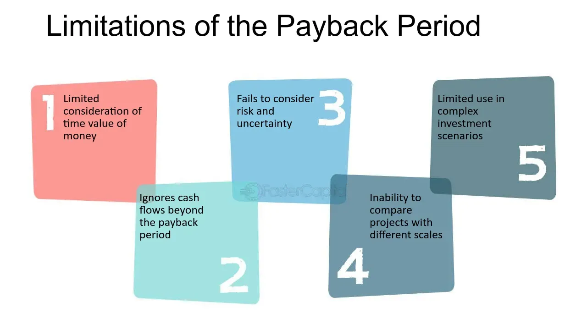

## Table of Contents

## What is Payback Period Analysis?

Payback Period Analysis is a way to figure out how long it will take for an investment to pay for itself. It's like counting the number of years or months until the money you put into a project starts coming back to you in profits or savings. For example, if you spend $10,000 on a new machine for your business, you would use Payback Period Analysis to see how long it takes for the machine to save or earn you back that $10,000.

This method is popular because it's simple and easy to understand. Businesses often use it to quickly compare different investment options. However, it has some downsides. It doesn't consider the time value of money, which means it treats a dollar today the same as a dollar in the future. Also, it doesn't account for what happens after the payback period, like additional profits or costs. Despite these limitations, Payback Period Analysis remains a useful tool for making quick investment decisions.

## Why is Payback Period Analysis important in investment decisions?

Payback Period Analysis is important in investment decisions because it helps businesses see how quickly they can get their money back from an investment. This is useful for companies that need to recover their costs fast. For example, if a business is thinking about buying new equipment, they can use Payback Period Analysis to see how many years it will take for the equipment to start making money for them. This helps them decide if the investment is worth it, especially if they have limited funds and need to choose between different projects.

Another reason Payback Period Analysis is important is that it's easy to understand and calculate. It doesn't require complicated math or financial knowledge, so even people who aren't experts in finance can use it to make decisions. This simplicity makes it a popular tool for quick comparisons between different investment options. However, it's worth noting that while Payback Period Analysis is helpful, it doesn't tell the whole story. It doesn't consider the value of money over time or what happens after the payback period, so it should be used alongside other methods for a complete analysis.

## What are the basic limitations of Payback Period Analysis?

One big problem with Payback Period Analysis is that it doesn't think about the time value of money. This means it treats money you get today the same as money you get in the future. But in real life, a dollar today is worth more than a dollar in the future because you can invest it and earn more money. So, Payback Period Analysis might make some investments look better than they really are if they take a long time to pay back.

Another limitation is that Payback Period Analysis only looks at how long it takes to get your money back, not what happens after that. It doesn't consider any extra money you might make or any extra costs you might have once you've recovered your initial investment. This can make it hard to see the full picture of whether an investment is a good idea in the long run.

Despite these limitations, Payback Period Analysis is still useful because it's simple and quick. It's great for getting a rough idea of how fast you'll get your money back, especially when you need to make decisions fast. But it's best to use it along with other methods that look at the bigger picture and consider things like the time value of money and future profits.

## How does Payback Period Analysis fail to account for the time value of money?

Payback Period Analysis doesn't consider the time value of money, which means it treats money you get today the same as money you get later. But in real life, a dollar today is worth more than a dollar in the future because you can invest it and earn more money. So, if an investment takes a long time to pay back, Payback Period Analysis might make it look better than it really is. It doesn't show that waiting for your money can cost you.

For example, if you invest $1,000 and it takes five years to get your money back, Payback Period Analysis would say that's okay. But it doesn't consider that if you had that $1,000 now, you could invest it somewhere else and maybe earn more money over those five years. This means Payback Period Analysis can make long-term investments seem more attractive than they really are because it doesn't account for the opportunity cost of waiting to get your money back.

## Can you explain how Payback Period Analysis ignores cash flows after the payback period?

Payback Period Analysis only looks at how long it takes to get your money back from an investment. It stops counting once you've recovered your initial cost. This means it doesn't care about any extra money you might make after the payback period is over. For example, if you buy a machine and it pays for itself in three years, Payback Period Analysis won't tell you about any profits you might make in the fourth or fifth year.

This can be a big problem because sometimes the most important part of an investment is what happens after you get your money back. If an investment keeps making money for a long time after the payback period, it might be a much better choice than it looks using just Payback Period Analysis. So, while this method is good for a quick look at how fast you'll recover your costs, it doesn't give you the full picture of an investment's value over time.

## What are the implications of not considering risk in Payback Period Analysis?

Not considering risk in Payback Period Analysis can make it hard to see if an investment is really a good idea. Every investment has some risk, like the chance that it might not work out as planned or that the market might change. If you only look at how fast you get your money back, you might choose an investment that looks good on paper but is actually very risky. For example, if you invest in a new technology that could be replaced by something better soon, Payback Period Analysis won't tell you about that risk.

Ignoring risk can lead to bad decisions, especially if you're comparing different investments. One investment might pay back faster but be much riskier than another one that takes longer to pay back but is safer. If you don't think about risk, you might pick the fast one and end up losing money if things go wrong. So, it's important to use Payback Period Analysis along with other methods that look at risk, to get a better idea of which investments are really the best choices.

## How does Payback Period Analysis compare to other investment appraisal techniques?

Payback Period Analysis is a simple way to figure out how quickly you'll get your money back from an investment. It's easy to use and understand, so it's good for quick decisions. But it has some big limitations. It doesn't think about the time value of money, which means it treats money today the same as money in the future. It also doesn't look at what happens after you get your money back, like extra profits or costs. And it doesn't consider risk, so it might make risky investments look better than they are.

Other investment appraisal techniques, like Net Present Value (NPV) and Internal Rate of Return (IRR), are more detailed. NPV takes into account the time value of money by discounting future cash flows back to today's dollars. This helps you see if an investment will really be worth it in the long run. IRR, on the other hand, calculates the rate of return you can expect from an investment, which helps you compare different investments more accurately. Both NPV and IRR consider the full life of an investment, including all cash flows and the risks involved, making them more comprehensive than Payback Period Analysis.

Despite these differences, Payback Period Analysis is still useful because it's quick and simple. It's a good first step to see how fast you'll recover your costs. But for a complete picture, it's best to use it along with other methods like NPV and IRR, which give you a deeper understanding of an investment's true value and risks.

## What are the advanced limitations of Payback Period Analysis in complex financial scenarios?

In complex financial scenarios, Payback Period Analysis can be even more limited because it doesn't handle the ups and downs of cash flows well. For example, if an investment has a lot of changes in how much money it makes or loses over time, Payback Period Analysis can't show that. It just looks at the total amount of money you get back until you cover your costs. So, if an investment starts making a lot of money after a few years but then loses money, Payback Period Analysis won't tell you about those changes. This makes it hard to use in businesses where things like sales, costs, and profits can change a lot.

Another problem in complex scenarios is that Payback Period Analysis doesn't consider how different parts of a business might affect each other. For instance, if you're investing in a new product line, it might affect other parts of your business, like how much you sell of your old products or how much it costs to run your factory. Payback Period Analysis doesn't look at these connections, so it might make an investment look good when it could actually cause problems in other areas of your business. Because of these issues, in more complicated situations, it's really important to use other methods along with Payback Period Analysis to get a full picture of what's going on.

## How can biases in decision-making affect the use of Payback Period Analysis?

Biases in decision-making can really change how people use Payback Period Analysis. For example, if someone is in a hurry to get their money back, they might like Payback Period Analysis because it's all about how fast you recover your costs. This can make them choose investments that pay back quickly, even if those investments are risky or won't make much money in the long run. This is called a "short-term bias," where people focus too much on getting their money back fast and don't think about the bigger picture.

Another way biases can affect Payback Period Analysis is through overconfidence. If someone thinks they know everything about an investment, they might not look at other important things like risk or the time value of money. They might just use Payback Period Analysis because it's simple and gives them a quick answer. But this can lead to bad decisions because they're not considering all the factors that could affect the investment. So, it's important to be aware of these biases and use other methods along with Payback Period Analysis to make better choices.

## What are some real-world examples where Payback Period Analysis has limitations?

In a real-world example, a company might be looking at buying a new piece of machinery that costs $50,000. They expect the machine to save them $10,000 a year in labor costs. Using Payback Period Analysis, they would see that it takes 5 years to get their money back. But what if the machine needs a lot of repairs after those 5 years? Payback Period Analysis doesn't tell them about those extra costs. Also, if they could have invested that $50,000 somewhere else and made more money, the analysis doesn't show that either. So, they might think the machine is a good investment when it might not be.

Another example is a business thinking about opening a new store. They figure out that it will take 3 years to pay back the money they spend on the store. But what if the neighborhood changes and fewer people come to shop there after those 3 years? Payback Period Analysis doesn't consider that. It also doesn't think about how opening the new store might affect their other stores. Maybe people will start shopping at the new store instead of the old ones, which could hurt their overall business. So, even though the new store looks good using Payback Period Analysis, it might not be the best choice when you look at everything.

## How can the limitations of Payback Period Analysis be mitigated or addressed?

To make up for the limitations of Payback Period Analysis, you can use other methods along with it. For example, you can use Net Present Value (NPV) to see how much an investment is really worth over time. NPV takes into account the time value of money, which means it treats money today differently than money in the future. This helps you see if an investment will actually be worth it in the long run. You can also use Internal Rate of Return (IRR) to find out the expected rate of return on an investment, which helps you compare different investments more accurately. Both NPV and IRR consider the full life of an investment, including all the money coming in and going out, and the risks involved.

Another way to deal with the limitations of Payback Period Analysis is to think about the bigger picture. This means looking at things like how an investment might affect other parts of your business or how it might change over time. For example, if you're investing in a new product, think about how it might affect your old products or how much it will cost to make and sell it over time. You can also talk to experts or use computer models to help you see how different scenarios might play out. By using these other methods and thinking about the bigger picture, you can get a better idea of whether an investment is really a good choice.

## What are the future trends or potential developments in improving Payback Period Analysis?

In the future, Payback Period Analysis might get better by using new technology like computer programs and AI. These tools could help make the analysis more accurate by looking at more data and considering things like the time value of money and risk. For example, AI could predict how an investment might change over time and show how different scenarios could affect when you get your money back. This would make Payback Period Analysis more useful and help people make better decisions.

Another way Payback Period Analysis could improve is by working together with other methods like Net Present Value (NPV) and Internal Rate of Return (IRR). Instead of just using Payback Period Analysis by itself, people might use it as part of a bigger set of tools. This way, they can get a fuller picture of an investment. For instance, a computer program could automatically calculate the Payback Period along with NPV and IRR, giving a complete analysis that takes into account all the important factors. This would make Payback Period Analysis more helpful and less likely to lead to bad choices.

## What are the financial limitations of payback period analysis?

The payback period is a straightforward investment evaluation tool that measures the time it takes for an investor to recoup their initial investment from cash inflows. Despite its simplicity and practicality in certain scenarios, the payback period is accompanied by several financial limitations that investors need to consider.

One major limitation of the traditional payback period is its failure to account for the time value of money (TVM). The time value of money is a critical financial concept indicating that a dollar today is worth more than a dollar in the future due to its potential [earning](/wiki/earning-announcement) capacity. Consequently, standard payback period calculations can be misleading as they treat all cash flows equally, regardless of when they occur. To overcome this issue, investors can employ the discounted payback period, which incorporates a discount rate to adjust future cash flows and provide a more accurate reflection of an investment’s worth over time. The formula for a discounted payback period requires calculating the present value of each cash inflow:

$$
\text{PV} = \frac{\text{Cash Flow}}{(1 + r)^n}
$$

where $r$ is the discount rate and $n$ is the time period.

Another significant drawback of the payback period is its disregard for cash flows occurring after the payback threshold is reached. Investments typically generate benefits for years beyond an initial payback period, and ignoring these benefits can result in an incomplete analysis, leading to potentially suboptimal investment decisions. To mitigate this limitation, investors should integrate other financial metrics, such as net present value (NPV) or internal rate of return (IRR), which consider all cash flows over an investment’s entire life span, providing a more comprehensive picture.

Additionally, the reliance on the payback period alone can result in the oversight of other crucial financial metrics. While it serves as a quick reference for [liquidity](/wiki/liquidity-risk-premium) and risk assessment, other metrics like NPV, IRR, and profitability index (PI) provide insights into overall profitability, efficiency, and the rate of return. These metrics collectively present a fuller understanding of an investment’s potential, guiding a more balanced decision-making process.

To address these limitations, investors can adopt a multi-faceted analysis approach, combining the payback period with complementary tools that assess profitability, risk, and efficiency. This holistic approach allows for more nuanced insights, balancing short-term liquidity and long-term profitability considerations. By integrating these methodologies, investors can make more informed and strategic decisions that align with their financial goals.

## How can the Payback Period be integrated into Investment Analysis?

Integrating the payback period into a comprehensive investment analysis involves understanding its benefits and limitations, and complementing it with qualitative and quantitative assessment tools. The payback period, which measures how long it takes for an investment to recoup its initial outlay, plays a crucial role in risk assessment by providing a simple metric to gauge investment recovery speed. Investors often prefer investments with shorter payback periods to reduce exposure to uncertainties over time. This aspect of risk assessment is particularly valued in volatile markets or industries with rapid technological changes, where long-term forecasts may be unreliable.

When integrating the payback period into investment analysis, it is essential to consider both quantitative and qualitative factors. Quantitatively, the payback period alone does not account for the time value of money or any returns generated beyond the payback point. Therefore, utilizing adjustments such as the discounted payback period can provide a more comprehensive insight. The formula for the discounted payback period is:

$$
\text{Discounted Payback Period} = \text{Years before recovery} + \left( \frac{\text{Remaining cost to recover}}{\text{Discounted cash flow in following year}} \right)
$$

Qualitatively, understanding the context and strategic importance of an investment is key. For example, investments with longer payback periods might be deemed acceptable if they align with the company's long-term strategic goals, such as entering new markets or developing innovative products.

Historically, sectors like renewable energy and manufacturing, which often require substantial upfront investments, have benefitted from employing the payback period as part of their financial assessments. For instance, companies investing in solar farms or wind turbines rely on shorter payback periods due to initial high capital costs and potential policy changes affecting profitability. In these scenarios, successful investment strategies often emerge from complementing the payback analysis with tools like Net Present Value (NPV), Internal Rate of Return (IRR), and sensitivity analysis. These tools provide insights into the potential profitability and viability of projects beyond the payback period.

Alternative analysis tools such as NPV and IRR help investors assess the full scope of an investment’s profitability and sustainability. While NPV calculates the net value of future cash flows in today’s terms, IRR provides the rate of growth an investment is expected to generate. These metrics, in conjunction with the payback period, offer a multidimensional approach to investment decision-making.

In conclusion, for a holistic investment analysis, the payback period should not stand alone. Instead, it should be part of a broader strategy that incorporates various financial metrics and qualitative evaluations, thereby enabling investors to make well-informed and balanced investment choices.

## What are the best practices for investors?

Investors seeking optimal investment strategies can benefit significantly from understanding the payback period and incorporating algorithmic trading. Here are some best practices to consider:

### Actionable Tips for Using the Payback Period

1. **Understand the Basics**: Begin by thoroughly comprehending how the payback period works. This includes calculating both discounted and undiscounted payback periods. The undiscounted payback period simply divides the initial investment by annual cash inflows, while the discounted version accounts for the time value of money using the formula:
$$
   \text{Discounted Payback Period} = n + \left(\frac{\text{Initial Investment} - \sum_{i=1}^{n} \text{Discounted Cash Inflows}_i}{\text{Discounted Cash Inflow}_{n+1}}\right)

$$

   where $n$ is the last period with a negative discounted cumulative cash flow.

2. **Evaluate Multiple Metrics**: Do not rely solely on the payback period. Complement it with Net Present Value (NPV), Internal Rate of Return (IRR), and profitability index to make more informed decisions.

3. **Industry-Specific Applications**: Use the payback period strategically in industries where it is commonly applied, such as manufacturing and infrastructure, where quick capital recovery is often essential.

### Incorporating Algo Trading into Investment Strategies

1. **Leverage Technology**: Use algorithmic trading to process large datasets quickly, allowing for faster decision-making. Algorithms can analyze market trends and execute trades at optimal times.

2. **Diversify and Automate**: Develop diverse trading algorithms tailored for different market conditions. Automated strategies can reduce emotional decision-making, leading to more consistent outcomes.

3. **Risk Management**: Integrate risk parameters in algo trading systems, such as stop-loss orders and drawdown limitations, to protect against significant losses.

### Continuous Learning and Adaptation

1. **Stay Informed**: Keep abreast of technological advancements in finance technology and algorithm design. This continuous learning can help refine strategies and adapt to changing market dynamics.

2. **Simulation and Backtesting**: Regularly backtest and simulate both the payback period analysis and algorithmic strategies to ensure they perform well under diverse scenarios.

### Expert Opinions on Optimization

- **Diversification**: Experts recommend using a blend of traditional financial analysis, like payback period evaluations, with advanced algorithmic trading. This synergy can balance quantitative rigor and qualitative insights.

- **Incremental Implementation**: Gradually implement algo trading strategies, starting with a small portfolio allocation. This allows for adjustment and learning with minimal risk.

### Checklist for Integration

1. **Define Investment Goals**: Clarify the investment objectives to decide the weightage of payback period and algo trading in strategy development.

2. **Combine Tools**: Use payback period for risk assessment and capital planning while allowing algo trading to provide execution efficiency.

3. **Regular Monitoring**: Establish routines for monitoring investments and algorithm performance to quickly adapt to any market changes.

4. **Risk Evaluation**: Continuously evaluate risk exposures and adjust strategies to align with market conditions and risk tolerance levels.

5. **Feedback Loops**: Set up mechanisms for feedback and improvement, ensuring strategies evolve based on past performance and new insights.

By following these practices, investors can optimize their use of the payback period and algorithmic trading, leading to more robust and informed investment decision-making processes.

## References & Further Reading

[1]: Bergstra, J., Bardenet, R., Bengio, Y., & Kégl, B. (2011). ["Algorithms for Hyper-Parameter Optimization."](https://papers.nips.cc/paper/4443-algorithms-for-hyper-parameter-optimization) Advances in Neural Information Processing Systems 24.

[2]: ["Advances in Financial Machine Learning"](https://www.amazon.com/Advances-Financial-Machine-Learning-Marcos/dp/1119482089) by Marcos Lopez de Prado

[3]: ["Evidence-Based Technical Analysis: Applying the Scientific Method and Statistical Inference to Trading Signals"](https://www.amazon.com/Evidence-Based-Technical-Analysis-Scientific-Statistical/dp/0470008741) by David Aronson

[4]: ["Machine Learning for Algorithmic Trading"](https://github.com/stefan-jansen/machine-learning-for-trading) by Stefan Jansen

[5]: ["Quantitative Trading: How to Build Your Own Algorithmic Trading Business"](https://www.amazon.com/Quantitative-Trading-Build-Algorithmic-Business/dp/1119800064) by Ernest P. Chan