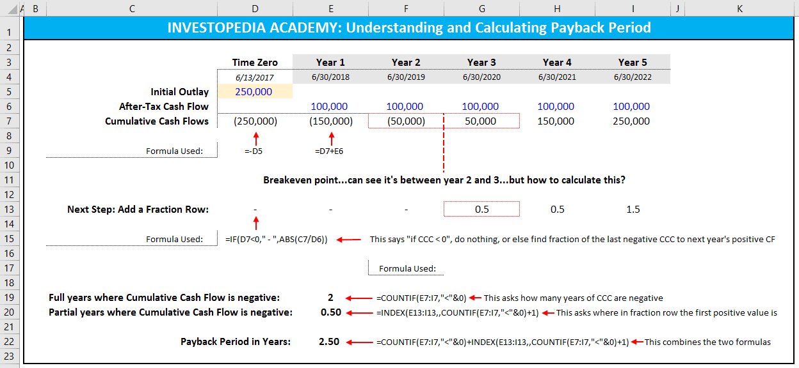

## Table of Contents

## What is the payback period and why is it important?

The payback period is the time it takes for an investment to earn back the money you spent on it. For example, if you spend $100 on a project and it starts making $25 each year, the payback period would be 4 years because that's how long it takes to get your $100 back.

It's important because it helps you understand how quickly you can recover your investment. This is useful for deciding if a project is worth doing, especially if you need the money back quickly. However, the payback period doesn't tell you everything. It doesn't consider the money you might make after the payback period or other costs, so it's just one part of making a good decision.

## How do you calculate the payback period manually?

To calculate the payback period manually, you need to know how much money you're putting into the project and how much money you expect to get back each year. Let's say you invest $1,000 in a project, and it makes $250 every year. You would divide the total investment by the yearly return to find out how many years it takes to get your money back. In this case, $1,000 divided by $250 equals 4 years. That's your payback period.

Sometimes, the money you get back each year isn't the same. If that happens, you add up the money you get back each year until it equals or passes your initial investment. For example, if you invest $1,000 and get $300 the first year, $400 the second year, and $500 the third year, you would add the first year's $300 and the second year's $400 to get $700. You still need $300 more to reach $1,000. In the third year, you get $500, so you only need part of that year to get the remaining $300. You would divide $300 by $500 to find out what part of the third year you need, which is 0.6 years. So, the payback period would be 2 years plus 0.6 years, which equals 2.6 years.

## What are the basic steps to set up a payback period calculation in Excel?

To set up a payback period calculation in Excel, start by entering your initial investment in one cell. For example, if you invested $1,000, put that number in cell A1. Next, list the cash flows you expect to receive each year in the cells below. So, if you expect to get $250 each year for 4 years, put $250 in cells A2, A3, A4, and A5. You can label these cells to make it clear what they represent, like "Year 1," "Year 2," and so on.

Then, use Excel formulas to calculate the cumulative cash flow. In cell B2, you can write a formula like "=A2" to show the cash flow for the first year. In cell B3, write "=B2+A3" to add the cash flow from the second year to the first year's total. Keep doing this down the column until you reach or pass your initial investment. Once you have the cumulative cash flows, find the first cell in column B where the number is equal to or greater than your initial investment. If it's exactly equal, the payback period is the number of years up to that point. If it's greater, you'll need to do a bit more math to figure out the fraction of the year needed to reach your initial investment. For example, if cell B3 shows $750 and cell B4 shows $1,250, you know the payback period is between 2 and 3 years. To find the exact payback period, subtract the cumulative cash flow just before you reach the investment ($750) from the investment ($1,000), which gives you $250. Then, divide that by the cash flow for the next year ($500), which gives you 0.5 years. So, the payback period is 2.5 years.

## How do you input cash flows into an Excel spreadsheet for payback period analysis?

To input cash flows into an Excel spreadsheet for payback period analysis, start by opening a new Excel workbook. In the first cell of the first column, like A1, type in the amount of money you initially invested. For example, if you invested $1,000, put "1000" in cell A1. Below that, in cells A2, A3, A4, and so on, enter the amount of money you expect to get back each year. If you expect to get $250 each year for four years, you would put "250" in cells A2, A3, A4, and A5. You can label these cells to make it clear what they represent, like putting "Initial Investment" in cell A1, "Year 1" in cell A2, "Year 2" in cell A3, and so on.

Once you have entered all your cash flows, you can use Excel formulas to calculate the cumulative cash flow. In cell B2, you can write a formula like "=A2" to show the cash flow for the first year. In cell B3, write "=B2+A3" to add the cash flow from the second year to the first year's total. Keep doing this down the column until you reach or pass your initial investment. This way, you can see how the money adds up over time and figure out when you get your initial investment back.

## What Excel functions are useful for calculating the payback period?

To calculate the payback period in Excel, you can use basic arithmetic functions like addition and subtraction. Start by entering your initial investment in one cell, say A1. Then, list the cash flows you expect to receive each year in the cells below, like A2, A3, A4, and so on. Use the SUM function to calculate the cumulative cash flows. For example, in cell B2, you can use "=A2" to show the cash flow for the first year. In cell B3, use "=B2+A3" to add the cash flow from the second year to the first year's total. Keep doing this down the column until you reach or pass your initial investment. Once you have the cumulative cash flows, you can find the payback period by seeing which year the cumulative cash flow first equals or exceeds the initial investment.

If the cumulative cash flow exactly matches the initial investment in a whole year, the payback period is the number of years up to that point. But if it's more than the initial investment, you need to find the fraction of the year needed to reach the initial investment. For example, if your initial investment is $1,000, and by the end of year 2 (cell B3) you have $750, and by the end of year 3 (cell B4) you have $1,250, you know the payback period is between 2 and 3 years. To find the exact payback period, subtract the cumulative cash flow just before you reach the investment ($750) from the investment ($1,000), which gives you $250. Then, divide that by the cash flow for the next year ($500), which gives you 0.5 years. So, the payback period is 2.5 years.

## Can you explain how to use the NPV function in Excel to assist with payback period calculations?

The NPV function in Excel, which stands for Net Present Value, isn't used directly to find the payback period, but it can help you understand the value of your investment over time. The NPV function calculates the present value of a series of cash flows by discounting them back to today's dollars. You need to enter a discount rate, which is the rate of return you expect from your investment, and then list the cash flows you expect to receive each year. For example, if you have an initial investment of $1,000 and expect to get $250 each year for four years, you can use the NPV function to see if the investment is worth it considering the time value of money.

While the NPV function itself doesn't tell you the payback period, you can use it to compare different investment options. By calculating the NPV, you get a sense of how much money your investment is worth today. If the NPV is positive, it means the investment is expected to be profitable. You can then use the cash flows you entered for the NPV calculation to manually calculate the payback period. Add up the cash flows each year until you reach or pass your initial investment, and use the method I explained earlier to find the exact payback period.

## How do you handle uneven cash flows when calculating the payback period in Excel?

When you have uneven cash flows, you need to add them up year by year until you get back the money you put in. Let's say you spent $1,000 on a project. In the first year, you get $300 back, in the second year, you get $400, and in the third year, you get $500. You add up the first year's $300 and the second year's $400, which gives you $700. You still need $300 more to reach $1,000. In the third year, you get $500, so you only need part of that year to get the remaining $300. You can figure out how much of the third year you need by dividing $300 by $500, which gives you 0.6 years. So, the payback period is 2 years plus 0.6 years, which equals 2.6 years.

To do this in Excel, you enter your initial investment in one cell, say A1. Then, you list the cash flows for each year in the cells below, like A2 for the first year, A3 for the second year, and so on. In another column, you can use formulas to add up the cash flows year by year until you reach or pass your initial investment. For example, in cell B2, you can write "=A2" to show the cash flow for the first year. In cell B3, write "=B2+A3" to add the second year's cash flow to the first year's total. Keep doing this until you find the year where the total cash flow equals or exceeds your initial investment. If it's exactly equal, the payback period is the number of years up to that point. If it's more than the initial investment, you need to find the fraction of the year needed to reach the initial investment, just like we did in the example above.

## What are common errors to avoid when calculating the payback period in Excel?

When calculating the payback period in Excel, one common mistake is forgetting to include all the cash flows. You need to add up all the money coming in until it equals or passes the money you spent at the start. If you miss any cash flows, your payback period will be wrong. Another mistake is not figuring out the fraction of the year right when the total cash flow goes over the initial investment. If you don't do this, your payback period might be off by a lot.

Also, make sure you're adding the cash flows in the right order. Start with the first year and keep going until you reach your goal. Mixing up the order can mess up your calculations. And remember, the payback period doesn't tell you everything about an investment. It's just one part of deciding if something is worth doing, so don't rely on it alone.

## How can you use Excel's conditional formatting to highlight the payback period?

To use Excel's conditional formatting to highlight the payback period, first set up your spreadsheet with your initial investment in one cell, like A1, and the yearly cash flows in the cells below, like A2, A3, and so on. Then, use formulas in another column to calculate the cumulative cash flows. For example, in cell B2, you can write "=A2" to show the first year's cash flow. In cell B3, write "=B2+A3" to add the second year's cash flow to the first year's total. Keep doing this down the column until you reach or pass your initial investment.

Once you have the cumulative cash flows, you can use conditional formatting to highlight the cell where the cumulative cash flow first equals or exceeds the initial investment. To do this, select the cells with the cumulative cash flows, go to the "Home" tab, and click on "Conditional Formatting." Choose "New Rule," then select "Use a formula to determine which cells to format." Enter a formula like "=B2>=$A$1" to highlight the first cell where the cumulative cash flow is greater than or equal to the initial investment. Click "Format," choose a highlight color, and click "OK." This will make it easy to see where the payback period ends.

## How do you adjust the payback period calculation for inflation or discount rates in Excel?

When you want to adjust the payback period calculation for inflation or discount rates in Excel, you need to change the value of the money you get back each year. Inflation means the money you get in the future will be worth less than it is now. A discount rate is used to figure out what future money is worth today. To do this, you need to use the present value of the cash flows instead of their actual amounts. You can use Excel's PV function to find the present value of each year's cash flow, considering the discount rate or inflation rate.

After you find the present value of each year's cash flow, you add them up until they equal or pass the initial investment, just like you do with the regular payback period. But now, you're using the adjusted amounts. This way, you get a more accurate idea of how long it will take to get your money back, taking into account that the money you get in the future is worth less than the money you spend now.

## What advanced Excel techniques can improve the accuracy of payback period calculations?

To improve the accuracy of payback period calculations in Excel, you can use the PV function to account for the time value of money. The PV function helps you find the present value of future cash flows, which means you can adjust them for inflation or a discount rate. This makes your payback period calculation more realistic because it considers that money you get in the future is worth less than money you spend now. You enter your initial investment in one cell, then use the PV function to adjust each year's cash flow based on the discount rate or inflation rate you expect. After adjusting, you add up these present values until they equal or pass your initial investment, which gives you a more accurate payback period.

Another advanced technique is using Excel's Solver tool to find the exact payback period. If your cash flows are uneven, it can be tricky to figure out the exact fraction of the year when you get your money back. Solver can help by finding the exact point where the cumulative cash flows equal your initial investment. You set up your spreadsheet with the initial investment and the yearly cash flows, then use formulas to calculate the cumulative cash flows. You can tell Solver to find the value in a cell that makes the cumulative cash flow equal to the initial investment. This can be especially helpful when dealing with complex cash flow patterns, making your payback period calculation more precise.

## How can you integrate Excel with other tools to automate and enhance payback period analysis?

To make payback period analysis easier and more powerful, you can use Excel with other tools like Python or Power BI. For example, you can use Python to get data from different places, like websites or databases, and then put it into Excel. Python can do calculations quickly and handle big data sets, which can help you find the payback period faster and more accurately. Once the data is in Excel, you can use its functions to do the final calculations and show the results in a way that's easy to understand.

Another way to improve your payback period analysis is by using Power BI with Excel. Power BI can take the data from Excel and make cool charts and dashboards that show the payback period and other important numbers in a clear way. This helps you see the results better and share them with others. By connecting Excel with these tools, you can automate a lot of the work, make fewer mistakes, and get more out of your payback period analysis.

## What is the Payback Period and How is it Understood?

The payback period is a key metric in investment analysis, particularly within the scope of capital budgeting. It is defined as the duration required to recover the initial cost incurred by an investment. In simple terms, the payback period calculates how long it will take for a project or asset to generate enough cash inflows to offset its initial financial outlay.

This metric is particularly valuable due to its straightforwardness and ease of interpretation. Investors and financial analysts frequently use the payback period as a preliminary assessment tool to gauge the quickness of return on investment. For example, an investment with a two-year payback period implies that the investor will have recouped the initial capital within two years from the project's cash flows.

The calculation of the payback period can be expressed mathematically. Suppose an initial investment ($C_0$) and a series of future cash inflows ($CF_1, CF_2, ..., CF_n$). The payback period ($PP$) is the smallest $n$ for which:

$$
C_0 = \sum_{t=1}^{n} CF_t
$$

In cases where cash inflows are uniform, the payback period can be quickly derived by dividing the initial investment by the annual cash inflow. For instance, if an investment of $10,000 yields annual returns of $2,500, the payback period would be:

$$
PP = \frac{10,000}{2,500} = 4 \text{ years}
$$

Importantly, the payback period provides an investor with a clear and concise measure of how soon they can expect to recover their investment. This assists in the initial screening of projects, allowing investors to prioritize those that offer quicker returns. However, while its simplicity is an advantage, the payback period does not account for the time value of money, risk factors, or cash flows occurring after the payback time. Despite these limitations, it remains a widely used tool for its effectiveness in offering a basic snapshot of investment recovery timelines.

## What are the pros and cons of the payback period?

The payback period is a widely utilized metric due to its straightforward nature, providing an easily comprehensible snapshot of an investment's recovery time. This simplicity is particularly beneficial for novice investors or businesses that seek a quick assessment of investment viability without engaging in complex calculations. The payback period is calculated using the formula:

$$
\text{Payback Period} = \frac{\text{Initial Investment}}{\text{Annual Cash Inflows}}
$$

However, the apparent ease of this calculation presents several significant drawbacks. Primarily, the payback period omits the time value of money (TVM), a fundamental principle in finance that asserts the value of money changes over time. This oversight can lead to an overestimation of an investment’s profitability, as future cash inflows are not adjusted for present value.

Moreover, the metric fails to consider the overall profitability or risk of a project beyond the break-even point. It solely focuses on how quickly funds are recovered and does not [factor](/wiki/factor-investing) in cash flows that occur after the payback period. Consequently, two projects with similar payback periods may vary greatly in return on investment (ROI) and risk, especially if one project continues to generate substantial cash flows long after the initial investment is recuperated.

Other limitations include its ignorance of cash flow variability. The payback period assumes consistent cash inflows, which may not be accurate for projects or investments subject to fluctuations. This can mislead investors or decision-makers relying on the payback period alone for comprehensive financial evaluations.

In summary, while the payback period offers a quick and accessible glimpse into the time required to recoup an initial investment, its limitations are considerable. Ignoring the time value of money and risk means the payback period should not be the sole criterion in evaluating investment opportunities. It should be supplemented by more comprehensive financial metrics such as Net Present Value (NPV) or Internal Rate of Return (IRR) to provide a well-rounded analysis.

## How can Excel be utilized for payback period calculation?

Excel offers powerful capabilities for calculating payback periods, making the process more efficient for investors. By establishing a simple spreadsheet, users can calculate both regular and discounted payback periods with ease.

To begin, users should set up a spreadsheet to organize their data. Start by entering the initial investment amount and anticipated annual cash inflows into consecutive cells. For example, assume an initial investment of $10,000 with annual cash inflows of $3,000, $3,500, $4,000, and $4,500 over four years.

The regular payback period can be calculated by determining the cumulative cash flow over time until the initial investment is recovered. In Excel, this can be achieved by using a cumulative sum formula:

1. In column A, enter the initial investment and each year's cash inflow.
2. In column B, calculate the cumulative cash flow using the 'SUM' function for each year. For example, in cell B2, enter `=A2`, and in cell B3, enter `=B2+A3`. Drag this formula down to cover all cash inflows.

The payback period is the first year in which the cumulative cash flow is greater than or equal to zero. To simplify, use Excel's 'MATCH' function to find the first occurrence where the investment is recouped:

```excel
=MATCH(TRUE, B2:B5>=0, 0)
```

For the discounted payback period, consider the time value of money by applying a discount rate. Create a new column to calculate the present value (PV) of each cash inflow using the formula:

$$
PV = \frac{\text{Cash Inflow}}{(1 + r)^n}
$$

Where $r$ is the discount rate and $n$ is the year number. In Excel:

1. Choose a cell (e.g., D1) to define your discount rate (i.e., 10% as 0.10).
2. In column C, calculate the present value for each cash inflow. In cell C2, enter:

```excel
=A2/((1+$D$1)^1)
```

Drag this formula to subsequent cells for each year, adjusting the exponent accordingly.

3. Calculate cumulative discounted cash flow in the next column (column D) similarly to the regular cumulative cash flow.

Finally, use the 'MATCH' function again to determine the discounted payback period:

```excel
=MATCH(TRUE, D2:D5>=0, 0)
```

Through this systematic approach, Excel transforms the payback period calculation into a streamlined and efficient process, making it an invaluable tool for investors seeking to make data-driven decisions.

## How can Payback Analysis be applied in trades according to the case study?

In a practical scenario, applying payback period analysis within a trading framework showcases how algorithmic strategies can be refined for optimal performance. Consider a theoretical trading strategy designed to execute pairs trading on equity markets. This strategy involves simultaneously buying and shorting two correlated stocks to profit from temporary discrepancies in their relative prices. The goal is to adjust the parameters of this strategy by evaluating its payback period results.

**Initial Setup and Parameters**: Assume an initial capital investment of $100,000 dedicated to trading. The parameters defining entry and exit points for trades are based on the z-score of the spread between asset prices. Initially, the strategy sets a z-score entry threshold at 2.0 and an exit threshold at 0.5. The cash inflows considered for payback period analysis come from the profits generated from these trades.

**Calculating the Payback Period**: Using Excel, the cash inflows are recorded monthly to track profitability over time. The payback period is determined by identifying the month when cumulative cash inflows equal the initial investment. If monthly profits are represented in a vector `P = [p_1, p_2, ..., p_n]`, the cumulative cash flows `C` can be calculated using:

$$

C[i] = \sum_{j=1}^{i} p_j 
$$

The payback period is the smallest `i` such that $C[i] \geq 100,000$.

**Parameter Adjustment**: Suppose initial calculations show a payback period of 18 months. To shorten this period, traders might adjust the entry threshold to increase the frequency of trades, potentially improving cash inflows. By lowering the z-score entry threshold from 2.0 to 1.5, an increased number of trading opportunities occur.

**Simulation and Results**: After parameter adjustments, the strategy is backtested again. The new results show an increased frequency of trades and improved cash flows, reducing the payback period to approximately 12 months. This adjustment demonstrates a more efficient use of capital and a quicker recovery of the initial investment.

**Python Simulation Code**:
A Python script was employed to simulate and analyze the strategy:

```python
import numpy as np

initial_investment = 100000
monthly_cash_inflows = np.random.normal(loc=5000, scale=1500, size=24)  # Simulated data

cumulative_cash_flows = np.cumsum(monthly_cash_inflows)
payback_month = np.where(cumulative_cash_flows >= initial_investment)[0][0] + 1

print(f"Payback period is approximately {payback_month} months.")
```

The example above illustrates how integrating payback period analysis can guide parameter optimization in trading strategies, highlighting the impact on capital recovery timelines and overall strategy efficiency. This case study underscores the practical utility of financial metrics in fine-tuning [algorithmic trading](/wiki/algorithmic-trading) decisions.

## References & Further Reading

[1]: ["Advances in Financial Machine Learning"](https://www.amazon.com/Advances-Financial-Machine-Learning-Marcos/dp/1119482089) by Marcos Lopez de Prado

[2]: ["Machine Learning for Algorithmic Trading"](https://www.amazon.com/Machine-Learning-Algorithmic-Trading-alternative/dp/1839217715) by Stefan Jansen

[3]: ["Quantitative Trading: How to Build Your Own Algorithmic Trading Business"](https://github.com/LucindaYa/quant-resources/blob/master/Quantitative%20Trading%20How%20to%20Build%20Your%20Own%20Algorithmic%20Trading%20Business.pdf) by Ernest P. Chan

[4]: ["Evidence-Based Technical Analysis: Applying the Scientific Method and Statistical Inference to Trading Signals"](https://books.google.com/books/about/Evidence_Based_Technical_Analysis.html?id=jbD47VkOHAEC) by David Aronson

[5]: Bergstra, J., Bardenet, R., Bengio, Y., & Kégl, B. (2011). ["Algorithms for Hyper-Parameter Optimization."](https://dl.acm.org/doi/10.5555/2986459.2986743) Advances in Neural Information Processing Systems 24.