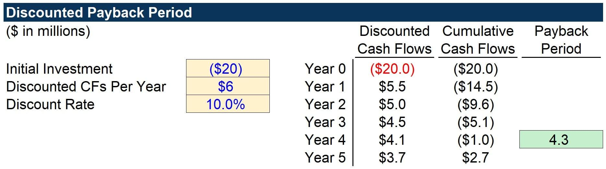

In the world of investing and finance, the payback period represents an essential metric for making informed decisions. It measures the time required to recover the initial investment in a project or venture, thereby offering insight into the risk and viability of financial undertakings. Investors and corporate analysts utilize this metric to quickly evaluate projects and determine their potential for return. It serves as a preliminary screening tool that aids in assessing whether an investment is worth further exploration.

In the context of algorithmic trading, the importance of the payback period is underscored by the necessity for rapid decision-making and precise calculations. By providing a straightforward assessment of investment recovery time, the payback period metric becomes a valuable tool in analyzing trading strategies and optimizing financial performance.



As this article progresses, the discussion will encompass not only the calculation and application of the payback period but also its integration with other financial metrics like net present value (NPV) and internal rate of return (IRR). These complementary tools allow for a more comprehensive analysis of investment opportunities, enhancing the decision-making process in both conventional financial settings and algorithmic trading environments.

## Table of Contents

## Understanding the Payback Period

The payback period is a financial metric utilized to determine the time span required to recoup the initial investment on a project or venture. It provides a straightforward calculation for assessing how quickly an investment can achieve its breakeven point, making it a favored tool among investors and financial analysts for its simplicity. 

Investors are typically inclined towards projects with shorter payback periods as these indicate quicker returns and potentially reduced investment risk. The logic is simple: a shorter duration implies that the capital is tied up for less time, reducing exposure to uncertainties and market volatility. Therefore, this metric can serve as a risk-reduction strategy by identifying investments that promise rapid recovery and contribute to better liquidity management.

The formula for calculating the payback period is straightforward:

$$
\text{Payback Period} = \frac{\text{Initial Investment}}{\text{Average Annual Cash Inflow}}
$$

For instance, if an initial investment is $100,000 and the project generates an average annual cash inflow of $25,000, the payback period would be calculated as follows:

$$
\text{Payback Period} = \frac{100,000}{25,000} = 4 \text{ years}
$$

This means that it would take four years to recover the initial investment, assuming constant cash inflows annually.

Despite its intuitive appeal and ease of calculation, the payback period does have limitations. It does not account for the time value of money, a crucial consideration in investment analysis where future cash flows are less valuable than immediate ones. Nonetheless, the payback period remains a fundamental measure, providing a preliminary evaluation of an investment's recovery timeline and serving as a useful screening tool before applying more sophisticated financial analyses.

## The Role of Payback Period in Investment Analysis

In investment analysis, the payback period acts as a preliminary evaluation tool crucial for assessing the attractiveness of different projects. It quantitatively determines how long it takes for an investment to repay its initial cost through incoming cash flows. This measure is especially valuable in capital budgeting, where it provides stakeholders with a quick assessment of both [liquidity](/wiki/liquidity-risk-premium) and investment risk.

The payback period is calculated by dividing the initial investment cost by the average annual cash inflow derived from the project. Mathematically, it can be expressed as:

$$
\text{Payback Period} = \frac{\text{Initial Investment}}{\text{Annual Cash Inflow}}
$$

Projects with shorter payback periods are generally preferred as they imply quicker recovery of the invested capital and signify lower risk. This is particularly advantageous when an organization seeks to maintain liquidity or when there is uncertainty regarding long-term returns due to volatile market conditions.

Despite its simplicity, the payback period serves as an essential initial screening metric, allowing investors to rapidly filter out less attractive options before proceeding to more sophisticated valuation methods such as Net Present Value (NPV) or Internal Rate of Return (IRR). This straightforward approach aids investors in focusing their analytical efforts on projects that demand deeper financial scrutiny, thereby optimizing resource allocation and decision-making processes.

While it may not capture the full complexity of an investment’s potential, the payback period remains a favored tool for its efficiency and ability to highlight immediate financial viability within capital budgeting.

## Limitations of the Payback Period

The payback period, while straightforward and useful for investment analysis, has several limitations that investors must consider. A significant drawback is its inability to account for the time value of money. This concept, fundamental in finance, suggests that money available today is worth more than the same amount in the future due to its [earning](/wiki/earning-announcement) potential. By ignoring this principle, the payback period may lead to incomplete assessments of an investment's true profitability. For example, a project that returns $1,000 today is inherently worth more than one returning the same amount five years from now, yet the payback period treats both equally if they reach breakeven at the same time.

Another limitation is the exclusion of cash flows occurring after the payback period is reached. This oversight means that potentially profitable projects could be undervalued if they generate substantial inflows beyond the breakeven point. It doesn't measure the overall profitability or magnitude of the returns, focusing solely on the speed of initial recovery. An investment that breaks even quickly but yields minimal cash flows beyond that point might score well on the payback period metric but perform poorly in terms of net gains.

For a more comprehensive view of investment opportunities, analysts often complement the payback period with other financial metrics such as Net Present Value (NPV) and Internal Rate of Return (IRR). NPV provides a detailed view by calculating the present value of future cash flows, adequately considering the time value of money. The formula for NPV is:

$$

NPV = \sum_{t=0}^{n} \frac{R_t}{(1+i)^t} - C_0 
$$

where $R_t$ is the net cash inflow in the period t, $i$ is the discount rate, $n$ is the number of periods, and $C_0$ is the initial investment. This metric helps ascertain whether the returns surpass the anticipated cost of capital. Similarly, IRR identifies the discount rate at which the NPV of future cash flows equals zero, offering insights into the project's potential return rate.

In conclusion, while the payback period serves as a useful quick assessment tool, it should be employed alongside more robust financial analyses to ensure well-informed investment decisions.

## Application in Algorithmic Trading

In the context of [algorithmic trading](/wiki/algorithmic-trading), the speed of decision-making is paramount, and financial metrics like the payback period play a role in ensuring efficient and effective strategy evaluation. The payback period allows traders to make swift financial assessments of potential trades, which is critical in an environment where market conditions can change rapidly.

Algorithmic models integrate the payback period as a metric to evaluate potential trades or system strategies using historical data. By analyzing past performance, these models can estimate the time required for a trading strategy to recoup its initial costs. This rapid estimation enables traders to filter and prioritize strategies that promise quick returns, aligning with the objective of minimizing risk while maximizing reward.

The appeal of a quick payback period is particularly significant for algorithmic systems, as it indicates low-risk, high-reward trading strategies. In algorithmic trading, risk management is as crucial as generating returns. Strategies with shorter payback periods are generally perceived as less risky, allowing traders to redeploy capital to new opportunities swiftly. This flexibility is vital in an automated trading environment where the ability to rapidly adapt and react to new information results in competitive advantage.

Incorporating the payback period in algorithmic trading strategies can be implemented through programming. Here is a simple Python snippet to calculate the payback period for a hypothetical trading strategy:

```python
def calculate_payback_period(initial_investment, annual_cash_inflows):
    payback_period = initial_investment / annual_cash_inflows
    return payback_period

initial_investment = 100000  # Example initial investment in a trading strategy
annual_cash_inflows = 25000  # Expected annual returns from the strategy

payback_period = calculate_payback_period(initial_investment, annual_cash_inflows)
print(f"The payback period is {payback_period} years.")
```

This code provides a basic framework for traders to incorporate the payback period metric into their evaluation processes, allowing for rapid and efficient strategy selection.

## Example of Payback Period Calculation

Consider a project requiring an initial investment of $100,000, with expected annual cash inflows amounting to $25,000. The payback period is calculated by dividing the initial investment by the annual cash inflow. Mathematically, this can be represented by the formula:

$$
\text{Payback Period} = \frac{\text{Initial Investment}}{\text{Annual Cash Inflow}}
$$

For this particular project, substituting the known values into the formula, we have:

$$
\text{Payback Period} = \frac{100,000}{25,000} = 4 \text{ years}
$$

This calculation reveals that it will take four years to recover the initial investment, assuming constant annual cash inflows. This straightforward approach provides an initial insight into the project's financial viability, allowing investors or analysts to quickly assess whether the investment aligns with their risk tolerance and financial goals. While this example exhibits simplicity, it underscores the importance of the payback period as an accessible metric for evaluating the potential time frame required to recover an initial outlay in investment scenarios.

## Conclusion

The payback period serves as an important tool in financial analysis, offering a rapid estimation of the time required for an investment to repay its initial outlay. It is particularly useful in both traditional and algorithmic trading contexts. By providing a quick gauge of an investment’s recovery time, it helps investors and analysts in making swift, preliminary assessments without the need for complex calculations. This aspect of speed is crucial in algorithmic trading, where decisions must be made in fractions of a second.

Despite its advantages, the payback period is not without limitations. Its simplicity means it does not account for the time value of money, a fundamental concept in finance that can affect the actual value of future cash flows. Moreover, the payback period disregards cash flows that occur after the initial investment is recovered, thus failing to measure the overall profitability of a project.

Nevertheless, when used in conjunction with other financial metrics such as Net Present Value (NPV) and Internal Rate of Return (IRR), the payback period can significantly enhance the investment analysis toolkit. While NPV provides insights into the value added by an investment in present terms, and IRR offers a percentage return expected from an investment, the payback period adds the dimension of time, which is essential for understanding liquidity and risk. Combining these metrics results in a more comprehensive analysis, enabling better-informed decision-making in both corporate finance and personal investment strategies.

In summary, the payback period remains a practical, if imperfect, tool that complements more sophisticated financial metrics, helping investors and financial analysts to quickly screen potential investments and pursue further analysis where necessary.

## References & Further Reading

[1]: ["Principles of Corporate Finance"](https://www.mheducation.com/highered/product/Principles-of-Corporate-Finance-Brealey.html) by Richard A. Brealey, Stewart C. Myers, and Franklin Allen

[2]: ["Algorithmic and High-Frequency Trading"](https://www.cambridge.org/us/universitypress/subjects/mathematics/mathematical-finance/algorithmic-and-high-frequency-trading) by Álvaro Cartea, Sebastian Jaimungal, and José Penalva

[3]: Damodaran, A. (2002). ["Investment Valuation: Tools and Techniques for Determining the Value of Any Asset"](https://archive.org/details/investmentvaluat0000damo_n6k9). John Wiley & Sons.

[4]: Bodie, Z., Kane, A., & Marcus, A. J. (2014). ["Investments"](https://www.mheducation.com/highered/product/Investments-Bodie.html). McGraw-Hill Education.

[5]: Fabozzi, F. J. (2012). ["Handbook of Portfolio Construction: Contemporary Applications of Markowitz Techniques"](https://link.springer.com/book/10.1007/978-0-387-77439-8). Springer.