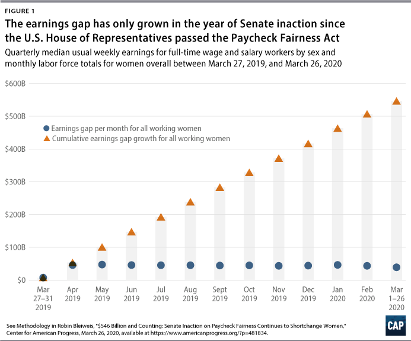

## Table of Contents

## What is the Paycheck Fairness Act?

The Paycheck Fairness Act is a proposed law in the United States that aims to help close the wage gap between men and women. It wants to make sure that women get paid the same as men for doing the same job. The act would change some rules to make it easier for women to find out if they are being paid less and to do something about it if they are.

This act would also stop employers from punishing workers who talk about their salaries with each other. It would help women by giving them better tools to fight for equal pay. The Paycheck Fairness Act has been talked about in Congress for many years, but it has not become a law yet. Many people think it is important to pass this act to make workplaces fairer for everyone.

## What are the main goals of the Paycheck Fairness Act?

The main goal of the Paycheck Fairness Act is to make sure that women get paid the same as men for doing the same job. It wants to close the wage gap, which means the difference in pay between men and women. The act would change some rules to help women find out if they are being paid less than men for the same work. It would also make it easier for women to do something about it if they are being paid less.

Another important goal is to stop employers from punishing workers who talk about their salaries with each other. This is important because it helps everyone know if they are being paid fairly. The act would give women better tools to fight for equal pay. It would make workplaces fairer for everyone by making sure that pay is based on the work people do, not on whether they are men or women.

## How does the Paycheck Fairness Act aim to address wage discrimination?

The Paycheck Fairness Act aims to address wage discrimination by making it easier for women to find out if they are being paid less than men for the same job. It wants to close the wage gap, which is the difference in pay between men and women. The act would change some rules so that women can see if they are being paid fairly. If they find out they are being paid less, the act would make it easier for them to do something about it, like going to court or talking to their boss.

Another way the Paycheck Fairness Act aims to address wage discrimination is by stopping employers from punishing workers who talk about their salaries with each other. This is important because when people know what others are [earning](/wiki/earning-announcement), they can see if they are being paid fairly. The act would give women better tools to fight for equal pay. It would make workplaces fairer for everyone by making sure that pay is based on the work people do, not on whether they are men or women.

## What are the key provisions of the Paycheck Fairness Act?

The Paycheck Fairness Act has some important rules to help women get paid the same as men for doing the same job. One key rule is that it makes it easier for women to find out if they are being paid less than men. If they find out they are being paid less, the act helps them do something about it, like going to court or talking to their boss. This is important because it helps close the wage gap, which is the difference in pay between men and women.

Another important rule is that the act stops employers from punishing workers who talk about their salaries with each other. This helps everyone know if they are being paid fairly. The act also gives women better tools to fight for equal pay. It makes workplaces fairer for everyone by making sure that pay is based on the work people do, not on whether they are men or women.

## How does the Paycheck Fairness Act build on existing laws like the Equal Pay Act of 1963?

The Paycheck Fairness Act builds on the Equal Pay Act of 1963 by making it easier for women to find out if they are being paid less than men for the same job. The Equal Pay Act made it illegal to pay men and women differently for the same work, but it can be hard for women to know if they are being paid less. The Paycheck Fairness Act helps by giving women better tools to see if they are being paid fairly. It also makes it easier for them to do something about it if they find out they are being paid less.

Another way the Paycheck Fairness Act builds on the Equal Pay Act is by stopping employers from punishing workers who talk about their salaries with each other. This is important because when people know what others are earning, they can see if they are being paid fairly. The Paycheck Fairness Act also gives women more ways to fight for equal pay, like going to court or talking to their boss. By doing these things, the Paycheck Fairness Act helps make workplaces fairer for everyone.

## What are the differences between the Paycheck Fairness Act and the Lilly Ledbetter Fair Pay Act?

The Paycheck Fairness Act and the Lilly Ledbetter Fair Pay Act both want to help women get paid the same as men for the same job, but they focus on different things. The Lilly Ledbetter Fair Pay Act, which became a law in 2009, makes it easier for people to file a complaint about pay discrimination. It says that the time limit for filing a complaint starts over every time someone gets a paycheck that they think is unfair. This is important because sometimes people don't find out they are being paid less until they have been working for a long time.

The Paycheck Fairness Act, on the other hand, wants to make it easier for women to find out if they are being paid less and to do something about it. It would stop employers from punishing workers who talk about their salaries with each other. This helps everyone know if they are being paid fairly. The Paycheck Fairness Act also gives women better tools to fight for equal pay, like going to court or talking to their boss. While the Lilly Ledbetter Fair Pay Act focuses on when people can file a complaint, the Paycheck Fairness Act focuses on making it easier to find out about and fight pay discrimination.

## How has the Paycheck Fairness Act been received by different political groups?

The Paycheck Fairness Act has been supported by many Democrats and groups that fight for women's rights. They think it is important to pass this law to help close the wage gap between men and women. They believe that women should get paid the same as men for doing the same job. Democrats and women's rights groups say that the act would make workplaces fairer by giving women better tools to find out if they are being paid less and to do something about it if they are.

On the other hand, many Republicans and some business groups have not supported the Paycheck Fairness Act. They worry that the act might make it harder for businesses to run smoothly. They think that the act could lead to more lawsuits against employers, which could be bad for businesses. Republicans and business groups believe that there are already enough laws, like the Equal Pay Act and the Lilly Ledbetter Fair Pay Act, to help with pay fairness, and they do not think a new law is needed.

## What are the arguments in favor of the Paycheck Fairness Act?

Supporters of the Paycheck Fairness Act say it's important because it helps women get paid the same as men for doing the same job. They think the act would make it easier for women to find out if they are being paid less. If women find out they are being paid less, the act would help them do something about it, like going to court or talking to their boss. This is important because it helps close the wage gap, which is the difference in pay between men and women. Supporters believe that the act would make workplaces fairer for everyone by making sure that pay is based on the work people do, not on whether they are men or women.

Another big reason supporters like the Paycheck Fairness Act is that it stops employers from punishing workers who talk about their salaries with each other. This is important because when people know what others are earning, they can see if they are being paid fairly. The act would give women better tools to fight for equal pay. Many Democrats and groups that fight for women's rights support the act because they think it's a big step towards making sure everyone gets paid fairly for their work.

## What are the arguments against the Paycheck Fairness Act?

People who do not support the Paycheck Fairness Act, like many Republicans and some business groups, worry that it might make it harder for businesses to run smoothly. They think the act could lead to more lawsuits against employers. This could be bad for businesses because they might have to spend a lot of time and money dealing with these lawsuits instead of focusing on their work. They believe that there are already enough laws, like the Equal Pay Act and the Lilly Ledbetter Fair Pay Act, to help with pay fairness, so they do not think a new law is needed.

Another concern is that the Paycheck Fairness Act might make it too easy for people to claim they are being paid unfairly. Critics worry that this could lead to a lot of complaints that are not really about pay discrimination. They think this could make it hard for businesses to know how to set fair pay for their workers. Overall, those against the act believe it could cause more problems than it solves, and they think other ways should be used to make sure everyone gets paid fairly.

## What has been the legislative history of the Paycheck Fairness Act?

The Paycheck Fairness Act has been talked about in the United States Congress for many years. It was first introduced in 1997 by Senator Tom Harkin and Representative Rosa DeLauro. Since then, it has been brought up many times, but it has not become a law yet. Every time it is introduced, it goes through a process where it is discussed and voted on in different committees. Sometimes it passes in one part of Congress, like the House of Representatives, but not in the other part, like the Senate. This has happened several times, showing that there is support for the act, but not enough to make it a law.

The most recent big push for the Paycheck Fairness Act happened in 2021. It was passed by the House of Representatives, but it did not get enough votes in the Senate to become a law. Many Democrats and groups that fight for women's rights keep pushing for it because they think it is important to help close the wage gap between men and women. On the other hand, many Republicans and some business groups do not support it because they worry it could cause problems for businesses. The act keeps being brought up, showing that the issue of pay fairness is still important to many people.

## How might the Paycheck Fairness Act impact businesses if passed?

If the Paycheck Fairness Act becomes a law, it could change how businesses work. The act would make it easier for workers to find out if they are being paid less than others for the same job. This means businesses might have to be more careful about how they set pay for their workers. They would need to make sure they are paying men and women the same for the same work. If they do not, they could face more lawsuits from workers who think they are being paid unfairly. This could mean more time and money spent on dealing with these lawsuits instead of running the business.

Another way the Paycheck Fairness Act could affect businesses is by stopping them from punishing workers who talk about their salaries. If workers can talk openly about what they earn, it might be harder for businesses to keep pay differences a secret. This could lead to more questions and complaints from workers about their pay. Some businesses worry that this could cause problems and make it hard to set fair pay for everyone. They think the act might lead to too many complaints that are not really about pay discrimination, which could make their work more difficult.

## What are the potential economic implications of the Paycheck Fairness Act on a national scale?

If the Paycheck Fairness Act becomes a law, it could help close the wage gap between men and women across the country. This means more women would get paid the same as men for doing the same job. When women earn more, they can spend more money on things like food, clothes, and other stuff they need. This could help the economy grow because when people have more money to spend, businesses sell more things. Also, if women feel they are being paid fairly, they might be happier at work and stay in their jobs longer, which is good for businesses and the economy.

On the other hand, some people worry that the Paycheck Fairness Act could make it harder for businesses to run smoothly. They think the act might lead to more lawsuits from workers who think they are being paid unfairly. This could mean businesses have to spend more time and money dealing with these lawsuits instead of focusing on their work. If businesses have to spend a lot of time and money on lawsuits, it might slow down the economy. So, while the act could help close the wage gap and boost spending, it could also cause some problems for businesses and the economy if it leads to too many lawsuits.

## References & Further Reading

[1]: Equal Pay Act of 1963, Pub.L. 88–38, 77 Stat. 56 (1963) [U.S. Equal Employment Opportunity Commission](https://www.eeoc.gov/statutes/equal-pay-act-1963).

[2]: Hegewisch, A., & Williams-Baron, E. (2018). "The Gender Wage Gap: 2018; Earnings Differences by Gender, Race, and Ethnicity." [Institute for Women's Policy Research](https://www.jstor.org/stable/resrep27247).

[3]: World Economic Forum. (2022). "Global Gender Gap Report 2022." [World Economic Forum](https://www.weforum.org/publications/global-gender-gap-report-2022/).

[4]: U.S. Department of Labor. (2010). "Women in the Labor Force: A Databook." [Bureau of Labor Statistics](https://www.bls.gov/opub/reports/womens-databook/2021/).

[5]: "The Future of Jobs Report 2020", World Economic Forum, October 2020. [World Economic Forum](https://www.weforum.org/publications/the-future-of-jobs-report-2020/).

[6]: Sen, A., & Geishecker, I. (2010). "Automated Trading: An Ethical Perspective." [Journal of Business Ethics](https://www.jstor.org/journal/jbusiethi).

[7]: "Lilly Ledbetter Fair Pay Act of 2009, Pub.L. 111–2, 123 Stat. 5 (2009)" [U.S. Equal Employment Opportunity Commission](https://www.eeoc.gov/lilly-ledbetter-fair-pay-act-2009).

[8]: Lopez de Prado, M. (2018). ["Advances in Financial Machine Learning."](https://www.amazon.com/Advances-Financial-Machine-Learning-Marcos/dp/1119482089) John Wiley & Sons.

[9]: "Understanding the Paycheck Fairness Act." (2019). [National Women's Law Center](https://whnt.com/news/politics/ap-politics/ap-should-the-minimum-wage-be-lower-for-workers-who-get-tipped-two-states-are-set-to-decide/).

[10]: Jansen, S. (2020). ["Machine Learning for Algorithmic Trading."](https://github.com/stefan-jansen/machine-learning-for-trading) Packt Publishing.