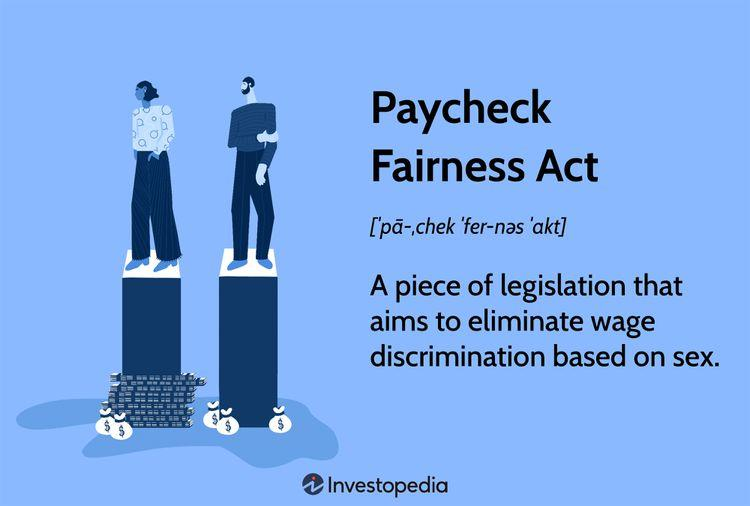

Wage equality refers to the principle that individuals in the workforce should receive equal pay for equal work, regardless of gender, race, or other discriminatory factors. This concept holds significant importance in contemporary society as it aims to eradicate systemic biases that contribute to economic disparity and marginalization. Achieving wage equality enhances not only social justice but also economic efficiency, as it ensures that talent and productivity are rewarded fairly, boosting overall market performance and consumer confidence.

The Paycheck Fairness Act is a legislative measure intended to strengthen the provisions of the Equal Pay Act of 1963 by addressing wage discrimination based on gender. Its primary purpose is to enhance enforcement mechanisms, increase transparency regarding pay scales, and protect employees from retaliatory actions when concerns about pay discrimination are raised. By aiming to eliminate gender-based pay gaps, the Act plays a crucial role in progressing towards financial equity and empowering underrepresented groups within the workforce.

Employment law serves as a cornerstone for establishing and maintaining fair labor practices by providing a legal framework that governs the relationships between employers and employees. It encompasses various statutes, regulations, and precedents designed to prevent exploitation and discrimination, thereby supporting wage equality initiatives. Employment law ensures that issues such as overtime pay, benefits, and workplace safety are adequately addressed, ultimately fostering a more equitable work environment.

Algorithmic trading involves using automated and complex algorithms to execute trades at high speeds and volumes. While primarily affecting the financial sector, its influence extends to employment patterns and wage equality. The increased reliance on technology and automation can displace traditional jobs, potentially exacerbating wage disparities if not managed properly. Conversely, algorithmic trading can also democratize access to financial markets, potentially offering new opportunities for individuals previously excluded.

The article aims to explore the intersections between wage equality, the Paycheck Fairness Act, employment law, and algorithmic trading. It will examine how these components interact and influence each other, offering insights into how they can collectively contribute to a more equitable and balanced economic system. By understanding these relationships, stakeholders can better address the challenges and opportunities presented in the pursuit of wage equality in a rapidly evolving landscape.

## Table of Contents

## Understanding Wage Equality

Wage equality, broadly defined, refers to the concept of ensuring that individuals receive equal pay for equivalent work, irrespective of gender, race, ethnicity, or other discriminatory factors. Historically, wage equality has been a central focus of labor movements and social justice advocacy worldwide, aiming to eliminate pay disparities that result from systemic discrimination and bias. The push for wage equality gained [momentum](/wiki/momentum) in the 20th century with milestones such as the introduction of the Equal Pay Act of 1963 in the United States and similar legislation in other countries.

In today's globalized economy, the status of wage equality varies significantly across regions and sectors. Reports by international organizations like the World Economic Forum and the International Labour Organization consistently highlight substantial wage gaps. For instance, the Global Gender Gap Report 2022 showed that it would take 135.6 years to close the gender pay gap worldwide if current trends persist. Regions such as Western Europe have made more progress towards wage equality, while others, including parts of the Middle East and North Africa, lag behind.

Wage inequality has far-reaching consequences for both economies and societies. Economically, wage disparities can lead to inefficiencies and reduced economic growth. Critically, unequal wages reduce the disposable income available to a large segment of the population, thereby limiting consumer spending and slowing down economic cycles. Additionally, firms that fail to address wage inequality may suffer from low employee morale and productivity, which can affect overall organizational performance.

Socially, wage inequality perpetuates poverty and limits access to essential services such as education and healthcare, creating cycles of disadvantage within certain groups. Inequitable pay structures can exacerbate tensions and contribute to social instability, as evidenced by numerous protests and movements driven by calls for fairer wages.

Several factors contribute to persistent wage inequality, including occupational segregation, where different groups are channeled into certain types of jobs that traditionally offer lower pay. Another [factor](/wiki/factor-investing) is the undervaluation of work typically done by women or minorities, which is rooted in historical biases and stereotypes. Discrimination in hiring, promotion, and wage-setting practices further widens the wage gap.

Additionally, systemic issues such as unequal access to education and training reinforce existing disparities, limiting opportunities for disadvantaged groups to enter high-paying professions. Addressing these key factors requires comprehensive strategies involving policy interventions, organizational reforms, and shifts in cultural attitudes toward work and gender roles.

## The Paycheck Fairness Act: An Overview

The Paycheck Fairness Act (PFA) represents a significant legislative effort in the United States aimed at addressing wage inequality, particularly focusing on gender pay gaps. The act builds upon the foundation laid by previous legislation such as the Equal Pay Act of 1963. While the Equal Pay Act sought to eliminate wage disparity based on sex, the PFA was introduced to further enhance these protections by closing legal loopholes and ensuring stronger enforcement mechanisms.

### Historical Background and Development of the Paycheck Fairness Act

The PFA was first introduced in 1997 by Senator Tom Daschle and has undergone various iterations since then. Despite being introduced repeatedly in Congress, it faced numerous legislative hurdles before passing the U.S. House of Representatives multiple times. The renewed interest and push for the PFA have been partially driven by broader societal movements advocating for gender equality and women’s rights, which underscore the continued relevance and necessity of such legislation.

### Key Provisions of the Act and Its Intended Impact on Wage Equality

The PFA introduces several critical provisions to bolster existing laws and pave the way for more effective enforcement of wage equality:

1. **Enhanced Wage Disclosure**: Employers are prohibited from retaliating against employees who discuss salaries, facilitating transparency about wage disparities.

2. **Requirement for Justification**: Employers must demonstrate that wage differentials are based on legitimate factors unrelated to gender, such as education, experience, or performance metrics.

3. **Class Action Lawsuits**: The Act allows workers to file class-action lawsuits for wage discrimination, thereby strengthening collective action against unfair practices.

4. **Data Collection and Reporting**: The Act mandates improved data collection and reporting on wage disparities, offering valuable insights into systemic issues and aiding policy formulation.

### The Role of the Act in Addressing Gender Pay Gaps

The PFA plays a role in tackling gender pay gaps by reinforcing the accountability of employers to maintain equitable pay structures. By mandating transparency and establishing stricter standards for justifying pay differences, the Act aims to address unconscious biases and systemic discrimination that contribute to wage inequality. This is particularly significant in sectors where gender-based wage disparities have persisted despite existing legal frameworks.

### Criticisms and Challenges Faced by the Paycheck Fairness Act

Despite its objectives, the PFA faces several criticisms and challenges:

1. **Legislative and Political Barriers**: The Act has struggled to secure bipartisan support, reflecting larger political divisions over the best approach to achieving wage equality.

2. **Economic Arguments**: Critics argue that the Act could impose undue regulatory burdens on businesses, potentially stifling economic flexibility and innovation.

3. **Effectiveness and Enforcement**: Concerns exist about the practical enforcement of the Act’s provisions and whether they can translate into substantive changes in organizational behavior.

4. **Overemphasis on Gender**: Some critics suggest that the Act’s focus on gender may overlook other dimensions of wage inequality, such as race and ethnicity.

The Paycheck Fairness Act continues to be a focal point in the discourse on wage equality, embodying both the progress made and the challenges that remain in addressing wage disparities in the workforce. It highlights the intersection of legal, economic, and social dimensions in the ongoing efforts to achieve fair wages for all.

## Employment Law and Wage Equality

Employment law comprises a framework of regulations and standards designed to govern the relationship between employers and employees. Its fundamental goals include ensuring fair treatment of workers, providing safe working environments, and defending workers' rights, including the right to equitable compensation. 

One essential aspect of employment law is its role in promoting wage equality, ensuring that individuals receive equal pay for equal work irrespective of gender, race, or other discriminatory factors. Laws such as the Equal Pay Act of 1963 in the United States serve as pivotal instruments in this pursuit. This Act prohibits wage discrimination and mandates that men and women be given equal pay for equal work in the same establishment.

Employment law supports wage equality initiatives through several mechanisms. For instance, it provides legal recourse for employees facing discrimination, thereby acting as a deterrent against wage disparities. Moreover, regulatory agencies, such as the Equal Employment Opportunity Commission (EEOC) in the United States, are tasked with enforcing these laws and assessing compliance by employers. 

Case studies underscore the positive impacts of employment law on wage equality. For example, the Lilly Ledbetter Fair Pay Act of 2009 was enacted after the eponymous lawsuit highlighted pay discrepancies based on gender that occurred over time with each discriminatory paycheck resetting the 180-day statute of limitations for filing an equal-pay lawsuit. This Act plays a significant role in providing individuals with the right to contest unfair pay practices, thereby promoting transparency and addressing systemic pay inequities.

Despite these advances, there are challenges and gaps in current employment law regarding wage parity. Enforcement can be inconsistent, and loopholes often exist that allow employers to justify wage disparities subtly. Moreover, gig economy roles and the increasing use of contractors present challenges to traditional employment law frameworks, which are typically structured around full-time employment contracts. Variability in state and federal laws can also complicate the landscape, making it difficult for workers to understand their rights fully.

Ongoing efforts are needed to address these challenges. There is a need for updated regulatory definitions that encompass emerging work structures and clearer guidelines for proving wage discrimination. Broad stakeholder involvement, including policymakers, companies, and advocacy groups, is essential to ensure that employment law evolves to effectively promote wage equity in contemporary work environments.

## Algorithmic Trading's Impact on Employment

Algorithmic trading, also referred to as algo-trading or automated trading, utilizes complex algorithms to manage trading decisions. These algorithms use historical data and mathematical models to execute trades at speeds and frequencies impossible for human traders. Since its inception in the late 20th century, [algorithmic trading](/wiki/algorithmic-trading) has gained prominence in the financial markets, accounting for a significant percentage of trade [volume](/wiki/volume-trading-strategy), especially in stock exchanges like NYSE and NASDAQ.

The rise of algorithmic trading has led to substantial changes in the financial sector. Traditional roles, such as floor traders and brokers, are being supplanted by technology-driven processes. This shift has decreased demand for these positions, with a parallel increase in the need for data scientists, quantitative analysts, and software developers. While it presents opportunities for those with the necessary technical skills, the transition poses challenges for individuals in traditional roles who may not have the expertise or resources to transition to these new roles. 

Moreover, the potential for wage inequality within the algorithmic trading sphere is significant. The financial industry traditionally boasts high wages, but the burgeoning algo-trading sector may exacerbate disparities. Jobs tied to algorithmic trading tend to offer lucrative compensation, attracting top talent from fields like computer science and quantitative analysis. However, as these high-tech roles proliferate, wage gaps may widen between technologically adept workers and others in traditional or transitional roles within the finance industry.

Automation and algorithmic trading could also impact broader wage equality in the future. As automation extends across sectors, one potential scenario involves polarization of the job market, characterized by high-paid skilled positions and low-paid unskilled roles, with a shrinking middle class. As such, continuous adaptation to technological advancements becomes crucial for maintaining equitable labor market conditions. Furthermore, institutions must consider policies that promote skills development and education to ensure that opportunities in algorithmic trading and the broader automated workforce do not exclude significant portions of the labor market.

In conclusion, while algorithmic trading significantly enhances efficiency and precision in financial markets, it also presents challenges for employment patterns and wage equality. The shift towards automated processes underscores the need for strategic interventions to bridge potential gaps and ensure inclusive economic opportunities.

## Intersections Between Wage Equality, Employment Law, and Algo Trading

Algorithmic trading, characterized by the use of complex algorithms to make high-speed trading decisions, has significantly altered traditional labor dynamics in the financial industry. One of the primary challenges it poses to conventional labor is the reduction of demand for human traders. As algorithms perform tasks more efficiently and faster than humans, a shift in the skill set required has emerged, potentially exacerbating wage inequality among workers displaced by technology.

Employment law can play a vital role in addressing these wage disparities in a tech-driven marketplace. By enforcing regulations that ensure fair pay across different sectors, employment law can help mitigate the negative impact of automation. For instance, employment regulations could mandate transparency in compensation across job roles influenced by algorithmic processes. Such measures would set a precedent for fairness and help design strategies for equal wage distribution among algorithmically and human-driven jobs.

Despite concerns about displacement, algorithmic trading offers potential positive impacts on wage distribution. Automation in trading can lead to increased market efficiency and reduced costs, potentially resulting in higher returns for investors, including those invested in pension funds or retirement accounts. This could indirectly benefit workers by enhancing the overall economic growth and stability, thus providing more opportunities for equitable wage distribution.

Ensuring fairness and equality in an increasingly automated workforce requires strategic oversight and policy adjustments. Companies and governments must collaborate to create equitable frameworks that address technological changes. Education and continuous skill development tailored to future market demands can prepare the workforce to adapt to these emerging technologies, reducing the risk of unemployment and wage inequality caused by automation.

In summary, while algorithmic trading challenges traditional labor markets, it also presents opportunities to reformulate employment laws to address wage inequality. By strategically leveraging employment law and focusing on fair practices, stakeholders can harness the benefits of technology while ensuring equitable treatment and opportunities across the workforce.

## Policy Recommendations and the Way Forward

### Policy Recommendations and the Way Forward

The pursuit of wage equality remains a multi-faceted challenge, necessitating robust legislative frameworks, innovative employment laws, proactive corporate policies, and comprehensive educational strategies.

#### Proposed Amendments to the Paycheck Fairness Act

To address contemporary challenges, the Paycheck Fairness Act could benefit from several key amendments. Firstly, it should incorporate transparency mandates that require companies to disclose salary ranges and pay scales, thereby reducing the opacity surrounding compensation. Additionally, the Act could expand its coverage to include contractors and gig workers, professions increasingly prevalent in today's labor market. Establishing a standardized method for evaluating jobs based on skill, effort, responsibility, and working conditions could ensure a more equitable comparison of wages across different roles. These changes aim to modernize the Act to reflect the evolving nature of work and its compensation structures.

#### New Employment Laws for AI and Algorithmic Impacts

As AI and algorithmic trading permeate the labor market, employment laws must adapt accordingly. One proposal is to introduce regulatory guidelines ensuring that algorithmic decision-making in hiring and compensation is free from bias. This can be achieved by requiring audits and accountability measures for AI systems. Lawmakers might also consider protections for workers displaced by automation, such as transition assistance programs that provide retraining and re-skilling opportunities. Moreover, introducing legislation that mandates companies to evaluate the potential wage impact of AI deployment can help preemptively address wage inequality that may arise from technological shifts.

#### Strategies for Companies and Policymakers

Companies and policymakers can deploy several strategies to bridge wage disparities. Employers can adopt a proactive stance by conducting regular pay equity audits to identify and rectify wage gaps. Encouraging diverse hiring practices and fostering inclusive workplace cultures can also contribute to more equitable wage distribution. For policymakers, establishing tax incentives for businesses that demonstrate significant progress in narrowing pay gaps could serve as an effective motivator. Moreover, fostering partnerships between government agencies and the private sector can facilitate the sharing of best practices and development of standardized wage-evaluation tools.

#### The Role of Education and Training

Education and training are pivotal in mitigating wage disparities in an ever-evolving job market. Governments and educational institutions should prioritize STEM education and digital literacy to equip individuals with the skills required in high-demand sectors, including technology and finance. Initiatives such as lifelong learning grants and vocational training programs can aid workers in transitioning to new roles as the market shifts. Employers should also be encouraged to offer skill-enhancement opportunities to their workforce, which can help employees adapt to new roles and responsibilities necessitated by technological advancements.

In conclusion, addressing wage equality in the context of modern labor dynamics requires a comprehensive approach. By amending existing laws, crafting new policies for technological impacts, fostering inclusive corporate practices, and emphasizing continual education, society can take concrete steps towards achieving a fair and equitable workforce.

## Conclusion

The discourse on wage equality, as explored in this article, presents an intricate tapestry interwoven with various legal, technological, and societal threads. Central to this discussion is the concept of wage equality, which advocates for equitable remuneration for all workers, irrespective of gender, race, or other biases. The significance of achieving wage equality cannot be overstated, as it serves as a foundation for socio-economic stability and progress.

The Paycheck Fairness Act emerges as a pivotal legislative measure aimed at narrowing the gender pay gap and ensuring transparency in wages. However, its journey is fraught with challenges, necessitating further refinement and adaptation to address evolving workforce dynamics. Complementing this is employment law, which plays a vital role in fostering fair labor practices. By enforcing regulations against discrimination and promoting equitable treatment, employment law undergirds the efforts towards achieving wage parity.

The advent of algorithmic trading introduces a technological dimension that both disrupts and potentially enhances traditional labor markets. Algorithmic systems, while optimizing financial operations, also pose risks of exacerbating wage disparities, particularly for those displaced by automation. Nevertheless, they present opportunities to redefine wage structures, potentially leading to a more equitable distribution of wealth.

The convergence of wage equality, employment law, and algorithmic trading highlights a need for an integrated approach to tackle wage disparities. As technology continues to reshape the labor landscape, it is imperative that laws evolve in tandem to protect workers' rights and promote fairness. This includes adapting existing legislation, like the Paycheck Fairness Act, to address the nuances introduced by technology-driven markets.

Looking ahead, the future of wage equality and employment law hinges on proactive engagement from policymakers, businesses, and society at large. It is crucial to prioritize efforts toward creating equitable employment practices that can withstand the rapid pace of technological change. This involves crafting policies that are not only reactive but also anticipatory of future developments in the workforce.

In conclusion, the pursuit of wage equality demands a multifaceted strategy that integrates legal frameworks, technological advancements, and inclusive policies. Stakeholders must collectively commit to fostering environments where transparency, fairness, and equity are the standard. By doing so, we can pave the way for a more just and balanced future in the world of work.

## References & Further Reading

[1]: Equal Pay Act of 1963, Pub.L. 88–38, 77 Stat. 56 (1963) [U.S. Equal Employment Opportunity Commission](https://www.eeoc.gov/statutes/equal-pay-act-1963).

[2]: Hegewisch, A., & Williams-Baron, E. (2018). "The Gender Wage Gap: 2018; Earnings Differences by Gender, Race, and Ethnicity." [Institute for Women's Policy Research](https://www.jstor.org/stable/resrep27247).

[3]: World Economic Forum. (2022). "Global Gender Gap Report 2022." [World Economic Forum](https://www.weforum.org/publications/global-gender-gap-report-2022/).

[4]: U.S. Department of Labor. (2010). "Women in the Labor Force: A Databook." [Bureau of Labor Statistics](https://www.bls.gov/opub/reports/womens-databook/2021/).

[5]: "The Future of Jobs Report 2020", World Economic Forum, October 2020. [World Economic Forum](https://www.weforum.org/publications/the-future-of-jobs-report-2020/).

[6]: Sen, A., & Geishecker, I. (2010). "Automated Trading: An Ethical Perspective." [Journal of Business Ethics](https://www.jstor.org/journal/jbusiethi).

[7]: "Lilly Ledbetter Fair Pay Act of 2009, Pub.L. 111–2, 123 Stat. 5 (2009)" [U.S. Equal Employment Opportunity Commission](https://www.eeoc.gov/lilly-ledbetter-fair-pay-act-2009).

[8]: Lopez de Prado, M. (2018). ["Advances in Financial Machine Learning."](https://www.amazon.com/Advances-Financial-Machine-Learning-Marcos/dp/1119482089) John Wiley & Sons.

[9]: "Understanding the Paycheck Fairness Act." (2019). [National Women's Law Center](https://whnt.com/news/politics/ap-politics/ap-should-the-minimum-wage-be-lower-for-workers-who-get-tipped-two-states-are-set-to-decide/).

[10]: Jansen, S. (2020). ["Machine Learning for Algorithmic Trading."](https://github.com/stefan-jansen/machine-learning-for-trading) Packt Publishing.