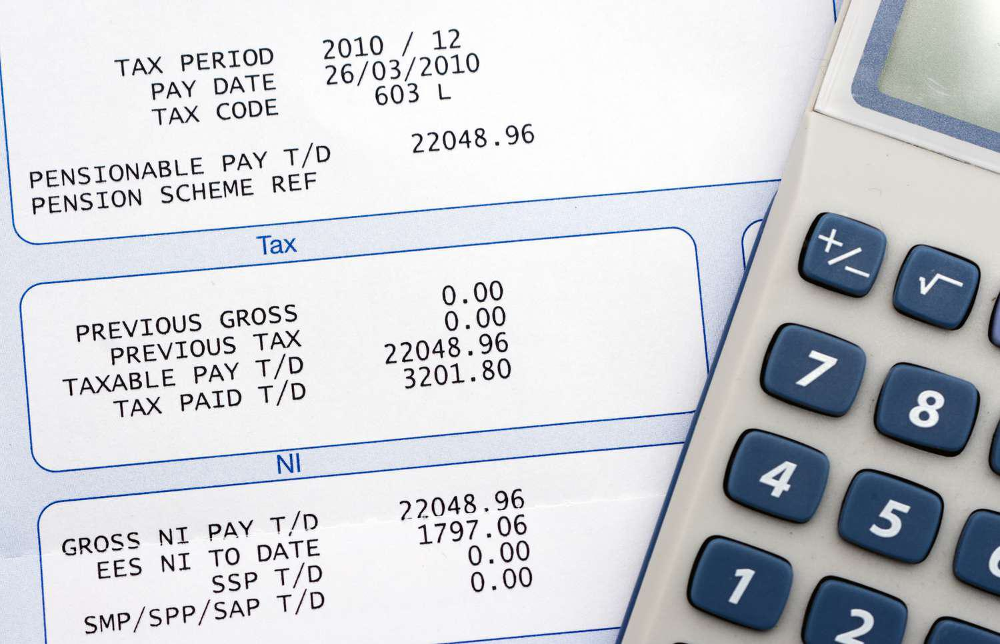

The COVID-19 pandemic posed unprecedented global challenges, compelling nations to devise various strategies to mitigate its multifaceted impacts. In the United States, one significant legislative response was the introduction of the Paycheck Protection Program and Health Care Enhancement Act, commonly referred to as the COVID 3.5 package. This relief package, amounting to $484 billion, was meticulously crafted to address the economic repercussions of the pandemic, provide vital support to small businesses, and bolster healthcare infrastructures. 

Integral to this legislative effort was the augmentation of funding for the Paycheck Protection Program (PPP), which provided a lifeline to small enterprises navigating the economic turbulence. Additionally, substantial financial resources were directed towards hospitals and healthcare providers, reflecting the heightened demand for healthcare services amidst the crisis. The package also underscored the critical need for comprehensive COVID-19 testing, allocating significant funds to enhance testing capabilities nationwide.



In this article, we will examine the key components of this pivotal legislation, delving into its overarching aims and assessing its tangible impact on the economy, healthcare systems, and financial trading sectors. Through this exploration, we aim to provide a nuanced understanding of how such fiscal measures intersect with economic mechanisms, particularly in times of global upheaval.

## Table of Contents

## Overview of the Paycheck Protection Program and Health Care Enhancement Act

The Paycheck Protection Program and Health Care Enhancement Act, enacted on April 24, 2020, was a pivotal component of the United States' strategy to address the immediate economic and healthcare challenges posed by the COVID-19 pandemic. As a supplementary measure to the Coronavirus Aid, Relief, and Economic Security (CARES) Act, this legislation sought to bolster ongoing efforts primarily aimed at safeguarding the country's economic vitality and healthcare resilience during a period of unprecedented disruption.

The act secured additional financial resources for the Paycheck Protection Program (PPP), an initiative designed to facilitate forgivable loans to small businesses, enabling them to retain employees and manage essential expenditures amidst the pandemic-induced economic downturn. Recognizing the necessity of maintaining economic stability through support for small businesses, the legislation allocated a substantial portion of its funds to this purpose, thereby ensuring continued employment and mitigating widespread economic distress.

Moreover, the act included pivotal provisions for healthcare facilities and expanded testing initiatives. It directed significant funding towards hospitals and healthcare systems, addressing the acute need for resources to manage the surge in patient care demands due to COVID-19. This financial support was crucial for enabling healthcare providers to sustain operations and manage the increased burden on medical infrastructures.

Additionally, the act fortified public health responses by allocating resources for the enhancement of testing capabilities across the country. This was vital for monitoring and controlling virus transmission, facilitating informed public health decisions, and ultimately curbing the pandemic's spread.

In summary, the Paycheck Protection Program and Health Care Enhancement Act was instrumental in reinforcing existing frameworks to support businesses, healthcare facilities, and testing initiatives. These efforts were integral to the broader strategy of mitigating the pandemic's severe socio-economic impacts and ensuring the nation's ability to respond effectively to the evolving crisis.

## The Paycheck Protection Program: New Funding and Impact

The Paycheck Protection Program (PPP), a crucial component of the United States' COVID-19 relief strategy, was bolstered by an infusion of an additional $321 billion under the Paycheck Protection Program and Health Care Enhancement Act. This funding was central to the government's effort to stabilize the economy by supporting small businesses, which faced unprecedented challenges due to the pandemic. The PPP aimed to provide forgivable loans to small businesses to facilitate the retention of their workforce and cover essential operational expenses during a time of severe economic disruption.

A noteworthy aspect of this funding allocation was the $60 billion set aside specifically for loans through small and community lenders. This provision was critical to ensuring that the funds reached a broader spectrum of small businesses, particularly those in underserved and rural areas that might have had limited access to larger financial institutions. By prioritizing access for small and community lenders, the initiative sought to address the disparities in financial services accessibility that could have hindered the equitable distribution of relief.

The design of the PPP loans included terms that allowed for forgiveness of the loan principal if businesses adhered to certain criteria, primarily centered on maintaining their workforce and utilizing the funds for eligible expenses such as payroll, rent, utilities, and mortgage interest. This forgiveness structure was pivotal in providing immediate financial relief without adding long-term debt burdens to businesses already struggling to survive.

The rapid implementation and vast reach of the PPP highlighted its significant impact across various sectors, with a large number of businesses benefiting from the financial assistance. According to Small Business Administration (SBA) data, the forgivable nature of these loans and their swift deployment were instrumental in helping countless small entities sustain their operations and preserve jobs during one of the most challenging periods in recent economic history. 

Moreover, this strategic financial support played a role in maintaining economic stability by preventing a more severe unemployment crisis, aiding in the retention of millions of jobs. Although the PPP faced criticisms regarding the distribution and deployment of funds, its rapid rollout and widespread reception underscored the government's commitment to mitigating the immediate economic impacts of the pandemic on small businesses and their employees.

## Economic Injury Disaster Loans and Hospital Funding

The Paycheck Protection Program and Health Care Enhancement Act allocated an additional $60 billion to the Economic Injury Disaster Loan (EIDL) program. This vital financial support was targeted at small businesses grappling with the economic disruptions brought about by the COVID-19 pandemic. The EIDL program, administered by the Small Business Administration (SBA), offered low-interest loans to small businesses and nonprofit organizations experiencing substantial economic injury.

The program aimed to address operating costs and relieve financial strain, ensuring businesses could sustain their operations during the crisis. A significant portion of the allocated funds was set aside for emergency grants of up to $10,000 per applicant, providing immediate relief to businesses in distress.

Simultaneously, the legislation earmarked $75 billion for hospitals and healthcare providers. This funding was pivotal in managing the surge in demand for healthcare services and covering the increased costs related to COVID-19 patient care. Hospitals faced unprecedented challenges, including the need for additional personal protective equipment (PPE), ventilators, and staffing costs associated with the pandemic response. The funds were also intended to compensate healthcare facilities for lost revenues, as elective procedures and regular health services saw a significant decline during the pandemic.

Addressing both economic and healthcare sectors, this part of the relief package recognized the intertwined nature of economic stability and public health infrastructure. By focusing on maintaining the operational viability of businesses and healthcare systems, the act sought to mitigate both immediate and long-term impacts of the pandemic on the U.S. economy and public health landscape.

## Boosting Testing Capabilities

The Paycheck Protection Program and Health Care Enhancement Act earmarked $25 billion to fortify COVID-19 testing infrastructure across the United States. This strategic investment targeted multiple beneficiaries, including states, tribes, and local entities, with the goal of amplifying testing efforts and crafting effective public health mitigation strategies. 

The substantial financial provisions underlined the critical role of widespread testing in combating the pandemic by facilitating timely detection and isolation of cases. The funds facilitated the procurement of essential testing supplies and equipment, the expansion of laboratory capacities, and the deployment of mobile testing units to underserved areas. Through these measures, the act sought to alleviate testing bottlenecks and ensure equitable access to testing resources.

Additionally, the enhanced testing capabilities provided valuable data that informed public health decisions, such as determining the necessity for lockdowns or relaxations, planning vaccine distributions, and identifying hotspots for targeted interventions. The deployment of rapid and accurate testing methods was a pivotal [factor](/wiki/factor-investing) in the successful management of the pandemic's trajectory, emphasizing the importance of robust testing frameworks in public health emergency responses.

## Intersection with Algorithmic Trading

The economic destabilization caused by the COVID-19 pandemic significantly affected global financial markets. This period of [volatility](/wiki/volatility-trading-strategies) underscored the importance of [algorithmic trading](/wiki/algorithmic-trading), an advanced method of executing orders using automated and pre-programmed trading instructions. These systems are designed to account for variables such as timing, price, and [volume](/wiki/volume-trading-strategy), and during the pandemic, they became crucial tools for navigating uncertain market conditions.

Algorithmic trading systems are equipped to process large volumes of data at remarkable speeds, providing traders the advantage of reacting near-instantaneously to market fluctuations. This capability was particularly beneficial during the pandemic, as news of economic relief measures, such as the Paycheck Protection Program and Health Care Enhancement Act, provided crucial information that could be quickly capitalized upon. The swift absorption and analysis of such news by algorithmic systems allowed traders to adjust their strategies in real-time, mitigating losses and exploiting new opportunities.

The relief package, aimed at stabilizing the economy, inadvertently played a role in market stabilization, offering a fertile ground for algorithmic trading. It contributed to restoring a degree of confidence among investors and traders, attenuating some of the market's extreme volatilities. These measures also led to an increase in [liquidity](/wiki/liquidity-risk-premium), a critical factor for the effective functioning of algorithmic trading systems, which thrive in environments where assets can be bought or sold promptly and at stable prices.

Python, with its robust ecosystem of financial and data analysis libraries, has become a popular language for developing algorithmic trading strategies. Libraries such as `numpy` and `pandas` facilitate data manipulation and analysis, while `scikit-learn` and `statsmodels` allow for advanced statistical modeling and [machine learning](/wiki/machine-learning). Below is a simple Python code snippet demonstrating how an algorithmic trader might simulate a trading strategy that reacts to changes in market conditions:

```python
import numpy as np
import pandas as pd
from statsmodels.tsa.arima_model import ARIMA

# Simulated market data
data = pd.Series(np.random.randn(100) + 0.2) # mimic slightly positive drift

# ARIMA model for predicting market trends
model = ARIMA(data, order=(5, 1, 0))
model_fit = model.fit(disp=0)
forecast = model_fit.forecast(steps=1)[0]

# Example trading logic
def trade_strategy(prediction, threshold=0.1):
    if prediction > threshold:
        return "Buy"
    elif prediction < -threshold:
        return "Sell"
    else:
        return "Hold"

action = trade_strategy(forecast[0])
print(f"Trading action: {action}")
```

This example highlights how algorithmic traders develop strategies that can adapt to fluctuating market dynamics. The essence of successful algorithmic trading during crises hinges on the ability to swiftly interpret market signals and adjust to new economic realities, a process significantly enhanced by the backdrop of economic stabilization efforts such as the COVID-19 relief package. This intersection of fiscal measures with algorithmic trading illustrates the interdependent nature of modern financial ecosystems.

## Conclusion

The Paycheck Protection Program and Health Care Enhancement Act significantly contributed to the United States' strategy in addressing the multifaceted challenges posed by the COVID-19 pandemic. By directing substantial funds towards small businesses, healthcare services, and testing capabilities, the legislation sought to mitigate the economic downturn and maintain public health infrastructure. Strategic infusion of financial support aimed to stabilize key sectors, thereby bolstering economic resilience and restoring confidence among businesses and consumers.

The intersection of fiscal policy, such as this relief package, with technological advancements in trading, notably algorithmic trading, underscores the complex dynamics of managing economic disruptions in times of crises. These automated systems, leveraging vast data and computational power, enabled traders to adapt swiftly to volatile markets, aided by the stability provided through such government interventions. This synergy highlights the importance of integrating economic stimulus efforts with advanced market mechanisms to navigate uncertainties effectively.

Looking forward, assessing the prolonged impacts of such relief programs remains crucial for policymakers and economists. Evaluations of funding effectiveness, sector-specific recovery, and market behavior provide valuable insights for future crisis management strategies. Continuous analysis will guide the optimization of fiscal measures and technological applications to enhance national resilience against unforeseen global challenges.

## References & Further Reading

[1]: ["The CARES Act Works for All Americans"](https://home.treasury.gov/policy-issues/coronavirus/about-the-cares-act) - U.S. Department of the Treasury

[2]: Liu, M., & Saeed, T. J. (2020). ["COVID-19's Impact on the Financial Markets Around the World."](https://www.nature.com/articles/s41598-024-81563-z) SSRN Electronic Journal.

[3]: Bartik, A. W., Bertrand, M., Cullen, Z., Glaeser, E. L., Luca, M., & Stanton, C. (2020). ["The Impact of COVID-19 on Small Business Outcomes and Expectations."](https://papers.ssrn.com/sol3/papers.cfm?abstract_id=3570896) Proceedings of the National Academy of Sciences.

[4]: United States Congress. (2020). ["Paycheck Protection Program and Health Care Enhancement Act."](https://www.congress.gov/bill/116th-congress/house-bill/266) Public Law No: 116-139.

[5]: Wiersholm, A., & Duggal, R. (2020). ["The Paycheck Protection Program and Consumer Protection During COVID-19 Pandemic."](https://pmc.ncbi.nlm.nih.gov/articles/PMC8660126/) The Brookings Institution.

[6]: Lopez de Prado, M. (2018). ["Advances in Financial Machine Learning."](https://www.amazon.com/Advances-Financial-Machine-Learning-Marcos/dp/1119482089) Wiley.

[7]: Mulligan, C. B. (2020). ["Economic Policies and Practices in the COVID-19 Pandemic."](https://www.nber.org/papers/w27060) NBER Working Paper No. 27660.