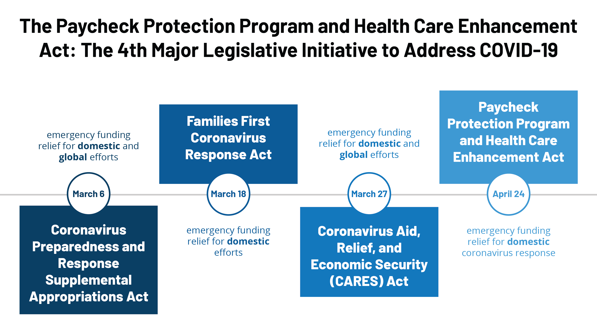

## Table of Contents

## What is the Paycheck Protection and Health Care Enhancement Act?

The Paycheck Protection and Health Care Enhancement Act is a law that was passed in the United States in April 2020. It was created to help people and businesses during the COVID-19 pandemic. The main goal of this act was to provide more money to small businesses, hospitals, and testing efforts. It added more funds to programs that were already helping people, like the Paycheck Protection Program (PPP), which gives loans to small businesses to help them keep paying their workers.

This act also gave more money to hospitals and health care providers to help them deal with the increased number of patients due to the virus. It included $75 billion for hospitals and $25 billion for testing and contact tracing. The idea was to make sure that hospitals had the resources they needed and that more people could get tested for the virus. By doing this, the government hoped to slow down the spread of COVID-19 and help the economy recover.

## When was the Paycheck Protection and Health Care Enhancement Act signed into law?

The Paycheck Protection and Health Care Enhancement Act was signed into law on April 24, 2020. This was during the time when the COVID-19 pandemic was causing a lot of problems for people and businesses in the United States. The act was meant to help by giving more money to programs that were already helping people.

The law added more funds to the Paycheck Protection Program (PPP), which gives loans to small businesses to help them keep paying their workers. It also gave more money to hospitals and health care providers to help them deal with the increased number of patients due to the virus. The act included $75 billion for hospitals and $25 billion for testing and contact tracing, aiming to slow down the spread of the virus and help the economy recover.

## What are the main components of the Paycheck Protection and Health Care Enhancement Act?

The Paycheck Protection and Health Care Enhancement Act is a law that was passed to help people and businesses during the COVID-19 pandemic. One of the main parts of this act is that it added more money to the Paycheck Protection Program (PPP). The PPP gives loans to small businesses to help them keep paying their workers. This was important because many businesses were struggling and needed help to stay open and keep their employees.

Another big part of the act is that it gave more money to hospitals and health care providers. The act included $75 billion for hospitals to help them deal with the increased number of patients due to the virus. It also included $25 billion for testing and contact tracing. This money was meant to help make sure that hospitals had the resources they needed and that more people could get tested for the virus. By doing this, the government hoped to slow down the spread of COVID-19 and help the economy recover.

## How does the Act aim to support small businesses?

The Paycheck Protection and Health Care Enhancement Act helps small businesses by adding more money to the Paycheck Protection Program (PPP). The PPP gives loans to small businesses so they can keep paying their workers. This is important because many small businesses were struggling during the COVID-19 pandemic and needed help to stay open. By giving them loans, the act helps these businesses keep their employees and continue operating.

The act also makes sure that small businesses can get the help they need quickly. It added more funds to the PPP so that more businesses could apply for loans. This means that more small businesses could get the money they needed to keep going during a tough time. By supporting small businesses in this way, the act helps to keep people employed and supports the economy.

## What specific provisions does the Act include for health care?

The Paycheck Protection and Health Care Enhancement Act helps hospitals and health care providers by giving them more money. It includes $75 billion for hospitals to help them deal with the increased number of patients because of the COVID-19 virus. This money is important because it helps hospitals buy the things they need, like equipment and supplies, to take care of more people.

The act also includes $25 billion for testing and contact tracing. This money helps to make sure that more people can get tested for the virus. By doing more testing and tracing, the government hopes to find out who has the virus and stop it from spreading to more people. This is important for keeping people safe and helping the health care system handle the situation better.

## How much funding was allocated to the Paycheck Protection Program (PPP) under this Act?

The Paycheck Protection and Health Care Enhancement Act added more money to the Paycheck Protection Program (PPP). It gave an extra $310 billion to the PPP. This money was meant to help more small businesses get loans so they could keep paying their workers during the COVID-19 pandemic.

This was important because many small businesses were struggling and needed help to stay open. By giving them loans, the act helped these businesses keep their employees and continue operating. This support was crucial for keeping people employed and supporting the economy during a tough time.

## What changes were made to the PPP loan forgiveness criteria by this Act?

The Paycheck Protection and Health Care Enhancement Act did not make any direct changes to the PPP loan forgiveness criteria. The main goal of this act was to add more money to the Paycheck Protection Program so that more small businesses could get loans. This meant that more businesses could apply for the help they needed to keep paying their workers during the COVID-19 pandemic.

However, the criteria for loan forgiveness stayed the same as before. Businesses could still get their loans forgiven if they used at least 60% of the loan for payroll costs and the rest for other allowed expenses like rent, utilities, and mortgage interest. The act just made sure that more businesses had access to these loans, but it did not change the rules about how the loans could be forgiven.

## How does the Act address testing and contact tracing for COVID-19?

The Paycheck Protection and Health Care Enhancement Act helps with testing and contact tracing for COVID-19 by giving $25 billion to these efforts. This money is important because it helps to make sure that more people can get tested for the virus. By doing more testing, the government can find out who has the virus and stop it from spreading to more people.

This act helps to make sure that the money for testing and contact tracing is used well. It supports the work of health care providers and labs so they can do more tests. By doing this, the government hopes to keep people safe and help the health care system handle the situation better during the COVID-19 pandemic.

## What role does the Act play in supporting hospitals and health care providers?

The Paycheck Protection and Health Care Enhancement Act helps hospitals and health care providers by giving them more money. It includes $75 billion for hospitals to help them deal with the increased number of patients because of the COVID-19 virus. This money is important because it helps hospitals buy the things they need, like equipment and supplies, to take care of more people. By giving hospitals this money, the act makes sure they can keep working well during the pandemic.

The act also helps with testing and contact tracing by giving $25 billion to these efforts. This money helps to make sure that more people can get tested for the virus. By doing more testing, the government can find out who has the virus and stop it from spreading to more people. This support is important for keeping people safe and helping the health care system handle the situation better during the COVID-19 pandemic.

## How does the Act impact the eligibility criteria for PPP loans?

The Paycheck Protection and Health Care Enhancement Act does not change the rules about who can get a PPP loan. The main goal of the act is to give more money to the Paycheck Protection Program so that more small businesses can apply for loans. This means that more businesses can get the help they need to keep paying their workers during the COVID-19 pandemic.

The eligibility criteria for PPP loans stayed the same as before. Businesses could still apply for a loan if they had fewer than 500 employees, or if they met the size standard for their industry. The act just made sure that more businesses had the chance to get these loans, but it did not change who could apply for them.

## What are the economic implications of the Paycheck Protection and Health Care Enhancement Act?

The Paycheck Protection and Health Care Enhancement Act has important economic effects. By adding more money to the Paycheck Protection Program (PPP), it helps small businesses keep paying their workers. This is good for the economy because it keeps people employed. When people have jobs, they can spend money on things they need, which helps other businesses too. The act also gives more money to hospitals, which helps them take care of more people during the COVID-19 pandemic. This is important because healthy people can work and help the economy grow.

The act also helps with testing and contact tracing, which is important for stopping the spread of the virus. By giving $25 billion to these efforts, the government can find out who has the virus and stop it from spreading to more people. This helps keep the economy running smoothly because fewer people get sick and need to stay home. Overall, the act supports the economy by helping small businesses, hospitals, and testing efforts during a tough time.

## How does the Act integrate with other legislative measures to combat the effects of the COVID-19 pandemic?

The Paycheck Protection and Health Care Enhancement Act works together with other laws to help fight the effects of the COVID-19 pandemic. It adds more money to the Paycheck Protection Program, which was first set up by the CARES Act. The CARES Act was a big law that helped people and businesses during the early days of the pandemic. By giving more money to the PPP, the new act makes sure that more small businesses can get loans to keep paying their workers. This helps keep people employed and supports the economy, which is important because it helps other laws work better too.

The act also helps hospitals and health care providers by giving them more money. This is important because it helps them take care of more people during the pandemic. The money for hospitals and testing comes on top of what was already given by other laws like the CARES Act and the Families First Coronavirus Response Act. These laws all work together to make sure that hospitals have what they need and that more people can get tested for the virus. By doing this, the government hopes to slow down the spread of the virus and help the economy recover faster.

## References & Further Reading

[1]: ["The CARES Act Works for All Americans"](https://home.treasury.gov/policy-issues/coronavirus/about-the-cares-act) - U.S. Department of the Treasury

[2]: Liu, M., & Saeed, T. J. (2020). ["COVID-19's Impact on the Financial Markets Around the World."](https://www.nature.com/articles/s41598-024-81563-z) SSRN Electronic Journal.

[3]: Bartik, A. W., Bertrand, M., Cullen, Z., Glaeser, E. L., Luca, M., & Stanton, C. (2020). ["The Impact of COVID-19 on Small Business Outcomes and Expectations."](https://papers.ssrn.com/sol3/papers.cfm?abstract_id=3570896) Proceedings of the National Academy of Sciences.

[4]: United States Congress. (2020). ["Paycheck Protection Program and Health Care Enhancement Act."](https://www.congress.gov/bill/116th-congress/house-bill/266) Public Law No: 116-139.

[5]: Wiersholm, A., & Duggal, R. (2020). ["The Paycheck Protection Program and Consumer Protection During COVID-19 Pandemic."](https://pmc.ncbi.nlm.nih.gov/articles/PMC8660126/) The Brookings Institution.

[6]: Lopez de Prado, M. (2018). ["Advances in Financial Machine Learning."](https://www.amazon.com/Advances-Financial-Machine-Learning-Marcos/dp/1119482089) Wiley.

[7]: Mulligan, C. B. (2020). ["Economic Policies and Practices in the COVID-19 Pandemic."](https://www.nber.org/papers/w27060) NBER Working Paper No. 27660.