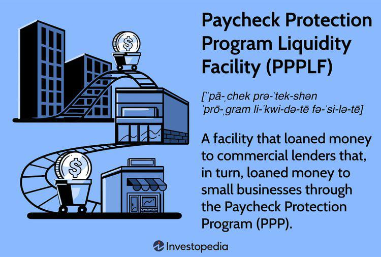

The Paycheck Protection Program (PPP) was a critical initiative introduced by the U.S. government during the COVID-19 pandemic to provide financial relief to small businesses. It offered forgivable loans to support payroll and essential expenses, thus aiding businesses to remain operational and retain employees during an unprecedented economic downturn. Complementing this effort was the Paycheck Protection Program Liquidity Facility (PPPLF), a mechanism designed by the Federal Reserve to ensure liquidity for lenders participating in the PPP. The PPPLF allowed financial institutions to use the PPP loans as collateral to access low-cost financing from the Federal Reserve. This initiative aimed to stabilize the financial sector by alleviating liquidity pressures on banks, credit unions, and other lenders, ensuring their capacity to continue offering loans to small businesses.

The significance of the PPPLF in the economic landscape during the pandemic cannot be overstated. It facilitated the efficient distribution of financial aid, directly contributing to the survival and continuity of numerous small businesses across the United States. By mitigating liquidity risks, the PPPLF helped bolster confidence among financial institutions amidst widespread economic uncertainty.



This article aims to explore the intersection of the PPPLF and the rapidly evolving field of algorithmic trading. Algorithmic trading, the use of computer programs to execute trades at high speed and volume, plays a pivotal role in modern financial markets. The exploration involves understanding how the liquidity infusions from facilities like the PPPLF could influence trading algorithms and the potential implications for financial markets. Through this analysis, the article seeks to offer insights into the adaptive nature of financial mechanisms and their capacity to respond to crises efficiently.

## Table of Contents

## Understanding the Paycheck Protection Program Liquidity Facility (PPPLF)

The Paycheck Protection Program Liquidity Facility (PPPLF) was established in response to the economic disruption caused by the COVID-19 pandemic, with the primary objective of supporting small businesses. The PPPLF was a critical component of the broader Paycheck Protection Program (PPP), which provided loans to help small businesses keep their workforce employed during the pandemic.

The PPPLF was created by the Federal Reserve as a mechanism to provide liquidity to financial institutions participating in the PPP. Under this facility, the Federal Reserve made loans to eligible lenders, with the loans originated under PPP serving as collateral. This structure ensured that lenders had the necessary liquidity to continue extending credit to small businesses without the constraint of balance sheet limitations. By accepting PPP loans as collateral, the Federal Reserve effectively mitigated the risk associated with these loans and encouraged widespread participation by financial institutions.

The operational mechanism of the PPPLF relied on the eligibility of participants, which included depository institutions such as banks and credit unions, as well as non-depository lenders. These entities were able to borrow funds from the Federal Reserve at an [interest rate](/wiki/interest-rate-trading-strategies) set at 0.35%, with the term of the loan matching the maturity of the underlying PPP loan. This rate provided an incentive for lenders to actively offer PPP loans, knowing that they could readily access liquidity through the PPPLF.

Throughout its operation, the PPPLF underwent several expansions to accommodate a wider range of financial institutions and increasing demand for PPP loans. The Federal Reserve continued to adjust the terms and conditions of the facility to ensure that sufficient [liquidity](/wiki/liquidity-risk-premium) was available to meet the financing needs of small businesses. The facility's flexibility was instrumental in addressing the changing economic conditions during the pandemic.

The PPPLF concluded on July 30, 2021, reflecting a return to more stable economic conditions and the tapering off of emergency fiscal measures. By the end of its operation, the facility had successfully provided critical support to the financial system, enabling the distribution of significant aid to small businesses across the United States. The closure of the PPPLF marked a transition towards recovery and the gradual phasing out of emergency support measures, signifying the improving economic landscape post-pandemic.

The PPPLF played an essential role in stabilizing the financial system during a period of unprecedented uncertainty, underscoring the importance of government-backed liquidity facilities in maintaining the flow of credit to crucial sectors of the economy.

## The Role of Algorithmic Trading in Finance

Algorithmic trading refers to the use of computer algorithms to automate trading processes, executing orders based on pre-defined criteria at speeds and frequencies that are impossible for human traders. Over recent decades, it has become a pivotal component of the financial markets, drastically altering the traditional trading landscape. 

### Definition and Significance

Algorithmic trading involves the use of complex algorithms to assess market data, identify trading opportunities, and execute trades automatically. These algorithms analyze a vast array of market variables, including price, [volume](/wiki/volume-trading-strategy), and timing, and can operate across multiple markets simultaneously. The significance of [algorithmic trading](/wiki/algorithmic-trading) lies in its ability to process huge volumes of data at remarkable speeds, facilitating high-frequency trading ([HFT](/wiki/high-frequency-trading-strategies)) and enhancing liquidity and market efficiency.

### Benefits of Algorithmic Trading

The primary advantages of algorithmic trading include speed, efficiency, and a reduction in human errors:

1. **Speed**: Algorithms can execute trades in milliseconds, an advantage that is particularly beneficial in volatile markets where prices may change rapidly. The swift execution of orders ensures that traders can capitalize on transient opportunities and lock in profits that might otherwise be missed.

2. **Efficiency**: By automating the trading process, algorithmic trading reduces the need for manual intervention, allowing for round-the-clock monitoring and trading. This efficiency ensures optimal execution of trades by taking advantage of minute price discrepancies.

3. **Reduced Human Error**: Automated trading reduces the influence of human emotions and biases, which can often lead to erroneous decision-making. By adhering to predetermined rules and strategies, algorithms offer a more disciplined and consistent approach to trading.

### Common Use Cases and Strategies

Algorithmic trading encompasses a variety of use cases and strategies. Some of the most prevalent include:

- **Statistical Arbitrage**: This involves identifying and exploiting statistical mispricings in securities. Algorithms facilitate the rapid execution of trades to take advantage of these short-lived discrepancies.

- **Market Making**: Algorithmic systems can quote both buy and sell prices, thus providing liquidity to the markets. The speed of algorithmic trading enables market makers to quickly adjust prices in response to market conditions, maintaining a competitive edge.

- **Trend Following**: This strategy uses algorithms to identify price trends and make buy or sell decisions based on the direction of the market. It relies heavily on technical analysis indicators such as moving averages.

- **Mean Reversion**: This strategy is based on the premise that prices and returns eventually move back towards their historical averages. Algorithms monitor market data to identify deviations from these averages and place trades that anticipate reversals.

- **Execution Algorithms**: These are designed to optimize the execution of large orders with minimal market impact. Techniques such as VWAP (Volume Weighted Average Price) and TWAP (Time Weighted Average Price) are commonly employed to distribute trades over specified periods.

In conclusion, algorithmic trading is an essential tool in modern finance, providing numerous benefits including speed and efficiency, while minimizing human error. It supports diverse strategies that adapt to various market conditions, ultimately contributing to enhanced market liquidity and efficiency. As technology continues to advance, algorithmic trading is expected to gain an even more significant foothold in global financial markets.

## Linking PPPLF and Algorithmic Trading

The intersection of the Paycheck Protection Program Liquidity Facility (PPPLF) and algorithmic trading represents a nuanced aspect of financial markets' adaptability to external economic stimuli. At its core, algorithmic trading relies on mathematical models and computational algorithms to execute orders rapidly and efficiently, often capitalizing on minute price discrepancies that human traders might not detect. In this context, understanding how liquidity infusions like those from the PPPLF could influence trading algorithms is crucial.

Theoretical exploration suggests that the liquidity provided through programs like the PPPLF can have both direct and indirect effects on trading algorithms. Directly, the infusion of liquidity into financial markets might lower [volatility](/wiki/volatility-trading-strategies) temporarily, affecting volatility-based trading strategies. For instance, if an algorithm is designed to exploit volatility (e.g., a statistical [arbitrage](/wiki/arbitrage) model), the sudden reduction in market volatility due to a liquidity boost could impact its profitability. Conversely, the injection of liquidity could enhance market depth, enabling algorithms to execute larger orders with reduced market impact costs.

From a quantitative standpoint, trading models could potentially integrate several data points from the PPPLF program. These include the volume of loans disbursed, the rate of loan application approvals, default rates, and the liquidity levels experienced by eligible financial institutions. These data points serve as indicators of financial stability and credit availability, crucial elements for algorithms assessing market conditions. The impact of these data points can be integrated into predictive models, possibly using regression analysis to correlate liquidity levels with market price movements.

Here is a simple example in Python, demonstrating how one might integrate PPPLF data into a trading model:

```python
import numpy as np
from sklearn.linear_model import LinearRegression

# Hypothetical PPPLF data
ppplf_liquidity_data = np.array([[100, 0.5], [150, 0.6], [120, 0.55], [130, 0.52]])
market_prices = np.array([1050, 1075, 1030, 1080])

# Linear Regression Model
model = LinearRegression()
model.fit(ppplf_liquidity_data, market_prices)

# Predict market prices based on new PPPLF data
new_ppplf_data = np.array([[140, 0.58]])
predicted_market_price = model.predict(new_ppplf_data)

print("Predicted Market Price:", predicted_market_price)
```

In this simple model, liquidity data and another economic indicator are used to predict market prices, showcasing how PPPLF data could inform trading decisions.

Challenges arise in the integration of government responses like the PPPLF into trading algorithms. The primary challenge is the dynamism and unpredictability of economic policy impacts, which can seldom be captured fully by static models. Algorithms need to be adaptive, capable of factoring in sudden policy changes, market sentiment shifts, and economic data updates. Moreover, there is the risk that over-reliance on such data might lead to model overfitting, where the algorithm becomes too tailored to specific data patterns that might not persist.

Further considerations include the latency of policy impact, where the timing of liquidity provision and its market effects may not coincide perfectly. Algorithms would need mechanisms to accommodate these lags, possibly through the incorporation of lagged variables in their predictive models. Lastly, regulatory changes and data availability are constraints to model reliability, as governments may alter program parameters or discontinue data provision, affecting algorithm accuracy and performance.

## Impact on Small Businesses and the Economy

The Paycheck Protection Program Liquidity Facility (PPPLF) played a pivotal role in supporting small businesses during the height of the COVID-19 pandemic. It provided necessary liquidity to financial institutions, allowing them to offer Paycheck Protection Program (PPP) loans to small businesses in need. This mechanism was crucial in minimizing economic disruptions caused by lockdowns and social distancing measures, which severely impacted many small businesses.

One of the main objectives of the PPPLF was to enable financial institutions to extend more credit to small businesses by offering a reliable source of liquidity from the Federal Reserve. By accepting PPP loans as collateral, the Federal Reserve reduced the risk burden on banks, encouraging them to participate actively in the PPP. Evaluating the effectiveness of the PPPLF, it is evident that the facility accomplished its goal by significantly enhancing the reach and impact of the PPP. According to the U.S. Small Business Administration, over $790 billion in PPP loans were disbursed, supporting more than 5.2 million businesses and safeguarding approximately 51 million jobs.

An analysis of the broader economic impact reveals that the PPPLF played an integral role in promoting job retention and business continuity. The infusion of liquidity helped stabilize the financial operations of small businesses, many of which faced temporary closures or reduced revenues due to the pandemic. This stabilization was crucial in maintaining employment levels during the economic downturn, thereby cushioning the overall unemployment rate.

The long-term implications for small businesses and lending institutions post-PPPLF are multifaceted. For small businesses, the support received during the pandemic fostered resilience and adaptability in the face of unprecedented challenges. Many businesses used the loans to pivot their operations, adopting digital tools and e-commerce platforms to sustain their customer base and revenue streams. This shift toward digital transformation is likely to have lasting positive effects on their operational agility and competitive edge in the post-pandemic market.

For lending institutions, the PPPLF highlighted the importance of having robust mechanisms in place to respond swiftly to economic crises. It demonstrated the need for flexible financial infrastructures that can accommodate sudden surges in demand for credit and liquidity. Moving forward, banks and other lending entities might integrate these insights into their risk management frameworks, potentially influencing the design of future credit products and services tailored to the needs of small businesses.

Overall, the PPPLF's legacy is expected to influence both the strategic thinking of small businesses and the operational strategies of financial institutions, as each seeks to navigate a post-pandemic economy with greater resilience and foresight.

## Case Studies and Practical Insights

During the COVID-19 pandemic, the Paycheck Protection Program (PPP) and Paycheck Protection Program Liquidity Facility (PPPLF) provided crucial financial support to small businesses, offering a safety net that helped sustain operations amid unprecedented challenges. These programs enabled businesses to maintain payrolls, thereby supporting employment and contributing to economic stability.

### Real-World Examples of Benefited Businesses

Several small businesses across various sectors successfully utilized PPP and benefited indirectly from the PPPLF. For instance, independent restaurants, retail stores, and service-oriented small businesses took advantage of PPP loans to cover essential expenses and retain employees. The PPP loans provided the necessary liquidity that many small businesses lacked during the harsh economic conditions brought by the pandemic.

An example is a family-owned restaurant chain in the Midwest that used PPP funding to retain its staff and transition to a takeout and delivery model. With the infusion of liquidity facilitated by the PPPLF, the community bank managing the restaurant's financing was able to offer favorable terms, thus ensuring the business remained operational despite reduced in-person dining.

### Financial Institutions' Strategic Use of PPPLF Funds

Financial institutions leveraged PPPLF funds to enhance their lending capabilities during the pandemic. By using PPP loans as collateral, banks could borrow from the Federal Reserve at low interest rates, resulting in increased liquidity. This additional liquidity allowed banks to extend more credit and offer deferral programs on existing loans, thereby supporting a wider array of businesses.

A notable case involved a regional bank that strategically utilized PPPLF advances to augment its commercial lending portfolio. The bank redirected part of this liquidity to invest in technology, improving their digital banking services, crucial for facilitating transactions in a pandemic-stricken environment. Additionally, the bank conducted targeted outreach to businesses in underserved areas, ensuring broader access to financial aid during the crisis.

### Correlational Data with Algorithmic Trading Practices

The intersection of PPP, PPPLF, and algorithmic trading presents an innovative avenue for research. While direct correlations between government loan programs and algo trading are complex to establish due to the diverse data sets and market factors involved, some insights can be discerned through market sentiment analysis and liquidity trends.

One approach involves evaluating market data for real-time liquidity fluctuations that align with news releases related to PPP and PPPLF distributions. Algorithmic trading strategies can be adapted to leverage this data; for example, by adjusting risk assessments or liquidity provisioning in response to predicted shifts in market conditions influenced by government interventions.

```python
import pandas as pd
import numpy as np

# Hypothetical market sentiment data set
data = {'date': pd.date_range(start='2020-04-01', periods=100, freq='D'),
        'ppplf_news_impact': np.random.rand(100),
        'market_liquidity_trends': np.random.rand(100)}

# Convert to DataFrame
df = pd.DataFrame(data)

# Simple correlation analysis
correlation = df['ppplf_news_impact'].corr(df['market_liquidity_trends'])
print(f"Correlation between PPPLF news impact and market liquidity trends: {correlation}")
```

Even though the direct impact of PPP and PPPLF on algo trading practices necessitates further empirical research, the above approach provides a framework for understanding the possible influence of financial policies on trading algorithms. This interplay signifies a potential area for future exploration, particularly as financial markets and government interventions continue to evolve.

## Future Outlook and Conclusion

The evolving landscape of financial markets and trading methodologies suggests potential pathways for similar government-backed facilities during future crises. The COVID-19 pandemic highlighted the critical role of liquidity support in stabilizing businesses and financial systems. Future developments could involve enhancements to the Paycheck Protection Program Liquidity Facility (PPPLF) framework, tailored to more dynamically address economic challenges.

During crises, governments may prioritize facilities that integrate advanced technology and real-time data analytics to improve the precision and timeliness of economic interventions. For example, automated systems could be employed to identify sectors most in need of aid, assessing liquidity gaps more efficiently by using [machine learning](/wiki/machine-learning) algorithms. This could potentially increase the accuracy of fund allocation, ensuring that resources reach businesses with the highest impact on employment and economic stability.

Algorithmic trading is expected to become increasingly sophisticated, with algorithmic models potentially incorporating government interventions as variables to optimize trading strategies. Future developments might involve creating adaptive algorithms that adjust predictions based on macroeconomic signals, including government policy changes. This calls for algorithms that are not only reactive but also predictive, potentially leveraging neural networks or other advanced AI methods to anticipate the timing and impact of government actions.

Python, along with libraries such as Numpy and Pandas, can be instrumental in designing these algorithms. Consider a simple example where a machine learning model predicts stock price movements based on government-backed liquidity measures:

```python
import pandas as pd
from sklearn.model_selection import train_test_split
from sklearn.ensemble import RandomForestRegressor

# Sample data preparation
data = pd.read_csv('financial_data.csv')
features = data[['government_intervention_index', 'market_volatility', 'industry_liquidity']].values
target = data['stock_price_movement'].values

# Split data into training and testing sets
X_train, X_test, y_train, y_test = train_test_split(features, target, test_size=0.2, random_state=42)

# Train the model
model = RandomForestRegressor(n_estimators=100, random_state=42)
model.fit(X_train, y_train)

# Predict and evaluate
predictions = model.predict(X_test)
```

Such frameworks indicate a trend towards tightly integrating economic policies with market dynamics, contributing to a more resilient financial architecture. In terms of financial market stability, the synchronization of algorithmic trading with government interventions can mitigate extreme volatility. By anticipating policy shifts and inclusive data points, these systems can buffer markets against abrupt swings, making them robust against shocks.

Looking ahead, the necessity of adaptive financial mechanisms becomes undeniable as economic climates remain unpredictable. The experience of the COVID-19 pandemic has underscored the importance of preparedness in economic policy and market mechanisms. Future government-backed facilities may adopt a hybrid approach, blending traditional financial support with cutting-edge technology, ensuring businesses remain resilient, and markets remain stable through evolving economic challenges.

## References & Further Reading

[1]: Aikman, D., Kiley, M. T., Lee, S. J., & Palumbo, M. G. (2019). ["Mapping Heat in the U.S. Financial System,"](https://papers.ssrn.com/sol3/papers.cfm?abstract_id=2642442) Finance and Economics Discussion Series (FEDS). 

[2]: Board of Governors of the Federal Reserve System. (2021). ["Federal Reserve Announces an Expansion of the Paycheck Protection Program Liquidity Facility (PPPLF) Eligibility,"](https://www.federalreserve.gov/publications/2021-ar-overview.htm) Press Release.

[3]: Narajabad, B. N., & Rodnyansky, A. (2020). ["Lending through the financial cycle: The Paycheck Protection Program Liquidity Facility,"](https://www.federalreserve.gov/econres/feds/files/2020054pap.pdf) Finance and Economics Discussion Series (FEDS) 2020-054. 

[4]: Securities and Exchange Commission (SEC). (2020). ["Staff Guidance on Regulation SHO,"](https://www.sec.gov/rules-regulations/staff-guidance) 

[5]: Bank for International Settlements (BIS). (2020). ["Basel Committee on Banking Supervision - Bank lending amid COVID-19,"](https://www.bis.org/) Working Paper.