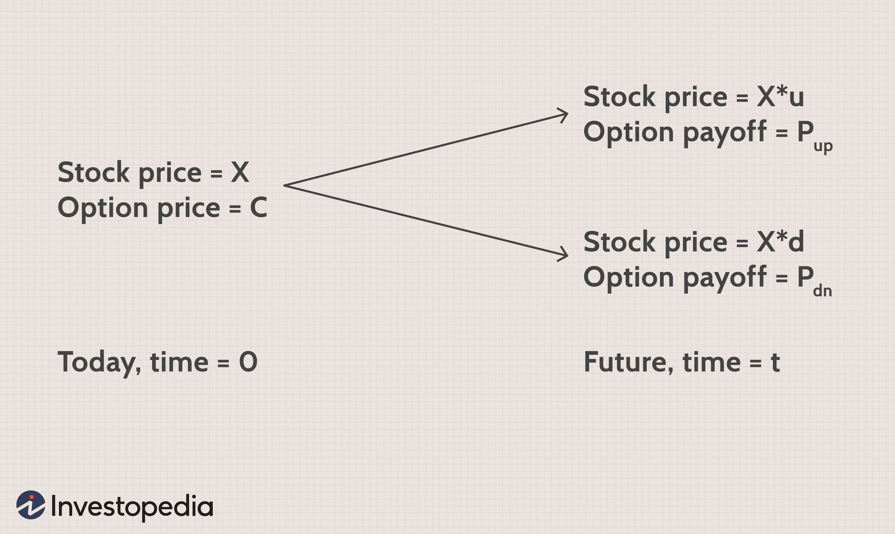

In recent years, the stock market has undergone transformative changes primarily fuelled by the advent and proliferation of algorithmic trading. This approach, which leverages computer algorithms to automate the process of buying and selling stocks, has fundamentally altered how trades are executed and managed. As the financial industry invests more heavily in technology, the reliance on sophisticated algorithms continues to grow, providing new dimensions in trading that enhance both efficiency and precision.

Algorithmic trading extends beyond the simple execution of buy and sell orders. It integrates advanced strategies and cutting-edge technologies to facilitate more informed and timely decision-making processes. The automation capabilities allow for the analysis of vast volumes of data at speeds far exceeding human capabilities. This technological edge ensures that trading activities can be optimized to achieve better performance outcomes. Algorithms can dynamically adapt to market conditions, enabling traders to respond to fluctuations swiftly and with precision.



This article seeks to explore the multifaceted aspects of algorithmic trading within the stock market landscape. It examines how algorithms influence share prices, detailing their role in enhancing market liquidity and contributing to market volatility. Furthermore, the article outlines the advantages such as reduced transaction costs and the minimization of human emotional bias, as well as challenges like regulatory oversight and the risks associated with flash crashes and technical failures. Lastly, it provides guidance on how investors and traders can leverage these algorithmic tools to their benefit in navigating the modern stock market.

## Table of Contents

## Understanding the Stock Market

The stock market functions as a dynamic and intricate platform where shares of companies, also known as equities, are issued, bought, and sold. Its proper understanding is essential for traders and investors aiming to capitalize on market opportunities. The stock market serves dual primary purposes: providing companies with access to capital in exchange for a slice of ownership in the company, and offering investors a means to participate in the financial achievements of those companies.

Share prices are driven by several critical factors. At the core, company performance metrics such as earnings reports, revenue growth, and profit margins play a pivotal role in influencing stock valuations. Strong performance indicators can lead to an appreciation in stock value, while underperformance may result in devaluation.

Economic data such as unemployment rates, inflation, GDP growth, and interest rates also significantly impact stock market dynamics. These indicators offer insights into the broader economic environment, affecting investor confidence and market sentiment. Positive economic prospects often encourage investment and push prices upward, whereas economic downturns may deter investment, suppressing prices.

Market sentiment, though intangible, can have profound effects on stock prices. It encompasses the collective mood and attitude of investors toward market conditions. Positive sentiment tends to increase buying activity and elevate stock prices, whereas negative sentiment can lead to widespread selling and price declines. Market sentiment can sometimes create discrepancies between a stock's intrinsic value and its market price.

Understanding these dynamics is crucial for making informed investment decisions. Stocks represent fractional ownership in a company, granting investors a proportional claim on the company’s assets and future earnings. Participating in the stock market involves both potential rewards and risks. An investor benefits from stock price appreciation and dividends, if declared by the company. However, stock prices can be volatile, influenced by market and external factors, which can lead to significant investment risks. Therefore, a comprehensive grasp of these elements is indispensable for effective stock market participation.

## What is Algorithmic Trading?

Algorithmic trading, often referred to as 'algo-trading', employs the power of computer programs to automatically execute trading orders by following a pre-defined set of instructions. These predetermined instructions are grounded in factors such as price, timing, and [volume](/wiki/volume-trading-strategy), enabling trades to be executed at a velocity and frequency unattainable by human traders. The primary objective of [algorithmic trading](/wiki/algorithmic-trading) is to leverage computational efficiency to achieve optimal trading outcomes.

The cornerstone of algorithmic trading lies in its ability to interpret vast amounts of market data and make instantaneous decisions based on pre-set criteria. An algorithm, in this context, is essentially a series of coded rules that can analyze current market conditions and make decisions about trading actions. For instance, a simple trading algorithm might be structured to buy a stock if its 50-day moving average exceeds the 200-day moving average, indicating a bullish trend.

Here is a simple illustration using Python to calculate and compare moving averages:

```python
import pandas as pd

# Suppose 'data' is a DataFrame with a 'Price' column containing historical stock prices
data['50_MA'] = data['Price'].rolling(window=50).mean()
data['200_MA'] = data['Price'].rolling(window=200).mean()

buy_signal = data[data['50_MA'] > data['200_MA']]
```

This snippet calculates 50-day and 200-day moving averages and identifies buy signals when the shorter moving average crosses above the longer one.

Algorithms facilitate enhanced market efficiency by streamlining the trading process, thus ensuring that trading decisions are executed seamlessly and swiftly. The absence of human intervention in executing trades reduces the likelihood of errors due to emotional biases and facilitates the quick assimilation of market trends and opportunities. Moreover, algorithmic trading often guarantees more favorable prices for traders through its capacity to undertake rapid and voluminous transactions, thereby improving market [liquidity](/wiki/liquidity-risk-premium) and reducing transaction costs.

Ultimately, the proficiency of algorithmic trading to handle complex computations and execute high-speed transactions transforms it into a vital component of modern-[day trading](/wiki/day-trading-spy), offering a strategic edge in competitive financial markets.

## How Algorithmic Trading Impacts Share Prices

Algorithmic trading, or algo-trading, can significantly impact share prices by influencing both [volatility](/wiki/volatility-trading-strategies) and liquidity within stock markets. One of the primary effects of algorithmic trading is enhanced market liquidity. By executing a high volume of trades efficiently, algorithms facilitate more continuous buying and selling of shares, reducing the liquidity risk that investors might encounter. Consequently, shares become more accessible, and the market can absorb large trades without substantial price changes, making it more responsive to supply and demand.

However, during periods of market turbulence, the rapid deployment of algorithmic trading strategies can lead to increased volatility. When numerous algorithmic strategies respond simultaneously to market events, there can be swift and pronounced price movements. For instance, if multiple algorithms are triggered to sell based on a specific price signal, it could lead to a sudden spike in sell orders, driving prices down rapidly. This collective behavior can widen the bid-ask spread, which represents the difference between what buyers are willing to pay and sellers are willing to accept. A wider spread can indicate increased uncertainty and decreased market efficiency during such volatile times.

Despite the potential for increased volatility, algorithmic trading ensures that pricing is more reflective of underlying market fundamentals. The frequent and high volume of trades executed by algorithms helps integrate new information into share prices more quickly than would be possible without such technology. This rapid price adjustment process is facilitated by the algorithms' ability to analyze large datasets, identify trends, and execute trades with minimal time lag. As a result, share prices often reflect the latest available information, maintaining alignment with economic and corporate fundamentals.

In summary, while algorithmic trading can exacerbate short-term volatility and affect market dynamics during turbulent periods, it also enhances liquidity and ensures that share prices are promptly updated in response to new information. This dual impact underscores the complexity and transformative role of algorithms in modern financial markets.

## Advantages of Algorithmic Trading

Algorithmic trading offers a multitude of advantages that enhance the efficiency and efficacy of trade execution. One of the primary benefits is its ability to minimize the impact of human emotions on trading decisions. Emotions such as fear and greed can lead to irrational decisions and inconsistency in trading practices. By relying on pre-defined algorithms, trading becomes more rational and objective, ensuring that decisions are based on concrete data and analysis rather than emotional reactions.

Precision in trade execution is another notable advantage of algorithmic trading. Algorithms can monitor and analyze vast amounts of market data in real-time, identifying optimal trading conditions and executing trades at precise moments. This capability ensures trades are executed at the most advantageous prices, thereby maximizing potential returns. For instance, algorithms can swiftly identify trends and reversals or capitalize on [arbitrage](/wiki/arbitrage) opportunities faster than any human trader could. 

Moreover, algorithmic trading significantly reduces transaction costs. Traditionally, the involvement of human brokers necessitated higher transaction fees. However, algorithms streamline the trading process by automating tasks such as order placement, adjustment, and execution, which reduces the need for human intervention and, consequently, the associated costs. This automation also allows for the execution of large volumes of orders without incurring substantial market impact, further decreasing costs.

The speed at which algorithmic trading operates is another critical advantage. The time taken from recognizing a trading opportunity to executing a trade can be reduced to fractions of a second through automation. This rapid execution enables traders to capitalize on short-lived market phenomena and price discrepancies that might be missed if trading manually.

In summary, algorithmic trading offers advantages that include minimizing emotional influence, providing precision in execution, reducing transaction costs, and increasing execution speed. These benefits make it an invaluable tool for traders seeking to optimize their engagement in financial markets.

## Challenges and Risks of Algorithmic Trading

Algorithmic trading, while offering numerous advantages, is not devoid of challenges and risks that can significantly impact market dynamics. One of the most pronounced concerns is its contribution to market instability, particularly during flash crashes. These rapid, deep market sell-offs can be exacerbated by algorithmic trading systems acting on predefined criteria without human intervention, leading to cascading effects that amplify price movements.

Technical failures and system errors pose another significant risk in algorithmic trading. Algorithms are driven by complex code and rely on robust technological infrastructure; thus, any faults in the system can lead to erroneous trades and substantial financial losses. Code errors, incorrect data feeds, or system outages can have a chain reaction, affecting not only the trader using the algorithm but also market participants at large.

The unpredictability of 'black swan' events, rare but impactful occurrences, further adds to the complexity of managing algorithmic trading systems. These events can trigger unprecedented market conditions that algorithms are not equipped to handle, potentially leading to catastrophic trading losses. Algorithms designed and backtested in normal market conditions might fail to adapt to the unforeseen and extreme scenarios brought about by such events.

A substantial capital investment is required for developing and deploying algorithmic trading strategies. This includes the cost of high-performance computing systems, data feeds, and software platforms necessary to ensure trades are executed accurately and promptly. In addition to initial costs, ongoing maintenance of software and data feeds is crucial to accommodate market changes and minimize system vulnerabilities.

For example, consider the Python snippet below, which outlines a very basic structure of an algorithmic trading strategy:

```python
import numpy as np
import pandas as pd

# Sample stock price data
data = {
    'Prices': [100, 102, 101, 105, 107, 103],
}

df = pd.DataFrame(data)

# Simulating a simple moving average crossover strategy
df['SMA_3'] = df['Prices'].rolling(window=3).mean()
df['SMA_2'] = df['Prices'].rolling(window=2).mean()

# Generate buy/sell signals
signals = np.where(df['SMA_2'] > df['SMA_3'], 'Buy', 'Sell')

df['Signal'] = signals

print(df)
```

This code calculates two simple moving averages over different periods and generates buy/sell signals based on their crossover, illustrating a basic concept. However, in real-world scenarios, much more sophisticated and rigorously tested strategies are necessary. Furthermore, the infrastructure required to execute these strategies at a competitive level involves significant cost and expertise, emphasizing the demanding nature of algorithmic trading.

These risks necessitate that traders equipped with algorithmic strategies continually invest in their technological resources and adapt to the regulatory landscape, which is evolving to mitigate market instability while ensuring fair trading practices.

## Getting Started with Algorithmic Trading

To embark on a journey in algorithmic trading, a fundamental understanding of the stock market and proficiency in programming languages such as Python or C++ is essential. These skills form the foundation for developing, testing, and deploying effective trading algorithms.

The initial step involves selecting an appropriate trading platform. A robust platform will offer comprehensive features, such as access to real-time data, a wide range of financial instruments, and API support for programmatic trading. Popular platforms include MetaTrader, [Interactive Brokers](/wiki/interactive-brokers-api), and QuantConnect, each providing unique advantages based on the trader's objectives and experience level.

Once a platform is chosen, developing a well-researched trading strategy becomes paramount. This involves designing algorithms that can identify and exploit market inefficiencies. Strategies can range from simple moving-average crossovers to more complex [statistical arbitrage](/wiki/statistical-arbitrage) models. Knowledge in quantitative analysis and financial modeling is beneficial here, as it allows for the creation of sophisticated and effective algorithms.

Backtesting is a critical step in honing these strategies. This process involves running the algorithm on historical data to evaluate its performance and identify potential weaknesses. By analyzing past trades, traders can fine-tune their algorithms for enhanced accuracy and efficiency. Simulated trading or paper trading follows [backtesting](/wiki/backtesting) and offers the opportunity to test strategies in real-time without financial risk. This simulation environment closely replicates live market conditions, enabling traders to assess strategy performance and adjust as necessary before committing real capital.

Furthermore, a solid grasp of risk management principles is crucial in algorithmic trading. Implementing measures such as stop-loss orders and position sizing can mitigate potential losses and preserve capital. Continuous monitoring and optimization of algorithms, based on performance metrics and market changes, ensure that strategies remain relevant and profitable.

As technology progresses, staying updated with advancements such as [artificial intelligence](/wiki/ai-artificial-intelligence) and [machine learning](/wiki/machine-learning) can provide additional tools for developing cutting-edge trading strategies. Embracing these technologies can lead to more adaptive and predictive algorithms, offering a competitive edge in fast-evolving markets.

In summary, beginning a venture into algorithmic trading necessitates a blend of market knowledge, programming skills, and strategic development. With the right tools and continuously refined strategies, traders can effectively leverage technology to capitalize on opportunities within the stock market.

## The Future of Algorithmic Trading

As technology continues to evolve, algorithmic trading is poised for further sophistication, driven predominantly by advancements in artificial intelligence (AI) and machine learning (ML). These technologies have the potential to transform algorithmic trading by enhancing predictive accuracy and automating complex decision-making processes. AI algorithms can process vast amounts of financial data at unprecedented speeds, identifying patterns that are not apparent to human investors. Machine learning models can also evolve by continuously learning from new data, leading to increasingly refined trading strategies.

Innovative developments in these areas are likely to reduce operational costs and enhance precision in trade execution, providing new opportunities for traders and investors. For instance, AI-driven algorithms can optimize order placements to minimize market impact and improve execution prices, which is crucial in high-frequency trading where speed and cost-efficiency are paramount.

However, as algorithmic trading methods become more advanced, the regulatory environment may need to adapt to address associated risks. High-frequency trading, characterized by extremely high-speed transactions, can contribute to market instability; hence, regulators might introduce measures to mitigate these risks. This may include implementing latency floors, imposing stricter reporting requirements, and enhancing surveillance of trading activities to ensure transparency and fairness in the markets.

As these technologies continue to develop, ethical considerations and accountability in AI decision-making will also become more prominent. Ensuring that AI systems are designed to operate transparently and align with regulatory standards will be crucial for maintaining market integrity. Consequently, future regulations may focus on establishing clear guidelines and standards for the use of machine learning and AI in financial markets, balancing innovation with the need for stability and investor protection.

Overall, the future of algorithmic trading is likely to be defined by a blend of technological advancement and evolving regulatory frameworks. Traders and investors who adapt to these changes stand to gain significant advantages, provided they navigate the complexities with a strategic and informed approach.

## Conclusion

Algorithmic trading is significantly transforming the investment landscape, offering a blend of both challenges and opportunities for traders and investors. By leveraging sophisticated algorithms, market participants can execute trades with enhanced speed and precision, thus gaining a competitive edge. Nevertheless, the advantages of algorithmic trading are closely accompanied by inherent risks. These include potential technical failures, susceptibility to market anomalies, and the complexities introduced by high-frequency trading, all of which necessitate a comprehensive understanding and proactive risk management strategies.

The successful integration of algorithmic trading requires continuous education and awareness of evolving market conditions, technological advancements, and regulatory environments. Investors and traders equipped with a strategic approach can effectively mitigate risks and capitalize on the benefits of algorithmic trading. The future of the stock market is increasingly aligned with advancements in artificial intelligence and machine learning, which promise further cost reductions and improved trading accuracy.

Ultimately, staying informed and making informed decisions are crucial for navigating the nuanced and ever-evolving landscape of the stock market. Algorithmic trading demands a careful balance between exploiting its opportunities and understanding its complexities to achieve sustainable success.

## References & Further Reading

[1]: Bergstra, J., Bardenet, R., Bengio, Y., & Kégl, B. (2011). ["Algorithms for Hyper-Parameter Optimization."](https://papers.nips.cc/paper/4443-algorithms-for-hyper-parameter-optimization) Advances in Neural Information Processing Systems 24.

[2]: ["Advances in Financial Machine Learning"](https://www.amazon.com/Advances-Financial-Machine-Learning-Marcos/dp/1119482089) by Marcos Lopez de Prado

[3]: ["Evidence-Based Technical Analysis: Applying the Scientific Method and Statistical Inference to Trading Signals"](https://www.amazon.com/Evidence-Based-Technical-Analysis-Scientific-Statistical/dp/0470008741) by David Aronson

[4]: ["Machine Learning for Algorithmic Trading"](https://github.com/stefan-jansen/machine-learning-for-trading) by Stefan Jansen

[5]: ["Quantitative Trading: How to Build Your Own Algorithmic Trading Business"](https://books.google.com/books/about/Quantitative_Trading.html?id=j70yEAAAQBAJ) by Ernest P. Chan