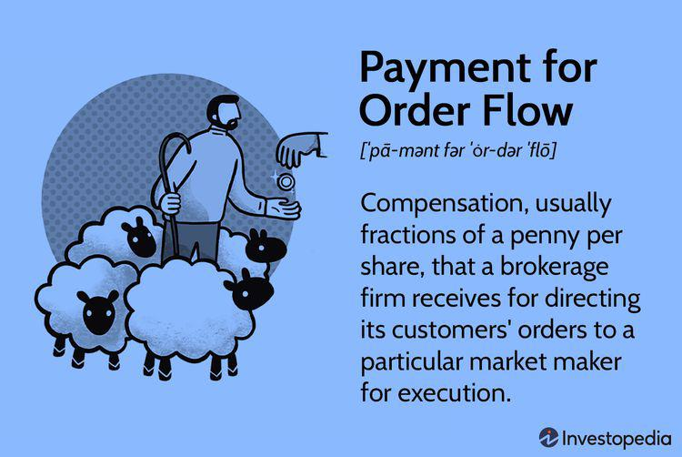

Payment for Order Flow (PFOF) is a significant trading mechanism within stock markets and algorithmic trading. It serves as a form of compensation that brokerage firms receive from market makers for directing trades their way. This mechanism allows brokerages to offer commission-free trading to investors, a strategy widely popularized by platforms like Robinhood. Through PFOF, a brokerage firm routes its client's order to a market maker in exchange for a payment. The market maker benefits from earning the spread between buying and selling prices, while the client benefits from ostensibly free trading services.

Understanding the intricacies of PFOF is essential, as it has considerable implications on trade execution quality. The mechanism impacts how orders are executed, potentially influencing the priority between routing trades to a financially lucrative partner versus ensuring the client gets the best possible trade price. Consequently, brokerage services' role in affecting trade execution quality generates both benefits and criticisms.



This article seeks to provide a comprehensive overview of PFOF, analyzing its operational mechanics, potential advantages, and the controversies it stirs in trading dynamics. The discourse surrounding PFOF extends beyond its immediate financial implications to ethical considerations within the finance industry. Differences in applications of PFOF are notable between equity trading and options trading due to variations in trade dynamics and spread differences.

Additionally, the regulatory framework around PFOF involves stringent requirements by the Securities and Exchange Commission (SEC) in the United States, aimed at maintaining transparency and fairness in trade executions. Understanding how PFOF interplays with regulatory policies is vital, given ongoing discussions about its reform. This article also aims to shed light on the balancing act regulators, brokerages, and investors must perform to safeguard investor protection without stifling market innovation.

## Table of Contents

## Understanding Payment for Order Flow (PFOF)

Payment for Order Flow (PFOF) is a mechanism through which brokerage firms are compensated for routing client orders to specific market makers for execution. This model diverges from traditional commission-based trading, which typically charges customers a fee per transaction. By leveraging PFOF, brokerages are able to offer commission-free trading to their clients, effectively removing direct transaction fees. Instead, these brokerages receive payments from market makers, typically amounting to a fraction of a penny per share, as compensation for directing orders to them.

The emergence and subsequent popularity of commission-free trading platforms, such as Robinhood, can be largely attributed to PFOF as a primary revenue model. These platforms strategically use PFOF to attract a larger user base by capitalizing on the allure of zero commission trading. This has fundamentally changed the landscape of trading, increasing accessibility for retail investors who might have previously been deterred by transaction fees.

Market makers play a crucial role in the PFOF framework. They benefit from it by gaining a consistent flow of orders, which helps them maintain market [liquidity](/wiki/liquidity-risk-premium). By facilitating a large number of trades, market makers are better positioned to manage their inventory effectively, ensuring that they can match buyers and sellers efficiently. This continuous order flow helps stabilize markets and can potentially reduce bid-ask spreads.

In summary, PFOF serves as a mutually beneficial arrangement between brokerages and market makers — brokerages attract clients by offering reduced or zero direct trading costs, while market makers benefit from stable order flow that aids in liquidity management. This model has revolutionized trading practices, but it is essential for investors to remain informed about how these processes can impact trade execution quality and overall trading costs.

## How Does Payment for Order Flow Work?

Payment for Order Flow (PFOF) is a process where brokerage firms direct client orders to specific market makers who, in return, provide compensation to the brokers. This arrangement allows brokerage firms to offer trades to their clients with seemingly no direct fees. However, the apparent absence of transaction costs doesn't eliminate the financial implications associated with PFOF practices.

When an investor places an order, it is routed by the broker to a market maker. The market maker executes the transaction and profits from the spread, the difference between the buying and selling prices of a security. For example, if a stock can be bought at $100 and sold at $100.05, the spread would be $0.05. The market maker's profit lies in this spread, leveraging their ability to execute transactions en masse efficiently.

The quality of trade execution under PFOF has raised concerns among investors and regulators. Although trades may be advertised as 'free', the cost often manifests as a suboptimal execution price. A lower execution quality can occur because the broker might prioritize routing orders to market makers offering higher payments rather than those providing the best price for the security.

This scenario presents a potential conflict of interest where market makers aligned with brokers' compensation interests may not necessarily offer the best terms for the investor. Consequently, even minor discrepancies in execution prices can accumulate into significant costs for frequent traders. Investors and regulators remain vigilant, continuously weighing the benefits of commission-free trading against the possible hidden costs engendered by PFOF.

## PFOF for Equities vs. Options

Payment for Order Flow (PFOF) presents distinct characteristics and impacts when comparing equities and options trading. The interplay between PFOF and market dynamics is particularly evident due to the inherent differences in these asset classes.

Options trading is characterized by higher bid-ask spreads compared to equity trading. This occurs because options, being derivative financial instruments, are subject to more complex valuations and market [volatility](/wiki/volatility-trading-strategies). Consequently, the wider spreads create opportunities for brokerages to benefit more from PFOF in options trading, as these spreads can be more lucrative. For example, if the bid-ask spread for an option is $0.50, the market maker’s ability to profit from this difference is significantly higher than with a tighter spread that is often seen in equity trading.

The influence of PFOF has intensified with the rise of retail investor participation in options markets. Platforms promoting ease of access have led to increased trading volumes, spotlighting the impact of PFOF on execution quality. Retail investors, often attracted by the promise of commission-free trades, may not be fully aware of how the wider spreads in options trading can affect their returns. Market liquidity providers capitalize on these spreads by executing trades at prices that menially disadvantage retail traders, although without explicit trading fees.

Another concern is that the wider bid-ask spreads in options exacerbate issues related to execution quality. When a brokerage firm routes orders to a market maker prioritizing PFOF, the market maker might not strive for the most favorable execution. The potential misalignment between achieving the best available market price and the financial benefits gained from PFOF can result in situations where investors receive suboptimal trade executions.

In order to assist with understanding the financial implications of executing options trades with wider spreads, consider this simplified Python example calculating potential profit from a market maker's perspective:

```python
def calculate_profit(buy_price, sell_price, spread):
    # Calculate the profit per option contract for a market maker
    return (sell_price - buy_price) - spread

# Example scenario
buy_price = 4.00
sell_price = 4.50
spread = 0.50

profit = calculate_profit(buy_price, sell_price, spread)
print(f"Market maker's potential profit per contract: ${profit}")
```
The code above demonstrates how a market maker could potentially profit from an options contract with a $0.50 spread, serving as a simplified illustration of how PFOF can yield revenue in options trading.

Ultimately, while PFOF facilitates cost reductions in trading by potentially lowering commission charges, it raises significant concerns about execution fairness, especially in options markets where trade dynamics and investor outcomes can be markedly affected by the practice.

## SEC Requirements and PFOF Regulations

The Securities and Exchange Commission (SEC) in the United States plays a pivotal role in regulating Payment for Order Flow (PFOF) to maintain fair and transparent trading practices. The SEC requires brokerage firms to disclose their PFOF arrangements, ensuring that investors are informed about potential conflicts of interest that may arise from these practices. This disclosure is crucial as it allows investors to understand the nuances of how their trades are executed and the potential implications on trade prices.

Under the Regulation National Market System (NMS), rules such as 605 and 606 are fundamental in promoting transparency in trade execution. Rule 605 mandates the disclosure of order execution information by market centers, providing statistical data to evaluate execution quality. Rule 606 requires broker-dealers to disclose their order routing practices, offering insights into the venues to which customer orders are routed and any financial inducements received.

The evolving landscape of PFOF has propelled the SEC to propose amendments aiming to enhance disclosure requirements further. These initiatives focus on introducing competitive order execution practices, thereby addressing concerns related to potential conflicts of interest. By encouraging competitive practices, the SEC seeks to ensure that brokers make routing decisions based on execution quality, not financial remuneration from market makers.

Regulatory scrutiny remains intense as the SEC evaluates the impact of PFOF on market fairness. The commission continues to consider additional reforms that may be necessary to safeguard investor interests and uphold the integrity of financial markets. The ongoing analysis is driven by concerns that PFOF might compromise best execution practices, potentially resulting in less favorable trade outcomes for investors, particularly retail investors.

The regulatory framework around PFOF is a work in progress, reflecting the complexities and potential ethical issues inherent in broker-dealer operations. Thus, adherence to SEC regulations and any future amendments is critical for brokerages to foster a trading environment that prioritizes transparency, fairness, and investor protection.

## Potential Benefits of PFOF

Payment for Order Flow (PFOF) offers several potential benefits to both the financial markets and retail investors. One significant advantage is the enhancement of market liquidity. By directing trades to market makers, brokerage firms facilitate the matching of buy and sell orders more efficiently, which helps maintain a continuous flow of transactions. This increased liquidity can narrow bid-ask spreads, improving pricing for all market participants. 

Additionally, PFOF enables brokerages to offer commission-free trading. Historically, trading commissions have posed a barrier for retail investors, particularly those with smaller amounts to invest. By eliminating these fees, PFOF reduces the overall cost of trading, making it more accessible to a broader audience. The rise of commission-free trading platforms such as Robinhood demonstrates this model's attractiveness, as it allows investors to keep more of their returns.

For smaller brokerage firms, PFOF provides an opportunity to manage higher volumes of trades without needing an extensive internal infrastructure. By outsourcing order execution to specialized market makers, these firms can focus on customer acquisition and service, while market makers handle the complexities of trade execution. This arrangement can be especially beneficial for new or smaller entrants in the brokerage industry, allowing them to compete alongside larger, more established firms.

Furthermore, the reduced cost barriers afforded by PFOF can lead to increased participation from retail investors. As trading becomes more economically feasible for individuals, it promotes a more diverse investor base and potentially encourages greater financial literacy and engagement with the stock market. 

Overall, while PFOF has its advantages, it is important to consider these potential benefits alongside the criticisms and regulatory considerations, to understand its full impact on the financial ecosystem.

## Criticisms of PFOF

Payment for Order Flow (PFOF) has been the subject of significant criticism, particularly regarding potential conflicts of interest and trade execution quality. At the heart of these criticisms lies the concern that brokers who engage in PFOF might prioritize the monetary benefits they receive from market makers over their duty to execute trades at the best possible price for their clients. This conflict arises because brokerages earn revenue from routing trades to specific market makers, who compensate them for the order flow. As a result, brokers may be tempted to favor the market maker offering higher compensation rather than the one providing optimal execution quality.

The practice of PFOF initially gained traction in the 1990s, and since then, it has consistently sparked debates about transparency and fairness in financial markets. Despite the allure of "free" trading services made possible by PFOF, investors may unknowingly bear hidden costs. These costs manifest as potentially inferior trade prices which can occur if the broker fails to secure the best available market conditions for executing an investor's order. When the execution price deviates negatively from the best possible price available, the perceived benefits of zero-commission trades are offset by a deterioration in order execution quality.

This issue is exacerbated by the complexity of pricing structures in financial markets, where seemingly negligible differences in execution can translate into significant costs over time, especially for high-frequency traders or large-[volume](/wiki/volume-trading-strategy) transactions. Transparency challenges arise because the intricacies of PFOF arrangements are not always fully disclosed to retail investors, leaving them with little insight into how their orders are being executed or the implicit costs involved.

Critics of PFOF assert that the lack of transparency can lead to an erosion of investor trust and market integrity. They argue for enhanced disclosure requirements to ensure investors are adequately informed about the potential implications of PFOF on their trades. Moreover, fears persist that without stringent regulation, the practice might undermine the fair and efficient functioning of financial markets by allowing conflicts of interest to influence trade execution decisions.

## The Bottom Line

Payment for Order Flow (PFOF) remains a multifaceted and often contentious subject in both trading and finance. Its ability to significantly reduce trading costs by allowing commission-free trades is beneficial for a wide audience, particularly retail investors who gain access to stock markets without incurring direct fees. However, these benefits come with notable drawbacks and complications. One of the primary concerns is the potential conflict of interest it introduces, where brokers might prioritize their financial remuneration over the quality of trade execution. This has led to increased scrutiny from regulators who are striving to ensure that investors receive the best possible prices in the marketplace.

Both traders and brokerage firms must have a thorough understanding of the mechanics and implications of PFOF. For traders, awareness of how PFOF might affect the execution price and overall cost of trades is crucial. Brokerage firms need to balance the advantages of PFOF as a revenue model with their duty to provide fair and transparent services to clients. Furthermore, regulators continue to play a vital role in overseeing these practices to safeguard market integrity.

As the regulatory landscape continues to evolve, the practices surrounding PFOF must be closely monitored. Regulatory bodies, such as the U.S. Securities and Exchange Commission (SEC), are continually reassessing rules and disclosure obligations to mitigate any conflicts of interest and enhance market transparency. This ongoing dialogue ensures that PFOF can coexist with fair and competitive market conditions, upholding the principles of equity and protection for all market participants.

## References & Further Reading

[1]: ["Payment for Order Flow in the United States"](https://www.forbes.com/advisor/investing/payment-for-order-flow/) by Larry Harris. Journal of Financial Markets, 1997.

[2]: Tabb, L. (2021). ["The True Cost of 'Free' Trading: Understanding Payment for Order Flow."](https://www.rockefellerfoundation.org/report/true-cost-of-food-measuring-what-matters-to-transform-the-u-s-food-system/)

[3]: O'Hara, M., & Ye, M. (2011). ["Is Market Fragmentation Harming Market Quality?"](https://www.sciencedirect.com/science/article/pii/S0304405X11000390) Journal of Financial Economics.

[4]: Securities and Exchange Commission. (2022). ["Staff Report on Equity and Options Market Structure Conditions in Early 2021."](https://www.sec.gov/files/staff-report-equity-options-market-struction-conditions-early-2021.pdf)

[5]: Griffin, J. M., & Ozdogan, A. (2021). ["High-Frequency Trading, Payment for Order Flow, and Small Retail Investor Execution Cost."](https://scholar.google.com/citations?user=KynkZCIAAAAJ)