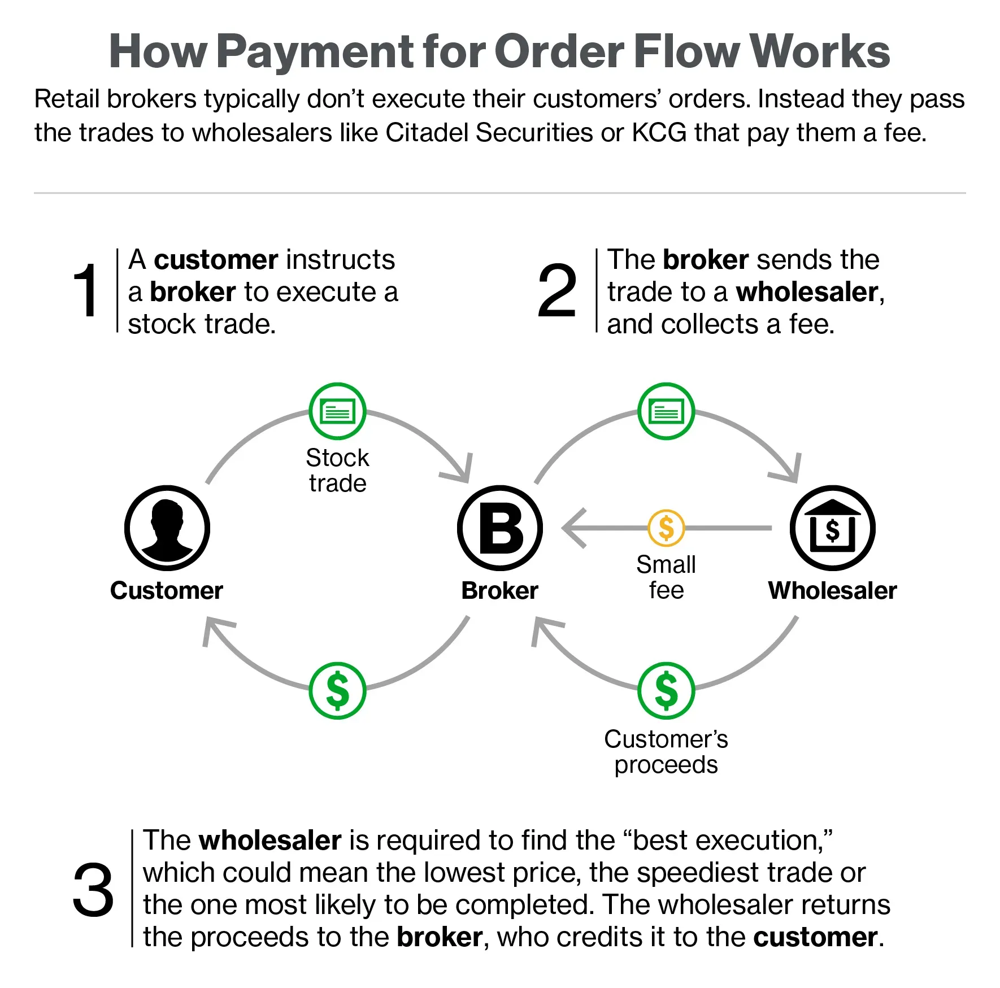

## Table of Contents

## What is Payment for Order Flow (PFOF)?

Payment for Order Flow (PFOF) is when a broker gets paid for sending their clients' buy or sell orders to a market maker or another firm instead of sending them directly to a stock exchange. The market maker or firm then executes the trade and makes money from the difference between the buy and sell prices. This practice is common in the United States and helps brokers offer services at lower or no cost to their clients.

PFOF can be good for investors because it can lower trading costs. However, it can also lead to conflicts of interest. Brokers might choose to send orders to the firm that pays them the most, not the one that gives the best price for the client. This means that while investors might save on fees, they might not always get the best possible price for their trades. It's important for investors to understand how their brokers handle their orders.

## How does Payment for Order Flow work?

Payment for Order Flow, or PFOF, is when a broker gets money for sending their clients' trade orders to a special company called a market maker instead of a stock exchange. The market maker then handles the trade and makes money from the difference between the price they buy and sell the stock. This payment helps brokers offer their services for free or at a lower cost to their clients.

While PFOF can help lower the costs for investors, it can also create problems. Sometimes, brokers might choose to send orders to the market maker that pays them the most money, not the one that gives the best price for the client. This means that even though investors might not pay fees, they might not always get the best deal on their trades. It's important for investors to know how their brokers handle their orders to make sure they are getting a fair deal.

## Who are the main participants in PFOF?

The main participants in Payment for Order Flow are brokers, market makers, and investors. Brokers are the ones who get paid for sending their clients' trade orders to market makers instead of directly to a stock exchange. Market makers are the companies that receive these orders and execute the trades. They make money from the difference between the buying and selling prices of the stocks. Investors are the clients of the brokers who want to buy or sell stocks.

Brokers benefit from PFOF because they can offer their services at a lower cost or even for free. This is because the payments they receive from market makers help cover their expenses. Market makers like PFOF because it gives them a steady flow of orders to handle, which helps them make more money. For investors, PFOF can mean lower trading costs, but it can also mean they might not always get the best price for their trades because brokers might choose the market maker that pays them the most, not the one that offers the best price for the client.

## What are the benefits of PFOF for retail investors?

Payment for Order Flow, or PFOF, can help retail investors by making trading cheaper. When brokers get paid by market makers for sending them orders, they can offer their services for free or at a lower cost. This means that retail investors don't have to pay big fees every time they want to buy or sell stocks. This can be a big help, especially for people who are just starting to invest and don't have a lot of money to spend on fees.

However, there are also some things to think about. While PFOF can save money on fees, it might not always get retail investors the best price for their trades. Sometimes, brokers might send orders to the market maker that pays them the most, not the one that gives the best price for the client. So, even though investors might save on fees, they could end up paying a bit more for the stocks they buy or getting a bit less for the stocks they sell. It's important for retail investors to understand how their brokers handle their orders to make sure they are getting a fair deal.

## What are the potential drawbacks of PFOF for retail investors?

One big problem with Payment for Order Flow, or PFOF, for retail investors is that it might not always get them the best price for their trades. When brokers send orders to market makers who pay them the most, they might not choose the market maker that offers the best price for the client. This means that even though investors might save on fees, they could end up paying more for the stocks they buy or getting less for the stocks they sell. This can add up over time and affect how much money investors make or lose.

Another issue is that PFOF can create conflicts of interest. Brokers might be more focused on getting paid by market makers than on getting the best deal for their clients. This can make it hard for retail investors to trust that their broker is always looking out for their best interests. It's important for investors to know how their brokers handle their orders and to keep an eye on whether they are getting fair prices for their trades.

## How is PFOF regulated in the United States?

In the United States, Payment for Order Flow, or PFOF, is watched over by the Securities and Exchange Commission, or SEC. The SEC makes rules to make sure that brokers who use PFOF are doing it in a fair way. They have to tell their clients about PFOF and show them how it might affect their trades. The SEC also checks to make sure that the prices retail investors get are not too different from the prices on the stock exchange.

There are also rules from the Financial Industry Regulatory Authority, or FINRA, that help keep PFOF fair. FINRA makes sure that brokers are following the SEC's rules and that they are giving their clients the best possible prices. If brokers are not following these rules, FINRA can take action against them. Even with these rules, it's still important for investors to know how their brokers handle their orders and to keep an eye on their trades to make sure they are getting a fair deal.

## What role do market makers play in PFOF?

Market makers are important in Payment for Order Flow, or PFOF, because they are the ones who get the trade orders from brokers. When a broker sends an order to a market maker instead of a stock exchange, the market maker is responsible for buying or selling the stocks. They make money from the difference between the price they buy and sell the stocks. This is called the bid-ask spread. Market makers like PFOF because it gives them a steady flow of orders to handle, which helps them make more money.

But, market makers also pay brokers for sending them these orders. This payment is what makes PFOF work. It helps brokers offer their services for free or at a lower cost to their clients. For market makers, this payment is like a cost of doing business because it helps them get more orders to trade. But it can also lead to problems if brokers choose to send orders to the market maker that pays them the most, not the one that gives the best price for the client.

## How does PFOF impact the execution quality of trades?

Payment for Order Flow, or PFOF, can affect how well trades are done. When brokers send orders to market makers who pay them the most, they might not always choose the market maker that gives the best price for the client. This means that even though investors might save on fees, they could end up paying more for the stocks they buy or getting less for the stocks they sell. This can make a difference in how good the trade is, because getting the best price is important for making or saving money.

Even though PFOF can lower trading costs, it can also create problems with how trades are handled. If brokers are more focused on getting paid by market makers than on getting the best deal for their clients, it can lead to lower quality trades. This is why it's important for investors to know how their brokers handle their orders and to check if they are getting fair prices for their trades.

## Can PFOF lead to conflicts of interest?

Yes, Payment for Order Flow, or PFOF, can lead to conflicts of interest. When brokers get paid by market makers for sending them orders, they might choose the market maker that pays them the most money instead of the one that gives the best price for their clients. This means that brokers might not always do what's best for their clients because they want to make more money from the market makers.

This conflict can make it hard for investors to trust their brokers. If brokers are more focused on getting paid than on getting the best deal for their clients, it can affect how well the trades are done. It's important for investors to know how their brokers handle their orders and to keep an eye on whether they are getting fair prices for their trades.

## How do different countries regulate PFOF?

In the United States, the Securities and Exchange Commission, or SEC, and the Financial Industry Regulatory Authority, or FINRA, keep an eye on Payment for Order Flow, or PFOF. The SEC makes rules to make sure brokers tell their clients about PFOF and show how it might affect their trades. FINRA checks to make sure brokers follow these rules and give their clients the best possible prices. Even with these rules, it's still important for investors to know how their brokers handle their orders.

In the European Union, PFOF is not allowed for shares. The rules say that brokers must send orders to the place that gives the best price for their clients. This is to make sure there are no conflicts of interest and that investors always get the best deal. In Canada, PFOF is allowed but it's watched closely to make sure it's fair. Brokers have to tell their clients about PFOF and make sure they are getting good prices for their trades.

## What are the recent trends and developments in PFOF?

Recently, there has been a lot of talk about Payment for Order Flow, or PFOF. One big change is that more people are using trading apps like Robinhood, which use PFOF to offer free trades. This has made PFOF more popular, but it has also made people worry more about whether it's fair. Some people think that PFOF can lead to bad deals for investors because brokers might choose the market maker that pays them the most, not the one that gives the best price for their clients.

Another trend is that rules about PFOF are changing in some places. In the United States, the SEC is looking at new ways to make sure PFOF is fair. They want to make sure that investors always get the best prices for their trades, even if brokers are getting paid by market makers. In the European Union, PFOF is not allowed for shares anymore, which means brokers have to send orders to the place that gives the best price for their clients. These changes show that people are trying to make sure PFOF works well for everyone.

## How might future regulations affect the practice of PFOF?

Future regulations could change how Payment for Order Flow, or PFOF, works. In the United States, the SEC might make new rules to make sure that investors always get the best prices for their trades, even if brokers are getting paid by market makers. This could mean that brokers have to be more careful about where they send orders and make sure they are choosing the best place for their clients, not just the one that pays them the most. If these rules happen, PFOF might become less common or change how it works to make it fairer for everyone.

In other places like the European Union, PFOF is already not allowed for shares. This means that brokers have to send orders to the place that gives the best price for their clients. If more countries start to follow this rule, PFOF might go away in those places. This could make trading more expensive for investors because brokers might have to charge more if they can't get paid by market makers. But it could also make sure that investors always get the best deal on their trades, which is good for them in the long run.

## References & Further Reading

[1]: ["Payment for Order Flow in the United States"](https://www.forbes.com/advisor/investing/payment-for-order-flow/) by Larry Harris. Journal of Financial Markets, 1997.

[2]: Tabb, L. (2021). ["The True Cost of 'Free' Trading: Understanding Payment for Order Flow."](https://www.rockefellerfoundation.org/report/true-cost-of-food-measuring-what-matters-to-transform-the-u-s-food-system/)

[3]: O'Hara, M., & Ye, M. (2011). ["Is Market Fragmentation Harming Market Quality?"](https://www.sciencedirect.com/science/article/pii/S0304405X11000390) Journal of Financial Economics.

[4]: Securities and Exchange Commission. (2022). ["Staff Report on Equity and Options Market Structure Conditions in Early 2021."](https://www.sec.gov/files/staff-report-equity-options-market-struction-conditions-early-2021.pdf)

[5]: Griffin, J. M., & Ozdogan, A. (2021). ["High-Frequency Trading, Payment for Order Flow, and Small Retail Investor Execution Cost."](https://scholar.google.com/citations?user=KynkZCIAAAAJ)