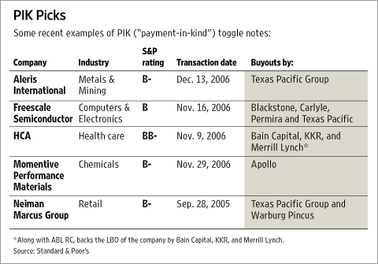

In the world of bond investments, Payment-In-Kind (PIK) bonds present a unique proposition. These securities distinguish themselves by offering a creative form of interest payment, wherein companies issue additional bonds instead of paying cash to cover interest obligations. This alternative structure can be particularly vital for companies experiencing financial distress, as it allows them to conserve cash during challenging times.

However, like any investment, PIK bonds carry their own set of advantages and risks. From the perspective of the issuer, PIK bonds facilitate immediate cash flow relief, providing crucial time and resources to stabilize or expand operations. For investors, they offer the allure of higher yields compared to traditional bonds, attracting those willing to accept higher risk for potentially greater returns. Yet, the deferred nature of payments and increased debt obligations elevate the default risk, necessitating thorough due diligence and risk assessment by investors.



This article will explore the specifics of PIK bonds, examining their benefits and drawbacks. Additionally, the role of PIK bonds within the domain of algorithmic trading will be discussed, highlighting how advanced trading systems can optimize investment strategies for these high-yield instruments.

## Table of Contents

## What Are Payment-In-Kind (PIK) Bonds?

Payment-In-Kind (PIK) bonds are a distinct class of deferred coupon bonds in which the interest payments are made by issuing additional bonds rather than cash. This atypical approach allows issuers, frequently companies experiencing financial strain, to conserve cash flow while managing their existing obligations. By issuing additional bonds as interest, companies benefit from deferred cash expenses, which can be crucial during challenging financial periods.

PIK bonds are predominantly issued by companies facing financial difficulties, aiming to navigate cash flow challenges without sacrificing necessary operational liquidity. This makes them an attractive instrument for these companies as they work towards financial recovery or restructuring. 

For investors, particularly institutional ones, PIK bonds present an opportunity to achieve higher yields, albeit with accompanying risks. The deferred nature of cash payments tends to be offset by offering a premium yield. This higher yield compensates for the additional risk associated with the issuer's financial instability and the potential accounting complexities of managing interest in the form of additional securities rather than cash.

Overall, PIK bonds offer a sophisticated investment alternative, providing both companies and investors with strategic benefits and challenges. They require careful consideration of the issuer's creditworthiness and the wider economic context, ensuring that the anticipated rewards justify the inherent risks.

## How Do PIK Bonds Work?

Payment-In-Kind (PIK) bonds defer cash interest payments until maturity by compensating investors with additional bonds instead of cash. This process effectively allows issuers to accumulate interest liabilities over time without immediate cash outflows. By issuing more bonds in lieu of current interest payments, companies can preserve [liquidity](/wiki/liquidity-risk-premium), a crucial advantage for those experiencing financial constraints or requiring capital reallocation to other operational needs.

The mechanism of PIK bonds involves a compound-like structure where interest is capitalized and reflected in the increased amount of bond principal over time. For instance, if a $1,000 PIK bond with a 10% [interest rate](/wiki/interest-rate-trading-strategies) does not pay cash interest annually, it will instead issue an additional $100 in bond face value each year. At the end of the first year, the bondholder would hold $1,100 in PIK bond principal. At maturity, the cumulative principal — original plus the accrued additional amounts — is repaid in full. 

This increased bond issuance, however, introduces both opportunities and risks. Financially, it offers companies a tool to manage liquidity shortages by delaying cash expenditure. Yet, by raising the total debt obligation as interest rolls into the principal, it escalates financial leverage. New bond issuances could potentially dilute existing equity value, and, more critically, increase the likelihood of financial distress or default if the issuer cannot meet the lump-sum payment at maturity.

In summary, PIK bonds provide an innovative means for companies to delay cash payments, making them attractive to certain investors seeking higher potential yields. Yet, the implications for corporate leverage and investor risk profiles are substantial, requiring careful consideration.

## Comparison: PIK Bonds vs. Regular Bonds

Regular bonds are a foundational element of the fixed-income market, offering predictable cash interest payments to investors at specified intervals, typically semi-annually or annually. This predictability affords investors a stable stream of income, allowing for effective cash flow management. The fundamental nature of these bonds centers on their clear and straightforward payment structure, minimizing uncertainty and providing a more secure investment option for risk-averse investors.

In contrast, Payment-In-Kind (PIK) bonds present a different financial architecture. Instead of traditional cash interest payments, PIK bonds enhance an investor's holdings by issuing additional bonds as interest. This approach leads to higher yields due to the compounding effect of reinvested interest payments, albeit with deferred cash benefits. The underlying appeal of PIK bonds primarily lies in their potentially higher returns, which can be attractive in comparison to regular bonds, particularly during periods of low interest rates.

Investors must consider the risk profiles associated with each type of bond. Regular bonds are typically backed by the issuer’s general creditworthiness and, in some cases, specific assets, offering relatively low default risk. They provide investors with certainty about income streams and principal repayment, making them a stable investment choice.

PIK bonds, however, come with heightened risk, as they are often issued by companies experiencing financial challenges or growth phases that require cash conservation. The deferral of cash payments implies that investors are exposed to a higher default risk, because if the issuing company’s financial situation worsens, it may struggle to meet its growing debt obligations at maturity. Therefore, while PIK bonds can offer attractive yields, they demand a comprehensive assessment of the issuer's financial health and prospects.

In summary, the selection between PIK bonds and regular bonds hinges on the investor’s risk tolerance and income requirements. Investors seeking regular and predictable income streams will likely favor traditional bonds. Conversely, those who can accommodate higher risk for the potential of elevated returns might find PIK bonds appealing, despite their inherent uncertainties.

## Advantages and Disadvantages of PIK Bonds

Payment-In-Kind (PIK) bonds offer several advantages, particularly for issuing companies and investors seeking higher yields. By allowing companies to preserve cash, PIK bonds provide financial flexibility, enabling companies to allocate cash resources to other strategic needs, such as operations, expansions, or debt restructuring. This can be especially beneficial for companies undergoing periods of financial distress or those in capital-intensive industries.

From an investor's perspective, PIK bonds are attractive because they typically offer higher yields compared to regular bonds. The higher yields serve as compensation for the increased risk that investors assume, given that interest payments are deferred and paid in additional bonds rather than cash. This structure appeals to institutional investors with a higher risk tolerance and a focus on potential capital appreciation.

However, PIK bonds come with significant drawbacks. The primary disadvantage is the increase in debt obligations. As companies issue additional bonds as interest payments, their overall debt burden grows, potentially leading to elevated leverage ratios. This situation raises the company's credit risk, increasing the likelihood of default, especially for companies already experiencing financial difficulty.

For investors, PIK bonds are not ideal for those seeking regular income. Traditional bond investors expect periodic cash flows to meet income needs or reinvestment strategies. Given that PIK bond interest is paid in additional securities rather than cash, investors may face challenges in realizing liquidity or meeting cash flow requirements from their investments.

The higher default risk associated with PIK bonds is another concern for investors. Companies that resort to issuing PIK bonds often do so during financial constraints, which can lead to an increased risk of not meeting their long-term debt obligations. As a result, investors must conduct thorough due diligence and risk assessment before investing in PIK bonds. This involves analyzing the issuer's financial health, understanding industry dynamics, and calculating potential risks.

In summary, while PIK bonds can provide distinct benefits, they demand careful consideration of their risks by both issuers and investors. The decision to engage with PIK bonds should be informed by a comprehensive analysis of how these securities fit into the overarching investment strategy and risk appetite.

## The Role of Algorithmic Trading in PIK Bonds

Algorithmic trading plays a significant role in the management and optimization of Payment-In-Kind (PIK) bond investments. By leveraging advanced computational algorithms, traders can exploit market inefficiencies and identify lucrative opportunities within the complex landscape of PIK bonds. These automated systems utilize vast amounts of data to perform analyses that inform trading decisions, thereby offering a competitive edge to investors.

One of the primary advantages of [algorithmic trading](/wiki/algorithmic-trading) in the context of PIK bonds is its ability to process large volumes of market data with speed and precision. This capability allows traders to detect price discrepancies and trends that may not be immediately apparent to human analysts. For instance, algorithms can evaluate credit spreads, liquidity metrics, and interest rate movements—all crucial factors influencing PIK bond valuations. By continuously monitoring these variables, automated systems can execute trades at optimal times, potentially enhancing returns.

Moreover, algorithmic trading systems can incorporate sophisticated quantitative models to assess the risk profile of PIK bonds. Given that these bonds often originate from financially distressed companies with heightened default risk, advanced risk assessment models are invaluable. Techniques such as Monte Carlo simulations or Value-at-Risk (VaR) calculations allow algorithms to estimate potential losses and devise strategies to mitigate them effectively. This risk management capability is especially crucial as PIK bonds inherently [carry](/wiki/carry-trading) a higher probability of default compared to traditional bonds.

Python, as a programming language, offers a robust environment for developing and deploying algorithmic trading strategies. Libraries such as NumPy, pandas, and scikit-learn provide tools for data manipulation and [machine learning](/wiki/machine-learning), facilitating the creation of predictive models that enhance decision-making.

```python
import numpy as np
import pandas as pd
from sklearn.linear_model import LinearRegression

# Sample data: Historical bond prices and interest rates
data = pd.DataFrame({
    'bond_price': [100, 101.5, 102, 103, 104.5],
    'interest_rate': [0.02, 0.021, 0.022, 0.023, 0.024]
})

# Preparing data for a simple linear regression model
X = data['interest_rate'].values.reshape(-1, 1)
y = data['bond_price'].values

# Fit model
model = LinearRegression()
model.fit(X, y)

# Predict future bond price based on interest rate trend
predicted_price = model.predict(np.array([[0.025]]))
print(f"Predicted bond price with 2.5% interest rate: {predicted_price[0]:.2f}")
```

While algorithmic trading provides numerous advantages, its application within the PIK bond market requires carefully crafted algorithms to address the securities' inherent risks. The complexity and [volatility](/wiki/volatility-trading-strategies) associated with distressed assets necessitate robust models capable of adapting to rapidly changing market conditions. Consequently, successful deployment of algorithmic systems in this domain relies heavily on expertise in both financial markets and advanced computational techniques. 

In summary, while the deployment of algorithmic trading in PIK bond markets offers substantial potential, it demands sophisticated systems and strategies to navigate the high risks endemic to these financial instruments.

## Conclusion

Payment-In-Kind (PIK) bonds present a niche yet compelling prospect for experienced investors looking to diversify their investment portfolios. These bonds provide financially distressed companies with a mechanism to navigate immediate cash flow challenges by deferring cash interest payments. Instead, interest is paid through the issuance of additional bonds. For companies, this strategy can be critical for preserving liquidity and potentially averting crises.

However, the high-risk profile intrinsic to PIK bonds cannot be overlooked. They often come from companies facing significant financial hurdles, inherently increasing the likelihood of default. Investors must, therefore, conduct thorough due diligence, evaluating the issuing company’s financial health and market conditions before investment. These securities are not suitable for those seeking stable, regular income due to the deferred and non-cash nature of interest payments.

Algorithmic trading introduces a new dynamic to investing in PIK bonds. Traders can deploy sophisticated algorithms to track price inefficiencies and trends, offering potentially substantial returns. Automated systems can optimize decision-making processes, adjusting PIK bond portfolios based on real-time data. Nevertheless, the fluctuating nature and elevated default risk associated with PIK bonds necessitate advanced algorithms capable of mitigating these hazards.

In summary, PIK bonds hold potential for high rewards but require cautious and informed strategies. Investors and algorithmic traders can benefit from the unique advantages these securities offer, provided they possess the acumen to navigate the complex risk landscape.

## FAQs

### What factors should investors consider when investing in PIK bonds?

Investors should evaluate several key factors when considering Payment-In-Kind (PIK) bonds. Firstly, the creditworthiness of the issuer is paramount; companies issuing PIK bonds are often experiencing financial distress, posing a higher default risk. Therefore, a thorough analysis of the issuer’s financial health and future cash flow projections is essential. Additionally, the maturity and terms of the PIK bonds should align with the investor’s risk tolerance and investment horizon. PIK bonds typically offer higher yields to compensate for increased risk, so investors must weigh this against potential volatility in market conditions.

Moreover, the macroeconomic environment can significantly impact the issuer's ability to meet obligations. Economic downturns can exacerbate the financial challenges faced by issuers, potentially increasing the risk of default. Lastly, investors should consider the bond's liquidity; PIK bonds may not be as easily traded as regular bonds, affecting pricing and [exit](/wiki/exit-strategy) strategies.

### How does the taxation of PIK bond interest work?

Taxation of PIK bond interest can be intricate due to the nature of their interest payments. Interest on PIK bonds is typically taxed as income in the year it accrues, even though the interest is not received in cash but in the form of additional bonds. This creates a scenario where investors have a tax liability without an equivalent cash flow to cover it, which is commonly referred to as "phantom income." Investors should consult tax professionals to navigate the specific implications and possible strategies for mitigating these tax obligations.

### Are there any notable historical examples of PIK bond investments yielding significant returns?

There have been instances where PIK bonds have achieved notable returns, primarily when the issuing companies successfully navigate their distress and move towards financial stability. For example, during the early 2000s, some private equity-backed transactions utilized PIK financing structures that delivered attractive returns as the target companies improved operationally and financially. Additionally, certain PIK toggle notes, which give issuers the option to pay interest in either cash or additional securities, have benefited from favorable market conditions that drove significant returns. However, these cases are balanced by the inherent risk associated with investing in distressed securities, which underlines the importance of high-risk tolerance and thorough due diligence.

## References & Further Reading

[1]: ["The 2023-2025 Outlook for PIK Bonds and Related Instruments"](https://www.investopedia.com/terms/p/paymentinkindbond.asp) by Investopedia

[2]: Fabozzi, F. J. (2007). ["Fixed Income Analysis, Second Edition"](https://books.google.com/books/about/Fixed_Income_Analysis.html?id=lujLawVLS3YC). Wiley.

[3]: ["High Yield Debt: An Insider's Guide to the Marketplace"](https://www.amazon.com/High-Yield-Debt-Insiders-Marketplace/dp/1119134412) by Marwan Marshi & Tammie Arnold

[4]: ["Algorithmic Trading and DMA: An Introduction to Direct Access Trading Strategies"](https://www.semanticscholar.org/paper/Algorithmic-trading-%26-DMA-%3A-an-introduction-to-Johnson/aa5de1ab883d5e23b6651faa7c1807586d688e4b) by Barry Johnson

[5]: ["Handbook of Fixed-Income Securities, Eighth Edition"](https://www.amazon.com/Handbook-Fixed-Income-Securities-Eighth/dp/0071768467) by Frank J. Fabozzi

[6]: ["Payment-in-Kind Bonds: Risks and Opportunities"](https://accountinginsights.org/understanding-payment-in-kind-pik-types-taxes-and-risks/) by PIMCO

[7]: ["Advancing PIK Bond Analysis with Algorithmic Trading Strategies"](https://www.investopedia.com/articles/active-trading/101014/basics-algorithmic-trading-concepts-and-examples.asp) by InvestmentBank.com