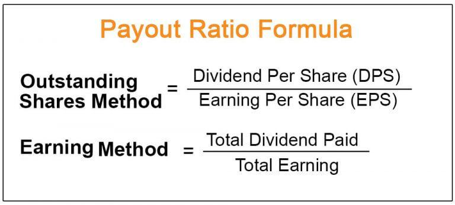

Understanding key financial metrics is essential for making informed investment decisions. Among these metrics, dividends and the payout ratio play a significant role. Dividends represent portions of a company's earnings distributed to shareholders, serving as a reward for their investment. The payout ratio, conversely, is a financial metric that evaluates the sustainability of a company’s dividend payments by expressing what percentage of earnings are paid out as dividends versus retained in the business. These metrics not only provide insights into a company’s financial health but also its commitment to returning value to shareholders.

In modern investing strategies, algorithmic trading has emerged as a vital tool, particularly in the optimization of dividend-focused strategies. By incorporating financial metrics like the payout ratio, algorithmic trading can enhance investment outcomes through real-time data analysis and automated trading decisions. This integration of technology and data means both seasoned investors and newcomers can potentially improve their investment strategies and performance.



With a deeper understanding of how payout ratios mirror a company's dividend policies, investors can better navigate both manual and algorithmic trading contexts. This insight is crucial as it aligns investment choices with personal financial goals, whether through stable income generation or growth-focused endeavors. Ultimately, an appreciation for these financial metrics and their implications lays the groundwork for more strategic investment decisions in the evolving landscape of finance and investing.

## Table of Contents

## Understanding Dividends and Payout Ratios

Dividends represent a portion of a company's earnings that are distributed to shareholders as a reward for their investment. These distributions can be issued in the form of cash payments, additional shares of stock, or other property. The primary purpose of dividends is to provide shareholders with a return on their investment in the company, reflecting the company's profitability and financial health. Companies that consistently pay dividends often attract investors seeking steady income streams.

The payout ratio, also known as the dividend payout ratio, is a key financial metric that evaluates the sustainability of a company's dividend payments. It is expressed as a percentage that illustrates what portion of a company's earnings is distributed as dividends compared to what is retained for future growth or debt repayment. The formula to calculate the payout ratio is:

$$
\text{Payout Ratio} = \left( \frac{\text{Dividends Paid}}{\text{Net Income}} \right) \times 100
$$

Alternatively, it can also be calculated using per-share metrics:

$$
\text{Payout Ratio} = \left( \frac{\text{Dividends Per Share (DPS)}}{\text{Earnings Per Share (EPS)}} \right) \times 100
$$

A low payout ratio may indicate that the company is prioritizing reinvestment of its earnings into operations, research and development, or expansion projects, which can be appealing to growth-focused investors. This approach suggests that the company has ample opportunities for growth and aims to increase shareholder value through capital appreciation rather than immediate returns.

Conversely, a high payout ratio often signals that a mature company is returning a significant portion of its earnings to shareholders in the form of dividends. Such companies may have fewer opportunities for profitable reinvestment and, therefore, prioritize providing immediate returns to their investors. While this can attract income-focused investors who seek regular income from their investments, it might raise concerns about the company's potential for future growth if earnings are not sufficiently reinvested.

Investors utilize the payout ratio to assess a company's financial health and its commitment to providing returns. Stable payout ratios over time can indicate the reliability of the company's dividend policy, reassuring investors of consistent returns. On the other hand, fluctuating payout ratios might signal financial instability or a shift in the company's strategic priorities, necessitating a closer examination of the underlying factors influencing these changes. 

In summary, understanding dividends and payout ratios helps investors evaluate a company's financial strategies and determine whether those align with their investment goals, whether it's income generation or growth potential.

## Key Components of the Payout Ratio

Dividends Per Share (DPS) represents the actual payment made to shareholders, calculated on a per-share basis. This metric indicates how much cash a shareholder receives for each share owned. For example, if a company declares a total dividend of $1 million and has 500,000 outstanding shares, the DPS would be:

$$
\text{DPS} = \frac{\text{Total Dividends Paid}}{\text{Total Shares Outstanding}} = \frac{1,000,000}{500,000} = 2
$$

Earnings Per Share (EPS) is the portion of a company’s profit attributed to each outstanding share. It is a critical indicator of a company’s profitability and financial health. EPS is calculated using the formula:

$$
\text{EPS} = \frac{\text{Net Income} - \text{Dividends on Preferred Stock}}{\text{Average Outstanding Shares}}
$$

This distinction is important because preferred dividends are paid out before calculating EPS for common shareholders.

The payout ratio, primarily expressed as a percentage, gives investors insight into how a company manages its earnings. It can be calculated using two primary methods: dividing the Total Dividends Paid by Net Income or using the relationship between DPS and EPS:

$$
\text{Dividend Payout Ratio (DPR)} = \frac{\text{Total Dividends Paid}}{\text{Net Income}}
$$

Alternatively:

$$
\text{DPR} = \frac{\text{DPS}}{\text{EPS}}
$$

Both methods result in the same ratio, illustrating how much of the company's earnings are returned to shareholders as dividends. This relationship between DPS and EPS assesses the proportion of profits distributed as dividends versus retained within the company for growth and reinvestment.

Understanding the interaction between DPS and EPS allows investors to evaluate a company's dividend policy. A higher DPS relative to EPS might indicate a mature company focusing on rewarding shareholders, while a lower ratio may suggest the company is reinvesting in growth opportunities. This is crucial for assessing the financial health and strategic direction of a company from an investor's perspective.

## Implications for Investment Decisions

The payout ratio serves as a critical indicator of a company's capacity to maintain its dividend payments and reflects its overall financial health. For income-focused investors, seeking reliable and consistent returns, a stable payout ratio is especially significant. It suggests that the company is not only capable of generating sufficient profits to cover its dividends but is also maintaining this capability over time. Such stability provides assurance of predictable income streams, which is highly valued by investors who depend on dividends for regular income.

On the other hand, a high payout ratio might signal caution for investors with growth-oriented strategies. While it indicates that a substantial portion of earnings is being distributed to shareholders, it might also imply that the company has limited funds available for reinvestment in growth opportunities. This could be detrimental to long-term expansion and innovation, thus possibly restraining future stock price appreciation. Growth investors often prioritize companies that reinvest earnings to fuel their expansion and enhance business prospects, rather than those that distribute a large portion of earnings as dividends.

The strategic setting of dividend rates is a delicate balance, impacting both stock market perception and investor sentiment. A company with a well-calibrated payout policy can bolster investor confidence and attract a stable shareholder base. Conversely, unexpected changes in the payout ratio—such as sudden increases or decreases—can alter market perceptions and lead to [volatility](/wiki/volatility-trading-strategies) in stock prices. An optimal payout ratio reflects prudent financial management, aligning with the company's long-term goals and investor expectations. 

Ultimately, understanding the implications of the payout ratio aids investors in evaluating whether a company's dividend policy aligns with their investment objectives, whether those objectives are income stability or growth potential. This insight is essential for making informed investment decisions that align with personal financial goals.

## Role of Algorithmic Trading in Analyzing Dividends

Algorithmic trading utilizes advanced computational models to inform investment decisions, integrating key financial metrics such as the payout ratio. This technique enables the analysis and selection of stocks based on quantifiable criteria, enhancing both risk assessment and forecasting capabilities. 

Quantitative algorithms in [algorithmic trading](/wiki/algorithmic-trading) can efficiently screen large sets of stocks by evaluating their payout ratios. This screening process aids traders in identifying companies with financially sustainable dividend policies, aligning with their investing criteria, whether it be for income generation or long-term growth. By focusing on payout ratios, algorithms can discard stocks with unfavorable financial health or unsustainable dividend practices, thus refining the investment pool.

Historical data on payout ratios plays a critical role in algorithmic trading, particularly in the context of [machine learning](/wiki/machine-learning) models. By analyzing past payouts, traders can infer patterns and trends that may inform future stock performance. Machine learning models can be trained on this historical data, allowing predictions regarding a company's ability to maintain or alter its dividend payouts. Improved prediction models offer traders a strategic advantage, as they can more accurately anticipate shifts in dividend policies and make informed decisions accordingly.

Real-time data analysis is another significant advantage of algorithmic trading when analyzing dividends. Automated systems can continuously monitor payout ratios and other financial indicators, instantly executing trades based on predefined criteria. This ability to react swiftly to financial updates presents a competitive edge, particularly in volatile markets where timeliness is crucial. Automated trades reduce human error and emotional biases, relying solely on data-driven insights to optimize portfolio performance.

Incorporating dividend analysis into algorithmic trading strategies exemplifies the growing trend toward data-driven investing, where the integration of financial metrics such as payout ratios into algorithmic processes offers potential for enhanced performance and strategic alignment with individual investment goals.

## Using Python to Calculate the Payout Ratio in Algotrading

Python offers powerful tools and libraries that facilitate the calculation of financial metrics like the payout ratio, key to developing and optimizing algorithmic trading strategies. One of the most valuable libraries for this purpose is `yfinance`, which allows users to access financial data seamlessly.

To calculate the payout ratio using Python, the following steps can be performed:

1. **Fetching Data**: Using `yfinance`, users can retrieve real-time or historical data for stocks. This data includes essential financial metrics such as dividends per share (DPS) and earnings per share (EPS), which are crucial for calculating the payout ratio.

2. **Performing Calculations**: Once the data is fetched, Python can be employed to perform the necessary calculations. The formula for the payout ratio is:
$$
   \text{Payout Ratio} = \left(\frac{\text{DPS}}{\text{EPS}}\right) \times 100

$$

   This formula helps determine the percentage of earnings distributed to shareholders as dividends.

3. **Python Code Example**:

   To illustrate, consider the following Python code snippet that uses `yfinance`:

   ```python
   import yfinance as yf

   # Define the stock ticker
   ticker = "AAPL"

   # Fetch the stock data
   stock = yf.Ticker(ticker)

   # Get the dividends and EPS from the financials
   dividends = stock.dividends
   financials = stock.financials.loc[:, 'Net Income'].dropna()

   # Calculate Dividends Per Share (DPS) for the latest dividend
   latest_dividend = dividends[-1]
   shares_outstanding = stock.info['sharesOutstanding']
   DPS = latest_dividend / shares_outstanding

   # Calculate Earnings Per Share (EPS)
   latest_net_income = financials[-1]
   EPS = latest_net_income / shares_outstanding

   # Calculate the Payout Ratio
   payout_ratio = (DPS / EPS) * 100
   print(f"The Payout Ratio is: {payout_ratio:.2f}%")
   ```

   This example demonstrates how to calculate the payout ratio by first obtaining the necessary financial data, then applying the formula within a Python script.

4. **Insights for Trading Strategies**: By automating these calculations, traders can quickly analyze multiple stocks, identify investment opportunities, and make informed decisions. This capability effectively integrates dividend insights into broader trading strategies, offering algorithmic traders an advantage in fast-paced financial markets.

Python's versatility and the comprehensive data provided by libraries such as `yfinance` highlight its potency as a tool in algorithmic trading, particularly in the context of dividend-focused strategies.

## Conclusion

Understanding the payout ratio and its implications can significantly enhance an investor's ability to analyze a company's financial practices and its ability to sustain dividend payments. By examining the proportion of earnings that a company allocates to dividends versus retained earnings, both manual and algorithmic traders can derive valuable insights into the company's priorities and financial health.

For algorithmic traders, incorporating dividend metrics like payout ratios into trading strategies can provide a more detailed understanding of a company's operational stability and future growth prospects. Integrating this data into computational models allows for more nuanced and robust strategies, leveraging historical patterns and real-time analytics to anticipate market movements and optimize investment outcomes. For example, by using historical data to train machine learning models, traders can predict future stock performance with greater accuracy.

The trend toward automation and data-driven technologies underscores the future of investing. With the advent of sophisticated algorithmic trading systems, investors can now conduct real-time analyses and execute trades automatically, harnessing computational power to process large volumes of financial data swiftly.

Ultimately, understanding the payout ratio benefits both investors and algorithmic traders by providing a clear picture of a company's dividend policy and overall financial health. By incorporating this understanding into their strategies, investors can make more informed decisions, optimizing their financial outcomes while navigating the complexities of the modern market landscape. Embracing these insights and technological advancements positions traders and investors to better adapt and thrive in an increasingly data-centric investment environment.

## References & Further Reading

[1]: Bhattacharyya, S. (2010). ["Dividends and Payout Ratios: A Study of the Financial Sector"](https://www.semanticscholar.org/paper/Dividend-Payout-and-Executive-Compensation%3A-Theory-Bhattacharyya-Morrill/dc9863c273cdd59f1dd3baacdf8a17e012ee610b). In: Intelligent Enterprises of the 21st Century, Springer.

[2]: ["Advances in Financial Machine Learning"](https://www.amazon.com/Advances-Financial-Machine-Learning-Marcos/dp/1119482089) by Marcos Lopez de Prado

[3]: ["Quantitative Trading: How to Build Your Own Algorithmic Trading Business"](https://www.amazon.com/Quantitative-Trading-Build-Algorithmic-Business/dp/1119800064) by Ernest P. Chan

[4]: Jansen, S. (2020). ["Machine Learning for Algorithmic Trading"](https://github.com/stefan-jansen/machine-learning-for-trading). Packt Publishing.

[5]: Gitman, L.J., & Zutter, C.J. (2017). ["Principles of Managerial Finance"](https://books.google.com/books/about/Principles_of_Managerial_Finance.html?id=tx2-ngEACAAJ). Pearson.