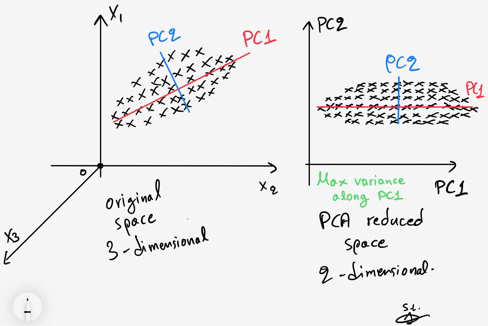

## Table of Contents

## What is Principal Component Analysis (PCA)?

Principal Component Analysis (PCA) is a way to simplify complex data. Imagine you have a lot of information, like measurements of different things. PCA helps you find the most important parts of this information, called principal components. These components are new ways of looking at your data that show the biggest differences or patterns. By using PCA, you can reduce the number of variables you need to look at, making it easier to understand and work with your data.

Think of PCA like trying to summarize a long book. Instead of reading every page, you might focus on the main ideas or themes. In the same way, PCA takes your data and finds the main "themes" or patterns. It does this by creating new variables, the principal components, which are combinations of the original data. These components are ordered so that the first one shows the largest variation in the data, the second one shows the next largest, and so on. This helps you see what's most important in your data without getting lost in all the details.

## What are the main applications of PCA?

PCA is used in many areas to make data easier to understand and work with. One common use is in data visualization. When you have a lot of variables, it can be hard to see what's going on. PCA helps by turning those variables into a smaller set of new variables, called principal components. This makes it easier to plot the data and see patterns or trends that might be hidden otherwise. For example, if you're studying different types of flowers, PCA can help you see how they group together based on their features, like petal length and width.

Another important use of PCA is in reducing the number of variables in a dataset, which is called dimensionality reduction. This is helpful when you want to build models or do other types of analysis. By using fewer variables, you can make your models simpler and faster to run, and sometimes even more accurate. For instance, in face recognition technology, PCA can take all the pixels in a face image and turn them into a smaller set of features that still capture what makes each face unique. This makes it easier for computers to recognize and match faces.

PCA is also used in noise filtering and data compression. In fields like signal processing, PCA can help separate the important parts of a signal from the background noise. This is useful in things like audio or image processing, where you want to clean up the data to focus on what's important. Similarly, PCA can be used to compress data, making it smaller and easier to store or send. This is helpful in many areas, from saving space on your computer to transmitting data over the internet more efficiently.

## How does PCA help in reducing the dimensionality of data?

PCA helps in reducing the dimensionality of data by finding new ways to look at the data that capture the most important information in fewer variables. Imagine you have a lot of different measurements about something, like the size and shape of different fruits. Instead of using all these measurements, PCA creates new variables called principal components. These components are combinations of the original measurements, and they are ordered so that the first one shows the biggest differences in the data, the second one shows the next biggest, and so on. By using just the first few principal components, you can keep most of the important information but with fewer variables.

For example, if you're studying different types of fruits, you might start with measurements like weight, length, width, and color. This gives you four variables, which can be hard to work with. PCA can take these four variables and turn them into new variables, where the first principal component might show the overall size of the fruit, and the second might show the shape. If these two components capture most of the differences between the fruits, you can now work with just these two variables instead of four. This makes your data easier to understand and use, without losing much important information.

## What are the steps involved in performing PCA?

To perform PCA, you first need to get your data ready. This means making sure all your measurements are on the same scale, so one doesn't overpower the others. You do this by subtracting the average value of each measurement from all the data points and then dividing by the standard deviation. This step is called standardization. Once your data is standardized, you can start finding the principal components. You do this by looking at how all your measurements relate to each other and figuring out the directions in which the data varies the most. These directions are your principal components.

After finding the principal components, you need to decide how many to keep. You usually keep the ones that capture most of the variation in your data. This means you might keep the first few components if they explain a lot of the differences in your data. Once you've chosen your components, you can transform your original data into this new set of variables. This is done by multiplying your standardized data by the principal components. The result is a new dataset with fewer variables that still holds most of the important information from your original data. This new dataset is easier to work with and analyze.

## How do you calculate the principal components in PCA?

To calculate the principal components in PCA, you start by turning your data into a matrix where each row is a different observation and each column is a different variable. You then standardize this data by subtracting the mean of each column from all the values in that column and dividing by the standard deviation. This makes sure all your variables are on the same scale. Next, you find the covariance matrix of your standardized data. The covariance matrix shows how all the variables relate to each other. From this matrix, you find the eigenvalues and eigenvectors. The eigenvectors are the directions of the principal components, and the eigenvalues tell you how important each component is.

Once you have the eigenvectors and eigenvalues, you sort them in order of the eigenvalues from highest to lowest. The eigenvector with the highest eigenvalue is your first principal component, the one with the next highest eigenvalue is your second principal component, and so on. To get your new dataset in terms of these principal components, you multiply your standardized data by the eigenvectors. This gives you a new set of variables that are combinations of your original data, but now they're ordered by how much variation they capture. By keeping only the first few principal components, you can reduce the number of variables while still keeping most of the important information in your data.

## What is the significance of eigenvalues and eigenvectors in PCA?

In PCA, eigenvalues and eigenvectors are super important because they help us find the principal components. Think of eigenvectors as the directions in which your data changes the most. They show you the lines along which your data spreads out the most. Eigenvalues, on the other hand, tell you how important each of these directions is. A bigger eigenvalue means that direction captures more of the differences in your data. So, by looking at the eigenvalues and eigenvectors, you can figure out which new variables, or principal components, will keep the most important information from your original data.

When you do PCA, you start by finding the eigenvectors and eigenvalues of the covariance matrix of your data. The covariance matrix shows how all your variables relate to each other. Once you have the eigenvectors and eigenvalues, you sort them by the size of the eigenvalues, from biggest to smallest. The eigenvector with the biggest eigenvalue becomes your first principal component, the one with the next biggest eigenvalue becomes your second principal component, and so on. By using these eigenvectors to transform your data, you create new variables that are combinations of your original data but ordered by how much variation they capture. This way, you can keep just the first few principal components and still have most of the important information from your original data.

## How do you choose the number of principal components to retain?

Choosing the number of principal components to keep is important for making sure you keep the most important information from your data. One way to do this is by looking at the eigenvalues. Each eigenvalue shows how much variation a principal component captures. You usually want to keep enough components so that you capture a big part of the total variation in your data. A common rule is to keep enough components to explain at least 70-90% of the variation. This means you add up the eigenvalues of the components you keep and divide by the total sum of all eigenvalues. If this number is at least 0.7 or 0.9, you're doing well.

Another way to choose the number of components is by using a scree plot. A scree plot is a graph that shows the eigenvalues of all the principal components, ordered from biggest to smallest. You look for a point where the eigenvalues start to level off or drop sharply. This point is called the "elbow," and it suggests that adding more components after this point won't give you much new information. So, you would keep the components up to the elbow. Both methods help you decide how many components to keep, making sure you simplify your data without losing what's important.

## What is the difference between PCA and other dimensionality reduction techniques like t-SNE?

PCA and t-SNE are both used to make big sets of data easier to work with, but they do it in different ways. PCA finds new variables, called principal components, that show the biggest differences in the data. It keeps the most important information by looking at how all the original variables relate to each other. PCA is good for making data simpler and easier to understand, and it's often used when you want to keep the main patterns in the data while reducing the number of variables. It's also good for data where the relationships between variables are linear, meaning they follow a straight line.

On the other hand, t-SNE is better at showing how different groups of data points are related to each other. It's really good at finding clusters or groups in the data, even if the relationships between the data points are not simple or straight. t-SNE does this by trying to keep similar data points close together and different ones far apart in the new, smaller set of variables. This makes t-SNE great for visualizing data, especially when you want to see how different groups or categories in your data are spread out. But, t-SNE can be harder to use and understand than PCA, and it's not as good at keeping the overall structure of the data.

## How does PCA handle multicollinearity in datasets?

PCA is really good at dealing with multicollinearity, which is when different variables in your data are closely related to each other. Imagine you're measuring the length and width of leaves from the same tree. These measurements might be similar because bigger leaves tend to be longer and wider. PCA helps by turning these related variables into new ones, called principal components, that are not related to each other. This means you can use these new variables without worrying about them being too similar.

By using PCA, you can focus on the most important information in your data without the problem of multicollinearity getting in the way. The first principal component will show the biggest pattern in your data, and each new component will show a different, smaller pattern. This way, you can keep the important parts of your data but make it easier to work with because the new variables are not closely related to each other.

## What are some common challenges and limitations of using PCA?

One challenge with PCA is that it can be hard to understand what the new variables, or principal components, mean. When you use PCA, you're turning your original data into new data that's easier to work with, but these new variables are combinations of the old ones. This can make it tough to explain what each new variable represents in a way that makes sense to people who aren't experts in math or statistics. For example, if you're studying different types of cars, your first principal component might be a mix of things like size, weight, and engine power. It's not always easy to put that into simple words.

Another limitation is that PCA assumes the relationships between your variables are linear, which means they follow a straight line. If the relationships in your data are more complicated, PCA might not work as well. It can miss important patterns or details that don't fit into straight lines. Also, PCA is sensitive to the scale of your data. If one variable is measured in a way that makes it much bigger or smaller than the others, it can affect the results. That's why you need to standardize your data before using PCA, but even then, it's something to keep in mind.

## How can PCA be applied in real-time data processing?

PCA can be used in real-time data processing to make big sets of data easier to handle and understand as they come in. Imagine you're working with a system that keeps getting new information, like a weather station that's always measuring temperature, humidity, and wind speed. PCA can take these measurements and turn them into simpler, new variables that show the most important patterns. This way, you can quickly see what's happening without having to look at all the details. It's like getting a quick summary of the weather instead of reading every single measurement.

However, using PCA in real-time can be tricky because it needs to be fast and keep up with the new data. You have to make sure the PCA calculations are done quickly enough so that they don't slow down the system. Also, since PCA works best when the data is standardized, you need to keep standardizing the new data as it comes in. This can be a bit of a challenge, but if you can do it, PCA can help you make sense of real-time data more easily and quickly.

## What advanced techniques can be combined with PCA for enhanced analysis?

One advanced technique that can be used with PCA is called Kernel PCA. This is helpful when your data has complicated patterns that don't follow straight lines. Kernel PCA can find these patterns by turning the data into a higher-dimensional space where the relationships become simpler. This makes it easier to see what's going on in your data. By using Kernel PCA with regular PCA, you can get a better understanding of your data, even if it's really complex.

Another technique that works well with PCA is called Independent Component Analysis (ICA). While PCA focuses on finding the directions in your data that show the most variation, ICA looks for directions that are as independent from each other as possible. This can be useful in fields like signal processing, where you might want to separate different sounds or signals from each other. By using ICA after PCA, you can first simplify your data with PCA and then separate it into even more meaningful parts with ICA. This can give you a deeper look into what's happening in your data.

## What is Principal Component Analysis?

Principal Component Analysis (PCA) is a cornerstone technique in [statistics](/wiki/bayesian-statistics) and data science for reducing the dimensionality of datasets. It achieves this by transforming the original set of correlated variables into a new set of uncorrelated variables, which are called principal components. The principal components are linear combinations of the original variables and are arranged in such a way that the first principal component accounts for the largest possible variance in the data, and each subsequent component accounts for the remaining variance under the constraint that it is orthogonal to the preceding components.

Mathematically, the transformation can be formulated as follows:

$$
Y = XW
$$

Where:
- $Y$ is the matrix of the principal components.
- $X$ is the original data matrix.
- $W$ is the matrix of weights, formed by the eigenvectors of the covariance matrix of $X$.

The primary goal of PCA is dimensionality reduction while preserving as much information as possible. This is quantified by retaining most of the data's variance in the first few principal components. Therefore, PCA is particularly useful for simplifying complex datasets, making them more manageable without a significant loss of information.

In practical applications, especially in trading, PCA is deployed to streamline data analysis and enhance decision-making processes. By transforming the data into its principal components, traders can focus on the most influential variables driving market movements. This leads to more efficient data handling and can improve the robustness of trading strategies by eliminating noise and redundancies from the dataset.

## What are Eigen Vectors and the Covariance Matrix?

Eigenvectors and eigenvalues are fundamental concepts within Principal Component Analysis (PCA), serving to identify the principal components that facilitate data dimensionality reduction. To comprehend how PCA effectively simplifies large datasets, it's essential to examine the interplay of eigenvectors and the covariance matrix.

The covariance matrix is a square matrix that encapsulates the covariance measures between pairs of variables within a given dataset. It is instrumental for understanding how variables in a dataset move together, which is critical in predicting market trends and making informed investment decisions. Mathematically, for a dataset with variables $X_1, X_2, \ldots, X_n$, the covariance matrix $\Sigma$ is represented as:

$$
\Sigma = \begin{bmatrix}
\text{cov}(X_1, X_1) & \text{cov}(X_1, X_2) & \cdots & \text{cov}(X_1, X_n) \\
\text{cov}(X_2, X_1) & \text{cov}(X_2, X_2) & \cdots & \text{cov}(X_2, X_n) \\
\vdots & \vdots & \ddots & \vdots \\
\text{cov}(X_n, X_1) & \text{cov}(X_n, X_2) & \cdots & \text{cov}(X_n, X_n)
\end{bmatrix}
$$

In PCA, the eigenvectors of this covariance matrix represent the directions of maximum variance in the data, while the eigenvalues indicate the magnitude of variance in each of these directions. The principal components are essentially the eigenvectors of the dataset's covariance matrix, ranked by their corresponding eigenvalues from highest to lowest. This ranking process enables PCA to focus on the directions in the data that contain the most variance, disregarding those with lesser variance, thus streamlining the dataset.

Executing PCA involves computing the eigenvectors (principal components) and their corresponding eigenvalues from the covariance matrix. In practice, this task can be efficiently achieved using numerical libraries such as NumPy in Python:

```python
import numpy as np

# Assume X is the data matrix with variables as columns
cov_matrix = np.cov(X, rowvar=False)
eigenvalues, eigenvectors = np.linalg.eigh(cov_matrix)

# Sort eigenvectors by decreasing eigenvalues
sorted_indices = np.argsort(eigenvalues)[::-1]
sorted_eigenvectors = eigenvectors[:, sorted_indices]

# Principal components
principal_components = sorted_eigenvectors
```

Through this process, PCA can identify new, significant features that effectively summarize the dataset, making it indispensable for unraveling complex data structures and enabling focused analysis in financial trading. By isolating and examining these principal components, traders can gain insights into the crucial factors that drive asset returns and [volatility](/wiki/volatility-trading-strategies), empowering informed decision-making.

## References & Further Reading

[1]: Jolliffe, I. T. (2002). ["Principal Component Analysis."](https://link.springer.com/book/10.1007/b98835) Springer Series in Statistics.

[2]: Härdle, W. K., & Simar, L. (2007). ["Applied Multivariate Statistical Analysis."](https://link.springer.com/book/10.1007/978-3-031-63833-6) Springer Science & Business Media.

[3]: Aitken, M., & Satchell, S. (2009). ["Quantitative Finance."](https://www.semanticscholar.org/paper/Developing-Change-Leaders-Aitken-Higgs/fd3a460dba3374e2ff2c4b2edb89720d1fd51956) Cambridge University Press.

[4]: Lopez de Prado, M. (2018). ["Advances in Financial Machine Learning."](https://www.amazon.com/Advances-Financial-Machine-Learning-Marcos/dp/1119482089) Wiley.

[5]: Jansen, S. (2020). ["Machine Learning for Algorithmic Trading."](https://github.com/stefan-jansen/machine-learning-for-trading) Packt Publishing. 

[6]: Shlens, J. (2014). ["A Tutorial on Principal Component Analysis."](https://arxiv.org/abs/1404.1100) arXiv preprint arXiv:1404.1100.

[7]: Chan, E. (2009). ["Quantitative Trading: How to Build Your Own Algorithmic Trading Business."](https://github.com/ftvision/quant_trading_echan_book) Wiley Trading.

[8]: Aronson, D. (2007). ["Evidence-Based Technical Analysis: Applying the Scientific Method and Statistical Inference to Trading Signals."](https://onlinelibrary.wiley.com/doi/book/10.1002/9781118268315) Wiley.