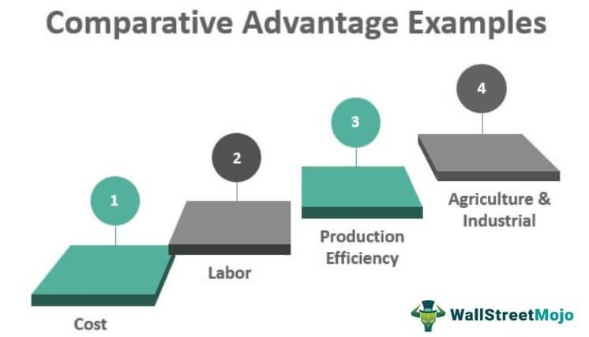

Algorithmic trading, widely known as algo trading, has dramatically reshaped the financial markets landscape by automating trading decisions through sophisticated computer algorithms. These algorithms analyze vast amounts of market data and execute trades at speeds and frequencies that are impossible for human traders to match. As the efficiency and complexity of financial markets increase, the quality and precision of the data feeding these algorithms become crucial to gaining a competitive advantage.

PCAP (Packet Capture) files have become a critical resource in this context. These files provide raw market data captured directly from network transmissions, offering traders a byte-for-byte transcription of data as it arrives from exchanges. Such granularity is invaluable for traders who aim to refine their algorithmic strategies, allowing for more accurate modeling and testing of various market scenarios.

PCAP files stand out due to their flexibility and relevance in low-latency trading strategies, which require minimal delays in data processing and decision-making. In algorithmic trading, where microseconds can determine the success or failure of a trade, the ability to access and analyze detailed packet data in real-time is indispensable. This article explores how PCAP files contribute to enhanced trading strategies by focusing on their granularity and adaptability.

## Table of Contents

## Understanding PCAP Files

PCAP (Packet Capture) files are invaluable in capturing raw data that is transmitted over a network, offering a meticulous byte-for-byte transcription of market data as received from various exchanges. These files depict network packets, which are smaller subsections of larger data sets transmitted between devices over a network. The information captured in PCAP files is comprehensive, providing a complete and unaltered representation of the data flow between applications and market exchanges. This lossless capture is pivotal for accurate analysis and decision-making in [algorithmic trading](/wiki/algorithmic-trading), where precision and detail are paramount.

One of the key attributes of PCAP files is the inclusion of metadata that accompanies the packet data. This metadata provides crucial context for each packet, including receive timestamps and the type of network over which the data was transmitted. Timestamps are particularly important as they offer the exact timing of when a packet was captured. This enables traders to perform precise analyses and run simulations that align closely with real-time scenarios. Additionally, information about the network type can aid in diagnosing network-specific issues or optimizing data flow across varying networking conditions.

For the interpretation and analysis of PCAP files, there are several tools available that facilitate detailed market research and data examination. Wireshark is one of the most popular tools used for this purpose. It is an open-source network protocol analyzer that enables users to see the minute details of network traffic in real-time, allowing for extensive examination of PCAP files. Similarly, tcpdump is a command-line packet analyzer that provides users the ability to capture and display packets being transmitted or received over a network. Its primary utility lies in its capability to filter and sort data, providing targeted insights into specific packet streams.

Both Wireshark and tcpdump are instrumental in converting the raw data housed in PCAP files into actionable intelligence, assisting traders in the execution of precise and informed trading strategies. Their usage extends beyond immediate data comprehension, allowing for archival storage of PCAP files that can be referenced in historical data analysis and [backtesting](/wiki/backtesting) strategies critical in algorithmic trading environments. Through such tools, PCAP files become a powerful resource, conveying both the broad overview and the detailed specifics necessary for comprehensive market data research and strategy development.

## Advantages of PCAPs in Algo Trading

PCAP files offer several advantages in algorithmic trading, enhancing the efficiency and precision of trading strategies.

### Lossless Data
PCAP files capture and store market data exactly as received from exchanges, without any alteration. This aspect of PCAPs ensures that no information is lost during data capture, a common issue in normalized data processes which may inadvertently discard potentially valuable nuances. Since PCAPs preserve the integrity of the original transmission, traders gain access to the complete dataset, allowing for more comprehensive analysis and insights.

### PTP-Synchronized Timestamps
Accurate and precise timing is paramount in algorithmic trading, especially for strategies involving high-frequency trades. PCAP files utilize Precision Time Protocol (PTP) for timestamp synchronization, which enables nanosecond-level precision. This high-resolution timestamping reflects true market conditions without suffer from the variances induced by network delays or processing latencies. With this level of accuracy, traders can build and execute timing-sensitive algorithms that rely on exact transaction sequencing and market event timing, crucial for exploiting microsecond discrepancies in the market.

### Compatibility & Customization
PCAP files offer significant flexibility in terms of data manipulation and storage efficiency. They can be merged and deduplicated to form cohesive datasets from multiple sources, making them ideal for extensive data-driven strategies that require various inputs. Additionally, PCAPs are compatible with various data processing and analysis tools, allowing traders to convert and deliver them in different formats suited to specific requirements. This adaptability contributes to reduced storage and bandwidth needs by allowing traders to tailor the data according to their specific strategy requirements and system capabilities.

Overall, the unique attributes of PCAP files, including their lossless nature, precise timing, and extensive compatibility, make them an essential resource for developing and executing advanced algorithmic trading strategies.

## PCAP Files vs. Normalized Data

While normalized data offers ease of analysis by converting diverse data formats into a standardized schema, it often results in information loss, making it less suitable for tasks requiring high precision, such as microstructure research and transaction cost analysis. Raw PCAP data, however, maintains the integrity of the original data packets as transmitted over the network. This preservation is vital for tasks necessitating granular details, as it allows researchers and traders to retain every bit of information present in the network traffic. 

In microstructure research, understanding the intricate details of how trades are executed and orders are processed can provide significant insights into market dynamics. Each packet captured in a PCAP file includes crucial information such as timestamps, order flows, and network latency, which might be sanitized or entirely absent in normalized data formats. This level of detail is indispensable for constructing an accurate representation of the market microstructure, thereby facilitating better strategy development and execution.

For certain trading strategies, such as those employed by Lead Market Makers, the need for such fine-grained data is even more critical. These strategies often rely on understanding minute-by-minute or even second-by-second changes in order flow and execution. Normalized schemas, though beneficial for reducing complexity, might strip away essential details such as the sequence of orders, network path changes, or variations in message timings, thereby hindering the effectiveness of these strategies. Raw PCAP data, by including all packet-level details, allows market makers to discern subtleties like order priority and transaction timestamps with nanosecond accuracy, crucial elements for optimizing market position and response times.

Ultimately, the choice between PCAP files and normalized data depends on the specific demands of the trading strategy being employed. Traders who require comprehensive insights and need to optimize their strategies to the fullest extent will find raw PCAP data invaluable. The capability to analyze every aspect of market data as it flows through the network can provide a tactical advantage in the increasingly competitive field of algorithmic trading, especially where precision and timing matter most.

## Use Cases of PCAPs in Algo Trading

PCAP files play a significant role in enhancing algorithmic trading strategies through various applications. One primary use of PCAPs is in historical analysis. By replaying past market events with PCAP data, traders can refine their trading strategies and improve backtesting processes. This capability allows traders to simulate market scenarios accurately and evaluate the effectiveness of their strategies under different conditions, enabling the identification of potential improvements. Accurate replay of market conditions helps traders fine-tune their algorithms and develop robust trading strategies.

For low-latency strategies, the precision offered by PCAP data is indispensable. High-frequency trading ([HFT](/wiki/high-frequency-trading-strategies)) relies heavily on executing trades with minimal delay. The precise timing provided by PCAP files allows traders to execute strategies that require interaction with market changes in fractions of a second. Any latency can significantly impact the profitability of these trades, which makes the microsecond accuracy of PCAP data crucial. Therefore, traders can leverage PCAP files to ensure their algorithms react with the speed and precision necessary for competitive advantage in fast-paced trading environments.

Furthermore, PCAPs contribute greatly to transaction cost analysis. With detailed packet data, traders can dissect the cost components involved in trade execution. By examining the discrete elements captured in PCAP files, traders can identify inefficiencies, such as slippage or adverse price movements, and devise methods to minimize these costs. The granular insights provided by PCAPs allow traders to scrutinize every aspect of their trading operations, optimize execution strategies, and maintain profitability by reducing unnecessary expenses.

In summary, PCAP files are an invaluable resource for algorithmic traders. They facilitate historical analysis, support low-latency trading strategies, and offer in-depth transaction cost insights. By utilizing PCAP data, traders can refine and optimize their trading operations, ultimately leading to more effective algorithmic strategies and enhanced trading performance.

## Conclusion

Incorporating PCAP data into algorithmic trading can significantly enhance trading strategies through improved analysis and reduced information loss. The detailed nature of PCAP files allows traders to access precise market data, enabling more accurate decision-making and refining of trading algorithms. This precision is pivotal for strategies that rely on low-latency information, where even microsecond differences in data can impact trading outcomes.

As algorithmic trading evolves, the need for raw data resources like PCAPs becomes increasingly crucial for traders aiming to maintain a competitive edge. PCAP files provide an unmatched level of detail, allowing for comprehensive market analysis and offering insights into market microstructure. Traders can leverage this data for complex models and analytics, improving their ability to respond to market conditions promptly.

Future developments in data capture and analysis technology are likely to further benefit algorithmic traders. Enhanced techniques for data storage, retrieval, and analysis will make processing large volumes of PCAP data more efficient, potentially leading to breakthroughs in trading strategy optimization. Innovations in hardware, such as faster processors and more efficient storage solutions, could support the handling of these data-intensive tasks, allowing traders to execute more sophisticated strategies and respond more rapidly to market developments.

In conclusion, as the trading landscape continues to evolve, harnessing the detailed insights provided by PCAP data will be a key strategy for traders seeking to optimize performance and secure a competitive edge in the fast-paced environment of algorithmic trading.

## References & Further Reading

[1]: Kramer, B. (2020). ["High-Frequency Trading: An Insider's Guide to Buying Low and Selling High."](https://link.springer.com/article/10.1007/s11408-019-00331-6) Wiley.

[2]: Alkaff, M., & Ismail, A. S. (2016). ["The Use of Packet Captures in a Networked Environment."](https://www.researchgate.net/profile/Saqaff-Alkaff-2/publication/291974284_A_review_of_underground_building_towards_thermal_energy_efficiency_and_sustainable_development/links/5c9c537aa6fdccd4603f35be/A-review-of-underground-building-towards-thermal-energy-efficiency-and-sustainable-development.pdf) IEEE.

[3]: Combs, G. (2018). ["Wireshark User's Guide."](https://dl.icdst.org/pdfs/files3/8929819f0c460eda52e78668b9bcbd27.pdf) Wireshark Foundation.

[4]: Luo, X., & Zhang, W. (2010). ["Accurate Replay of Intrusion Analysis Using Packet Capsules."](https://onlinelibrary.wiley.com/doi/10.1002/adfm.202003619) Association for Computing Machinery.

[5]: Gong, W., & McFarland, W. P. (2008). ["Achieving Network Traffic Precision: Methodologies and Applications."](https://onlinelibrary.wiley.com/doi/10.1002/adfm.202003619) IEEE Transactions on Communications.