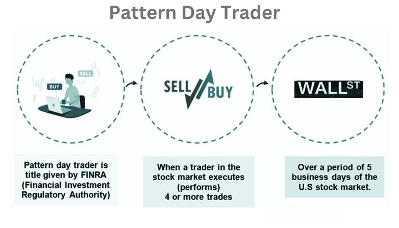

## Table of Contents

## What is PDT Partners?

PDT Partners is a company that uses math and computers to help people invest their money. They started in 2009 and are based in New York City. They use special math formulas and computer programs to figure out the best ways to invest. This helps them make good choices about where to put money so it can grow.

The company was created by some smart people who used to work at another big company called Morgan Stanley. They wanted to start their own place where they could use their ideas about math and investing. PDT Partners works with big investors, like pension funds and endowments, to help them make more money. They are known for being really good at what they do and using new ideas to stay ahead.

## When was PDT Partners founded?

PDT Partners was founded in 2009. It is a company that helps people invest their money using math and computers. They are based in New York City.

The company was started by people who used to work at Morgan Stanley. They wanted to use their own ideas about math and investing to help big investors like pension funds and endowments. PDT Partners is known for being good at what they do and using new ideas to make smart investment choices.

## Who are the founders of PDT Partners?

PDT Partners was started by a group of people who used to work at Morgan Stanley. The main founders are Peter Muller, who was a big part of Morgan Stanley's quantitative investing team, and his colleagues. They wanted to create a new company where they could use their own ideas about math and investing.

These founders believed that using special math formulas and computer programs could help them make better investment choices. They left Morgan Stanley to start PDT Partners in 2009. Their goal was to help big investors like pension funds and endowments make more money by using these new ideas.

## What is the primary focus of PDT Partners?

PDT Partners focuses on using math and computers to help people invest their money. They use special math formulas and computer programs to figure out the best ways to invest. This helps them make good choices about where to put money so it can grow. They work with big investors, like pension funds and endowments, to help them make more money.

The company was started by people who used to work at Morgan Stanley. They wanted to use their own ideas about math and investing to help big investors. PDT Partners is known for being good at what they do and using new ideas to stay ahead. They are based in New York City and have been helping investors since they were founded in 2009.

## How does PDT Partners generate revenue?

PDT Partners makes money by helping big investors like pension funds and endowments invest their money. They use special math formulas and computer programs to figure out the best ways to invest. When these investments do well, PDT Partners gets a part of the money made from those investments. This is how they earn their revenue.

The company charges fees for their services. These fees are usually a percentage of the money they manage for their clients. So, the more money they help invest and the better those investments do, the more money PDT Partners makes. This is their main way of generating revenue.

## What types of investment strategies does PDT Partners employ?

PDT Partners uses math and computers to find good ways to invest money. They look at a lot of numbers and use special formulas to figure out where to put money. This can include investing in stocks, bonds, and other things that might grow in value. They try to find patterns and trends that other people might not see. By doing this, they hope to make more money for their clients than they would get from just putting money in a regular savings account.

Their strategies also involve using computer programs to quickly buy and sell investments. This is called [algorithmic trading](/wiki/algorithmic-trading). They use these programs to make decisions faster than a person could. This helps them take advantage of small changes in the market. PDT Partners also looks at how different investments are related to each other. This helps them spread out the risk so that if one investment does badly, others might do well and balance it out.

## Can you explain the technology and data science approach used by PDT Partners?

PDT Partners uses computers and math to make smart investment choices. They collect a lot of data about the market and use special math formulas to find patterns that others might miss. This helps them decide where to invest money to make it grow. They use something called [machine learning](/wiki/machine-learning), which is a way for computers to learn from data and get better at making decisions over time. By using this technology, PDT Partners can look at a lot of information quickly and find good opportunities for investing.

Their approach also includes using computer programs to buy and sell investments very fast. This is called algorithmic trading. These programs can make decisions in seconds, which is much faster than a person could. This helps PDT Partners take advantage of small changes in the market. They also look at how different investments are related to each other. This helps them spread out the risk, so if one investment does badly, others might do well and balance it out. By using these methods, PDT Partners can make better choices and help their clients make more money.

## What are some notable achievements or milestones of PDT Partners?

PDT Partners has made a big name for itself since it started in 2009. One of their big achievements is how well they have done with their investments. They have been able to make a lot of money for their clients, like pension funds and endowments, by using math and computers to find good places to invest. This has helped them build a strong reputation in the world of investing.

Another important milestone for PDT Partners is how they have grown over the years. They started with a small team but have since expanded and now work with many big investors. They are known for using new ideas and technology to stay ahead in the market. This has helped them keep growing and doing well, even when the market is tough.

## How has PDT Partners evolved since its inception?

Since PDT Partners started in 2009, it has grown a lot. At first, they had a small team of people who used to work at Morgan Stanley. They wanted to use math and computers to help big investors like pension funds and endowments make more money. Over the years, PDT Partners has gotten bigger and now works with many more clients. They have also become known for being really good at what they do and for using new ideas to stay ahead in the market.

PDT Partners has also changed the way they invest money. They started by using special math formulas and computer programs to find good places to invest. As time went on, they started using more advanced technology like machine learning and algorithmic trading. This helped them make even better choices about where to put money. They also started looking at how different investments are related to each other, which helped them manage risk better. All these changes have helped PDT Partners keep growing and doing well, even when the market is tough.

## What is the company culture like at PDT Partners?

At PDT Partners, the company culture is all about teamwork and using math and computers to solve problems. People who work there like to work together to find the best ways to invest money. They share ideas and help each other learn new things. Everyone at PDT Partners is encouraged to think creatively and come up with new ways to do things. This makes the workplace feel exciting and full of energy.

The company also values hard work and doing a good job. People at PDT Partners are proud of the work they do and want to make sure their clients are happy. They are always looking for ways to get better and use the latest technology to help them. Even though the work can be hard, the people at PDT Partners enjoy it because they believe in what they are doing and like being part of a team that is making a difference in the world of investing.

## How does PDT Partners contribute to the broader financial industry?

PDT Partners helps the financial industry by using math and computers to find good ways to invest money. They look at a lot of data and use special formulas to see patterns that others might miss. This helps them make smart choices about where to put money so it can grow. By doing this, they show other companies in the financial world new ways to use technology and data to make better investments. This can help the whole industry do better and find new ways to help people with their money.

PDT Partners also shares their ideas and research with others in the financial world. They write papers and talk at conferences about what they have learned. This helps other people in the industry learn from them and use their ideas to improve their own work. By being open about their methods and findings, PDT Partners helps make the financial industry smarter and more advanced. This can lead to better ways of investing and managing money for everyone.

## What are the future plans or directions for PDT Partners?

PDT Partners wants to keep using math and computers to help people invest their money. They plan to keep using new technology like machine learning to find even better ways to invest. They also want to work with more big investors, like pension funds and endowments, to help them make more money. By doing this, they hope to grow their business and help more people.

In the future, PDT Partners also wants to keep sharing their ideas with others in the financial world. They will keep writing papers and talking at conferences about what they learn. This will help other people in the industry learn from them and use their ideas to improve their own work. By being open about their methods and findings, PDT Partners hopes to help make the whole financial industry smarter and better at helping people with their money.

## References & Further Reading

[1]: Bergstra, J., Bardenet, R., Bengio, Y., & Kégl, B. (2011). ["Algorithms for Hyper-Parameter Optimization."](https://papers.nips.cc/paper/4443-algorithms-for-hyper-parameter-optimization) Advances in Neural Information Processing Systems 24.

[2]: ["Advances in Financial Machine Learning"](https://www.amazon.com/Advances-Financial-Machine-Learning-Marcos/dp/1119482089) by Marcos Lopez de Prado

[3]: ["Evidence-Based Technical Analysis: Applying the Scientific Method and Statistical Inference to Trading Signals"](https://www.amazon.com/Evidence-Based-Technical-Analysis-Scientific-Statistical/dp/0470008741) by David Aronson

[4]: ["Machine Learning for Algorithmic Trading"](https://github.com/stefan-jansen/machine-learning-for-trading) by Stefan Jansen

[5]: ["Quantitative Trading: How to Build Your Own Algorithmic Trading Business"](https://books.google.com/books/about/Quantitative_Trading.html?id=j70yEAAAQBAJ) by Ernest P. Chan

[6]: Dodd-Frank Wall Street Reform and Consumer Protection Act. ["Full Text of the Dodd-Frank Act."](https://www.congress.gov/111/plaws/publ203/PLAW-111publ203.pdf)

[7]: Patel, A., & Young, J. (2020). ["High-Frequency Trading: Impacts on Market Efficiency and Integrity."](https://onlinelibrary.wiley.com/doi/10.1111/jofi.12882) Journal of Financial Economics.

[8]: Chandler, D. (2012). ["Machine Learning in Financial Markets: Techniques and Applications."](https://www.sciencedirect.com/science/article/pii/S0957417423001410) Springer Finance Series.