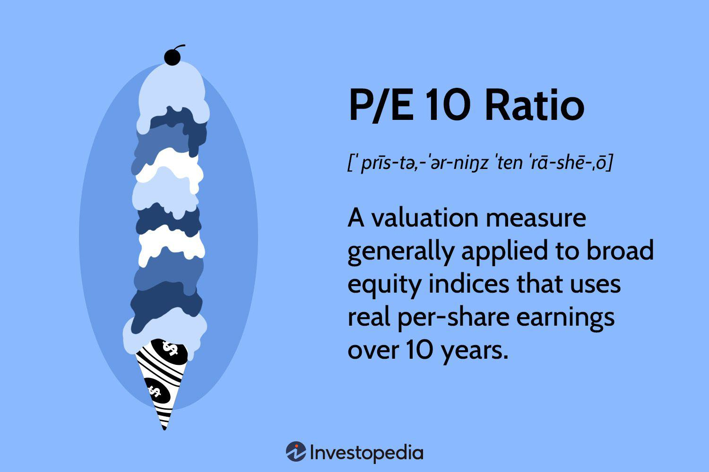

Stock valuation is a fundamental aspect of making informed investment decisions, influencing both personal portfolios and institutional strategies. Understanding various financial metrics is crucial for algorithmic traders and financial analysts, who rely on data-driven approaches to maximize returns and minimize risks. Among these metrics, the P/E 10 ratio, also known as the cyclically adjusted price-to-earnings (CAPE) ratio, is a significant tool for assessing long-term market valuations. This ratio provides a more stabilized view by taking the average inflation-adjusted earnings of a company over the past ten years.

The P/E 10 ratio offers advantages over the traditional price-to-earnings (P/E) ratio by smoothing out short-term earnings fluctuations caused by business cycles. This makes it a highly effective metric for evaluating whether a stock or broader market is overvalued or undervalued over a longer timeframe. Developed by the economist Robert Shiller, the P/E 10 ratio has become an essential component in discussions of market trends and potential future returns, offering investors a way to compare current price levels against historical earnings consistency.



This article explores the P/E 10 ratio's role in stock valuation, detailing its calculation method and significance in financial analysis and algorithmic trading. The metric's ability to reveal investment opportunities is particularly beneficial for algorithmic trading strategies, where rapid decision-making and objective analysis are paramount. By examining how the P/E 10 ratio aids in identifying market conditions and potential turning points, investors can enhance their strategic investment approaches, aligning them more closely with historical patterns and valuations. Through this exploration, investors and analysts can better leverage the P/E 10 ratio, integrating it effectively into more sophisticated trading algorithms and strategies.

## Table of Contents

## Understanding the P/E 10 Ratio

The P/E 10 ratio, commonly referred to as the cyclically adjusted price-to-earnings (CAPE) ratio, is a financial metric that assesses the valuation of the stock market using a ten-year average of inflation-adjusted earnings. This distinguishes it from the traditional P/E ratio, which relies on one-year earnings data and can be greatly affected by short-term economic fluctuations.

This ratio was developed by economist Robert Shiller, who aimed to offer a more stable and reliable measure of market valuation over extended periods. The primary advantage of the P/E 10 ratio is its ability to smooth out economic variances, providing a historical perspective that can better inform current earnings analyses. It is calculated as follows:

$$
\text{P/E 10 Ratio} = \frac{\text{Current Price of the Stock}}{\text{Average Inflation-Adjusted Earnings over the past 10 Years}}
$$

By utilizing a decade of earnings data, this ratio mitigates the impact of business cycles, thereby offering investors insights into long-term market trends. It helps identify whether the stock market is overvalued or undervalued based on historical benchmarks.

However, despite its usefulness, the P/E 10 ratio has limitations. Critics argue that it may not accurately predict market peaks or troughs as it does not take future earnings into consideration. Additionally, structural changes in the economy or in accounting practices over time can skew the historical data, potentially leading to misleading conclusions about current market valuations. Nonetheless, when used in conjunction with other financial metrics, the P/E 10 ratio serves as an essential tool for investors and analysts seeking to understand long-term trends in the stock market.

## Applications in Financial Analysis

The P/E 10 ratio, which encompasses a decade of earnings data, offers a comprehensive view of market valuations by smoothing out short-term economic fluctuations. This macroeconomic lens is crucial for investors seeking to discern whether the stock market is generally overvalued or undervalued over extended periods. By analyzing these long-term averages, investors can make informed decisions on asset valuations, identifying when markets are riding on speculative bubbles or undergoing healthy corrections.

The P/E 10 ratio's power lies in its historical perspective, providing a reliable baseline for comparison. Analysts utilize this ratio to conduct [backtesting](/wiki/backtesting), which is the process of applying trading strategies to historical data to evaluate their effectiveness. By leveraging backtesting, investors can understand past market behaviors and refine their current strategies accordingly. This involves not only recognizing patterns of boom and bust cycles but also understanding the economic indicators and market sentiments that correspond with historical deviations in the P/E 10 ratio.

The backtesting of the P/E 10 ratio can be performed with programming languages like Python, which offers libraries such as pandas and numpy for financial data manipulation. Below is a basic Python code snippet demonstrating how such a backtesting process might begin:

```python
import pandas as pd
import numpy as np

# Historical earnings and price data for a hypothetical index
data = {
    'Year': range(2000, 2021),
    'Earnings': [50, 52, 55, 60, 62, 65, 70, 72, 75, 80, 82, 85, 90, 92, 95, 100, 102, 105, 110, 115, 120],
    'Price': [1000, 1050, 1100, 1150, 1250, 1300, 1400, 1450, 1500, 1600, 1700, 1750, 1850, 1900, 2000, 2100, 2200, 2300, 2400, 2550, 2600]
}

# Creating a DataFrame
df = pd.DataFrame(data)

# Calculating rolling 10-year average earnings
df['Avg_Earnings_10'] = df['Earnings'].rolling(window=10).mean()

# Calculating the P/E 10
df['PE_10'] = df['Price'] / df['Avg_Earnings_10']

# Displaying the DataFrame with P/E 10
print(df)
```

This code calculates the 10-year average earnings and subsequently, the P/E 10 for each year. By examining the trend of the P/E 10 over time, analysts can determine if the stocks were overvalued or undervalued in the context of historical market conditions.

While the P/E 10 ratio does not predict future earnings, it offers a context for current valuations relative to historical averages, empowering investors to anticipate potential corrections before they unfold. This proactive approach aids in the formulation of more resilient investment strategies. Thus, by integrating these insights into their analysis, financial professionals can harness historical data to better navigate present and future market conditions.

## Incorporating the P/E 10 Ratio in Algorithmic Trading

Algorithmic trading has transformed the landscape of the financial markets, offering precision, speed, and the capability to handle complex data-driven trading strategies. The incorporation of the P/E 10 ratio, also known as the cyclically adjusted price-to-earnings (CAPE) ratio, into such algorithms allows traders to optimize their investment decisions by using a metric that accounts for long-term market valuations.

The P/E 10 ratio is calculated using the formula:

$$
\text{P/E 10} = \frac{\text{Current Price per Share}}{\text{Average Inflation-adjusted Earnings of the Past 10 Years}}
$$

This approach smooths income fluctuations caused by economic cycles, providing a more stable measure over traditional short-term P/E ratios.

## Identifying Undervalued Portfolios

Incorporating the P/E 10 ratio into [algorithmic trading](/wiki/algorithmic-trading) systems enables traders to systematically screen for undervalued portfolios. The integration process involves feeding historical earnings data and share prices into the algorithm, which then evaluates the P/E 10 ratio against predetermined thresholds. A low P/E 10 ratio may indicate an undervalued condition, thus triggering buy signals in the trading system. Here's a simplified Python example illustrating how such a mechanism might function:

```python
def calculate_pe10(price, earnings_history):
    avg_earnings = sum(earnings_history[-10:]) / 10
    return price / avg_earnings

threshold = 15  # Example threshold for undervaluation

def check_undervalued(price, earnings_history):
    pe10 = calculate_pe10(price, earnings_history)
    return pe10 < threshold

# Example usage
current_price = 100
earnings_history = [8, 9, 7, 10, 10, 11, 9, 9.5, 10, 9]

if check_undervalued(current_price, earnings_history):
    print("The stock is potentially undervalued.")
else:
    print("The stock is not considered undervalued.")
```

This code calculates the P/E 10 ratio and checks whether a stock is undervalued based on historical earnings data compared to a preset threshold.

## Enhanced Objectivity in Trading

One of the main advantages of algorithmic trading using the P/E 10 ratio is the reduction of emotional bias, which often influences human traders. Algorithms execute trades based solely on data and predefined rules, allowing for a disciplined approach to investment that can adjust dynamically to new data inputs. This objectivity ensures that decisions adhere strictly to the underlying financial metrics, avoiding emotional pitfalls like overreacting to market movements.

The use of automated systems not only aids in making swift trading decisions but also enhances the scalability of trading strategies. Firms can execute trades across multiple assets and markets simultaneously, optimizing portfolio allocations without being restrained by human limitations.

In summary, embedding the P/E 10 ratio in algorithmic trading provides a structured and robust framework for identifying investment opportunities, mitigating emotional biases, and increasing the precision of trading operations. As financial markets continue to evolve, leveraging historical and cyclical insights through algorithmic strategies remains a critical component for modern asset management.

## Case Studies and Real-World Applications

A comprehensive examination of the S&P 500 highlights the practical application of the P/E 10 ratio in market valuation assessments. Historically, this ratio has proven instrumental in identifying significant periods of market overvaluation. Two prominent examples underscore its efficacy: the dot-com bubble of the late 1990s and the financial crisis that unfolded in 2008.

During the dot-com bubble, the P/E 10 ratio for the S&P 500 soared to values significantly higher than historical averages, signaling an overheated market. This overvaluation was fueled by exuberant speculation in technology stocks without corresponding earnings growth. The elevated P/E 10 ratio provided a forewarning of the eventual market correction, which culminated in a substantial decrease in stock prices as the bubble burst.

Similarly, prior to the 2008 financial crisis, the P/E 10 ratio once again indicated an overvaluation of the market. Although not as pronounced as during the dot-com era, the ratio was substantially above its long-term mean, suggesting that stock prices were not sustainable in the face of underlying economic pressures. Investors and analysts who heeded this signal were better positioned to mitigate losses when the market experienced a downturn.

The use of the P/E 10 ratio is not limited to retrospective market analyses. Various firms leverage this metric in their algorithmic trading systems to enhance asset allocation strategies. By systematically incorporating P/E 10 ratios into their trading algorithms, these firms can establish thresholds for buying or selling, thereby identifying potentially undervalued assets or signaling timely exits from overvalued positions. This quantitative approach enables a more structured and disciplined investment strategy, minimizing subjective bias and enhancing decision-making accuracy.

Through backtesting and real-world implementation, firms employing the P/E 10 ratio within their algorithmic frameworks report improvements in portfolio performance. Specifically, the ability to anticipate market shifts more accurately results in better asset allocation and improved timing in market exits. These outcomes exemplify the tangible benefits of integrating historical P/E 10 data into automated trading systems, which contribute to maintaining competitive advantages in fluctuating markets.

In summary, the P/E 10 ratio serves as a valuable tool for investors seeking to understand long-term market trends and make informed investment decisions. Its real-world applications, underscored by historical case studies and algorithmic integration, confirm its relevance and effectiveness in modern financial markets.

## Conclusion

The P/E 10 ratio, also recognized as the cyclically adjusted price-to-earnings (CAPE) ratio, persists as a considerable tool in stock valuation. Its primary strength lies in its capacity to smooth out income fluctuations across economic cycles by utilizing a decade of earnings data, providing a more stable view of market valuation compared to shorter-term metrics. Despite criticisms regarding its inability to foresee market peaks or troughs and its disregard for future earnings potential, the P/E 10 ratio remains a valuable component in the investor's toolkit.

When integrated into algorithmic trading systems, the P/E 10 ratio's utility escalates. Algorithmic trading, which relies on computational algorithms to execute trades, benefits from the objective nature of the P/E 10 ratio. By incorporating this metric, algorithms gain increased precision in determining entry and [exit](/wiki/exit-strategy) points based on valuation criteria, thereby enhancing the overall effectiveness of investment strategies. This amalgamation allows for swift identification of undervalued assets and more disciplined trading processes, reducing the emotional biases that can often accompany manual trading.

To maximize the effectiveness of the P/E 10 ratio in investment decision-making, it should be complemented with other financial analyses. Investors are encouraged to employ a holistic approach by integrating the P/E 10 ratio with various financial metrics and qualitative factors, thus achieving a more comprehensive understanding of market dynamics. By doing so, they not only leverage the historical insights offered by the P/E 10 but also adapt to the ever-evolving economic landscape, ensuring well-rounded investment strategies that are grounded in both historical data and forward-looking perspectives.

## References & Further Reading

Shiller, R. (2000). *Irrational Exuberance*. This book, authored by economist Robert Shiller, explores the psychology of speculative bubbles and valuations in financial markets. It discusses how traditional valuation models, including the P/E 10 ratio (also known as the CAPE ratio), can reveal asset price bubbles and deviations from fundamentals that suggest impending corrections.

For a comprehensive understanding of the cyclically adjusted P/E ratio and related financial concepts, Investopedia offers a detailed guide. It covers the methodology for calculating the CAPE ratio, its historical application, and how it compares with standard P/E ratios.

Further insights into the integration of algorithmic trading systems with traditional financial metrics can be found in recent analyses focused on algorithmic strategies. These analyses examine how factors like the P/E 10 ratio can be incorporated into automated trading algorithms, offering improved decision-making capabilities through backtesting of historical data and optimizing trading strategies to align with long-term market trends. This involves using Python or similar programming languages to script trading actions triggered by P/E 10 thresholds, thereby providing a systematic approach to investment management.