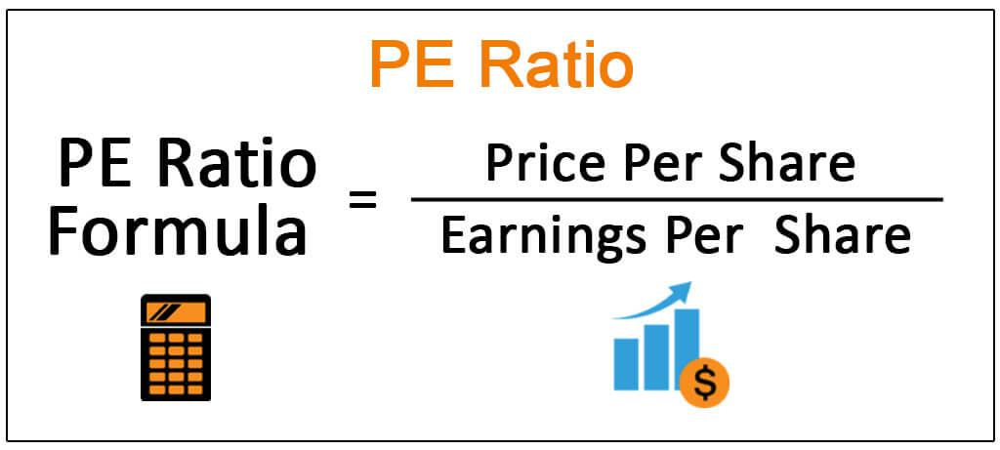

Stock valuation is a crucial component for investors seeking to make informed decisions in financial markets. At the forefront of this valuation process is the Price-to-Earnings (P/E) ratio, a key metric that helps evaluate a stock's value. By comparing the company's market price per share with its earnings per share (EPS), the P/E ratio provides insights into whether a stock is fairly priced, overvalued, or undervalued.

Investors rely on the P/E ratio to gauge market expectations and a company’s earning potential. The ratio’s importance cannot be understated as it serves as a primary tool for assessing a company’s financial health and future profitability prospects. By analyzing the P/E ratio, investors can make more strategic decisions about buying, holding, or selling shares.



Moreover, the P/E ratio has found a significant role in the integration of algorithmic trading strategies. With advances in trading technology, algorithms can now rapidly analyze vast amounts of financial data, applying metrics like the P/E ratio to automate and optimize trading decisions. This evolution in trading practices has enhanced the speed and efficiency of stock selection, minimizing emotional biases and promoting data-driven investment strategies.

This article will explore the essential nature of stock valuation through the P/E ratio, examine its role in financial analysis, and discuss how it is incorporated into algorithmic trading. By understanding the fundamentals and applications of the P/E ratio, investors can better navigate the complex landscape of today’s financial markets.

## Table of Contents

## Understanding the P/E Ratio

The Price-to-Earnings (P/E) ratio is a prominent tool in financial analysis, employed to compare a company's market valuation to its earnings. It is computed by dividing the current market price per share by the earnings per share (EPS). This calculation helps investors assess the relative value of a stock, offering an indication of market expectations regarding a company's future [earning](/wiki/earning-announcement) potential.

$$
\text{P/E Ratio} = \frac{\text{Market Price per Share}}{\text{Earnings per Share (EPS)}}
$$

The P/E ratio is essential for comparing companies within the same industry. A high P/E ratio may suggest that the market anticipates future growth and potentially higher earnings, while a low P/E ratio could indicate the stock is undervalued or that the company is experiencing difficulties.

There are different variations of the P/E ratio, predominantly the trailing P/E and the forward P/E. The trailing P/E uses earnings from the past 12 months, providing a historical perspective. Conversely, the forward P/E is based on projected earnings for the next 12 months, offering insight into how a company is expected to perform in the future. These variations are significant as they provide different contexts for evaluating a company's financial health and market position.

By understanding these distinctions, investors can better interpret the P/E ratio depending on their investment strategy—whether it be focused on historical performance or future potential. This expanded viewpoint enables a more nuanced evaluation of stocks, allowing for informed investment decisions.

## Limitations and Comparisons of the P/E Ratio

The Price-to-Earnings (P/E) ratio is widely used in stock valuation, but it presents several limitations that investors must consider. One key issue is the variability in accounting practices, which can lead to inconsistencies in earnings figures used to calculate the P/E ratio. Different companies may follow varying accounting standards or employ creative accounting techniques, impacting the reported earnings per share (EPS) and thus affecting the P/E ratio's accuracy. For example, a company using aggressive revenue recognition strategies might inflate its EPS, resulting in a deceptively low P/E ratio that could mislead investors about its true value.

Another significant limitation arises from industry-specific differences. The P/E ratio can vary widely across industries due to differing growth rates, risk profiles, and capital requirements. For instance, technology companies often have higher P/E ratios compared to utilities, reflecting higher growth expectations and risk. Comparing P/E ratios across different industries can lead to erroneous conclusions about a stock's valuation. Investors should, therefore, compare a company's P/E ratio against its industry peers to ensure a more relevant benchmark.

Given these limitations, a comprehensive stock valuation approach requires using the P/E ratio alongside other financial metrics. The Price-to-Book (P/B) ratio, Return on Equity (ROE), and Debt-to-Equity (D/E) ratio are examples of complementary metrics that can provide a fuller picture of a company's financial health and market position. By combining these indicators, investors can better assess a company's true value and mitigate the risk of relying solely on the P/E ratio.

In summary, while the P/E ratio is a useful initial screening tool, its limitations necessitate a multifaceted evaluation strategy. Incorporating additional metrics and considering industry-specific factors can lead to more informed investment decisions.

## Incorporating Algorithmic Trading

Algorithmic trading has significantly enhanced the capability to make informed stock selection decisions by incorporating fundamental metrics such as the Price-to-Earnings (P/E) ratio into automated trading systems. This technological advancement allows for the rapid processing of voluminous financial data, facilitating the execution of trades based on pre-established criteria. This efficiency minimizes emotional biases typically present in human decision-making, thus improving the overall effectiveness of trading strategies.

In an [algorithmic trading](/wiki/algorithmic-trading) setup, the P/E ratio is often utilized as a criterion to evaluate whether a stock is overvalued or undervalued. By setting predefined P/E thresholds, trading algorithms can automatically trigger buy or sell signals when a stock's P/E ratio meets certain conditions. For instance, an algorithm may be programmed to purchase stocks with P/E ratios below a specified level, indicative of potential undervaluation, and sell those with ratios above a certain threshold, suggesting overvaluation.

A simplified Python code example for implementing such a strategy might involve leveraging libraries like `pandas` for data manipulation and `numpy` for numerical operations. Below is a basic illustration:

```python
import pandas as pd
import numpy as np

# Load stock data
data = pd.read_csv('stock_data.csv')

# Calculate the P/E ratio
data['PE_Ratio'] = data['Market_Value_per_Share'] / data['Earnings_per_Share']

# Define thresholds
lower_threshold = 15
upper_threshold = 25

# Generate trade signals
data['Signal'] = np.where(data['PE_Ratio'] < lower_threshold, 'Buy', 
                           np.where(data['PE_Ratio'] > upper_threshold, 'Sell', 'Hold'))

# Display trading signals
print(data[['Stock', 'PE_Ratio', 'Signal']])
```

In this example, the algorithm reads stock data, computes the P/E ratio for each stock, and assigns a trade signal: 'Buy' for potentially undervalued stocks, 'Sell' for potentially overvalued stocks, and 'Hold' for those within acceptable ranges.

Algorithmic trading systems can also employ [machine learning](/wiki/machine-learning) techniques to optimize these strategies further. For instance, [reinforcement learning](/wiki/reinforcement-learning) could be used to adjust the P/E thresholds dynamically based on real-time market conditions, thereby enhancing the strategy's adaptability and performance.

The integration of algorithmic trading with financial metrics like the P/E ratio not only accelerates trade execution but also brings a level of analytical objectivity that is often difficult to maintain manually. By automating decision-making processes, traders can exploit opportunities with greater precision while minimizing risks associated with human emotions and cognitive biases. However, despite these advantages, it is crucial for traders to continuously monitor and adjust their algorithms to align with evolving market dynamics and ensure sustained effectiveness.

## Real-World Applications and Case Studies

Case studies in financial markets demonstrate how the Price-to-Earnings (P/E) ratio, integrated with algorithmic trading strategies, enhances investment decisions and outcomes. Investment firms and individual traders have leveraged this approach to optimize portfolios and generate returns. Below are notable examples and insights from these applications.

### Investment Firms and P/E Ratio Utilization

**Example 1: Quantitative Hedge Fund Strategy**

A prominent quantitative [hedge fund](/wiki/hedge-fund-trading-strategies) implemented a strategy that emphasized low P/E ratio stocks to identify undervalued securities with strong growth potential. The strategy involved screening stocks within specific sectors, using the P/E ratio as a key metric alongside other financial indicators such as Return on Equity (ROE) and Debt-to-Equity ratios. The firm’s algorithm selected stocks with the most favorable metrics, which historically outperformed market averages by focusing on intrinsic value.

*Key Insight:* The integration of P/E ratios with other financial metrics within an algorithm provided a robust framework for identifying value stocks in different market conditions. This multifactor strategy reduced reliance on the P/E ratio alone, therefore minimizing risks associated with P/E variations due to accounting differences or market sentiment.

### Individual Trading Strategies

**Example 2: Retail Investor’s Algorithmic Model**

A retail investor developed a Python-based trading model that automated stock selection based on P/E ratios. The model generated buy and sell signals by comparing the P/E ratio of a stock to its historical average and the industry benchmark. This approach allowed for rapid decision-making and the elimination of emotional bias, which is often prevalent in manual trading.

Here's a simplified version of the algorithm using Python:

```python
import yfinance as yf  # For more datasets, visit: https://paperswithbacktest.com/datasets

# Function to get current P/E ratio
def get_pe_ratio(ticker):
    stock = yf.Ticker(ticker)
    return stock.info['trailingPE']

# Function to compare current P/E with historical or industry average
def evaluate_stock(ticker, historical_avg, industry_avg):
    current_pe = get_pe_ratio(ticker)
    if current_pe < historical_avg and current_pe < industry_avg:
        return f"Consider Buying: {ticker}"
    elif current_pe > historical_avg or current_pe > industry_avg:
        return f"Consider Selling: {ticker}"
    else:
        return f"No Action: {ticker}"

# Example usage:
ticker = 'AAPL'
decision = evaluate_stock(ticker, historical_avg=15, industry_avg=20)
print(decision)
```

*Key Insight:* This automated approach not only expedited the investment process but also provided systematic and data-driven signals, reducing the subjectivity involved in stock trading.

### Challenges and Considerations

These cases underscore several challenges when applying P/E ratios and algorithmic trading in practice. Firstly, the reliance on accurate and timely financial data is crucial; any discrepancies can lead to sub-optimal decisions. Moreover, historical data and assumptions about industry benchmarks must be updated regularly to reflect market dynamics. Successful implementation requires a balance between quantitative analyses, like the P/E ratio, and qualitative factors, such as economic indicators and company news, which can influence stock performance.

By evaluating these real-world applications, investors can appreciate the synergy between traditional financial metrics and modern algorithmic tools, providing a comprehensive strategy to navigate financial markets effectively.

## Conclusion

The Price-to-Earnings (P/E) ratio continues to be a cornerstone in stock valuation and financial analysis, providing essential insights into a company's market valuation relative to its earnings. Its efficacy is particularly pronounced when it is integrated into a comprehensive investment strategy that considers a variety of financial metrics and market conditions. While algorithmic trading enhances the utilization of the P/E ratio by enabling swift and precise analysis of vast amounts of financial data, it is important for investors to be mindful of its inherent limitations. Algorithms can process data without emotional bias, but they may not always account for qualitative factors or unforeseen market fluctuations. 

In this context, investors are encouraged to adopt a multi-faceted investment approach. This strategy should combine the P/E ratio with other financial metrics such as debt-to-equity ratio, return on equity (ROE), and free cash flow, alongside qualitative insights like industry trends and macroeconomic factors. By doing so, investors can develop a more robust framework for making informed decisions and navigate the complexities of today's financial markets more effectively. This balanced methodology ensures a more thorough evaluation of investment opportunities, ultimately aiming to achieve more resilient and sustainable returns.

## References & Further Reading

### References & Further Reading

For those seeking to expand their knowledge on stock valuation and the use of P/E ratios, the following resources provide comprehensive insights:

1. **Benjamin Graham's "The Intelligent Investor"** - Often considered the bible of value investing, this book lays the groundwork for understanding stocks' intrinsic value and is an essential read for anyone looking to master the principles of stock valuation.

2. **"Security Analysis" by Benjamin Graham and David Dodd** - This classic text offers an in-depth exploration of financial metrics and fundamental analysis, providing valuable context for the P/E ratio within broader investment strategies.

3. **"Quantitative Financial Analytics: The Path to Success" by Edward E. Qian** - This book focuses on quantitative approaches to investment management, including algorithmic trading and its reliance on key financial metrics like the P/E ratio.

4. **"Algorithmic Trading and DMA: An Introduction to Direct Access Trading Strategies" by Barry Johnson** - Provides detailed insights into algorithmic trading systems, including examples of how P/E ratios and other metrics are used in automated decision-making processes.

5. **Journal Articles and Papers:**
   - "The P/E Ratio and Equity Valuation: Forecasting Stock Price Returns" - A study that examines the predictive power of the P/E ratio in future stock returns, adding empirical evidence to its utility in financial analysis.
   - "Algorithmic Trading: Impact on Stock Prices and Market Dynamics" - Discusses the influence of algorithmic trading on stock market behavior and how fundamental metrics, including the P/E ratio, are integrated into trading algorithms.

6. **Online Resources and Courses:**
   - Coursera and edX offer various courses on financial markets, stock valuation, and algorithmic trading, allowing for in-depth tutorials and practical applications of concepts like the P/E ratio.
   - The CFA Institute's website offers articles and continuing education on financial analysis, providing resources on the latest methodologies in stock valuation.

These resources provide a balanced mix of theoretical foundations and practical applications, crucial for investors and professionals eager to excel in financial analysis and trading strategies.

