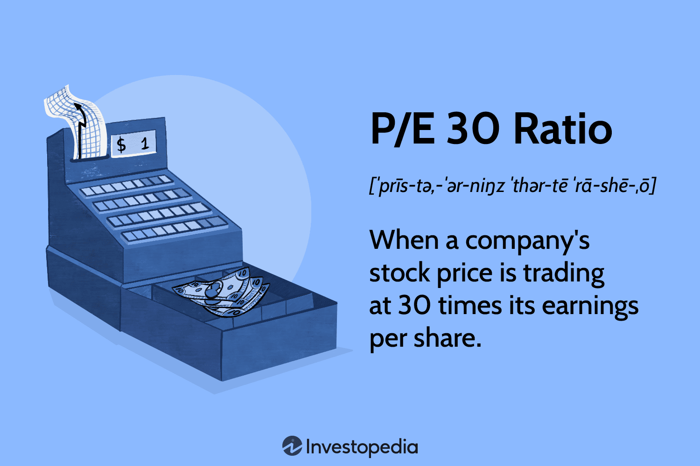

## Table of Contents

## What is the P/E ratio?

The P/E ratio, or Price-to-Earnings ratio, is a way to measure how much investors are willing to pay for a company's earnings. It's calculated by dividing the current stock price by the company's earnings per share (EPS). For example, if a company's stock is trading at $50 per share and its EPS is $5, the P/E ratio would be 10. This means investors are willing to pay $10 for every $1 of the company's earnings.

The P/E ratio can help investors understand if a stock is overvalued or undervalued compared to others in the market. A high P/E ratio might mean that investors expect the company to grow quickly in the future, so they're willing to pay more for its stock. On the other hand, a low P/E ratio might suggest that the company is not expected to grow much, or it could be a sign that the stock is undervalued and might be a good buy. However, the P/E ratio should not be the only tool used to make investment decisions, as it doesn't tell the whole story about a company's financial health.

## What does a P/E ratio of 30 mean?

A P/E ratio of 30 means that investors are willing to pay $30 for every $1 of the company's earnings. This is calculated by dividing the stock's current price by its earnings per share. If a company has a stock price of $60 and its earnings per share is $2, then the P/E ratio would be 30.

A P/E ratio of 30 is considered high. This might mean that investors think the company will grow a lot in the future, so they are willing to pay more for its stock. But a high P/E ratio can also mean that the stock might be overvalued, or too expensive compared to what it earns. It's important to look at other things too, not just the P/E ratio, to decide if a stock is a good investment.

## How is the P/E ratio calculated?

The P/E ratio is calculated by dividing the current stock price by the company's earnings per share (EPS). The stock price is how much one share of the company costs to buy. The EPS is found by taking the company's total earnings and dividing it by the number of shares it has. For example, if a company's stock price is $50 and its EPS is $2, you divide $50 by $2 to get a P/E ratio of 25.

This calculation helps investors understand how much they are paying for a company's earnings. A high P/E ratio might mean that people think the company will grow a lot in the future, so they are willing to pay more for its stock. A low P/E ratio might mean the company is not expected to grow much, or it could be a good deal if the stock is undervalued. But the P/E ratio is just one tool, and investors should look at other things too before deciding to buy a stock.

## What are the components needed to calculate the P/E ratio?

To calculate the P/E ratio, you need two main pieces of information: the current stock price and the earnings per share (EPS). The stock price is simply how much it costs to buy one share of the company's stock. You can find this easily on any financial website or stock market app. The EPS is a bit more complex. It's calculated by taking the company's total earnings (or profit) over a certain period, usually a year, and dividing that by the total number of shares the company has.

Once you have these two numbers, calculating the P/E ratio is straightforward. You just divide the stock price by the EPS. For example, if a company's stock is trading at $40 and its EPS is $2, the P/E ratio would be 20. This number tells you how much investors are willing to pay for each dollar of the company's earnings. A high P/E ratio might mean that people expect the company to grow a lot in the future, while a low P/E ratio could mean the opposite or that the stock is a good deal.

## Can you provide a simple example of calculating a P/E ratio of 30?

Let's say a company's stock is selling for $60. This is the price you would pay to buy one share of the company. Now, imagine this company made a profit of $2 for each share over the last year. This $2 is called the earnings per share, or EPS. To find the P/E ratio, you divide the stock price by the EPS. So, $60 divided by $2 equals 30. That means the P/E ratio for this company is 30.

A P/E ratio of 30 tells us that people are willing to pay $30 for every $1 of the company's earnings. This is a high P/E ratio, which might mean that people think the company will grow a lot in the future. But it could also mean the stock is expensive compared to its earnings. It's important to look at other things too, not just the P/E ratio, to decide if the stock is a good buy.

## How does a P/E ratio of 30 compare to industry averages?

A P/E ratio of 30 is considered high compared to many industry averages. For example, in industries like utilities or consumer staples, where growth is usually slow and steady, the average P/E ratio might be around 15 to 20. In these cases, a P/E ratio of 30 might suggest that investors think the company will grow much faster than its peers. But it could also mean the stock is overvalued, meaning it's too expensive compared to what it earns.

In other industries, like technology or biotech, where growth can be very fast, a P/E ratio of 30 might be closer to the average. In these sectors, it's common to see P/E ratios of 30 or even higher because investors expect big growth in the future. So, whether a P/E ratio of 30 is high or average depends a lot on the industry the company is in. It's always a good idea to compare a company's P/E ratio to others in the same industry to get a better idea of what it means.

## What factors can influence a company's P/E ratio?

Several things can affect a company's P/E ratio. One big thing is how fast people think the company will grow. If people think a company will grow a lot, they might be willing to pay more for its stock, which makes the P/E ratio go up. Another thing that can change the P/E ratio is how much risk people think there is with the company. If a company is seen as risky, its P/E ratio might be lower because people aren't as willing to pay a high price for it. Also, the overall mood of the stock market can affect P/E ratios. If everyone is feeling good about the market, P/E ratios might go up across the board.

The industry the company is in also plays a big role. Different industries have different average P/E ratios. For example, tech companies often have higher P/E ratios because they're expected to grow fast. On the other hand, companies in slower-growing industries like utilities might have lower P/E ratios. The economy's health can influence P/E ratios too. In good economic times, P/E ratios might be higher because people feel more confident about spending money on stocks. But in bad times, P/E ratios might drop as people become more cautious.

## How can investors use a P/E ratio of 30 in their decision-making process?

Investors can use a P/E ratio of 30 to help decide if a stock is a good buy. A P/E ratio of 30 means people are willing to pay $30 for every $1 the company earns. This is pretty high, so it might mean that investors think the company will grow a lot in the future. But it could also mean the stock is too expensive compared to its earnings. To figure out if the stock is a good deal, investors should compare the company's P/E ratio to others in the same industry. If other companies in the industry have lower P/E ratios, the stock with a P/E of 30 might be overvalued. But if other companies in the industry also have high P/E ratios, it might be okay.

It's important for investors to not just look at the P/E ratio. They should also think about other things like the company's financial health, how fast it's growing, and how much risk there is. For example, if a company has a P/E ratio of 30 but it's growing really fast and has a solid plan for the future, it might still be a good investment. But if the company isn't growing much and has a lot of debt, a high P/E ratio might be a red flag. So, the P/E ratio is just one piece of the puzzle, and smart investors will look at the whole picture before making a decision.

## What are the limitations of using the P/E ratio as a valuation metric?

The P/E ratio is a helpful tool, but it has some limits. One big problem is that it doesn't tell the whole story about a company. For example, it doesn't show if a company has a lot of debt or if it's making money in ways that aren't counted in the earnings. Also, the P/E ratio can be different in different industries. A P/E ratio that's high for one industry might be normal for another. This means you need to know the industry to understand if a P/E ratio is good or bad.

Another issue with the P/E ratio is that it can be affected by things outside the company's control, like the overall mood of the stock market or the economy. Sometimes, a company's P/E ratio might be high just because the whole market is feeling good, not because the company itself is doing well. Plus, the P/E ratio uses past earnings, which might not say much about what will happen in the future. So, while the P/E ratio can give you a quick idea of how much people are willing to pay for a company's earnings, it's not enough by itself to decide if a stock is a good buy.

## How does the P/E ratio vary across different sectors?

The P/E ratio can be very different from one sector to another. In sectors like technology and biotech, companies often have higher P/E ratios. This is because people expect these companies to grow a lot in the future. For example, a tech company might have a P/E ratio of 30 or even higher because people think it will keep making more money as it grows. On the other hand, in sectors like utilities or consumer staples, where growth is usually slower and steadier, the P/E ratios are often lower. These companies might have P/E ratios around 15 to 20 because people don't expect them to grow as fast.

Knowing the average P/E ratio for a sector helps investors understand if a company's stock is priced right. If a company in the tech sector has a P/E ratio of 20, it might be seen as a good deal because the average for that sector is higher. But if a utility company has a P/E ratio of 30, it might be seen as too expensive because the average for that sector is lower. So, it's important to compare a company's P/E ratio to others in the same sector to get a better idea of its value.

## What historical trends can be observed with companies having a P/E ratio of 30?

Over time, companies with a P/E ratio of 30 have often been seen as having good growth prospects. This means that investors think these companies will make more money in the future, so they are willing to pay more for the stock right now. For example, in the tech industry, a P/E ratio of 30 is not uncommon because people expect tech companies to grow quickly. If a company keeps its P/E ratio at 30 and also keeps growing its earnings, the stock price could go up a lot over time. But if the company doesn't grow as expected, the stock price might drop, and the P/E ratio could fall too.

However, a P/E ratio of 30 can also be a sign of trouble. Sometimes, a high P/E ratio means that the stock is overvalued, or too expensive compared to what the company earns. If the market's mood changes or if the company doesn't meet its growth targets, the stock price could go down quickly. Historically, when the economy is doing well, more companies might have P/E ratios of 30 or higher because investors feel confident. But during tough economic times, these high P/E ratios can come down fast as investors become more cautious about paying a lot for future growth that might not happen.

## How do analysts forecast future P/E ratios and what implications does a P/E of 30 have on these forecasts?

Analysts forecast future P/E ratios by looking at a company's expected earnings growth and comparing it to the current stock price. They use different tools and models to guess how much money a company will make in the future. They might also look at the whole economy and the industry the company is in to see if things are getting better or worse. If a company is expected to grow a lot, analysts might think the P/E ratio will stay high or even go up. But if the company's growth slows down, they might expect the P/E ratio to go down.

A P/E ratio of 30 means people are willing to pay $30 for every $1 the company earns right now. If analysts think the company will keep growing fast, they might say the P/E ratio of 30 is okay and could even go higher. But if they think the company's growth will slow down or if the stock price is too high compared to what the company earns, they might predict the P/E ratio will drop. This could mean the stock price goes down or the company's earnings go up, or both. So, a P/E ratio of 30 can mean different things depending on what analysts think will happen in the future.

## What is the P/E Ratio and how do we understand it?

The Price-to-Earnings (P/E) ratio is a prominent tool in financial analysis, employed to compare a company's market valuation to its earnings. It is computed by dividing the current market price per share by the earnings per share (EPS). This calculation helps investors assess the relative value of a stock, offering an indication of market expectations regarding a company's future [earning](/wiki/earning-announcement) potential.

$$
\text{P/E Ratio} = \frac{\text{Market Price per Share}}{\text{Earnings per Share (EPS)}}
$$

The P/E ratio is essential for comparing companies within the same industry. A high P/E ratio may suggest that the market anticipates future growth and potentially higher earnings, while a low P/E ratio could indicate the stock is undervalued or that the company is experiencing difficulties.

There are different variations of the P/E ratio, predominantly the trailing P/E and the forward P/E. The trailing P/E uses earnings from the past 12 months, providing a historical perspective. Conversely, the forward P/E is based on projected earnings for the next 12 months, offering insight into how a company is expected to perform in the future. These variations are significant as they provide different contexts for evaluating a company's financial health and market position.

By understanding these distinctions, investors can better interpret the P/E ratio depending on their investment strategy—whether it be focused on historical performance or future potential. This expanded viewpoint enables a more nuanced evaluation of stocks, allowing for informed investment decisions.

## References & Further Reading

#