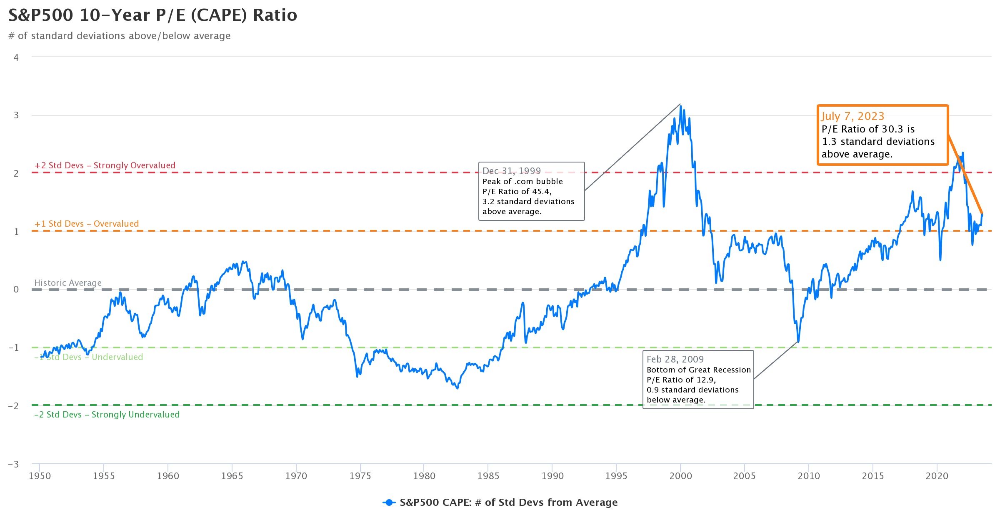

## Table of Contents

## What is a P/E ratio?

The P/E ratio, or Price-to-Earnings ratio, is a way to figure out how much people are willing to pay for a company's earnings. It's calculated by taking the current stock price and dividing it by the earnings per share (EPS). This number tells you if a stock might be a good buy or if it's too expensive. A lower P/E ratio could mean the stock is a good deal, while a higher P/E ratio might mean it's overpriced.

However, the P/E ratio isn't perfect. It's just one tool among many that investors use. Different industries have different average P/E ratios, so it's important to compare a company's P/E ratio to others in the same industry. Also, the P/E ratio can be affected by things like how fast a company is growing or if it has any one-time earnings or losses. So, while the P/E ratio can give you a quick idea about a stock's value, it's best used along with other information to make smart investment choices.

## How is the P/E ratio calculated?

The P/E ratio is calculated by dividing the current stock price by the earnings per share (EPS). The current stock price is how much one share of the company's stock costs right now. Earnings per share is the company's total earnings divided by the number of outstanding shares. So, if a company's stock is selling for $50 and its earnings per share is $5, the P/E ratio would be 10. This means investors are willing to pay $10 for every $1 of the company's earnings.

There are two types of P/E ratios: trailing P/E and forward P/E. The trailing P/E uses the earnings from the past 12 months, which are already known. The forward P/E uses the earnings that are expected for the next 12 months, which are just predictions. Both types of P/E ratios can be useful, but they might give you different numbers because they're looking at different time periods. It's good to know which type of P/E ratio you're looking at when you're trying to understand if a stock is a good buy.

## Why is the P/E ratio important for investors?

The P/E ratio is important for investors because it helps them see if a stock is a good buy or if it's too expensive. It's like a quick way to check if the price of a stock matches up with how much money the company is making. If the P/E ratio is low, it might mean the stock is a good deal. If it's high, the stock might be too pricey. This can help investors decide if they should buy, sell, or hold onto a stock.

But the P/E ratio isn't perfect. It's just one piece of the puzzle. Different industries have different average P/E ratios, so what looks like a good deal in one industry might not be in another. Also, the P/E ratio can be affected by things like how fast a company is growing or if it has any one-time earnings or losses. So, while the P/E ratio can give you a quick idea about a stock's value, smart investors use it along with other information to make their choices.

## What is the average P/E ratio for the Dow Jones Industrial Average?

The average P/E ratio for the Dow Jones Industrial Average changes all the time because it depends on the stock prices and earnings of the companies in the index. Over the years, the average P/E ratio for the Dow Jones has been around 15 to 20. But it can go up or down a lot depending on what's happening in the economy and how investors feel about the market.

For example, during good economic times, the P/E ratio might be higher because people are willing to pay more for stocks. But during bad economic times, the P/E ratio might be lower because people are more worried about their investments. So, if you're looking at the P/E ratio for the Dow Jones, it's a good idea to compare it to what it has been in the past and to think about what's going on in the economy right now.

## What is the average P/E ratio for the S&P 500?

The average P/E ratio for the S&P 500 can change a lot, but over time, it has usually been around 15 to 20. This number can go up or down depending on what's happening in the economy and how people feel about the market. For example, when the economy is doing well, the P/E ratio might be higher because people are willing to pay more for stocks. But when the economy is not doing so well, the P/E ratio might be lower because people are more worried about their investments.

It's important to look at the P/E ratio of the S&P 500 in the context of what's been happening lately. If the P/E ratio is higher than usual, it might mean that stocks are more expensive and people are feeling good about the market. If it's lower than usual, it might mean that stocks are cheaper and people are more worried. So, when you're thinking about the P/E ratio for the S&P 500, it's a good idea to compare it to what it has been in the past and to think about what's going on in the economy right now.

## How have the P/E ratios of the Dow Jones and S&P 500 changed over the past decade?

Over the past decade, the P/E ratios of both the Dow Jones Industrial Average and the S&P 500 have gone up and down a lot. Around 2013, the P/E ratio for the S&P 500 was about 15, which was pretty normal. But by 2020, it had gone up to around 25, which was much higher than usual. This was because the economy was doing well and people were willing to pay more for stocks. The Dow Jones had a similar pattern, with its P/E ratio also going up during this time, often staying between 15 and 20 but sometimes reaching higher levels.

In 2020, when the COVID-19 pandemic hit, the P/E ratios for both indexes dropped a lot at first because people were worried about the economy. But then they went up again as the government and the Federal Reserve started helping the economy, and people started feeling better about the market. By the end of 2021, the P/E ratio for the S&P 500 was still high, around 25 to 30, showing that people were still willing to pay a lot for stocks. The Dow Jones also saw its P/E ratio climb back up, often staying around 20 to 25. So, over the past decade, the P/E ratios of both the Dow Jones and the S&P 500 have changed a lot, going up when the economy was doing well and dropping when people were worried.

## What factors can influence the P/E ratios of the Dow Jones and S&P 500?

Several things can make the P/E ratios of the Dow Jones and S&P 500 go up or down. One big thing is how the economy is doing. When the economy is growing and people feel good about it, they might be willing to pay more for stocks, which makes the P/E ratio go up. But if the economy is not doing well, people might be more worried and not want to pay as much for stocks, so the P/E ratio goes down. Another thing that can change the P/E ratio is interest rates. When interest rates are low, people might want to put more money into stocks instead of saving it in the bank, which can push up the P/E ratio. But if interest rates go up, people might want to keep their money in the bank, which can make the P/E ratio go down.

Also, what's happening in the world can affect the P/E ratio. For example, if there's a big event like a war or a health crisis, people might get scared and not want to invest in stocks, which can lower the P/E ratio. On the other hand, good news like new technology or a big company doing well can make people feel more confident and willing to pay more for stocks, which can raise the P/E ratio. Finally, how much money companies are making, or their earnings, can also change the P/E ratio. If companies are making more money, their earnings per share go up, which can make the P/E ratio go down even if the stock price stays the same. But if companies are making less money, their earnings per share go down, which can make the P/E ratio go up if the stock price stays the same.

## How do the P/E ratios of the Dow Jones and S&P 500 compare to other global indices?

The P/E ratios of the Dow Jones and S&P 500 can be different from those of other global stock market indexes. For example, the P/E ratio for the FTSE 100 in the UK is often lower than the S&P 500. This might be because the companies in the FTSE 100 are in different industries or because investors in the UK have different expectations about the future. Another example is the Nikkei 225 in Japan, which can have a P/E ratio that's different from both the Dow Jones and the S&P 500. The Nikkei's P/E ratio might be influenced by Japan's economic situation and how investors there feel about the market.

The MSCI World Index, which includes stocks from many countries, usually has a P/E ratio that's somewhere in between the P/E ratios of the Dow Jones and S&P 500 and those of other major global indexes. This is because it's a mix of stocks from all over the world. The P/E ratio of the MSCI Emerging Markets Index, which includes stocks from developing countries, can be even more different. It might be lower than the P/E ratios of the Dow Jones and S&P 500 because investors might see more risk in investing in emerging markets, so they might not be willing to pay as much for those stocks.

## What are the limitations of using P/E ratios to evaluate the Dow Jones and S&P 500?

Using P/E ratios to evaluate the Dow Jones and S&P 500 has some limitations. One big problem is that P/E ratios don't tell you everything about a company or a market. For example, a company might have a high P/E ratio because people think it will grow a lot in the future, but if that growth doesn't happen, the stock could go down. Also, P/E ratios can be affected by one-time events, like a company selling off a part of its business or having a big loss or gain that won't happen again. These things can make the P/E ratio look different from what it really is.

Another limitation is that P/E ratios can be hard to compare across different industries or countries. What's a normal P/E ratio for one industry might be too high or too low for another. For example, tech companies often have higher P/E ratios than utility companies because people expect tech companies to grow faster. Also, different countries might have different average P/E ratios because of things like their economy or how investors there feel about the market. So, while P/E ratios can give you a quick idea about a stock or a market, they're just one tool and should be used along with other information to make smart choices.

## How can investors use P/E ratios to make informed decisions about investing in the Dow Jones or S&P 500?

Investors can use P/E ratios to get a quick idea about whether the Dow Jones or S&P 500 might be a good buy. If the P/E ratio is low compared to what it has been in the past or compared to other markets, it might mean that stocks in these indexes are a good deal. On the other hand, if the P/E ratio is high, it might mean that stocks are too expensive. But investors should remember that P/E ratios are just one piece of information. They need to look at other things too, like how the economy is doing, what's happening in the world, and what other people think about the market.

For example, if the P/E ratio of the S&P 500 is around 20 and it's usually been around 15 to 20, that might mean stocks are a bit expensive but still within a normal range. But if the P/E ratio is 30, that's a lot higher than usual, and investors might want to be careful because stocks could be overpriced. Also, investors should think about what's happening in the world that might affect the economy and the stock market. By looking at the P/E ratio along with other information, investors can make smarter choices about whether to buy, sell, or hold onto stocks in the Dow Jones or S&P 500.

## What are some advanced metrics that can be used in conjunction with P/E ratios for deeper analysis of the Dow Jones and S&P 500?

Investors can use other advanced metrics along with P/E ratios to get a better understanding of the Dow Jones and S&P 500. One important metric is the price-to-book (P/B) ratio, which compares a company's market value to its book value. If the P/B ratio is low, it might mean the stock is undervalued. Another useful metric is the price-to-sales (P/S) ratio, which looks at a company's stock price compared to its revenue. This can be helpful for companies that might not be making a profit yet but are growing their sales. The dividend yield is also important, especially for investors who want to get income from their investments. It shows how much a company pays out in dividends compared to its stock price.

Another advanced metric is the PEG ratio, which stands for price/earnings to growth ratio. It takes the P/E ratio and divides it by the company's expected growth rate. This can help investors see if a stock's price is fair when you consider how fast the company is growing. The debt-to-equity ratio is also useful because it shows how much debt a company has compared to its equity. A high debt-to-equity ratio might mean a company is risky, especially if the economy is not doing well. By using these advanced metrics along with P/E ratios, investors can get a fuller picture of the Dow Jones and S&P 500 and make smarter investment choices.

## How do sector-specific P/E ratios within the Dow Jones and S&P 500 impact the overall index P/E ratios?

The P/E ratios of different sectors within the Dow Jones and S&P 500 can affect the overall index P/E ratios. If a sector like technology, which often has high P/E ratios, is doing really well and its stocks are going up, it can make the whole index's P/E ratio go up too. This is because technology companies make up a big part of the index. On the other hand, if sectors like utilities or energy, which usually have lower P/E ratios, are doing better, they can pull the overall index P/E ratio down. So, the performance of different sectors can change the P/E ratio of the whole index.

Also, the way the index is weighted matters. The S&P 500 is market-cap weighted, which means bigger companies have a bigger impact on the index's P/E ratio. If big tech companies have high P/E ratios, they can make the whole S&P 500's P/E ratio look higher. The Dow Jones, on the other hand, is price-weighted, so companies with higher stock prices have more influence. If these companies have high P/E ratios, they can also push up the Dow Jones's overall P/E ratio. So, when you're looking at the P/E ratio of the Dow Jones or S&P 500, it's good to think about what's happening in different sectors and how the index is put together.

## What are P/E Ratios and how do we understand them?

The Price-to-Earnings (P/E) ratio is one of the most widely used metrics for evaluating stock valuations. It is a fundamental indicator that helps investors assess how much they are willing to pay for a dollar of a company's earnings. The P/E ratio is calculated using the formula:

$$
\text{P/E Ratio} = \frac{\text{Market Price per Share}}{\text{Earnings per Share (EPS)}}
$$

This simple yet powerful tool provides insights into whether a stock is overvalued or undervalued relative to its earnings.

### Importance of P/E Ratios in Assessing Stock Valuations

The P/E ratio is an essential measure because it provides a framework for determining the relative value of a company's shares. By comparing the market price with the company's earnings, investors can assess how the stock is priced relative to its earnings potential. A high P/E ratio could indicate that the market expects future growth and that investors are willing to pay a premium for it. Conversely, a low P/E ratio may suggest that the stock is undervalued or that the company faces challenges impacting its earnings potential.

### Comparing Companies and Industry Sectors

P/E ratios are particularly useful for comparing companies within the same industry sector. As companies operate under similar market conditions, a direct comparison of their P/E ratios can help investors understand how the market values different companies' earnings. Additionally, sector-specific median or average P/E ratios can inform whether a company is trading above or below the industry standard.

For instance, technology companies typically command higher P/E ratios due to expected growth potential and innovative prospects, whereas utility companies might exhibit lower ratios due to their stable but slower growth. Comparing P/E ratios across sectors can give investors insights into how different industries are valued in the market, although it is crucial to account for each sector's unique growth prospects and risk profiles.

### Limitations of Using P/E Ratios Alone for Investment Decisions

Relying solely on P/E ratios for investment decisions has significant drawbacks. First, the P/E ratio provides a snapshot based on past performance, which may not accurately predict future performance, especially for companies with volatile earnings. Second, high-growth companies might have very high P/E ratios that are misleading if not analyzed in the context of projected earnings growth.

Moreover, P/E ratios do not account for debt levels, taxation differences, and unique business models or competitive environments. Such factors can significantly affect a company's financial performance and should be considered alongside P/E ratios. Thus, while the P/E ratio is a vital tool in stock valuation, it should be integrated with other financial metrics and qualitative analysis to form a comprehensive investment strategy.

## How can one calculate and access index P/E ratios?

Calculating the price-to-earnings (P/E) ratio for indices like the Dow Jones Industrial Average (DJIA) and the S&P 500 involves aggregating data from the individual constituent stocks. The P/E ratio is a widely used metric to evaluate whether a stock or index is over- or under-valued by comparing current prices with earnings.

### Step-by-Step Guide on Calculating P/E Ratios for Indices

1. **Collect Price Data**: Obtain the current market price for each constituent stock in the index. For the DJIA and S&P 500, this data is available from financial news outlets, online brokerages, or market data providers.

2. **Collect Earnings Data**: Determine the earnings per share (EPS) for each company in the index. This figure can typically be found in the company's quarterly financial statements or investor relations webpage. Alternatively, financial databases like Bloomberg, Reuters, or Yahoo Finance offer aggregated EPS information.

3. **Calculate Individual Stock P/E Ratios**: For each stock, compute the P/E ratio using the formula:
$$
   \text{P/E Ratio} = \frac{\text{Market Price per Share}}{\text{Earnings per Share (EPS)}}

$$

4. **Aggregate to Index Level**: Aggregate the earnings of all constituent companies to find the total earnings of the index. Do the same for market capitalization. The P/E ratio for the index can then be determined by:
$$
   \text{Index P/E Ratio} = \frac{\text{Total Market Capitalization of Index}}{\text{Total Earnings of Index}}

$$

### Resources for Accurate and Up-to-Date P/E Ratios

Real-time and historical P/E ratios for major indices are typically available via financial data vendors such as Bloomberg, Reuters, and Morningstar. Additionally, many exchange-traded fund ([ETF](/wiki/etf-trading-strategies)) providers publish P/E ratios for indices they track, adding a layer of reliability and accessibility. Websites like Yahoo Finance and Google Finance provide updated ratio estimates, catering to retail and institutional investors.

### Discrepancies and Common Mistakes

1. **Non-Uniform Reporting Periods**: Companies within indices may report earnings at different fiscal periods. Ensure data consistency by aligning reporting periods when calculating aggregate figures.

2. **Impact of Negative Earnings**: Companies with negative earnings (losses) can distort average P/E calculations. A common practice to mitigate this is excluding such companies or using alternative metrics like the aggregate inverse P/E, which accounts for profitability only.

3. **Earnings Adjustments**: Sometimes, operating earnings or adjusted earnings (excluding one-time items) are used instead of GAAP earnings for consistency across companies.

### Role of ETFs in P/E Ratio Estimates

ETFs that mirror indices like the S&P 500 or DJIA often report their own P/E ratios. These figures provide an indirect method of estimating the index's P/E ratio based on the ETF's portfolio. Given their aggregated holdings mimic the index, they offer a practical view into the broader market conditions without manually recalculating individual stock data. Financial institutions publish these metrics in close adherence to the actual index, often providing supplemental insights into market sentiment and valuation trends.

## References & Further Reading

[1]: Graham, B., & Zweig, J. (2006). ["The Intelligent Investor: The Definitive Book on Value Investing."](https://www.amazon.com/Intelligent-Investor-Definitive-Investing-Essentials/dp/0060555661) HarperBusiness.

[2]: Damodaran, A. (2012). ["Investment Valuation: Tools and Techniques for Determining the Value of Any Asset."](https://books.google.com/books/about/Investment_Valuation.html?id=5SRHAAAAQBAJ) Wiley.

[3]: ["Advances in Financial Machine Learning"](https://www.amazon.com/Advances-Financial-Machine-Learning-Marcos/dp/1119482089) by Marcos Lopez de Prado

[4]: ["Algorithmic Trading and DMA: An Introduction to Direct Access Trading Strategies"](https://archive.org/details/algorithmictradi0000john) by Barry Johnson

[5]: Koller, T., Goedhart, M., & Wessels, D. (2020). ["Valuation: Measuring and Managing the Value of Companies."](https://www.mckinsey.com/capabilities/strategy-and-corporate-finance/our-insights/valuation-measuring-and-managing-the-value-of-companies) Wiley Finance.

[6]: Jagannathan, R., & McGrattan, E. R. (1995). ["The CAPM Debate."](https://www.semanticscholar.org/paper/The-CAPM-Debate-Jagannathan-Mcgrattan/2ae28a7d5bc3132040ccf46f10d59f4d55705e45) National Bureau of Economic Research.

[7]: ["Quantitative Trading: How to Build Your Own Algorithmic Trading Business"](https://github.com/LucindaYa/quant-resources/blob/master/Quantitative%20Trading%20How%20to%20Build%20Your%20Own%20Algorithmic%20Trading%20Business.pdf) by Ernest P. Chan