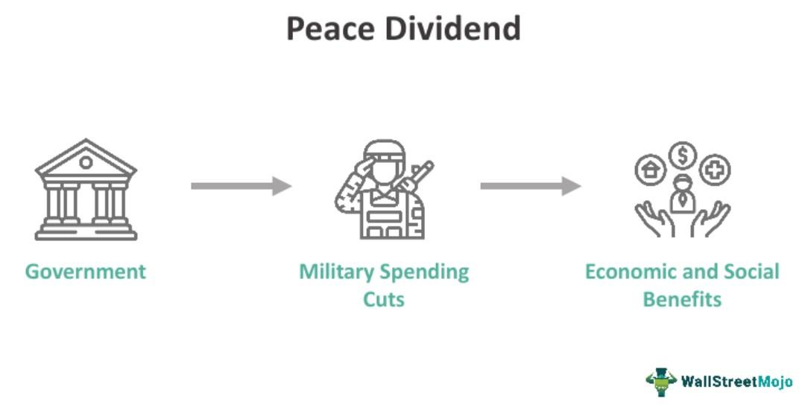

## Table of Contents

## What is a peace dividend?

A peace dividend is the money a country saves when it spends less on its military. After a war ends or when there is less tension between countries, governments might decide they don't need to spend as much on defense. This saved money can then be used for other things, like building roads, schools, or helping people in need.

Sometimes, people talk about a peace dividend when they hope that peace will bring economic benefits. For example, if two countries that used to fight a lot start trading with each other instead, both might see their economies grow. This growth can lead to more jobs and better lives for people in those countries. However, it's not always easy to see these benefits right away, and it depends a lot on what the governments choose to do with the money they save.

## How does the concept of a peace dividend originate?

The idea of a peace dividend started after big wars, like World War II. People saw how much money countries spent on fighting and thought about what could happen if that money was used for peaceful things instead. After the war ended, countries hoped to spend less on the military and more on things like hospitals and schools. This hope for better use of money after a war is where the term "peace dividend" comes from.

The term became popular again after the Cold War ended in the early 1990s. The United States and the Soviet Union had been spending a lot on their militaries because they were rivals. When the Cold War finished, people thought both countries could cut back on military spending and use the money for other things that would help their people. The idea of a peace dividend got a lot of attention as a way to make life better after years of tension and high military costs.

## What are the economic benefits associated with a peace dividend?

When a country spends less on its military because of peace, it can use the saved money to help its economy grow. This money can be used to build things like roads, schools, and hospitals. Better roads make it easier for businesses to move goods around, which can help them grow. Good schools and hospitals make people healthier and better educated, which means they can work more and earn more money. All of these things can lead to more jobs and a stronger economy.

Peace can also help trade between countries. When countries are not fighting, they can trade more easily. This can lead to more jobs in both countries because businesses can sell their products in new places. More trade can also mean lower prices for things people buy, because there is more competition. When people can buy things for less money, they have more money left over to spend on other things, which helps the economy grow even more.

## Can you explain the mechanisms through which a peace dividend is realized?

When a country spends less on its military because of peace, it saves money. This saved money is called the peace dividend. The government can then use this money for other things that help the country grow. For example, they might build new roads, schools, or hospitals. Better roads help businesses move their goods around more easily, which can make them more successful. Good schools and hospitals make people healthier and better educated, so they can work better and earn more money. All of this can lead to more jobs and a stronger economy.

Peace also makes it easier for countries to trade with each other. When countries are not fighting, they can buy and sell things more freely. This can create more jobs in both countries because businesses can sell their products in new places. More trade can also mean lower prices for things people buy, because there is more competition. When people can buy things for less money, they have more money left over to spend on other things, which helps the economy grow even more. So, the peace dividend is realized through better use of money saved from military spending and through increased trade between countries.

## What role do governments play in facilitating a peace dividend?

Governments play a big role in making a peace dividend happen. They decide how much money to spend on the military. When there is peace, governments can choose to spend less on the military and use that money for other things that help people. For example, they might build new roads, schools, or hospitals. This can make the economy grow because better roads help businesses, and good schools and hospitals make people healthier and better educated.

Governments also help by making it easier for countries to trade with each other when there is peace. They can make agreements that let businesses sell their products in new places. This can create more jobs and make things cheaper for people to buy. When people have more money to spend, it helps the economy grow even more. So, governments are important in deciding how to use the peace dividend to make life better for their people.

## How does disarmament contribute to the peace dividend?

Disarmament means countries get rid of some of their weapons and military stuff. When countries do this, they don't need to spend as much money on their military. This saved money is called the peace dividend. When countries spend less on the military, they can use the money for other things that help people, like building roads, schools, and hospitals. Better roads help businesses move their goods, which can make them more successful. Good schools and hospitals make people healthier and better educated, so they can work better and earn more money.

Disarmament also helps make peace between countries. When countries have fewer weapons, they are less likely to fight. This makes it easier for them to trade with each other. More trade can create more jobs because businesses can sell their products in new places. It can also make things cheaper for people to buy because there is more competition. When people can buy things for less money, they have more money to spend on other things, which helps the economy grow. So, disarmament helps create a peace dividend by saving money and making peace, which leads to a stronger economy.

## What are the challenges in measuring the impact of a peace dividend?

Measuring the impact of a peace dividend can be hard because it's not easy to see exactly how much money a country saves from spending less on the military. Sometimes, the savings are not clear because governments might still spend money on other things related to defense, like keeping old weapons safe or helping soldiers who are no longer fighting. Also, it can be tricky to know if the money saved is really being used for things that help the economy grow, like building roads or schools, or if it's just going into other parts of the government's budget.

Another challenge is that the effects of a peace dividend can take a long time to show up. For example, if a country builds a new school with the money saved from the military, it might take years before the students who go to that school start working and help the economy grow. Also, other things happening in the world, like changes in trade or new technology, can make it hard to tell if any good changes are because of the peace dividend or something else. So, figuring out exactly how much a peace dividend helps can be like trying to solve a puzzle with many pieces.

## How do different countries approach the utilization of a peace dividend?

Different countries use the money they save from spending less on the military in different ways. Some countries might decide to spend the money on things that help their people right away, like building new roads or hospitals. For example, after the Cold War, some countries in Europe used the money they saved to help their economies grow by investing in new businesses and making their cities better places to live. Other countries might choose to save the money or pay off debts, which can help them in the long run but might not make a big difference right away.

In some places, the government might not use the peace dividend to help the economy grow at all. They might spend the money on other things that don't help as many people, like building big monuments or holding big events. In other cases, countries might try to use the peace dividend to help other countries that need it more. For example, some rich countries might give the money they save to poorer countries to help them build schools or fight diseases. So, how a country uses its peace dividend can depend a lot on what the government thinks is important.

## What are the social and political implications of a peace dividend?

When a country saves money because it doesn't need to spend as much on its military, it can use that money to help people in other ways. This can make life better for a lot of people. For example, if the government builds new schools and hospitals with the money, people can get a better education and better healthcare. This can make people happier and healthier, which can make the whole country a nicer place to live. But, if the government doesn't use the money to help people, and instead spends it on things that don't help as many people, it can make people feel unhappy and left out.

The way a government chooses to use the peace dividend can also affect politics. If people see that the money is being used to help them, they might be more likely to support the government. But, if they see the money being wasted or used for things that don't help them, they might get angry and want to vote for someone else. Also, if the government decides to help other countries with the money, it can make people argue about whether that's a good idea. Some people might think it's important to help others, while others might think the money should be used to help people at home first. So, the peace dividend can make a big difference in how people feel about their government and each other.

## How can the peace dividend be sustained over time?

To keep the peace dividend going over time, countries need to keep spending less on their military. This means they have to work hard to stay peaceful with other countries. They can do this by talking to each other and making agreements not to fight. If they can do this, they won't need to buy as many weapons or keep as many soldiers, and they can keep saving money. This money can then be used to help people in other ways, like building schools and hospitals, which can make the country a better place to live.

It's also important for governments to use the money they save wisely. If they use it to help people and make the economy grow, people will be happier and the country will do well. But, if they waste the money or use it for things that don't help many people, it can make people unhappy and the peace dividend might not last. So, to keep the peace dividend going, countries need to stay peaceful and use the money they save in smart ways that help everyone.

## What are some historical examples where a peace dividend was successfully implemented?

After World War II ended, many countries in Europe saw a peace dividend. They didn't need to spend as much money on their military anymore. Instead, they used the money to rebuild their countries. They built new roads, schools, and hospitals. This helped their economies grow and made life better for a lot of people. For example, Germany used the peace dividend to help rebuild its cities and factories, which helped it become a strong economy again.

Another good example is after the Cold War ended in the early 1990s. The United States and Russia didn't need to spend as much on their military anymore because they weren't rivals anymore. The United States used some of the money it saved to help its economy grow. They spent it on things like education and health care. This helped a lot of people and made the country a better place to live. Russia also tried to use its peace dividend to help its people, but it had a harder time because its economy was not as strong.

## What advanced economic theories support the concept of a peace dividend?

Some advanced economic theories that support the idea of a peace dividend come from the field of public finance. These theories say that when a government spends less money on its military, it can use the saved money to help its people in other ways. For example, it can invest in things like schools, hospitals, and roads. These investments can make the economy grow because better schools help people get better jobs, better hospitals keep people healthy, and better roads help businesses move their goods. Economists call this kind of spending "public investment," and they think it can lead to a stronger economy over time.

Another set of theories comes from the field of international trade. These theories say that when countries are at peace, they can trade more easily with each other. When countries trade more, they can sell their products in new places and buy things they need from other countries. This can create more jobs and make things cheaper for people to buy. Economists think that more trade can make the economy grow, and they call this the "gains from trade." So, when countries are at peace and can trade more, they can use the peace dividend to make their economies stronger.

## What are the challenges in realizing peace dividends?

Realizing peace dividends presents several challenges, primarily influenced by security concerns, economic dependencies, and political dynamics. In conflict-prone regions, the feasibility of reducing military expenditures is complicated by ongoing security threats. Countries in such areas often face geopolitical tensions that make military readiness a priority, thus reducing the scope to reallocate defense budgets without potentially compromising national security. 

Economies heavily reliant on defense industries confront significant disruptions when military spending is curtailed. These economies may experience issues such as unemployment, reduced industrial output, and slowed technological advances. For instance, sudden reductions in defense budgets can lead to job losses and decreased economic activity in regions where the defense sector plays a central role. The economic model for regions dependent on military spending can be symbolically represented as:

$$
E_{total} = E_{defense} + E_{other}
$$

Here, $E_{total}$ is the total economic output, $E_{defense}$ represents the contribution of defense-related activities, and $E_{other}$ includes all other sectors. Significant reductions in $E_{defense}$ can lead to a substantial impact on $E_{total}$ if not counterbalanced by other economic activities.

Additionally, political resistance presents another layer of complexity. Defense budgets are often supported by strong political constituencies, including industries benefiting from military contracts and communities reliant on defense-related employment. These groups may resist changes that could undermine their economic well-being. Moreover, political leaders may perceive reductions in defense budgets as a sign of weakening national sovereignty or diminishing military influence, impacting policy decisions.

The intricate balance of addressing security needs, mitigating economic impacts, and navigating political landscapes underscores the multifaceted challenges in realizing peace dividends. Overcoming these hurdles requires strategic planning, ensuring economic diversification, and maintaining political consensus to effectively redirect defense spending towards socio-economic development.

## References & Further Reading

[1]: Ball, N. (1983). ["Defense and Development: A Critical Analysis of the Peace Dividend Concept."](https://link.springer.com/chapter/10.1007/978-1-349-23695-4_23) Routledge.

[2]: Smith, R. P. (2000). ["The Economic Impact of Military Expenditure: A Survey of the Recent Literature."](https://www.epsjournal.org.uk/index.php/EPSJ/article/view/143) Journal of Peace Research, 37(2), 277-289.

[3]: ["The Peace Dividend: Military Spending Cuts and Economic Growth."](https://www.imf.org/en/Publications/WP/Issues/2016/12/30/The-Peace-Dividend-Military-Spending-Cuts-and-Economic-Growth-1871) IMF Working Paper, 1996.

[4]: Hartley, K., & Sandler, T. (Eds.). (1990). ["The Economics of Defence Spending: An International Survey."](https://www.thefreelibrary.com/The+Economics+of+Defence+Spending%3A+An+International+Survey.-a012880481) Routledge.

[5]: Dunne, J. P., & Tian, N. (2015). ["Military Spending and Economic Growth: A Survey."](https://www.semanticscholar.org/paper/Military-expenditure-and-economic-growth%3A-A-survey-Dunne-Tian/506f866f5921827998d1ae872984820e2333c6f0) The Economics of Peace and Security Journal, 10(1), 5-11.

[6]: Clearwater, A., & McNamara, R. (1990). ["Post-Cold War Defense Spending: Economic Realities and Political Choices."](https://www.jstor.org/stable/2749605) Brookings Institution.

[7]: Ruttan, V. W. (2006). ["Is War Necessary for Economic Growth? Military Procurement and Technology Development."](https://academic.oup.com/book/8022) Oxford University Press.

[8]: ["The Military Peace Hypothesis and the Effect of Military Expenditure on Growth: A Meta-Analysis."](https://www.sciencedirect.com/science/article/pii/S0176268012000432) Economic Systems, Vol 35, Issue 3.