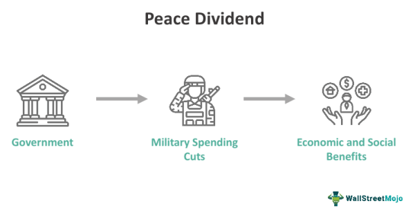

The concept of a peace dividend emerges from the notion that reduced military expenditure following conflicts can allow for the reallocation of financial resources toward fostering economic growth and enhancing social welfare. This transition aims to take advantage of the fiscal space created by decreasing defense budgets, channeling these resources into domestic priorities such as education, healthcare, and infrastructure development.

This article examines the multifaceted ways in which peace dividends influence the economy and affect sectors such as defense spending and algorithmic trading. It highlights the potential of strategic redirection of funds to stimulate economic development by examining both historical examples and contemporary economic implications. 



A comprehensive understanding of the relationship between defense spending and economic growth necessitates a thorough analysis of past global events where peace dividends have played a significant role as well as considering current economic trends and challenges. For instance, the end of the Cold War marked a significant shift in military spending patterns that several nations leveraged to enhance economic development through increased investments in civilian sectors. 

In summary, analyzing how reduced military expenditure can boost economic productivity and social well-being offers valuable insights into achieving sustainable economic development and highlights potential areas of opportunity for various sectors, including emerging financial technologies and trading methodologies.

## Table of Contents

## The Peace Dividend Concept

A peace dividend refers to the economic benefits derived from a government's decision to reduce defense spending following the end of a military conflict. This economic construct suggests that the resources previously allocated to military budgets can be redirected towards domestic priorities, such as infrastructure, education, and healthcare, which can stimulate economic growth and societal well-being.

The notion of a peace dividend gained significant attention after the Cold War era, during which many nations anticipated enhanced economic development following the substantial reduction in armed conflicts and subsequent defense expenditures. The hypothesis underpinning the peace dividend concept posits that when military budgets are slashed, funds can be reallocated to other sectors that directly contribute to an economy's flourishing. For example, investing in infrastructure projects can lead to job creation and improved efficiency in the movement of goods and services, while funding education efforts can enhance human capital.

Empirical studies support the idea that reduced defense spending can yield economic benefits. For instance, a study by the International Monetary Fund found that cutting military expenditures by 1% of GDP could increase economic growth over the long term, as resources are freed for more productive uses. Furthermore, countries that have successfully redirected military budget savings to development-intensive sectors have often experienced sustainable economic growth and improved social indicators, substantiating the positive correlation between peace dividends and economic expansion.

Overall, the peace dividend concept not only highlights the potential for economic growth through strategic fiscal reallocation but also emphasizes the broader socio-economic benefits, such as increased public welfare and reduced government debt burdens. By carefully managing the transition from defense to development spending, nations can harness the peace dividend to support sustainable and inclusive economic and social progress.

## Economic Implications of Reduced Defense Spending

Reducing defense spending can significantly impact an economy by reallocating resources to civilian sectors, enhancing overall productivity. When funds previously allocated to military budgets are redirected towards areas such as infrastructure, healthcare, and education, this reallocation fosters economic growth and stability. This process involves shifting labor and capital resources to more productive uses, contributing to increased economic efficiency.

Investments in human capital, such as education and healthcare, can yield substantial long-term benefits. These sectors are critical to enhancing the workforce's quality and overall productivity, leading to sustainable economic development. Infrastructure investments can also play a crucial role, as improved transportation networks, communication systems, and utilities enhance economic activities and trade efficiencies.

Fiscal savings are another advantage of reduced defense budgets. When defense spending decreases, governments can experience reduced fiscal pressures, which may lead to lower budget deficits or even surpluses. These savings can be utilized to reduce national debt or reinvest in other areas of economic growth. Additionally, the reduction in defense commitments can alleviate the need for high taxation, potentially resulting in reduced tax burdens on citizens and businesses, thereby increasing disposable income and consumption.

Moreover, this strategic reallocation can spur innovation and technological advancements as resources are directed towards research and development in civilian industries. The multiplier effect of spending in these sectors can further amplify economic benefits, as increased demand for goods and services generates additional employment and income, further stimulating economic activities.

In conclusion, reducing defense budgets and reallocating resources to civilian sectors can lead to enhanced economic productivity, long-term stability, and fiscal savings, ultimately fostering a more resilient and diversified economy.

## Challenges in Realizing Peace Dividends

Realizing peace dividends presents several challenges, primarily influenced by security concerns, economic dependencies, and political dynamics. In conflict-prone regions, the feasibility of reducing military expenditures is complicated by ongoing security threats. Countries in such areas often face geopolitical tensions that make military readiness a priority, thus reducing the scope to reallocate defense budgets without potentially compromising national security. 

Economies heavily reliant on defense industries confront significant disruptions when military spending is curtailed. These economies may experience issues such as unemployment, reduced industrial output, and slowed technological advances. For instance, sudden reductions in defense budgets can lead to job losses and decreased economic activity in regions where the defense sector plays a central role. The economic model for regions dependent on military spending can be symbolically represented as:

$$
E_{total} = E_{defense} + E_{other}
$$

Here, $E_{total}$ is the total economic output, $E_{defense}$ represents the contribution of defense-related activities, and $E_{other}$ includes all other sectors. Significant reductions in $E_{defense}$ can lead to a substantial impact on $E_{total}$ if not counterbalanced by other economic activities.

Additionally, political resistance presents another layer of complexity. Defense budgets are often supported by strong political constituencies, including industries benefiting from military contracts and communities reliant on defense-related employment. These groups may resist changes that could undermine their economic well-being. Moreover, political leaders may perceive reductions in defense budgets as a sign of weakening national sovereignty or diminishing military influence, impacting policy decisions.

The intricate balance of addressing security needs, mitigating economic impacts, and navigating political landscapes underscores the multifaceted challenges in realizing peace dividends. Overcoming these hurdles requires strategic planning, ensuring economic diversification, and maintaining political consensus to effectively redirect defense spending towards socio-economic development.

## Impacts on Algorithmic Trading

Algorithmic trading, utilizing computer programs to execute financial trades at high speeds, often relies on market data and trends to optimize trading strategies. The concept of a peace dividend, which entails reallocating funds from military to civilian use, can substantially influence market sentiment and, by extension, the performance of [algorithmic trading](/wiki/algorithmic-trading) systems. 

When peace dividends occur, there is typically an anticipated economic stabilization, as more resources become available for domestic initiatives such as infrastructure, education, and healthcare. This reallocation can foster investor confidence, often resulting in increased stock market valuations. Positive market sentiment creates a fertile environment for algorithmic traders who exploit these trends to maximize returns. For instance, a sudden decrease in defense spending might lead to an increase in investments in technology or construction companies, which algorithmic trading systems can capitalize on by quickly adjusting their trading portfolios.

To effectively harness the potential benefits of peace dividends, algorithmic systems often utilize predictive analytics to identify patterns in data related to defense spending and economic growth. By analyzing historical data alongside current economic indicators, traders can forecast potential market movements. For example, an algorithm might assess historical correlations between reductions in military expenditure and subsequent increases in specific sectors, allowing traders to make informed decisions.

Here's a simplified example of how an algorithm might use historical data to predict market impacts:

```python
import pandas as pd
from sklearn.model_selection import train_test_split
from sklearn.linear_model import LinearRegression
import numpy as np

# Sample data: historical military spending vs. economic sector growth metrics
data = {
    'Defense_Spending': [500, 480, 450, 430, 400],
    'Tech_Growth': [2.0, 2.5, 3.0, 3.5, 4.0],
    'Construction_Growth': [1.5, 1.8, 2.1, 2.4, 2.9]
}

df = pd.DataFrame(data)

# Feature and target variables
X = df[['Defense_Spending']]
y_tech = df['Tech_Growth']
y_construction = df['Construction_Growth']

# Splitting the data
X_train, X_test, y_tech_train, y_tech_test = train_test_split(X, y_tech, test_size=0.2, random_state=0)
X_train, X_test, y_construction_train, y_construction_test = train_test_split(X, y_construction, test_size=0.2, random_state=0)

# Linear regression model for technology growth
model_tech = LinearRegression()
model_tech.fit(X_train, y_tech_train)
tech_predictions = model_tech.predict(X_test)

# Linear regression model for construction growth
model_construction = LinearRegression()
model_construction.fit(X_train, y_construction_train)
construction_predictions = model_construction.predict(X_test)

print("Predicted Tech Growth:", tech_predictions)
print("Predicted Construction Growth:", construction_predictions)
```

In essence, algorithmic trading systems benefit from a peace dividend by exploiting the increased economic predictability and reduced uncertainty associated with enhanced social welfare investments. By leveraging data-driven techniques, these systems can anticipate and navigate shifts in economic conditions, maximizing returns and underpinning robust market engagement.

## Case Studies and Examples

Post-Cold War reductions in defense budgets in the U.S. and Europe illustrate the transformative potential of a peace dividend. Following the dissolution of the Soviet Union, these regions experienced a significant decrease in military expenditures. This shift enabled the reallocation of resources towards various social programs, thereby contributing to economic growth and societal well-being. For example, the United States redirected funds to initiatives such as education, healthcare, and infrastructure improvements, which collectively enhanced the quality of life and supported economic expansion.

Germany's reunification in 1990 stands as a prime example of a successful peace dividend application. With the fall of the Berlin Wall and the subsequent reunification, Germany redirected substantial defense funds towards the reconstruction and development of East Germany. This strategic allocation of financial resources facilitated infrastructure development, modernization of industry, and improvements in living standards, thereby integrating East Germany more fully into the national and global economy. The economic disparity between East and West Germany gradually diminished as investments in East Germany accelerated its economic growth and development.

East Asia presents another compelling example, where a focus on development rather than military expenditure has fueled notable economic growth. Countries in this region, often referred to as the "East Asian Tigers"—including South Korea, Taiwan, Singapore, and Hong Kong—opted for strategies that emphasized economic growth over military expansion. By prioritizing industrialization, technology, and education, these nations achieved rapid economic growth and development. Their emphasis on building strong, export-oriented economies contributed to significant reductions in poverty and improvements in living standards.

These case studies illustrate the diverse ways in which peace dividends can be realized, their effectiveness contingent upon strategic investment in social and economic sectors. Each scenario underscores the potential for redirected defense spending to drive societal advancement and foster economic stability.

## Conclusion

A peace dividend presents notable possibilities for socio-economic advancement by reallocating resources previously dedicated to defense towards developmental initiatives. However, realizing these benefits hinges on the existence of stable political and economic environments. Without stability, the transition of funds from military allocations to areas such as education, healthcare, and infrastructure may face significant hurdles, thus hampering prospects for growth.

Despite its theoretical appeal, achieving tangible peace dividends is fraught with practical challenges. Political resistance from defense-related constituencies, as well as economic dependencies on military industries, can impede efforts to reduce defense budgets. Moreover, the security landscape in unstable regions may mandate sustained defense expenditures, further complicating the potential for reallocating resources towards developmental objectives.

Nevertheless, strategically investing defense budget savings into development projects holds the promise of stimulating economic growth and encouraging international cooperation. By channeling funds into human capital, technology, and infrastructure, nations can foster environments that promote sustainable growth and enhance global stability. Successful examples, such as the reallocation of defense funds in post-Cold War Europe and East Asia's focus on economic development, underscore the potential of peace dividends to drive progress. While challenges remain, a focused approach to the strategic redirection of defense savings offers a pathway toward a more prosperous and cooperative global future.

## References & Further Reading

[1]: Ball, N. (1983). ["Defense and Development: A Critical Analysis of the Peace Dividend Concept."](https://link.springer.com/chapter/10.1007/978-1-349-23695-4_23) Routledge.

[2]: Smith, R. P. (2000). ["The Economic Impact of Military Expenditure: A Survey of the Recent Literature."](https://www.epsjournal.org.uk/index.php/EPSJ/article/view/143) Journal of Peace Research, 37(2), 277-289.

[3]: ["The Peace Dividend: Military Spending Cuts and Economic Growth."](https://www.imf.org/en/Publications/WP/Issues/2016/12/30/The-Peace-Dividend-Military-Spending-Cuts-and-Economic-Growth-1871) IMF Working Paper, 1996.

[4]: Hartley, K., & Sandler, T. (Eds.). (1990). ["The Economics of Defence Spending: An International Survey."](https://www.thefreelibrary.com/The+Economics+of+Defence+Spending%3A+An+International+Survey.-a012880481) Routledge.

[5]: Dunne, J. P., & Tian, N. (2015). ["Military Spending and Economic Growth: A Survey."](https://www.semanticscholar.org/paper/Military-expenditure-and-economic-growth%3A-A-survey-Dunne-Tian/506f866f5921827998d1ae872984820e2333c6f0) The Economics of Peace and Security Journal, 10(1), 5-11.

[6]: Clearwater, A., & McNamara, R. (1990). ["Post-Cold War Defense Spending: Economic Realities and Political Choices."](https://www.jstor.org/stable/2749605) Brookings Institution.

[7]: Ruttan, V. W. (2006). ["Is War Necessary for Economic Growth? Military Procurement and Technology Development."](https://academic.oup.com/book/8022) Oxford University Press.

[8]: ["The Military Peace Hypothesis and the Effect of Military Expenditure on Growth: A Meta-Analysis."](https://www.sciencedirect.com/science/article/pii/S0176268012000432) Economic Systems, Vol 35, Issue 3.