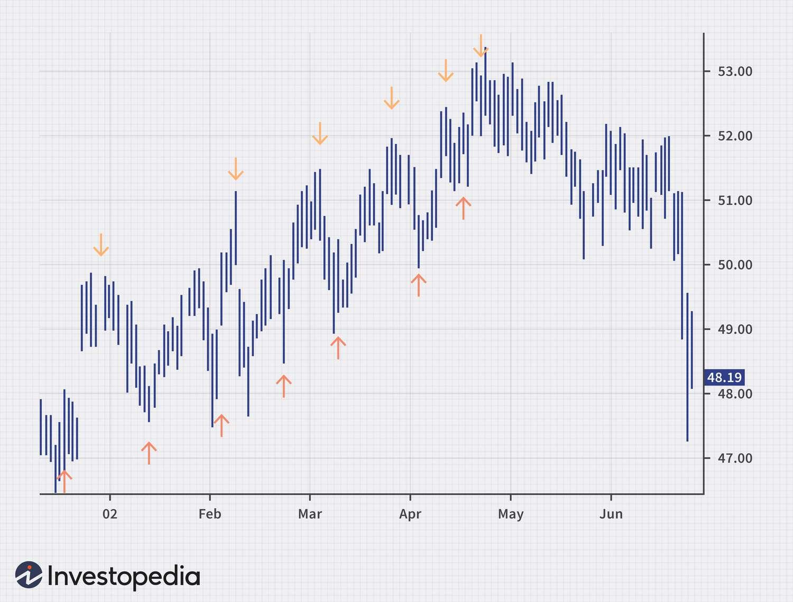

Peak-and-trough analysis is a fundamental tool in financial markets, used to identify and anticipate market trends and movements. This method looks at price movements and distinguishes between peaks (high points) and troughs (low points). By examining the succession of these peaks and troughs over time, traders and analysts can infer whether a market is trending upward, downward, or moving sideways in a range-bound market.

The significance of peak-and-trough patterns in identifying market trends is profound. In an uptrend, consecutive peaks and troughs will generally be higher than previous ones, indicating that the demand is outstripping supply. Conversely, in a downtrend, the peaks and troughs will tend to be lower than previous ones, suggesting supply exceeds demand. These patterns help traders determine entry and exit points in the market, manage risk, and enhance the accuracy of their trading strategies.



Algorithmic trading, a significant evolution in financial markets, leverages peak-and-trough analysis for increased computational efficiency and precision. Algorithms are designed to execute trades at high speed and use data-driven strategies based on technical indicators and historical pattern recognition, such as peaks and troughs. These algorithms incorporate mathematical models and statistical techniques to predict future price movements, swiftly respond to market changes, and execute trades with minimal human intervention. 

For example, the following Python code snippet illustrates how simple peak-and-trough analysis could be integrated into quantitative trading strategies using libraries like Pandas and NumPy:

```python
import pandas as pd
import numpy as np
from scipy.signal import find_peaks

# Sample market data (Price Series)
data = {'Price': [100, 102, 105, 104, 107, 111, 109, 113, 112, 115, 114]}
df = pd.DataFrame(data)

# Find peaks
peaks, _ = find_peaks(df['Price'])
troughs, _ = find_peaks(-df['Price'])

# Output peaks and troughs
print("Peaks at index:", peaks)
print("Troughs at index:", troughs)
```

In this code, the `find_peaks` function from the SciPy library is used to detect peaks (high points) and troughs (low points by negating the price) in a series of prices. Understanding and correctly implementing these patterns can be crucial for [algorithmic trading](/wiki/algorithmic-trading) strategies, promising substantial financial success due to the speed and pattern recognition capabilities of algorithms.

The integration of peak-and-trough analysis into algorithmic trading underscores its enduring relevance, as traders continue to seek out efficient methods to capture trends and minimize risks in various financial markets. This analysis remains a critical component for both manual and automated trading systems, and its principles are invaluable in developing comprehensive investment strategies.

## Table of Contents

## Understanding Peaks and Troughs

Peaks and troughs are fundamental concepts in the analysis of financial markets, particularly in understanding price movements over time. A peak represents the highest point reached by an asset's price before it begins to fall, while a trough is the lowest point before the price starts to rise again. These points are crucial in identifying trends, as they help distinguish between an upward, downward, or sideways market movement.

These patterns are universally applicable across various asset classes, including stocks, bonds, commodities, and currencies. Regardless of the asset being analyzed, the principles of peaks and troughs remain consistent, making them versatile tools for traders and investors. The recognition of these patterns can assist in making informed decisions about entering or exiting trades, setting stop-loss orders, and determining potential price targets.

Charting software, such as TradingView or MetaTrader, plays a significant role in identifying peaks and troughs. These tools provide traders with graphical representations of price movements, allowing for easier visualization of trends. Indicators like moving averages, Bollinger Bands, and Relative Strength Index (RSI) can enhance the identification process. For instance, moving averages can smooth out price data to highlight trends, while RSI can indicate whether a market is overbought or oversold, pinpointing potential peak or trough areas.

By combining visual chart patterns with technical indicators, traders can gain a more comprehensive understanding of market dynamics. Software features often include automatic trend line detection algorithms, which analyze historical data to predict future price movements. These advanced tools can also be configured with custom scripts in programming languages like Python to automate the detection of specific patterns, providing a robust framework for market analysis. 

Understanding and utilizing peaks and troughs are invaluable for navigating financial markets, offering insights into trend direction and potential turning points. These elements, universally applicable across asset classes, are integral to effective trading strategies.

## The Dynamics of Rising Peaks and Troughs

Rising peaks and troughs are characteristic of an uptrend in financial markets. This pattern indicates increasing asset prices over time, with each subsequent peak being higher than the previous one, and each trough also higher than the last. Such movements reflect sustained buying interest and growing investor confidence in the asset's prospects. The identification of this pattern provides traders with directional bias, aiding them in making informed buy or hold decisions.

In practice, the dynamics of rising peaks and troughs can be observed across various time frames and asset types. For instance, consider the historical analysis of the S&P 500 index during a bull market phase. As the index progresses upwards, a clear sequence of escalating peaks and troughs can be identified, demonstrating investor optimism and market strength.

To accurately evaluate trend strength, it's crucial to focus on the appropriate time frames. Short-term charts, such as intraday or daily charts, might highlight temporary fluctuations and noise. In contrast, longer-term charts, such as weekly or monthly views, provide a cleaner perspective on the prevailing trend direction. For example, a stock might display rising peaks and troughs on a daily chart, temporarily interrupted by dips or consolidations, yet exhibit a strong uptrend on a weekly chart. This emphasizes the importance of aligning the analysis with investment goals — whether short-term trading or long-term investing.

In quantitative terms, the significance of higher highs (peaks) and higher lows (troughs) in determining an uptrend can be integrated into trading algorithms. A simple Python script could involve analyzing price data to identify trends using moving averages or other technical indicators. Here’s a basic example of how one might implement peak-and-trough analysis in Python:

```python
import pandas as pd

# Assume df is a DataFrame with columns 'Date' and 'Price'
def identify_trend(df, lookback=5):
    peaks = []
    troughs = []
    for i in range(lookback, len(df) - lookback):
        window = df['Price'][i - lookback:i + lookback]
        if df['Price'][i] == max(window):
            peaks.append(df['Price'][i])
        elif df['Price'][i] == min(window):
            troughs.append(df['Price'][i])

    # Rising peaks and troughs check
    rising = all(y > x for x, y in zip(peaks, peaks[1:])) and all(y > x for x, y in zip(troughs, troughs[1:]))

    return rising

```
This function examines a rolling window of data points to identify local peaks and troughs. By storing these in lists, it then checks whether each subsequent peak and trough is higher than the previous one, confirming the presence of an uptrend.

In conclusion, recognizing the dynamics of rising peaks and troughs is essential in technical analysis, serving as fundamental components for identifying and confirming uptrends. Traders and investors who master this concept can better position themselves in capitalizing on market opportunities. Proper understanding and implementation of appropriate time frames are vital to taking advantage of this analysis effectively.

## Breaking Trend: Confirmation and Reversals

Peak-and-trough analysis provides a robust framework for confirming breaches of trendlines, a common method used by traders to determine changes in price direction. Trendlines are constructed by connecting significant peaks and troughs on a price chart. When a price breaks through a trendline, it often signals a potential reversal or continuation of a trend. This analysis becomes crucial in validating whether a breach signifies a real change in trend or a false signal. For instance, a break of an upward trendline drawn through descending peaks might suggest a shift to a downtrend. Conversely, breaking below a downward trendline connecting rising troughs could indicate an emerging uptrend.

Understanding investor psychology is pivotal in peak-and-trough analysis. Market trends often reflect collective investor sentiment, encapsulating fear and greed dynamics. A series of rising peaks and troughs suggest optimism, where each peak represents a new price high fueled by increasing demand. Conversely, diminishing peaks and troughs indicate waning [momentum](/wiki/momentum) and potential trend reversal. When a trendline is breached, it may either stem from irrational exuberance or panic selling, signifying shifts in confidence levels among traders. Recognizing these psychological cues can enhance the predictive capability of peak-and-trough analysis, revealing deeper insights into underlying market movements.

Reliable techniques for anticipating trend reversals include analyzing momentum oscillators and [volume](/wiki/volume-trading-strategy) indicators alongside peak-and-trough pattern identification. Momentum oscillators, like the Relative Strength Index (RSI) or Moving Average Convergence Divergence (MACD), help gauge the strength of a trend and identify overbought or oversold conditions. These tools, when used in conjunction with a break in trendline, can provide additional confirmation of a trend reversal. A weakening momentum coupled with a breached trendline suggests a higher probability of trend change.

Additionally, analyzing trading volume during trendline breaches offers valuable confirmation. If significant volume accompanies the breach, it could imply that substantial market participation backs the move, reinforcing its validity. Conversely, if a trendline break occurs on low volume, it might signal a false [breakout](/wiki/breakout-trading), warranting caution.

Incorporating these techniques allows investors to make informed decisions, enhancing their ability to anticipate and confirm trend reversals accurately. Through a careful combination of psychological insight and technical analysis, peak-and-trough analysis remains a vital tool in navigating the complexities of financial markets.

## The Rule of Thumb: Consolidation and Its Pitfalls

Consolidation in financial markets refers to a period where the price of an asset trades within a specific range, typically due to a temporary equilibrium between supply and demand. During these phases, the market experiences low [volatility](/wiki/volatility-trading-strategies) as neither buyers nor sellers dominate, resulting in horizontal price movements on a price chart. Consolidation is an essential concept in market analysis as it often precedes significant price movements or trend reversals. Recognizing consolidation periods can help traders prepare for potential breakout or breakdown scenarios, thus optimizing entry and [exit](/wiki/exit-strategy) strategies.

To identify consolidation, traders often look for specific chart patterns such as rectangles or triangles, which indicate a narrowing range of price movement. These patterns are characterized by multiple price touches on horizontal or converging trendlines without the price breaking through these lines. Technical indicators like the Bollinger Bands can be useful in identifying consolidation. When the bands squeeze or narrow considerably, it suggests reduced volatility and a potential consolidation zone. For a more quantitative approach, the Average True Range (ATR) indicator can help highlight diminishing volatility, indicating consolidation.

However, interpreting consolidation correctly is crucial, as it is easy to misjudge these phases as trend reversals. One common mistake is assuming that every breakout from a consolidation pattern will lead to a trend continuation or reversal. False breakouts are frequent, where the price moves briefly beyond the consolidation range before returning within it. To mitigate this risk, traders should look for confirmation signals, such as increased volume accompanying the breakout or alignment with other technical indicators, to validate the breakout's authenticity.

Practicing caution during consolidation periods, traders can refine their strategies by setting stop-loss orders just outside identified consolidation zones to prevent significant losses due to false signals. Understanding the nuances of consolidation and its pitfalls enables traders to enhance their market analysis, paving the way for more informed decision-making and optimized trading outcomes.

## Algorithmic Trading and Peak-and-Trough Analysis

Peak-and-trough analysis plays a vital role in developing algorithmic trading strategies. This analytical approach helps algorithms determine the direction and strength of market trends by examining the sequential movements of peaks (high points) and troughs (low points) in asset prices. Automated trading systems incorporate these patterns to signal potential entry or exit points, thus enabling more systematic and emotion-free trading decisions.

### Integration with Technical Indicators and AI

Algorithmic trading leverages technical indicators such as moving averages, Relative Strength Index (RSI), and Bollinger Bands in conjunction with peak-and-trough analysis. These indicators help traders identify trends and confirm signals generated by peak-and-trough patterns. For example, a crossover of moving averages might validate a new upward trend reflected in the form of higher peaks and higher troughs.

AI-based algorithms add another layer of sophistication by implementing [machine learning](/wiki/machine-learning) techniques to analyze vast datasets and improve predictive accuracy. Machine learning models, such as neural networks, can be trained to recognize peak-and-trough patterns within historical price data, enhancing the system's ability to predict future market movements. These AI models can process information at a speed and accuracy beyond human capability, offering a significant edge in high-frequency trading environments.

### Benefits and Challenges

The integration of peak-and-trough analysis in algorithms offers several advantages. One of the primary benefits is the ability to process large volumes of market data in real-time, leading to quicker decision-making. Algorithms can swiftly detect emerging trends and execute trades at optimal moments, thereby maximizing potential returns. Furthermore, this approach reduces human errors and biases, which can often lead to suboptimal trading decisions.

However, challenges do exist. The effectiveness of algorithmic systems heavily relies on the quality of data and the robustness of the algorithms used. Poor data quality can lead to incorrect pattern identification, while inadequately designed algorithms may fail to adapt to changing market conditions. Moreover, high-frequency trading, supported by these algorithms, raises concerns about market stability and fairness, as it can lead to increased volatility and market manipulations.

In conclusion, while peak-and-trough analysis substantially enhances algorithmic trading strategies, it requires careful consideration of technical indicators, data quality, and algorithm adaptability to ensure effective implementation and reliable trading performance.

## Conclusion

Throughout this article, we have examined the essential role that peak-and-trough analysis plays in financial markets. This method provides valuable insights into market trends and price movements, empowering traders and investors to make informed decisions. The universality of these patterns across various asset classes highlights their importance in chart analysis and trend identification.

We explored how peak-and-trough analysis aids in discerning market direction by tracking rising and falling price levels. This analysis is particularly significant in identifying uptrends and downtrends, allowing investors to align their strategies with prevailing market conditions. Real-world examples, alongside the technical tools designed to recognize these patterns, underscore the practical applications of this analysis in day-to-[day trading](/wiki/day-trading-spy) activities.

The importance of time frames was also discussed, noting that different time frames can influence the perception of trend strength. By using peak-and-trough analysis, traders can confirm trendline breaches and anticipate potential reversals, thus mitigating risks inherent in trading activities. Additionally, understanding consolidation periods is crucial to prevent mistaking them for trend reversals, which can otherwise lead to costly errors.

Furthermore, peak-and-trough analysis has been shown to augment algorithmic trading strategies. By integrating technical indicators and advanced algorithms, traders can automate the identification of market opportunities, maximizing benefits while being mindful of the associated challenges.

In conclusion, the enduring relevance of peak-and-trough analysis in financial markets cannot be overstated. By incorporating this analysis into investment strategies, investors can enhance their ability to navigate complex market environments. It serves as a foundation for more advanced trading techniques and continues to be a pivotal tool for both novice and experienced investors in achieving financial success.

## References & Further Reading

[1]: Aronson, D. R. (2007). ["Evidence-Based Technical Analysis: Applying the Scientific Method and Statistical Inference to Trading Signals"](https://onlinelibrary.wiley.com/doi/book/10.1002/9781118268315). John Wiley & Sons.

[2]: Chan, E. (2008). ["Quantitative Trading: How to Build Your Own Algorithmic Trading Business"](https://github.com/ftvision/quant_trading_echan_book). John Wiley & Sons.

[3]: Jansen, S. (2020). ["Machine Learning for Algorithmic Trading"](https://github.com/stefan-jansen/machine-learning-for-trading). Packt Publishing.

[4]: Lopez de Prado, M. (2018). ["Advances in Financial Machine Learning"](https://books.google.com/books/about/Advances_in_Financial_Machine_Learning.html?id=oU9KDwAAQBAJ). John Wiley & Sons.

[5]: Bergstra, J., Bardenet, R., Bengio, Y., & Kégl, B. (2011). ["Algorithms for Hyper-Parameter Optimization."](https://dl.acm.org/doi/10.5555/2986459.2986743) Advances in Neural Information Processing Systems 24.