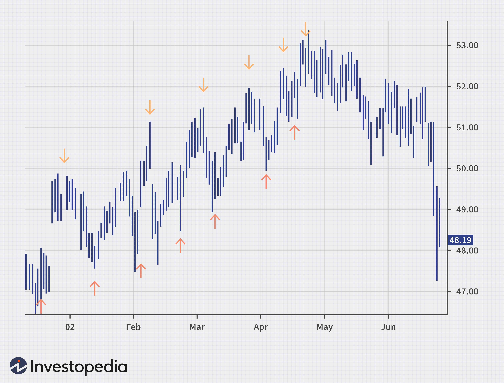

## Table of Contents

## What is peak and trough analysis?

Peak and trough analysis is a way to look at data over time to find the highest and lowest points. Imagine you are tracking the temperature every day for a month. The peak would be the hottest day, and the trough would be the coldest day. This method is used in many fields, like finance to see when stock prices are at their highest and lowest, or in medicine to monitor drug levels in a patient's blood.

In business, peak and trough analysis helps companies understand their sales patterns. For example, a toy store might see peaks during the holiday season when sales are high, and troughs during slower months. By knowing these patterns, the store can plan better for inventory and marketing. This analysis can also show trends over longer periods, helping businesses make smarter decisions about future plans.

## Why is peak and trough analysis important in data analysis?

Peak and trough analysis is important in data analysis because it helps us see the highest and lowest points in data over time. This is useful in many areas, like business, where it can show when sales are at their best or worst. By knowing these peaks and troughs, a company can plan better. For example, a store might stock up more before a peak sales period or run special deals during a trough to boost sales.

This analysis also helps in understanding patterns and trends. If a business sees that sales peak every year in December, they can prepare for this by increasing staff or inventory. On the other hand, if sales trough in January, they might plan sales or promotions to keep business steady. By looking at these patterns, companies can make smarter decisions and improve their overall performance.

## How can peak and trough analysis be applied in financial markets?

Peak and trough analysis is very useful in financial markets. It helps traders and investors see when stock prices are at their highest and lowest points. By looking at these peaks and troughs, they can make better decisions about when to buy or sell stocks. For example, if a stock's price reaches a peak, it might be a good time to sell and make a profit. On the other hand, if the price hits a trough, it could be a good time to buy the stock at a lower price.

This analysis also helps in understanding market trends over time. If a stock often peaks in certain months, traders can plan their investments around these times. They might buy stocks before the peak and sell them at the peak to make the most money. Similarly, if a stock often troughs at certain times, investors can wait for these periods to buy stocks at a lower price. By using peak and trough analysis, people in the financial markets can make smarter choices and hopefully earn more money.

## What are the basic steps to perform a peak and trough analysis?

To perform a peak and trough analysis, you first need to gather data over time. This could be daily stock prices, monthly sales numbers, or any other data that changes over time. Once you have your data, you need to look at it to find the highest and lowest points. The highest point is the peak, and the lowest point is the trough. You can do this by looking at a graph of the data or by using a computer program to find these points automatically.

After finding the peaks and troughs, you can start to see patterns. For example, if you are looking at stock prices, you might notice that the stock peaks every December and troughs every June. This pattern can help you make decisions. If you are a business owner looking at sales data, you might see that sales peak during the holiday season and trough in the summer. Knowing these patterns can help you plan better for the future, like stocking up on inventory before a peak or running sales during a trough.

## What tools or software can be used for peak and trough analysis?

There are many tools and software that can help with peak and trough analysis. One common tool is Microsoft Excel. Excel has functions and charts that can show you the highest and lowest points in your data. You can use a line chart to see the peaks and troughs easily. Another tool is Python, which is a programming language. With Python, you can use libraries like Pandas and Matplotlib to find and show the peaks and troughs in your data. These tools make it easier to see patterns and make decisions based on your data.

Another software that is useful for peak and trough analysis is R, which is also a programming language. R has packages like ggplot2 that can create graphs to show the peaks and troughs in your data. For people who work in finance, Bloomberg Terminal is a powerful tool. It can show you the peaks and troughs of stock prices and other financial data. These tools help you see the highest and lowest points in your data, which can help you make better decisions in business or investing.

## How do you identify peaks and troughs in a time series data?

To identify peaks and troughs in time series data, you first need to look at the data over time. Imagine you have a graph that shows how something changes day by day or month by month. A peak is the highest point on this graph, where the value is at its highest. A trough is the lowest point, where the value is at its lowest. You can find these points by looking at the graph and seeing where the line goes up to its highest and down to its lowest.

Once you have found the peaks and troughs, you can start to see patterns. For example, if you are looking at the temperature every day, you might see that the temperature peaks in the summer and troughs in the winter. This can help you understand how things change over time. By using tools like Excel or Python, you can make this process easier. These tools can show you the peaks and troughs on a graph or even find them automatically, helping you make better decisions based on the data.

## What are common challenges faced when conducting peak and trough analysis?

One common challenge in peak and trough analysis is dealing with noisy data. Sometimes, the data you collect can have a lot of ups and downs that make it hard to see the real peaks and troughs. For example, if you are looking at stock prices, small changes every day can make it tricky to spot the big trends. To fix this, you might need to smooth out the data, which means averaging it over time to see the overall pattern more clearly.

Another challenge is figuring out what causes the peaks and troughs. Just seeing that sales peak in December and trough in January doesn't tell you why this happens. You might need to look at other information, like holidays or seasonal changes, to understand the reasons behind the patterns. This can take a lot of extra work and research, but it's important for making good decisions based on the analysis.

Lastly, it can be hard to predict future peaks and troughs based on past data. Even if you see a pattern, things can change. For example, a new product might change when sales peak, or an economic event could shift when stock prices trough. This means you need to keep updating your analysis and be ready to change your plans if the patterns change.

## How can peak and trough analysis help in predicting future trends?

Peak and trough analysis can help in predicting future trends by showing patterns in the data over time. When you look at past data, you can see when things like sales or stock prices were at their highest and lowest points. If you notice that sales peak every year in December and trough in January, you can guess that this might happen again next year. This helps businesses plan better, like stocking up on more products before the peak or running sales during the trough to boost business.

However, predicting future trends is not always easy. Even if you see a pattern in the past, things can change. A new product might make sales peak at a different time, or an economic event could change when stock prices trough. So, while peak and trough analysis can give you a good idea of what might happen, you need to keep watching the data and be ready to change your plans if the patterns shift.

## What advanced techniques can enhance the accuracy of peak and trough detection?

One advanced technique to make peak and trough detection more accurate is using smoothing methods. Smoothing helps to reduce the small ups and downs in the data that can make it hard to see the real peaks and troughs. For example, you can use moving averages, which take the average of data points over a certain time period. This makes the data smoother and easier to analyze. Another smoothing method is called exponential smoothing, which gives more weight to recent data points. By smoothing the data, you can see the big trends more clearly and find the true peaks and troughs.

Another technique is using algorithms that can automatically find peaks and troughs. These algorithms look at the data and use math to decide what counts as a peak or a trough. For example, the "find_peaks" function in Python's SciPy library can help you find peaks and troughs quickly. These algorithms can be set to look for certain types of peaks or troughs, like ones that are very sharp or ones that are more spread out. By using these advanced tools, you can make your peak and trough analysis more accurate and reliable, helping you make better decisions based on the data.

## How does peak and trough analysis differ across various industries?

Peak and trough analysis can be used in many different industries, but how it is used can be different depending on the industry. In the stock market, peak and trough analysis helps traders see when stock prices are at their highest and lowest points. This can help them decide when to buy or sell stocks to make money. For example, if a stock often peaks in December, a trader might buy it before then and sell it at the peak. In healthcare, doctors use peak and trough analysis to check the levels of medicine in a patient's blood. They want to make sure the medicine is at the right level to help the patient without causing harm. If the medicine peaks too high, it might be dangerous, and if it troughs too low, it might not work well.

In the retail industry, peak and trough analysis helps store owners see when sales are at their best and worst. This can help them plan for busy times by stocking up on more products or hiring more staff. For example, a toy store might see sales peak during the holiday season and trough in the summer. Knowing this, the store can prepare better for the peak times. In the energy sector, peak and trough analysis is used to see when energy use is at its highest and lowest. This helps energy companies plan how much energy to produce and when. For example, energy use might peak during hot summer days when people use more air conditioning, and trough at night when people are sleeping. By understanding these patterns, energy companies can manage their resources better.

## What are the limitations of peak and trough analysis in data interpretation?

One big problem with peak and trough analysis is that it can be hard to tell if the peaks and troughs are real or just noise in the data. Sometimes, the data can have a lot of small ups and downs that make it tricky to see the big trends. For example, if you are looking at stock prices, there might be small changes every day that make it hard to spot the real peaks and troughs. To fix this, you might need to smooth out the data, but even then, it can be hard to be sure you are seeing the right patterns.

Another problem is that peak and trough analysis doesn't always tell you why the peaks and troughs happen. Just seeing that sales peak in December and trough in January doesn't explain why this happens. You might need to look at other information, like holidays or seasonal changes, to understand the reasons behind the patterns. This can take a lot of extra work and research, but it's important for making good decisions based on the analysis.

Lastly, predicting future peaks and troughs based on past data can be tricky. Even if you see a pattern, things can change. A new product might make sales peak at a different time, or an economic event could shift when stock prices trough. This means you need to keep updating your analysis and be ready to change your plans if the patterns change. So, while peak and trough analysis can give you a good idea of what might happen, it's not always perfect.

## Can you provide a case study where peak and trough analysis significantly impacted decision-making?

A toy store called "FunZone" used peak and trough analysis to make better decisions about their business. They looked at their sales data over the past few years and saw that sales always peaked in December, right before Christmas. This made sense because many people buy toys as gifts during the holiday season. On the other hand, sales always trough in the summer months, when kids are out of school and families are on vacation. By knowing these patterns, FunZone decided to stock up on more toys before December to meet the high demand. They also ran special sales in the summer to boost sales during the slow months.

This analysis helped FunZone a lot. They made more money during the peak times because they had enough toys to sell. And during the trough times, their summer sales helped keep business steady. By understanding when their sales were high and low, FunZone could plan better for the future. They even started to look at other data, like what kinds of toys sold best during the peak times, to make even smarter decisions. This case shows how peak and trough analysis can help a business make better choices and improve their overall performance.

## References & Further Reading

[1]: Aronson, D. R. (2007). ["Evidence-Based Technical Analysis: Applying the Scientific Method and Statistical Inference to Trading Signals"](https://onlinelibrary.wiley.com/doi/book/10.1002/9781118268315). John Wiley & Sons.

[2]: Chan, E. (2008). ["Quantitative Trading: How to Build Your Own Algorithmic Trading Business"](https://github.com/ftvision/quant_trading_echan_book). John Wiley & Sons.

[3]: Jansen, S. (2020). ["Machine Learning for Algorithmic Trading"](https://github.com/stefan-jansen/machine-learning-for-trading). Packt Publishing.

[4]: Lopez de Prado, M. (2018). ["Advances in Financial Machine Learning"](https://books.google.com/books/about/Advances_in_Financial_Machine_Learning.html?id=oU9KDwAAQBAJ). John Wiley & Sons.

[5]: Bergstra, J., Bardenet, R., Bengio, Y., & Kégl, B. (2011). ["Algorithms for Hyper-Parameter Optimization."](https://dl.acm.org/doi/10.5555/2986459.2986743) Advances in Neural Information Processing Systems 24.