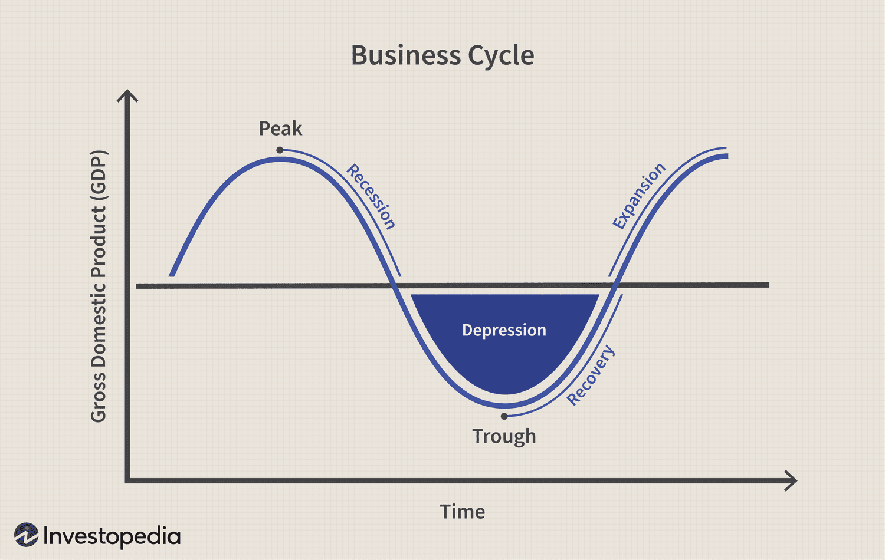

## Table of Contents

## What is a business cycle?

A business cycle is the natural ups and downs that happen in an economy over time. It's like a roller coaster that goes through periods of growth and periods of slowdown. When the economy is growing, more people have jobs, businesses make more money, and people feel confident about spending. This is called an expansion. But eventually, the economy can slow down, and this is called a contraction. During a contraction, businesses might make less money, people might lose their jobs, and people might spend less money.

These cycles can last for different amounts of time, sometimes a few years or even longer. Economists try to predict and understand these cycles to help make better decisions. They look at things like unemployment rates, how much people are spending, and how much businesses are producing. By understanding the business cycle, governments and businesses can try to make things better during tough times and keep the economy growing during good times.

## What is the peak phase of a business cycle?

The peak phase of a business cycle is when the economy is doing really well. It's the highest point before things start to slow down. During the peak, businesses are making a lot of money, and lots of people have jobs. People feel confident and spend more money on things they want, not just what they need. This is a time when the economy is growing fast, and everything seems to be going great.

But, the peak doesn't last forever. After reaching the peak, the economy starts to cool off. This is when the contraction phase begins. Businesses might start to see less profit, and some people might lose their jobs. It's important for people to know about the peak because it helps them prepare for the slowdown that comes next. By understanding the peak, governments and businesses can try to make the slowdown less painful.

## How can you identify when an economy has reached the peak of a business cycle?

You can tell that an economy has reached the peak of a business cycle when certain things start to happen. One big sign is that businesses are making as much money as they can. They are selling a lot of products and services, and their profits are really high. At the same time, almost everyone who wants a job has one. Unemployment is very low, and people feel good about their jobs and money. This makes them spend more on things they want, like new clothes or vacations, not just things they need.

Another way to spot the peak is by looking at how fast the economy is growing. During the peak, the economy is growing really fast. You can see this in numbers like how much people are spending and how much businesses are producing. But, at the peak, this growth starts to slow down a bit. It's like the economy is taking a deep breath before it starts to cool off. When you see these signs, it's a good hint that the economy has hit its peak and might start to slow down soon.

## What economic indicators are most useful in determining the peak of a business cycle?

The most useful economic indicators for figuring out when an economy has reached the peak of a business cycle are things like employment rates, consumer spending, and business profits. When the economy is at its peak, almost everyone who wants a job has one. This means unemployment is very low. People feel good about their jobs and money, so they spend more on things they want, not just what they need. At the same time, businesses are making a lot of money because they are selling a lot of products and services.

Another important indicator is how fast the economy is growing. During the peak, the economy is growing really fast. You can see this in numbers like how much people are spending and how much businesses are producing. But at the peak, this growth starts to slow down a bit. It's like the economy is taking a deep breath before it starts to cool off. When you see these signs, it's a good hint that the economy has hit its peak and might start to slow down soon.

## What typically happens to employment and inflation rates at the peak of a business cycle?

At the peak of a business cycle, employment is usually at its best. Almost everyone who wants a job can find one. This means unemployment rates are very low. People feel good about their jobs and their money, so they spend more on things they want, like new clothes or vacations, not just things they need. This feeling of confidence and spending helps keep the economy growing fast.

Inflation rates can also be high at the peak of a business cycle. When everyone is spending a lot of money, prices for things can go up. This is because there is a lot of demand for products and services. Businesses might raise their prices because they can, and this can lead to higher inflation. It's important to keep an eye on inflation because if it gets too high, it can make things more expensive for everyone and might signal that the peak is about to end.

## How does consumer behavior change at the peak of a business cycle?

At the peak of a business cycle, people feel really good about their money and jobs. They are more likely to spend on things they want, not just what they need. For example, they might buy new clothes, go on vacations, or eat out at restaurants more often. This is because a lot of people have jobs and feel confident about their future. When everyone is spending more, it helps keep the economy growing fast.

But, at the peak, people might also start to see prices go up. This is because everyone is trying to buy things, so businesses can charge more. People might still spend a lot, but they might start to be a bit more careful with their money. They might think about saving some of it for the future, just in case things get harder. This change in spending can be a sign that the peak is about to end, and the economy might start to slow down soon.

## What are the common signs that a peak in the business cycle is approaching?

When a peak in the business cycle is approaching, you can see some clear signs. Businesses start making a lot of money because they are selling a lot of products and services. Almost everyone who wants a job has one, so unemployment is very low. People feel good about their jobs and money, so they spend more on things they want, like new clothes or vacations, not just things they need. This spending helps the economy grow really fast.

But as the peak gets closer, some things start to change. The economy's growth might start to slow down a bit. Prices for things can go up because everyone is trying to buy them, which can lead to higher inflation. People might start to be a bit more careful with their money, thinking about saving some for the future. These changes are signs that the peak is coming and the economy might start to slow down soon.

## How do businesses typically prepare for and react to the peak of a business cycle?

When businesses see that the economy is getting close to the peak of a business cycle, they start to get ready. They know that things are going really well, so they try to make as much money as they can. They might hire more people to help them sell more products and services. They might also invest in new things, like machines or buildings, to help them grow even more. Businesses feel confident because everyone is spending a lot of money, so they want to take advantage of this good time.

But businesses also know that the peak won't last forever. They start to think about what will happen when the economy starts to slow down. They might save some of their money to help them through the tough times ahead. They might also start to be a bit more careful with their spending, making sure they don't spend too much on things they don't really need. By preparing like this, businesses can try to make the slowdown less painful and keep going strong even when the economy isn't doing as well.

## What are the potential risks and challenges businesses face at the peak of a business cycle?

At the peak of a business cycle, businesses face some big risks. One risk is that they might get too excited and spend too much money. They might buy a lot of new things or hire a lot of new people, thinking the good times will last forever. But if the economy starts to slow down, they could be left with too much stuff and not enough money to pay for it all. This can be a big problem because it might mean they have to let people go or even close down.

Another challenge is that prices can go up a lot at the peak. When everyone is spending money, businesses might raise their prices because they can. But if prices get too high, people might start to spend less. This can hurt businesses because they need people to keep buying their products and services. If people start to save their money instead of spending it, businesses might see their profits go down. This can make it hard for them to keep growing and can even lead to losses.

## How does government policy influence the peak phase of a business cycle?

Government policy can really affect the peak phase of a business cycle. When the economy is doing really well and reaching its peak, the government might try to keep things from getting too crazy. They might raise interest rates to make borrowing money more expensive. This can slow down spending a bit and help keep prices from going up too fast. The government might also change taxes or spending to try to keep the economy balanced. By doing these things, the government hopes to make the peak last longer and make the slowdown that comes after less painful.

But sometimes, government policies can make the peak even more intense. If the government keeps interest rates low and spends a lot of money, it can make people feel even more confident about spending. This can make the economy grow even faster, but it can also make the peak harder to handle. If the economy grows too fast, it might lead to really high prices and a bigger slowdown later. So, the government has to be careful and try to find the right balance to help the economy stay strong and healthy.

## Can the peak of a business cycle be predicted accurately, and if so, how?

Predicting the peak of a business cycle is really hard, but people try to do it by looking at different signs. Economists look at things like how many people have jobs, how much people are spending, and how fast businesses are growing. If they see that almost everyone has a job and people are spending a lot of money, it might mean the economy is getting close to its peak. They also watch for signs that the economy is starting to slow down a bit, like prices going up and people being more careful with their money. By putting all these signs together, economists can make guesses about when the peak might happen.

But even with all this information, it's still tough to predict the peak exactly. The economy is like a big puzzle with a lot of pieces, and sometimes things change in ways no one expects. For example, something big like a new law or a problem in another country can make the economy act differently. So, while economists can get close, they can't always say for sure when the peak will happen. It's more like a best guess based on what they know at the time.

## What historical examples illustrate the peak of a business cycle and its subsequent effects on the economy?

One famous example of the peak of a business cycle is the late 1990s in the United States. During this time, the economy was doing really well. Almost everyone who wanted a job had one, and people were spending a lot of money. Businesses were making a lot of profit, especially in the technology sector. This was the peak of the dot-com boom. But then, in early 2000, the economy started to slow down. A lot of tech companies that were doing well suddenly started to lose money. People lost their jobs, and the stock market crashed. This showed how quickly things can change after reaching the peak.

Another example is the peak of the business cycle in the mid-2000s, leading up to the 2008 financial crisis. In the years before 2008, the economy was growing fast, and people felt good about their money. They were buying a lot of houses, and banks were giving out loans easily. This was the peak of the housing bubble. But then, in 2008, the bubble burst. House prices fell a lot, and many people couldn't pay their loans. Banks started to fail, and a lot of people lost their jobs. This showed how a peak can lead to a big crash if things get out of control.

## References & Further Reading

[1]: Bergstra, J., Bardenet, R., Bengio, Y., & Kégl, B. (2011). ["Algorithms for Hyper-Parameter Optimization."](https://papers.nips.cc/paper/4443-algorithms-for-hyper-parameter-optimization) Advances in Neural Information Processing Systems 24.

[2]: ["Advances in Financial Machine Learning"](https://www.amazon.com/Advances-Financial-Machine-Learning-Marcos/dp/1119482089) by Marcos Lopez de Prado

[3]: ["Evidence-Based Technical Analysis: Applying the Scientific Method and Statistical Inference to Trading Signals"](https://www.amazon.com/Evidence-Based-Technical-Analysis-Scientific-Statistical/dp/0470008741) by David Aronson

[4]: ["Machine Learning for Algorithmic Trading"](https://github.com/PacktPublishing/Machine-Learning-for-Algorithmic-Trading-Second-Edition) by Stefan Jansen

[5]: ["Quantitative Trading: How to Build Your Own Algorithmic Trading Business"](https://www.wiley.com/en-us/exportProduct/pdf/9781119203377) by Ernest P. Chan