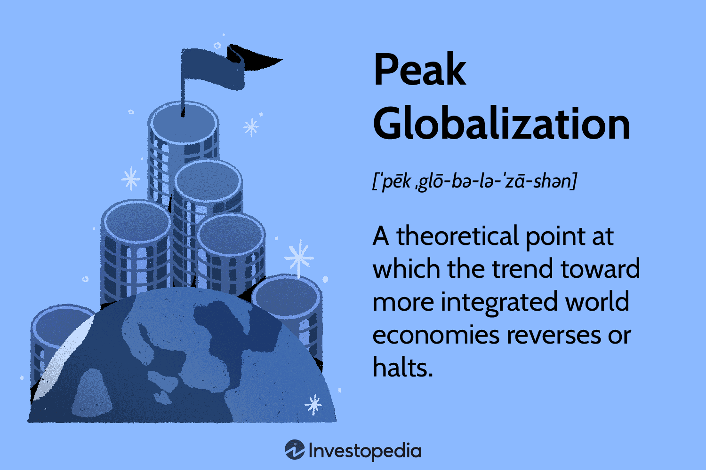

Globalization, international relations, economic trends, and algorithmic trading are integral components of the modern economic landscape. These elements converge to shape global economies, impacting international trade dynamics, market stability, and economic growth. Globalization fosters interconnected economies, enabling free trade and cultural exchanges that influence economic trends and international relations. It leads to both opportunities and challenges, promoting economic growth while sometimes exacerbating inequalities.

International relations are redefined in this global context, as geopolitical shifts and evolving alliances alter trade policies and power structures. Countries engage in both cooperation and competition, which impacts trade agreements and global economic policies.

Economic trends are increasingly shaped by globalization, characterized by market integration, the rise of emerging economies, and technological advancements. Innovations such as artificial intelligence, blockchain, and digital currencies redefine how economies operate, presenting both challenges and opportunities for growth and stability.

Algorithmic trading, driven by advancements in technology, revolutionizes financial markets by executing trades at speeds beyond human capabilities. This practice enhances market efficiency and liquidity but also introduces risks such as market manipulation and systemic instability.

This comprehensive overview highlights the significance of these interconnected topics, emphasizing the necessity for adaptive strategies to navigate the evolving economic landscape. Understanding these dynamics is essential for policymakers, businesses, and individuals aiming to harness opportunities and mitigate risks in today’s economy.

## Table of Contents

## Understanding Globalization

Globalization represents a transformative force in modern history, characterized by the increasing interconnectedness of national and regional economies, societies, and cultures through a comprehensive global network. This process is facilitated by advancements in trade, communication technologies, immigration, and transportation, which have collectively contributed to the creation of a global marketplace.

At the core of globalization is international trade, which has dramatically expanded as barriers to the movement of goods and services have diminished. The reduction of tariffs and the liberalization of trade policies have allowed countries to specialize in the production of goods where they hold a comparative advantage, boosting both efficiency and economic growth. For instance, the establishment of trade agreements such as the North American Free Trade Agreement (NAFTA) and the European Union's Single Market have played pivotal roles in enhancing trade among member countries by providing a framework that governs trade relations, reduces transaction costs, and promotes economic integration.

Foreign direct investment (FDI) is another critical component that drives globalization. It involves cross-border investments where an entity in one country establishes or expands its business operations in another country. This capital movement enhances host country economic growth by providing financial resources, technology transfers, and management expertise. For example, multinational corporations (MNCs) often invest heavily in developing countries' infrastructure and workforce, leading to accelerated economic growth and development. These corporations, such as Apple, Toyota, and Siemens, act as engines of globalization, bridging gaps between national economies, producing goods for global markets, and facilitating cultural exchange.

The rise of transnational corporations has further emphasized the interconnected nature of the global economy. These large companies operate in multiple countries and often transcend national boundaries in their operations, supply chains, and market reach. The influence of such corporations is evident in the development of global supply chains, where production processes are distributed across different countries to optimize costs and efficiency. This has increased economic interdependence but also introduced vulnerability to global disruptions, as evidenced by the COVID-19 pandemic's impact on supply chains worldwide.

While globalization has spurred rapid economic growth, it has also contributed to widening economic disparities. Wealth and income inequalities have become significant concerns as globalization tends to favor highly skilled workers and technologically advanced sectors, leaving less developed regions in relative poverty. According to the International Monetary Fund (IMF), globalization has resulted in substantial gains for aggregate GDP, yet the distribution of benefits across and within countries is uneven, often amplifying existing inequalities.

In summary, globalization has wrought profound changes on a global scale through international trade, FDI, and the activities of transnational corporations. These forces have collectively expanded the global marketplace, promoting economic growth and cultural exchange while simultaneously exacerbating social and economic inequalities. Understanding the mechanisms and impacts of globalization is crucial for navigating its complex dynamics and addressing the challenges it poses to global economic stability and equity.

## International Relations in a Globalized World

Globalization significantly reshapes international relations by fostering a dual dynamic of cooperation and competition among nations. This transformation is evident in the evolving geopolitical landscape where the rise of China and the shifting alliances of countries redefine global trade policies. China's remarkable economic growth and its strategic Belt and Road Initiative (BRI) exemplify its increasing influence on the global stage. This shift has prompted countries to reassess their trade and diplomatic strategies to either align with or counterbalance China's expanding economic footprint. 

Bi-globalization, a term describing the simultaneous promotion of globalization and nationalistic policies, further complicates international power structures. This dual approach allows countries to engage in global trade and technological exchanges, while also strengthening domestic policies to protect national interests. Such an approach affects international relations by influencing negotiations and commitments within global institutions.

These dynamics significantly impact trade agreements, shaping them to reflect the changing balances of power. For instance, the Comprehensive and Progressive Agreement for Trans-Pacific Partnership (CPTPP) and the Regional Comprehensive Economic Partnership (RCEP) illustrate how countries create new multilateral frameworks to facilitate trade while promoting regional stability and economic integration. International organizations and global economic policies must thus adapt to account for these shifts, necessitating reforms and innovations to remain relevant and effective.

The intricate interplay between globalization and international relations necessitates an understanding of how nations navigate this evolving landscape. It requires a balancing act between engaging in beneficial global cooperation and addressing competitive pressures and conflicts that arise from emerging geopolitical realities. By recognizing the transforming paradigm, countries can better navigate the complexities of modern international relations, ensuring sustainable economic growth and stability.

## Economic Trends Shaping Global Markets

Globalization has significantly impacted economic trends, leading to the integration of markets, the rise of emerging economies, and rapid technological advancements. These factors collectively shape global economic growth, stability, and inequality.

The integration of markets results from the removal of trade barriers and advancements in communication and transportation technologies. It facilitates the free flow of goods, services, capital, and labor across borders, creating a global marketplace. This interconnectedness has stimulated economic growth as countries exploit comparative advantages and scale economies. However, it also raises concerns about market [volatility](/wiki/volatility-trading-strategies) and contagion, where economic disruptions in one part of the world can rapidly impact other regions.

Emerging economies, characterized by rapid industrialization and economic reform, have become significant players in the global market. Countries like China and India have experienced substantial growth, contributing to shifts in economic power dynamics. Their integration into the global economy has expanded markets for developed nations and attracted foreign investment. Nonetheless, these economies often face challenges such as income inequality, environmental degradation, and dependency on volatile capital flows.

Technological advancements, particularly in [artificial intelligence](/wiki/ai-artificial-intelligence) (AI), blockchain, and digital currencies, are transforming economic landscapes. AI enhances productivity by automating tasks, optimizing supply chains, and enabling data-driven decision-making. However, it poses challenges such as job displacement and the need for workforce reskilling. Blockchain technology provides secure, decentralized transaction methods, benefiting industries like finance, supply chain, and healthcare. Its adoption depends on technical, regulatory, and security challenges.

Digital currencies, including cryptocurrencies, offer alternatives to traditional financial systems, potentially increasing financial inclusion and reducing transaction costs. They have prompted discussions on monetary policy, regulation, and systemic risk. For instance, Central Bank Digital Currencies (CBDCs) are being explored by various nations to harness the benefits of digital currencies while maintaining monetary control.

In summary, globalization fosters economic trends that present both opportunities and challenges. The integration of markets promotes growth but increases vulnerability to global shocks. Emerging economies contribute to economic dynamism but face social and environmental issues. Technological advancements drive innovation and efficiency yet require adaptation to mitigate their disruptive impacts. Understanding these trends is crucial for stakeholders to navigate the complexities of a rapidly evolving global economy.

## Algorithmic Trading: Revolutionizing Financial Markets

Algorithmic trading, a groundbreaking development in financial markets, leverages sophisticated computer algorithms to execute trades with a precision and speed far surpassing human capability. These algorithms analyze vast datasets to identify trading opportunities, reacting swiftly to market conditions to execute trades in fractions of a second. This capability has revolutionized financial markets by enhancing trade efficiency, reducing transaction costs, and improving market [liquidity](/wiki/liquidity-risk-premium).

The implementation of [algorithmic trading](/wiki/algorithmic-trading) offers several advantages. By automating the trading process, algorithms minimize the impact of human emotions and errors, leading to more consistent and reliable trading outcomes. The increased efficiency not only allows for a higher [volume](/wiki/volume-trading-strategy) of trades but also facilitates tighter bid-ask spreads, consequently lowering transaction costs for market participants. Moreover, the continuous and rapid trading activity driven by algorithms contributes to greater market liquidity, enabling smoother operation and more stable price formation.

Despite these benefits, algorithmic trading introduces new risks and challenges. One significant concern is the potential for market manipulation through techniques such as spoofing, where traders place large orders with the intention of canceling them before execution to create false impressions of demand or supply. This can distort market perceptions and lead to unexpected price movements. Additionally, the reliance on complex algorithms increases systemic risk. Algorithmic failures, whether due to programming errors or unforeseen market conditions, can propagate rapidly through the interconnected financial system, amplifying disruptions.

To illustrate, consider an algorithm designed to execute [arbitrage](/wiki/arbitrage) strategies by identifying price discrepancies across various exchanges. This algorithm rapidly buys an asset in a market where it is undervalued and simultaneously sells it where it is overvalued. While this enhances market efficiency by aligning prices, a glitch or misconfiguration could lead to unintended trades, potentially resulting in significant financial losses and market instability.

Looking to the future, algorithmic trading will likely become even more integral to financial markets as technological advancements accelerate. The incorporation of artificial intelligence and [machine learning](/wiki/machine-learning) into trading algorithms holds the promise of further optimizing trading strategies by automatically learning from historical data and adapting to changing market conditions. The growing role of quantum computing may also revolutionize financial computations, allowing for even faster and more complex data processing.

As algorithmic trading continues to evolve, regulators and market participants face the ongoing challenge of balancing innovation with the protection of market integrity. Establishing robust oversight mechanisms and ensuring adequate transparency will be crucial to mitigating the associated risks while harnessing the full potential of algorithmic trading in financial markets.

## Conclusion

The interconnection of globalization, international relations, economic trends, and algorithmic trading constitutes a multifaceted framework that defines the contemporary global economic narrative. This intricate interplay has enabled significant economic growth and the integration of markets across the globe. Globalization has expanded access to international markets, facilitating trade and investment and spurring innovation and efficiencies. In parallel, international relations have evolved, with geopolitical considerations influencing trade agreements and economic policies.

However, these advancements are accompanied by considerable challenges and risks. Globalization, while promoting economic expansion, has also intensified inequalities both within and between nations. The concentration of wealth in developed economies and transnational corporations often exacerbates socio-economic disparities. Furthermore, the competitive nature of international relations can lead to trade tensions and protectionist policies, potentially destabilizing global economic equilibrium.

Economic trends, driven by technological advancements, present both opportunities and obstacles. Innovations such as artificial intelligence and blockchain are reshaping industries, but they also pose questions about labor market disruptions and regulatory responses. Algorithmic trading exemplifies these dualities by enhancing market efficiency and liquidity while introducing systemic risks, including market manipulation and flash crashes.

Understanding these dynamics is crucial for policymakers, businesses, and individuals to effectively navigate the evolving economic landscape. Policymakers must craft adaptive strategies that harness the benefits of globalization and technological progress while addressing the associated risks. Businesses need to be agile, capitalizing on new opportunities while mitigating potential threats. For individuals, awareness of these global changes facilitates informed decision-making, whether in career choices, investments, or consumption.

Future developments will undoubtedly continue to redefine global economics. As technologies advance and geopolitical landscapes shift, adaptive strategies will be essential to leverage opportunities and mitigate risks. Continuous analysis and proactive engagements are necessary to ensure that the positive impacts of these interconnected elements outweigh the challenges, fostering a more equitable and sustainable global economic environment.

## References & Further Reading

[1]: Friedman, T. L. (2005). ["The World is Flat: A Brief History of the Twenty-first Century"](https://psycnet.apa.org/record/2005-13366-000). Farrar, Straus and Giroux.

[2]: Bhagwati, J. (2004). ["In Defense of Globalization"](https://archive.org/details/indefenseofglob00bhag). Oxford University Press.

[3]: Stiglitz, J. E. (2002). ["Globalization and Its Discontents"](https://www.researchgate.net/publication/4755241_Joseph_E_Stiglitz_2002_Globalization_and_Its_Discontents). W. W. Norton & Company.

[4]: Hull, J. C. (2017). ["Options, Futures, and Other Derivatives"](https://www.semanticscholar.org/paper/Options%2C-Futures%2C-and-Other-Derivatives-Hull/89bdee500c8623864fc9eb7a471546aa713acc44). Pearson.

[5]: Narula, R. (2003). ["Globalization and Technology: Interdependence, Innovation Systems and Industrial Policy"](https://archive.org/details/globalizationtec0000naru). Polity.

[6]: Gomber, P., Arndt, B., Lutat, M., & Uhle, T. (2011). ["High-Frequency Trading"](https://papers.ssrn.com/sol3/papers.cfm?abstract_id=1858626). Business & Information Systems Engineering, 3(1), 65-69.

[7]: Brynjolfsson, E., & McAfee, A. (2014). ["The Second Machine Age: Work, Progress, and Prosperity in a Time of Brilliant Technologies"](https://psycnet.apa.org/record/2014-07087-000). W. W. Norton & Company. 

[8]: Tapscott, D., & Tapscott, A. (2016). ["Blockchain Revolution: How the Technology Behind Bitcoin Is Changing Money, Business, and the World"](https://dl.acm.org/doi/10.5555/3051781). Penguin.