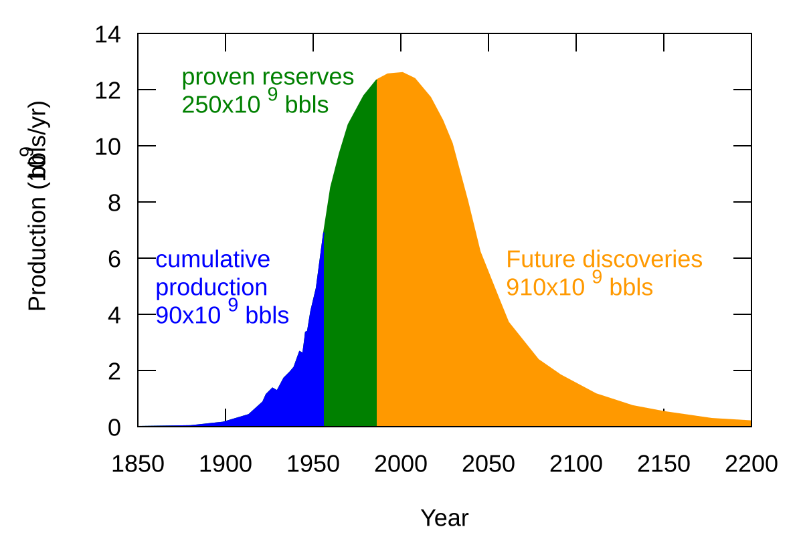

## Table of Contents

## What is peak oil?

Peak oil is when the world makes the most oil it ever will. After that, oil production starts to go down, even if people still want more oil. This happens because oil is a fossil fuel, which means it comes from old plants and animals that turned into oil over millions of years. There's only so much oil in the ground, so once we use a lot of it, it gets harder and harder to find and pump out more.

When peak oil happens, it can cause big problems. Oil is used for lots of things like cars, planes, and making plastics. If there's less oil, it might get more expensive, and people might have to find other ways to do things. Some people think we might have already reached peak oil, while others think it will happen soon. Either way, it's important for us to start using less oil and find other kinds of energy to use.

## How is peak oil determined?

Peak oil is determined by looking at how much oil the world is producing over time. Scientists and experts watch the numbers and see when oil production starts to go up less and less until it reaches the highest point. After that point, even though people might want more oil, the amount of oil coming out of the ground starts to go down. This highest point is what we call peak oil.

To figure out when peak oil will happen, experts use a lot of information. They look at how much oil is left in the ground, how fast we are using it, and how new technology might help find and get more oil. They also think about things like new oil discoveries and how easy or hard it is to get oil out of different places. By putting all this information together, they can make guesses about when peak oil might happen.

## When was the concept of peak oil first introduced?

The idea of peak oil was first talked about by a man named M. King Hubbert in the 1950s. He was a scientist who worked for an oil company. Hubbert noticed that oil production in a certain area would go up for a while and then start to go down after reaching a high point. He called this high point "peak oil." He used math to guess when the United States would reach its peak oil, and he was pretty close. People started to think more about this idea after he shared it.

After Hubbert introduced the idea, it became more important as people started to worry about running out of oil. In the 1970s, when there were big problems with oil supplies, more people started to think about peak oil. Since then, scientists and experts have been trying to figure out when the whole world will reach its peak oil. They use a lot of information to make their guesses, but it's hard to know for sure when it will happen.

## What are the different types of oil reserves and how do they relate to peak oil?

There are different types of oil reserves, and they are important when we talk about peak oil. The first type is called "proven reserves." These are the amounts of oil that we know for sure are in the ground and that we can get out with today's technology. It's like knowing exactly how much money you have in your bank account. The second type is "probable reserves." These are the amounts of oil that we think are there, but we're not 100% sure. It's like guessing how much money you might get from selling something you own. The last type is "possible reserves." These are the amounts of oil that might be there, but we're not very sure at all. It's like hoping to find money in an old coat pocket.

These different types of reserves relate to peak oil because they help us guess when peak oil will happen. Proven reserves are the most important because they tell us how much oil we can definitely use right now. When we start using up a lot of our proven reserves, we get closer to peak oil. Probable and possible reserves are trickier because we're not sure if we can use them. If we find new ways to get oil out of the ground, or if we discover new oil, it might push peak oil further into the future. But if we can't use these reserves, peak oil might happen sooner. So, understanding all these types of reserves helps us plan for the future and think about when we might run out of oil.

## What are some historical predictions about when peak oil would occur?

M. King Hubbert, a scientist who worked for an oil company, made one of the first predictions about peak oil. In the 1950s, he guessed that the United States would reach its peak oil in the late 1960s or early 1970s. He was pretty close because the U.S. did hit its peak oil in 1970. Hubbert also tried to predict when the whole world would reach its peak oil. He thought it would happen sometime between 1995 and 2000. His prediction for the world was not as accurate, but it got people thinking about peak oil.

Over the years, different people have made different predictions about when peak oil would happen. In the early 2000s, some experts thought peak oil would happen around 2010. For example, the Association for the Study of Peak Oil and Gas (ASPO) thought peak oil would come between 2007 and 2010. Another group, the International Energy Agency (IEA), predicted in 2010 that peak oil might happen around 2020. But these predictions have changed over time because new oil discoveries and new technology can change when peak oil will happen.

Some people think peak oil has already happened, while others believe it's still in the future. For instance, some say that the world might have reached peak oil in 2005 or 2006 because oil production seemed to level off around that time. On the other hand, some experts now think peak oil might not happen until the 2030s or even later because of new ways to get oil out of the ground, like fracking. So, the predictions keep changing, and it's hard to know for sure when peak oil will happen.

## How accurate have past peak oil predictions been?

Past peak oil predictions have had mixed results. M. King Hubbert's prediction about the United States hitting its peak oil in the late 1960s or early 1970s was very close, as the U.S. actually reached its peak in 1970. This showed that his method of looking at oil production trends could be useful. However, his prediction for the world's peak oil between 1995 and 2000 was not as accurate. The world did not hit its peak oil during that time, which shows how hard it is to predict peak oil for the whole world because there are so many things that can change.

Other predictions have also varied in accuracy. In the early 2000s, some experts thought peak oil would happen around 2010, but that didn't happen. The International Energy Agency (IEA) predicted in 2010 that peak oil might come around 2020, but we're past that date and still haven't seen a clear peak. Some people think peak oil might have already happened in 2005 or 2006, but oil production has not clearly gone down since then. These changing predictions show that new oil discoveries and new technology can push back when peak oil happens, making it hard to predict accurately.

Overall, predicting peak oil is tricky because there are so many things that can change, like new oil finds and new ways to get oil out of the ground. While some predictions have been close, others have been off the mark. This shows that while we can make educated guesses, it's hard to know for sure when peak oil will happen.

## What are the current predictions for when global peak oil will occur?

Right now, experts have different ideas about when global peak oil will happen. Some think it might have already happened around 2005 or 2006 because oil production seemed to level off around that time. But oil production has not clearly gone down since then, so it's hard to say for sure. Other experts think peak oil might not happen until the 2030s or even later because of new ways to get oil out of the ground, like fracking. These new methods can make more oil available, which can push back when peak oil happens.

It's hard to predict exactly when peak oil will happen because there are so many things that can change. New oil discoveries can add to the amount of oil we can use, and new technology can help us get oil out of places that were hard to reach before. For example, fracking has helped increase oil production in some places. But even with these changes, we know that there is only so much oil in the ground, so peak oil will happen eventually. The big question is when, and that's what experts are still trying to figure out.

## What technologies and strategies are being developed to mitigate the effects of peak oil?

People are working on new technologies and strategies to deal with peak oil. One big idea is to find other kinds of energy instead of oil. This includes using more solar power, wind power, and even nuclear power. These types of energy can help us use less oil. Another technology being developed is electric cars. Electric cars don't need oil to run, so if more people use them, we won't need as much oil for transportation. Also, scientists are trying to make biofuels, which are fuels made from plants. Biofuels can be used in cars and planes instead of oil.

Another strategy is to use oil more efficiently. This means finding ways to use less oil for the same things. For example, making cars that use less gas or buildings that need less energy to heat and cool. People are also working on better ways to find and get oil out of the ground. Fracking is one way to do this, but it can be bad for the environment. So, some people are looking for safer ways to get oil. By using these technologies and strategies, we can make the oil we have last longer and be ready for when peak oil happens.

## How does peak oil impact global economies and energy policies?

Peak oil can have a big effect on the world's economies because oil is used for so many things, like driving cars, flying planes, and making plastics. When peak oil happens, it means there's less oil to go around. This can make oil prices go up because everyone still wants it, but there's not as much. When oil prices go up, it can make everything more expensive, like food and goods that need to be moved around. This can slow down economies because people have less money to spend on other things. Countries that depend a lot on oil might have a harder time, while countries that use less oil or have other kinds of energy might do better.

Because of peak oil, countries are changing their energy policies. They are trying to use less oil and find other kinds of energy, like solar, wind, and nuclear power. This can help make sure they have energy even when there's less oil. Governments are also trying to help people use less oil by making rules that encourage electric cars and better public transportation. They might also give money to help build more solar and wind power plants. By doing these things, countries can be ready for peak oil and keep their economies strong even when oil is harder to get.

## What are the potential geopolitical consequences of peak oil?

When peak oil happens, it can cause big problems between countries. Some countries have a lot of oil, and others don't have much. The countries with oil might have more power because everyone wants it. They might try to control the price of oil or use it to get what they want from other countries. This can cause fights and disagreements. Countries that don't have much oil might have to pay a lot of money to get it, and they might not like that. They might even try to take oil from other places by force, which can lead to wars.

Countries might also change how they work with each other because of peak oil. They might make new deals to share oil or help each other find other kinds of energy. For example, some countries might work together to build more solar or wind power plants. But if countries can't agree on how to share oil or energy, it can cause more problems. Some countries might feel left out or treated unfairly, and this can make them angry. So, peak oil can change how countries get along and work together, and it can make the world a more tense place.

## How might peak oil affect different sectors such as transportation, agriculture, and manufacturing?

Peak oil can change a lot of things in the transportation sector. Cars, trucks, and planes all use oil to run. When there's less oil, it might cost more to fill up your car or fly on a plane. This can make people drive less or look for other ways to get around, like using electric cars or taking the bus or train. Companies that move things around might have to pay more for gas, which can make everything they sell more expensive. So, peak oil can make transportation harder and more costly for everyone.

In agriculture, peak oil can also cause big changes. Farmers use oil to run their machines, like tractors and harvesters. They also use oil to make fertilizers and to move food from farms to stores. If oil gets more expensive, it can cost more to grow food. This might make food prices go up, and some people might have a harder time buying enough to eat. Farmers might have to find new ways to grow food without using so much oil, like using animals to help with farming or finding new kinds of fertilizers.

Manufacturing can be affected by peak oil too. Many factories use oil to make things like plastics, clothes, and electronics. If oil gets more expensive, it can cost more to make these things. This can make the things we buy more expensive too. Companies might have to find new ways to make things without using so much oil, like using different materials or finding new energy sources. So, peak oil can make manufacturing more expensive and harder, and it can change what kinds of things we can buy.

## What are the long-term societal implications of transitioning beyond peak oil?

When we move past peak oil, it will change a lot of things in our society. We will have to find new ways to get energy, like using more solar and wind power. This can be good because it can help the environment and make the air cleaner. But it will also be hard because it will take time and money to build new power plants and change how we do things. Some people might lose their jobs in the oil industry, and they will need to learn new skills to work in other areas. It will be important for governments and companies to help people during this change so that everyone can do well.

In the long run, moving beyond peak oil can make our society stronger and more able to handle problems. We will learn to use energy more wisely and find new ways to do things without oil. This can make our cities better places to live, with less pollution and more green spaces. But it will also mean that we have to work together and plan carefully. If we do this well, we can build a future where we don't depend on oil and where everyone can have a good life. It will be a big change, but it can be a good one if we all work together.

## References & Further Reading

[1]: Hubbert, M. K. (1956). ["Nuclear Energy and the Fossil Fuels"](https://www.spec2000.net/freepubs/B1956-Peak-Oil-Hubbert.pdf). Presented at the American Petroleum Institute, Shell Development Company.

[2]: Brealey, R. A., Myers, S. C., & Allen, F. (2016). ["Principles of Corporate Finance"](https://www.mheducation.com/highered/product/Principles-of-Corporate-Finance-Brealey.html). McGraw-Hill Education.

[3]: "The End of Oil: On the Edge of a Perilous New World" by Paul Roberts

[4]: Laherrère, J. (2000). ["The Hubbert Curve: Its Strength and Weakness"](https://www.researchgate.net/publication/386726130_q-Exponential_Distribution_in_Urban_Agglomeration). Calverton, New York: Association for the Study of Peak Oil & Gas (ASPO).

[5]: McNally, R. (2017). ["Crude Volatility: The History and the Future of Boom-Bust Oil Prices"](https://www.amazon.com/Crude-Volatility-History-Future-Boom-Bust/dp/023117814X). Columbia University Press. 

[6]: Deffeyes, K. S. (2005). ["Beyond Oil: The View from Hubbert's Peak"](https://www.amazon.com/Beyond-Oil-View-Hubberts-Peak/dp/080902957X). Hill and Wang. 

[7]: Jansen, S. (2020). ["Machine Learning for Algorithmic Trading: Predictive Models to Extract Signals from Market and Alternative Data for Systematic Trading Strategies with Python"](https://www.amazon.com/Machine-Learning-Algorithmic-Trading-alternative/dp/1839217715). Packt Publishing.