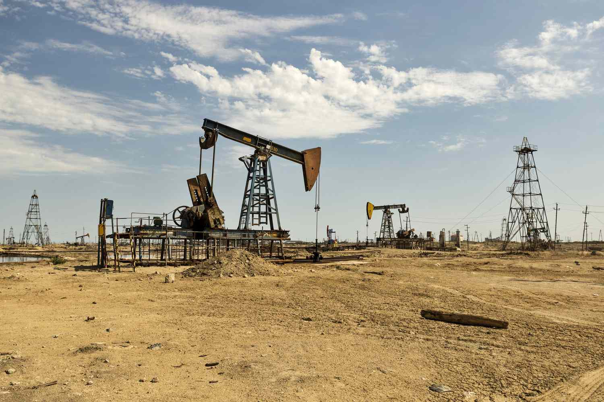

Peak oil, a concept that has been debated for decades, refers to the hypothesized point when global crude oil production reaches its maximum level, followed by a permanent decline. This notion stems from concerns about the depletion of conventional oil reserves, and its potential economic, social, and environmental ramifications are profound. The debates surrounding peak oil not only consider the technical aspects of oil extraction and production but also extend to the impacts of changing energy demands and the availability of alternative resources.

In recent years, significant technological advancements have emerged, most notably the utilization of artificial intelligence (AI) and algorithmic trading within the oil market. These technologies are harnessed for their ability to process massive datasets at unprecedented speeds, facilitating real-time decision-making and offering a competitive edge to market participants. AI systems are now capable of predicting market trends and adapting to fluctuating variables, a critical capability as the oil market becomes increasingly dynamic and complex.



The importance of these technologies cannot be overstated as they offer novel approaches to handling the uncertainties that characterize peak oil. Algorithmic trading, for instance, allows traders to implement specific strategies at unimaginable speeds, mitigating risks associated with volatile market conditions. Additionally, AI's capacity to analyze diverse data points enhances the accuracy of projections concerning oil supply and demand, thus aiding stakeholders in strategizing effectively.

This article will examine the nuanced aspects of peak oil, including its forecasts and associated challenges. It will explore potential consequences, and consider how AI and algorithmic trading are transforming the landscape. As the discussion unfolds, the interplay between technological innovations, economic imperatives, and ethical considerations will be highlighted, presenting a comprehensive overview of this evolving sector.

## Table of Contents

## Understanding Peak Oil

Peak oil refers to the theoretical point in time when global crude oil production reaches its maximum output before it begins to decline. This concept is rooted in the bell-shaped curve theory proposed by geophysicist Marion King Hubbert. Hubbert's model, introduced in a 1956 paper, illustrated that oil production in a given region follows a bell-shaped curve: it begins with an exponential increase, reaches a peak when approximately half of the oil reserves have been extracted, and then declines. This theory, originally applied to predict the peaking of oil production in the contiguous United States, successfully forecasted the peak in the early 1970s, lending credibility to the model.

The central idea behind Hubbert's theory is that oil production is not a linear exploitation process but is influenced by geological, technological, and economic factors. The critical assumption is that after a certain point, the discovery of new reserves is insufficient to offset the depletion of existing ones, leading to an inevitable decline in production. Despite the robustness of Hubbert's model in specific contexts, predicting global peak oil has proven to be far more complex. This complexity arises due to several factors, including technological advancements, such as hydraulic fracturing, which have significantly enhanced extraction efficiency and extended the life of existing oil fields.

Hydraulic fracturing, commonly known as fracking, has revolutionized the oil industry by enabling the extraction of oil from previously inaccessible shale formations. This method, combined with horizontal drilling, has unlocked vast quantities of oil and natural gas, particularly in the United States, which has shifted the global landscape of oil production. For example, the U.S. Energy Information Administration reported a substantial increase in shale oil production, resulting in the U.S. becoming a leading oil producer.

Thus, while the peak oil theory suggests an eventual decline in production, technological innovations have, so far, deferred the onset of a global peak. Additionally, economic factors, such as fluctuating oil prices, geopolitical events, and policy shifts towards renewable energy, further complicate the timeline for peak oil. The interplay between these elements contributes to the ongoing debate and uncertainty surrounding the concept of peak oil.

## Peak Oil Predictions and Challenges

Peak oil encompasses the idea that global [crude oil](/wiki/crude-oil) production will eventually reach a point of maximum output before it begins to decline. Predictions on when this peak will occur have varied substantially, with several early forecasts suggesting the early 2000s as a pivotal period. However, technological advancements and increased exploration have staved off these predictions. Marion King Hubbert, who proposed the bell-shaped curve theory, estimated production peaks based on existing data and extraction methods. Yet, his prognostications could not fully account for subsequent technological innovations such as hydraulic fracturing, which have significantly extended the productive lifespan of oil reserves.

Predicting peak oil remains intricate due to the uncertainties in estimating undiscovered oil reserves. The [volume](/wiki/volume-trading-strategy) of these reserves, alongside technological advancements like enhanced recovery methods and deep-sea drilling, introduces significant variability in forecasts. Exploration in previously inaccessible areas and the ability to extract from unconventional resources have complicated earlier predictions, resulting in a moving target for peak oil timelines.

Furthermore, the viability of alternative energy sources adds another layer of complexity. As renewable energy technologies become more efficient and cost-effective, their capacity to reduce reliance on oil affects long-term demand predictions. The transition to electric vehicles and biofuels exemplifies shifts towards alternatives, potentially causing what some theorists term a "peak demand" scenario rather than a conventional "peak supply."

Geopolitical factors further exacerbate the challenges of predicting peak oil. Nations with significant oil reserves, their political stability, regulatory environments, and the dynamics of international agreements influence global oil production and distribution networks. Conflicts, trade policies, and diplomatic relations continuously reshape production capabilities and global market flow, thereby affecting predictions surrounding peak oil. Thus, while the discourse around peak oil continues, the convergence of technological, economic, and geopolitical drivers necessitates a nuanced understanding of the forces shaping the future of global oil production.

## Consequences of Peak Oil

A peak in oil supply is hypothesized to trigger significant economic disruptions due to increased prices. This potential surge in oil prices could markedly affect critical sectors heavily reliant on oil, such as agriculture, transportation, and manufacturing. In agriculture, oil is crucial for powering machinery, transportation, and the production of fertilizers and pesticides. A rise in oil prices could result in increased costs of production, leading to higher food prices and potential food scarcity issues.

Similarly, the transportation sector, which includes road transport, aviation, and shipping, would face heightened operational costs. This increase could result in higher costs for goods and services as transportation is integral to supply chains. Consequently, consumers would eventually bear the brunt of these cost increments. Manufacturing relies on oil for both energy and as a raw material for products like plastics, meaning that increased oil prices would ripple through to higher production costs and, ultimately, consumer prices.

Conversely, a peak in oil demand could occur as a consequence of a global shift towards alternative and more sustainable energy sources. This transition is driven by both environmental considerations and advancements in renewable energy technologies, such as solar, wind, and electric vehicles. A reduction in oil demand could stabilize or even reduce oil prices, altering investment patterns in the energy sector and potentially reducing the financial viability of oil exploration and extraction projects.

Both supply and demand peak scenarios [carry](/wiki/carry-trading) significant economic and environmental impacts. Economically, the sectors dependent on oil could face [volatility](/wiki/volatility-trading-strategies), with industries needing to adapt quickly to changing energy landscapes. Environmentally, a peak in demand, illustrating a shift to renewable energy, could lead to substantial reductions in carbon emissions, contributing positively to global efforts to combat climate change. With this shift, there can be a marked decrease in pollution levels, improved public health outcomes, and a positive trajectory towards meeting international climate goals such as those outlined in the Paris Agreement.

The transformative nature of these potential alterations underscores the complex interplay between environmental sustainability efforts and economic stability, suggesting a need for comprehensive strategies to manage transition risks while fostering economic resilience.

## Algorithmic Trading in the Oil Market

Algorithmic trading has revolutionized the oil market by integrating sophisticated [artificial intelligence](/wiki/ai-artificial-intelligence) (AI) and [machine learning](/wiki/machine-learning) techniques, enabling traders to analyze vast datasets with unprecedented speed and accuracy. This innovative approach involves the use of algorithms to automate trading decisions based on predefined criteria. By processing real-time data, AI-driven systems can predict price movements and quickly respond to volatility, granting traders a significant advantage.

In [algorithmic trading](/wiki/algorithmic-trading), computers execute trades using complex algorithms designed to identify optimal trading opportunities. These algorithms consider numerous variables, such as historical price data, trading volumes, geopolitical events, weather patterns, and macroeconomic indicators, to make informed predictions. The foundation of such systems lies in their ability to discern intricate patterns that would be difficult for human traders to detect due to the sheer volume and complexity of the data involved.

Machine learning models, particularly those in the subfields of supervised and unsupervised learning, are commonly employed to enhance predictive capabilities. Techniques such as regression analysis, neural networks, and decision trees are utilized to build models that continually improve their accuracy over time. These models are capable of processing high-frequency data, allowing them to recalibrate and refine strategies as market conditions change.

For instance, a simple linear regression model might predict future oil prices based on previous trends. In Python, this could be implemented as follows:

```python
import numpy as np
from sklearn.linear_model import LinearRegression

# Historical oil price data
prices = np.array([[1], [2], [3], [4], [5]]) # Example data points
future_time = np.array([[6]]) # Predict price at a future point

# Creating and training the regression model
model = LinearRegression()
model.fit(prices, prices) # Simple example with prices as both input and target

# Predicting future price
predicted_price = model.predict(future_time)
print("Predicted Oil Price:", predicted_price)
```

Algorithmic trading systems can adjust their strategies dynamically, accounting for the ever-changing landscape of the oil market. Through continuous learning, these systems ensure traders can reduce risks and maximize returns, adapting to market shocks and unexpected events quickly.

Moreover, algorithmic trading facilitates high-frequency trading ([HFT](/wiki/high-frequency-trading-strategies)), enabling traders to execute thousands of orders in milliseconds. While HFT increases the [liquidity](/wiki/liquidity-risk-premium) of the oil market and can reduce trading costs, it also raises concerns regarding market stability and equitability.

In conclusion, the adoption of algorithmic trading, powered by AI and machine learning, has transformed the oil trading landscape. By enhancing decision-making processes through the rapid analysis of complex data sets, traders can maintain a competitive edge in a highly volatile and competitive market.

## AI's Evolving Role in Oil Trading

AI's influence in oil trading extends beyond mere predictive analytics, fostering a transition from passive market forecasts to active engagement within market dynamics. AI systems now play a critical role in shaping market behavior by analyzing complex variables and enabling traders to make informed decisions swiftly and accurately.

AI's capacity to process vast datasets allows for the identification of intricate patterns and correlations that would be impractical to discern manually. Machine learning models, particularly those employing neural networks, offer profound insights by examining historical data and simulating various market conditions. These systems are designed to learn and adapt, continually refining their algorithms to accommodate new information, thus enhancing market responsiveness.

Moreover, AI-driven platforms facilitate high-frequency trading, enabling transactions to occur at previously unattainable speeds. Consider, for example, a Python implementation of a simple AI approach to detect price anomalies based on historical trends:

```python
import numpy as np
from sklearn.linear_model import LinearRegression

# Sample historical oil prices
historical_prices = np.array([[1, 100], [2, 105], [3, 102], [4, 108], [5, 115]])

# Feature: Day, Target: Price
X = historical_prices[:, 0].reshape(-1, 1)
y = historical_prices[:, 1]

# Linear Regression Model
model = LinearRegression()
model.fit(X, y)

# Predict future price
future_day = np.array([[6]])
predicted_price = model.predict(future_day)
print(f"The predicted oil price on day 6 is: {predicted_price[0]:.2f}")
```

This code provides a basic framework for understanding how AI models can be trained and utilized to project future oil prices, thus aiding traders in decision-making. Such applications underscore AI's ability to shift from passive analysis to active trading strategies.

AI also supports decision-making by incorporating real-time information such as geopolitical news,

## Regulatory and Ethical Considerations

The rapid adoption of artificial intelligence (AI) and algorithmic trading in the oil markets presents several regulatory and ethical considerations that are increasingly demanding attention. One of the primary concerns is market manipulation. Algorithmic trading systems, driven by AI, can execute high-frequency transactions, potentially leading to unfair market advantages and impacting prices in ways that may not reflect genuine market conditions. This raises questions about the integrity and fairness of market operations.

Transparency is another significant concern. AI systems often operate as 'black boxes', where the decision-making processes are not clearly understandable even by their developers. This opacity complicates the task of regulators who need to ensure that these systems comply with existing market rules and do not contribute to volatility or market disorder. Without transparency, it becomes challenging to audit and monitor trading activities, posing risks to market fairness and competitiveness.

To address these challenges, regulatory frameworks need to evolve contemporaneously with technological advancements. Current regulations may not sufficiently cover the complexities introduced by AI-driven trading strategies. Therefore, regulators must develop new guidelines that accommodate the unique characteristics of algorithmic trading. These guidelines should focus on ensuring transparency, preventing market manipulation, and promoting ethical trading practices.

One approach could involve the development of standardized protocols for algorithmic trading systems, mandating clear documentation of algorithms’ decision-making processes. Regulatory bodies could also require regular audits of these systems to ensure compliance with market regulations. Additionally, implementing real-time monitoring solutions may help detect and mitigate potential manipulative activities more swiftly.

Ethical considerations encompass issues like the potential for biased decision-making by AI systems. Since these systems rely on historical data for training, any biases inherent in the data could lead to skewed outcomes that disadvantage certain market participants. Stakeholders should strive to remove biases from AI models and promote diversity in data sets used for training Machine Learning algorithms.

In conclusion, integrating AI and algorithmic trading in oil markets necessitates a delicate balance between fostering innovation and upholding ethical standards and regulatory compliance to protect the integrity and fairness of the markets. This evolving landscape requires proactive measures and close collaboration among regulators, industry participants, and technologists to craft a sustainable and fair regulatory environment.

## Conclusion

The unpredictable nature of peak oil, compounded by the ever-evolving landscape of the oil market, underscores a critical period of transformation. Technological advancements, especially the integration of AI and algorithmic trading, have indelibly altered traditional paradigms of oil trading. These technologies provide enhanced capabilities for processing complex data and forecasting market trends, offering unprecedented precision and speed in decision-making processes.

However, this technological evolution demands diligent navigation across various landscapes—technological, economic, and ethical. Stakeholders, including traders, regulatory bodies, and policymakers, must work collaboratively to address these challenges. The rapid pace of AI and algorithmic trading necessitates a regulatory framework that ensures transparency and mitigates risks such as market manipulation. Developing such frameworks requires a balance between encouraging innovation and maintaining fair market practices.

Moreover, the economic implications of AI integration call for a proactive approach in adapting business models to optimize the benefits of technological advancements while minimizing disruptions. Ethical considerations must also be at the forefront, promoting accountability and ensuring that AI systems operate within the established moral and social norms.

The future of oil trading will be shaped by stakeholders' ability to harness AI's potential responsibly, maintaining a focus on sustainability and transparency. By thoughtfully navigating these multifaceted challenges, the oil market can adapt to the uncertainties surrounding peak oil and continue to function efficiently in an evolving global landscape.

## References & Further Reading

[1]: Hubbert, M. K. (1956). ["Nuclear Energy and the Fossil Fuels"](https://www.spec2000.net/freepubs/B1956-Peak-Oil-Hubbert.pdf). Presented at the American Petroleum Institute, Shell Development Company.

[2]: Brealey, R. A., Myers, S. C., & Allen, F. (2016). ["Principles of Corporate Finance"](https://www.mheducation.com/highered/product/Principles-of-Corporate-Finance-Brealey.html). McGraw-Hill Education.

[3]: "The End of Oil: On the Edge of a Perilous New World" by Paul Roberts

[4]: Laherrère, J. (2000). ["The Hubbert Curve: Its Strength and Weakness"](https://www.researchgate.net/publication/386726130_q-Exponential_Distribution_in_Urban_Agglomeration). Calverton, New York: Association for the Study of Peak Oil & Gas (ASPO).

[5]: McNally, R. (2017). ["Crude Volatility: The History and the Future of Boom-Bust Oil Prices"](https://www.amazon.com/Crude-Volatility-History-Future-Boom-Bust/dp/023117814X). Columbia University Press. 

[6]: Deffeyes, K. S. (2005). ["Beyond Oil: The View from Hubbert's Peak"](https://www.amazon.com/Beyond-Oil-View-Hubberts-Peak/dp/080902957X). Hill and Wang. 

[7]: Jansen, S. (2020). ["Machine Learning for Algorithmic Trading: Predictive Models to Extract Signals from Market and Alternative Data for Systematic Trading Strategies with Python"](https://www.amazon.com/Machine-Learning-Algorithmic-Trading-alternative/dp/1839217715). Packt Publishing.