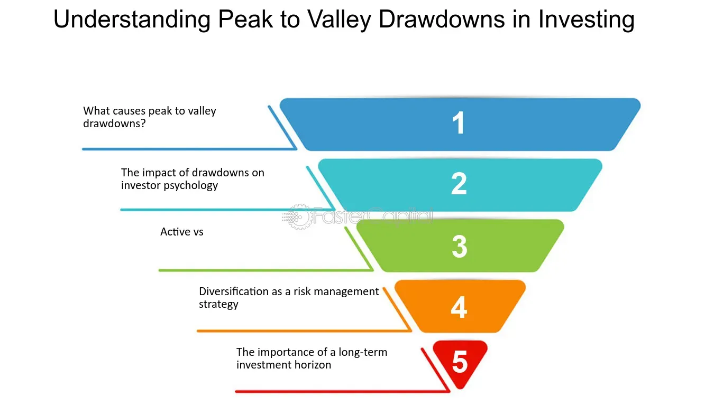

## Table of Contents

## What is the basic definition of peak-to-valley drawdown in finance?

Peak-to-valley drawdown is a measure used in finance to show how much an investment or a portfolio has lost from its highest point to its lowest point before it starts to recover. It helps investors understand the risk of an investment by showing the largest drop in value that has happened over a certain time.

For example, if an investment reaches a high of $100 and then drops to $70 before going up again, the peak-to-valley drawdown would be 30%. This measure is important because it gives investors an idea of how bad things could get, helping them decide if they are comfortable with that level of risk.

## How is peak-to-valley drawdown calculated?

Peak-to-valley drawdown is calculated by finding the difference between the highest value, or peak, of an investment and its lowest value, or valley, before it starts to go up again. To do this, you first identify the peak, which is the highest point the investment reached. Then, you look for the valley, which is the lowest point the investment reached after the peak but before it starts to recover. The drawdown is then the percentage drop from the peak to the valley.

For example, if an investment's peak was $100 and it dropped to a valley of $70 before going up again, you would calculate the drawdown like this: Subtract the valley ($70) from the peak ($100) to get $30. Then, divide this difference ($30) by the peak ($100) to get 0.30. Multiply by 100 to turn it into a percentage, so the peak-to-valley drawdown is 30%. This calculation helps investors see how much they could lose in the worst-case scenario.

## Why is peak-to-valley drawdown important for investors?

Peak-to-valley drawdown is important for investors because it shows them the biggest drop their investment might face. Knowing this helps investors understand the risk of losing money. If an investment has a big drawdown, it means it can go down a lot before it goes back up. This can be scary for investors, especially if they need their money soon or if they don't like big risks.

Investors use peak-to-valley drawdown to decide if an investment matches their comfort with risk. If someone can handle big ups and downs, they might be okay with a higher drawdown. But if someone wants their money to be safer, they'll look for investments with smaller drawdowns. This helps them pick investments that fit their goals and how much risk they can handle.

## Can you explain the difference between maximum drawdown and other types of drawdowns?

Maximum drawdown is the biggest drop from the highest point to the lowest point an investment has ever seen. It's like looking at the worst-case scenario for how much money you could lose. Other types of drawdowns might look at smaller drops over shorter times. For example, a monthly drawdown only looks at the biggest drop within a month, not the whole history of the investment.

Maximum drawdown is important because it gives investors a clear picture of the biggest risk they might face. It helps them understand if they can handle that kind of loss. Other drawdowns, like average drawdown, look at all the drops and find the average size of those drops. This can be useful for seeing how often and how big the usual drops are, but it doesn't show the worst that could happen like maximum drawdown does.

## What is the significance of the time period over which a drawdown occurs?

The time period over which a drawdown happens is important because it tells investors how long they might have to wait before their investment starts to recover. A short drawdown might only last a few days or weeks, which can be easier for investors to handle. But a long drawdown, which might last months or even years, can be much harder. Investors need to know if they can wait that long for their money to come back.

Understanding the time period of a drawdown also helps investors match their investments with their plans. If someone needs their money soon, they might not want to invest in something that could have a long drawdown. But if someone is saving for the long term, like for retirement, they might be okay with waiting out a longer drawdown. This way, they can pick investments that fit when they need their money.

## How does peak-to-valley drawdown relate to risk management in investment portfolios?

Peak-to-valley drawdown is a key tool in risk management for investment portfolios because it shows investors the biggest loss they might face. Knowing the largest possible drop helps investors figure out how much risk they can handle. If an investment has a big drawdown, it means it could lose a lot of value before it starts to go up again. This information is important for investors who want to avoid big losses, especially if they need their money soon or if they don't like taking big risks.

Investors use peak-to-valley drawdown to make their portfolios safer. They might choose investments with smaller drawdowns if they want to keep their money more secure. Or, they might spread their money across different investments to lower the overall risk. By understanding the drawdown, investors can pick investments that match their goals and how much risk they're willing to take. This helps them manage their money better and feel more confident about their investments.

## What are some common strategies to minimize peak-to-valley drawdowns?

One common strategy to minimize peak-to-valley drawdowns is diversification. This means spreading your money across different types of investments, like stocks, bonds, and real estate. If one investment goes down a lot, the others might not go down as much or might even go up, which can help reduce the overall drop in your portfolio. Another strategy is to use stop-loss orders. These are like safety nets that automatically sell an investment if it drops to a certain price. This can help limit how much you lose on a single investment.

Another approach is to invest in assets that are less risky, like bonds or money market funds. These types of investments usually don't go up and down as much as stocks, so they might have smaller drawdowns. You can also use a strategy called dollar-cost averaging, where you invest a fixed amount of money at regular times, no matter what the market is doing. This can help smooth out the ups and downs over time and reduce the impact of big drops.

## How can peak-to-valley drawdown be used to compare the performance of different investment funds?

Peak-to-valley drawdown can be used to compare the performance of different investment funds by looking at how much each fund has lost from its highest point to its lowest point. This helps investors see which funds have bigger or smaller drops. If one fund has a smaller drawdown, it means it might be less risky. Investors who don't like big risks might choose this fund because it doesn't lose as much value during tough times.

For example, if Fund A has a peak-to-valley drawdown of 10% and Fund B has a drawdown of 20%, Fund A might be seen as safer. Even if Fund B usually makes more money, the bigger drawdown means it can lose more value before it goes back up. By comparing drawdowns, investors can pick funds that match how much risk they are willing to take and how much they can handle losing.

## What are the limitations of using peak-to-valley drawdown as a sole measure of investment risk?

Using peak-to-valley drawdown as the only way to measure investment risk has some problems. One big issue is that it only shows the worst drop an investment has ever had. It doesn't tell you how often those big drops happen or how long they last. An investment might have a big drawdown once, but if it usually doesn't drop much, it might still be a good choice for some people. Also, drawdown doesn't look at how much money an investment makes over time. An investment with a big drawdown could still make a lot of money in the long run, so just looking at drawdown might make you miss out on good investments.

Another problem with using drawdown by itself is that it doesn't show the whole picture of risk. There are other risks to think about, like how much an investment goes up and down every day or how it might be affected by changes in the market or the economy. Drawdown also doesn't tell you about the chance of losing all your money, which is a big deal for some investors. So, while drawdown is helpful, it's better to use it with other measures of risk to get a fuller understanding of how safe or risky an investment really is.

## How do advanced statistical models incorporate peak-to-valley drawdown in forecasting?

Advanced statistical models use peak-to-valley drawdown to help predict how much an investment might lose in the future. These models look at past drawdowns to figure out patterns and how often big drops happen. By studying these patterns, the models can guess how likely it is that a big drop will happen again and how bad it might be. This helps investors plan for the worst-case scenarios and decide if they can handle those risks.

These models often mix drawdown data with other information, like how much an investment goes up and down every day or how it reacts to changes in the market. By putting all this data together, the models can give a more complete picture of risk. This way, investors get a better idea of not just the biggest possible loss, but also how often and how long those losses might last. This helps them make smarter choices about where to put their money.

## Can you discuss any case studies where peak-to-valley drawdown played a critical role in investment decisions?

One famous case where peak-to-valley drawdown was important happened during the 2008 financial crisis. Many investors looked at how much their investments had dropped from their highest points to their lowest points during this time. For example, the S&P 500 had a peak-to-valley drawdown of about 57% from October 2007 to March 2009. Investors who understood this big drop were able to make better choices about when to sell or hold onto their investments. Some decided to wait out the crisis because they knew the market could recover, while others chose to sell to avoid losing even more money.

Another case study involves a [hedge fund](/wiki/hedge-fund-trading-strategies) that used peak-to-valley drawdown to manage its portfolio. The fund's managers looked at past drawdowns to set limits on how much they were willing to lose. They used this information to decide when to use stop-loss orders, which automatically sell investments if they drop too much. By doing this, they were able to protect their investors' money during times when the market was going down a lot. This strategy helped the fund keep its losses smaller than many other funds during tough times, showing how important understanding drawdowns can be for making smart investment choices.

## What future trends or technological advancements might affect the way peak-to-valley drawdown is analyzed and utilized in finance?

In the future, the way peak-to-valley drawdown is analyzed and used in finance might change a lot because of new technology. One big trend could be the use of [artificial intelligence](/wiki/ai-artificial-intelligence) (AI) and [machine learning](/wiki/machine-learning). These technologies can look at huge amounts of data quickly and find patterns that people might miss. They can predict how likely a big drop in an investment might be and how bad it could get. This can help investors make better choices by giving them more accurate information about risks.

Another trend could be better tools for showing data in a way that's easy to understand. Right now, drawdown data can be hard to read for some people. But with new tech, we might see more user-friendly ways to see this information, like interactive charts or apps. This can make it easier for more people to use drawdown data to make smart investment decisions. As technology keeps getting better, it will help investors understand and manage the risks of their investments even better.

## What is Understanding Drawdown?

Drawdown refers to the decline in the equity value of an investment or trading account from a peak to a trough before a new peak is achieved. This concept is vital in risk management, primarily because it quantifies the extent of losses an investment might encounter during a specific period. In quantitative terms, drawdown can be expressed as a percentage of the peak value, which provides a clearer understanding of the risk assumed in an investment strategy.

To elaborate, consider the equity value $E$ of an account over time, denoted as $E(t)$. The drawdown at time $t$ can be calculated using the formula:

$$
\text{Drawdown}(t) = \frac{E(t) - \text{Peak value prior to } t}{\text{Peak value prior to } t} \times 100\%
$$

Understanding drawdowns involves dissecting their various types, each serving a unique purpose in risk evaluation:

1. **Absolute Drawdown**: This measures the difference between the initial capital and the smallest point of equity. It is especially useful for assessing the initial risks taken by a strategy. In numerical terms:
$$
   \text{Absolute Drawdown} = \text{Initial capital} - \min(E(t))

$$

   where $\min(E(t))$ is the minimum equity value recorded over the assessment period.

2. **Maximal Drawdown**: Maximal drawdown provides the maximum observed loss from a peak to its subsequent trough. It is crucial in identifying the worst drawdown experienced in a portfolio, aiding in stress testing and preparation for extreme market conditions:
$$
   \text{Maximal Drawdown} = \max \left( \frac{\text{Peak} - \text{Trough}}{\text{Peak}} \right)

$$

   where the peak and trough are determined over the complete dataset.

3. **Relative Drawdown**: This reflects the ratio of the drawdown compared to the account's equity high-water mark, offering insights into the volatility and resilience of an investment strategy over time:
$$
   \text{Relative Drawdown} = \max \left( \frac{E_{\text{peak}} - E(t)}{E_{\text{peak}}} \right)

$$

   where $E_{\text{peak}}$ stands for the historical highest equity point reached up to time $t$.

Understanding these three dimensions of drawdowns allows traders and investors to evaluate the risk-reward ratio effectively. In [algorithmic trading](/wiki/algorithmic-trading), where decisions are made programmatically, comprehending and monitoring drawdowns is instrumental in tailoring strategies that are resilient in diverse market environments. This understanding not only fortifies the risk management framework but also optimizes the long-term performance of trading algorithms.

## What is the importance of drawdown analysis?

Drawdown analysis is indispensable for evaluating the risk profile and overall performance of investment portfolios. It serves as a key indicator of [volatility](/wiki/volatility-trading-strategies) and stability within trading strategies. By understanding drawdown dynamics, investors can gain valuable insights into the potential risks and rewards associated with their strategies. Drawdown metrics, such as the maximum drawdown, provide a concrete measure of the historical peak-to-trough decline, revealing how much an investment loses before rebounding to a new high.

Consider an investment whose portfolio experiences varying returns over time. The drawdown $D_t$ at time $t$ can be mathematically represented as:

$$
D_t = \frac{\text{Peak Value} - \text{Trough Value}}{\text{Peak Value}} \times 100\%
$$

This formula helps quantify the downside risk during turbulent market conditions. Utilizing drawdown analysis allows investors to differentiate between temporary market fluctuations and sustained portfolio downturns. Observing drawdown patterns aids in determining how a strategy would hold up during adverse market phases, thereby facilitating more informed investment decisions. 

Institutional investors and fund managers heavily rely on drawdown metrics to assess the historical resilience and risk exposure of their investment strategies during market downturns. This form of analysis helps in crafting strategies that are more robust to market stress, ensuring that portfolios can withstand and recover from losses efficiently.

Moreover, drawdown analysis encourages a disciplined approach toward investing by highlighting the need for risk management and diversification. It underscores the importance of devising strategies that not only target high returns but also maintain acceptable levels of risk. By systematically examining drawdowns, both individual and institutional investors can tailor their portfolios to align with their risk tolerance and financial goals, ultimately achieving a balance between risk and reward.

## References & Further Reading

[1]: Bergstra, J., Bardenet, R., Bengio, Y., & Kégl, B. (2011). ["Algorithms for Hyper-Parameter Optimization."](https://dl.acm.org/doi/10.5555/2986459.2986743) Advances in Neural Information Processing Systems 24.

[2]: ["Advances in Financial Machine Learning"](https://www.amazon.com/Advances-Financial-Machine-Learning-Marcos/dp/1119482089) by Marcos Lopez de Prado

[3]: ["Evidence-Based Technical Analysis: Applying the Scientific Method and Statistical Inference to Trading Signals"](https://www.amazon.com/Evidence-Based-Technical-Analysis-Scientific-Statistical/dp/0470008741) by David Aronson

[4]: ["Machine Learning for Algorithmic Trading"](https://github.com/stefan-jansen/machine-learning-for-trading) by Stefan Jansen

[5]: ["Quantitative Trading: How to Build Your Own Algorithmic Trading Business"](https://www.amazon.com/Quantitative-Trading-Build-Algorithmic-Business/dp/1119800064) by Ernest P. Chan