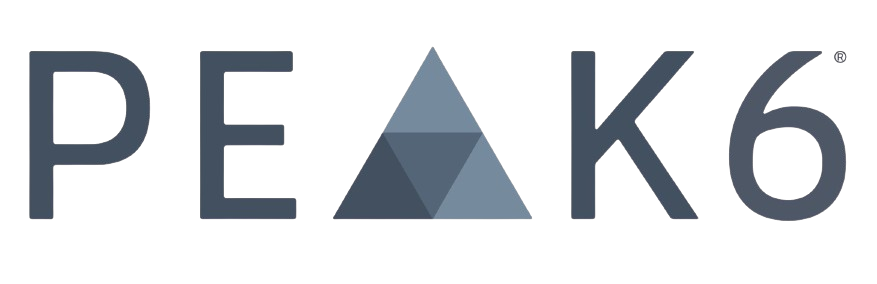

## Table of Contents

## What is Peak6?

Peak6 is a company that helps other businesses with technology and finance. They started in 1997 and have grown a lot since then. They work in many areas like trading, insurance, and gaming. They use smart technology to make things easier and better for their clients.

The company is known for being innovative. They always try to find new ways to solve problems. They have a team of experts who are good at what they do. Peak6 helps their clients make more money and work more efficiently. They are based in Chicago but work with people all over the world.

## When was Peak6 founded?

Peak6 was founded in 1997. That means it started a long time ago, more than 20 years now.

Since then, Peak6 has grown a lot. They help other businesses with technology and finance. They work in many areas like trading, insurance, and gaming.

## Who are the founders of Peak6?

Peak6 was started by Jenny Just and Matt Hulsizer. They are the founders of the company. Jenny and Matt began Peak6 in 1997 because they wanted to help other businesses with technology and finance.

Jenny Just and Matt Hulsizer have been very successful with Peak6. They have grown the company a lot over the years. Peak6 now works in many areas like trading, insurance, and gaming. They use smart technology to make things easier and better for their clients.

The founders are known for being innovative. They always try to find new ways to solve problems. Jenny and Matt have built a team of experts who are good at what they do. Thanks to them, Peak6 helps clients make more money and work more efficiently.

## What industries does Peak6 operate in?

Peak6 works in different industries. They help businesses with trading, insurance, and gaming. These are the main areas where Peak6 uses its technology and finance skills to make things better for their clients.

In trading, Peak6 helps people buy and sell things like stocks and options. They use smart technology to make trading easier and more efficient. For insurance, Peak6 helps companies manage their risks and protect their businesses. They also use technology to make insurance processes smoother.

In the gaming industry, Peak6 works with game developers and companies to improve their games. They use their tech skills to help make games more fun and successful. Peak6 is known for being innovative in all these areas, always finding new ways to help their clients.

## What are some of the key services offered by Peak6?

Peak6 offers many important services to help businesses. They focus on trading, insurance, and gaming. In trading, Peak6 helps people buy and sell things like stocks and options. They use smart technology to make trading easier and faster. This helps their clients make more money and work more efficiently.

For insurance, Peak6 helps companies manage their risks and protect their businesses. They use technology to make insurance processes smoother and more effective. This means companies can focus on their main work without worrying about risks.

In the gaming industry, Peak6 works with game developers to make their games better. They use their tech skills to help make games more fun and successful. Peak6 is always finding new ways to help their clients in all these areas.

## How does Peak6 approach risk management in its operations?

Peak6 takes risk management very seriously in all its operations. They use smart technology to help businesses manage risks, especially in the insurance industry. Peak6 helps companies understand their risks better and find ways to protect themselves. They use data and technology to make sure that businesses can handle unexpected problems without losing too much money.

In trading, Peak6 also focuses on managing risks. They help people buy and sell things like stocks and options in a way that is safe and efficient. Peak6 uses technology to watch the markets closely and make quick decisions to reduce risks. This helps their clients make more money while keeping their investments safe.

## What is the business model of Peak6?

Peak6 makes money by helping other businesses with technology and finance. They work in areas like trading, insurance, and gaming. Peak6 uses smart technology to make things easier and better for their clients. They charge for their services, which helps them earn money. This way, Peak6 can keep growing and helping more businesses.

In trading, Peak6 helps people buy and sell things like stocks and options. They use technology to make trading safer and more efficient. This helps their clients make more money while keeping their investments safe. For insurance, Peak6 helps companies manage risks and protect their businesses. They use data and technology to make insurance processes smoother. In gaming, Peak6 works with game developers to make games more fun and successful. By offering these services, Peak6 earns money and helps their clients succeed.

## Can you explain Peak6's investment strategy?

Peak6's investment strategy focuses on using technology and data to make smart choices. They look for good opportunities in areas like trading, insurance, and gaming. Peak6 uses their expertise to find ways to make money while also helping their clients. They are always looking for new and innovative ways to invest, which helps them stay ahead in the market.

They also manage risks carefully. Peak6 uses technology to watch the markets closely and make quick decisions to reduce risks. This helps their clients make more money while keeping their investments safe. By being careful and using smart technology, Peak6 can find good investments and help their clients succeed.

## What are some notable acquisitions or partnerships of Peak6?

Peak6 has made some important acquisitions and partnerships over the years. One big acquisition was Youbetme, a social betting platform. This helped Peak6 grow in the gaming industry. They also bought a company called Apex Clearing, which helps with trading and clearing services. This made Peak6 stronger in the financial services area.

Another important partnership was with the Chicago Cubs. Peak6 worked with the Cubs to help with their business and technology needs. This partnership showed how Peak6 can help big organizations in different ways. By making these acquisitions and partnerships, Peak6 has been able to grow and help more businesses in different industries.

## How does Peak6 utilize technology in its business?

Peak6 uses technology in many ways to help businesses. They use smart technology to make trading easier and faster. This helps people buy and sell things like stocks and options without much trouble. Peak6 also uses technology to watch the markets closely and make quick decisions. This helps their clients make more money while keeping their investments safe.

In the insurance industry, Peak6 uses technology to help companies manage risks and protect their businesses. They use data to understand risks better and find ways to handle them. This makes insurance processes smoother and more effective. For the gaming industry, Peak6 works with game developers to make games better. They use their tech skills to help make games more fun and successful. By using technology in all these areas, Peak6 helps their clients succeed.

## What are the major challenges Peak6 faces in the market?

Peak6 faces some big challenges in the market. One challenge is keeping up with new technology. Technology changes fast, and Peak6 needs to stay ahead to help their clients. If they fall behind, it could be hard for them to offer the best services. Another challenge is competition. There are many other companies that do similar things in trading, insurance, and gaming. Peak6 has to work hard to be better than these other companies.

Another challenge is managing risks. Peak6 helps businesses with risk management, but they also have to manage their own risks. This can be tricky, especially in trading where things can change quickly. They need to be very careful to keep their clients' money safe. Also, Peak6 works in different industries, so they need to understand each one well. This can be hard because each industry has its own problems and rules.

## What future plans or expansions does Peak6 have?

Peak6 wants to keep growing and helping more businesses. They plan to use new technology to make their services even better. They are looking at new areas where they can help, like more types of trading and different kinds of insurance. Peak6 also wants to work with more game developers to make games even more fun and successful. They are always looking for new ways to use technology to solve problems and help their clients.

Another big plan for Peak6 is to expand to new places. Right now, they are based in Chicago, but they want to work with more people around the world. This means they might open new offices in different countries. By doing this, Peak6 can help more businesses and learn about new markets. They are excited about these plans and think they will help them grow even more in the future.

## References & Further Reading

[1]: Jansen, S. (2018). ["Machine Learning for Algorithmic Trading."](https://github.com/stefan-jansen/machine-learning-for-trading) Packt Publishing.

[2]: Lopez de Prado, M. (2018). ["Advances in Financial Machine Learning."](https://www.amazon.com/Advances-Financial-Machine-Learning-Marcos/dp/1119482089) Wiley.

[3]: Chan, E. P. (2009). ["Quantitative Trading: How to Build Your Own Algorithmic Trading Business."](https://github.com/ftvision/quant_trading_echan_book) Wiley.

[4]: Bouchaud, J.-P., & Potters, M. (2003). ["Theory of Financial Risk and Derivative Pricing: From Statistical Physics to Risk Management."](https://www.cambridge.org/core/books/theory-of-financial-risk-and-derivative-pricing/5BBBA04CE72ED9E5E7C1C028D9A94FCB) Cambridge University Press.

[5]: Narang, R. K. (2009). ["Inside the Black Box: A Simple Guide to Quantitative and High Frequency Trading."](https://onlinelibrary.wiley.com/doi/book/10.1002/9781118267738) Wiley.