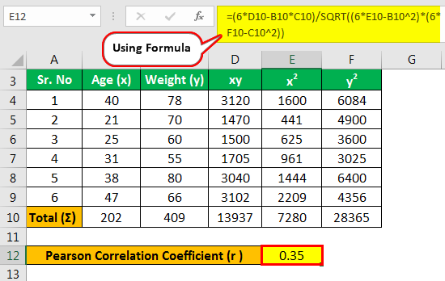

## Table of Contents

## What is the Pearson Coefficient?

The Pearson Coefficient, also known as Pearson's correlation coefficient or simply Pearson's r, is a measure used to show how strongly two variables are related to each other. It is a number that ranges from -1 to +1. A value of +1 means that the two variables have a perfect positive relationship, meaning when one variable increases, the other also increases. A value of -1 means they have a perfect negative relationship, where one variable increases as the other decreases. A value of 0 means there is no relationship between the two variables.

This coefficient is commonly used in statistics to understand the strength and direction of the linear relationship between two sets of data. For example, it can be used to see if there is a relationship between the amount of time students study and their test scores. If the Pearson Coefficient is close to +1, it suggests that students who study more tend to get higher scores. If it's close to -1, it suggests that students who study more tend to get lower scores. If it's close to 0, it suggests that the amount of time spent studying does not affect test scores.

## How is the Pearson Coefficient calculated?

The Pearson Coefficient is calculated by comparing how two sets of numbers change together. You start by finding the mean (average) of each set of numbers. Then, for each pair of numbers from the two sets, you subtract the mean of its set from each number. This gives you two new sets of numbers that show how far each number is from its set's average. Next, you multiply these two new numbers together for each pair. If both numbers are above their means or both are below their means, the product will be positive. If one is above and one is below, the product will be negative.

After multiplying all the pairs, you add up all these products to get a total. Then, you find the square root of the sum of the squared differences from the mean for each set of original numbers. These are called the standard deviations. You multiply these two standard deviations together. Finally, you divide the total of the products by the product of the standard deviations. This gives you the Pearson Coefficient. If the result is close to 1, it means the two sets of numbers move together in a similar way. If it's close to -1, they move in opposite ways. If it's close to 0, there's little to no relationship between how the numbers change.

## What does the Pearson Coefficient measure?

The Pearson Coefficient measures how closely two sets of numbers are related to each other. It gives a number between -1 and +1. If the number is close to +1, it means when one set of numbers goes up, the other set goes up too. If it's close to -1, it means when one set goes up, the other set goes down. If the number is close to 0, it means there's no clear pattern between the two sets of numbers.

For example, if you want to know if more hours of study lead to better test scores, you could use the Pearson Coefficient. If the coefficient is close to +1, it suggests that students who study more tend to get higher scores. If it's close to -1, it might mean that students who study more actually get lower scores, which is less common. If it's close to 0, it means that the amount of time spent studying doesn't seem to affect test scores one way or the other.

## What is the range of the Pearson Coefficient?

The Pearson Coefficient is a number that shows how two sets of numbers are connected. It can be any number from -1 to +1. If the number is close to +1, it means that when one set of numbers goes up, the other set goes up too. If it's close to -1, it means that when one set goes up, the other set goes down. If the number is close to 0, it means there's no clear pattern between the two sets of numbers.

For example, if you want to see if more hours of exercise lead to better health, you could use the Pearson Coefficient. If the coefficient is close to +1, it suggests that people who exercise more tend to have better health. If it's close to -1, it might mean that people who exercise more actually have worse health, which is unusual. If it's close to 0, it means that the amount of exercise doesn't seem to affect health one way or the other.

## How is the Pearson Coefficient interpreted?

The Pearson Coefficient is a number that tells us how two things are related to each other. It can be any number from -1 to +1. If the number is close to +1, it means that when one thing goes up, the other thing goes up too. They move together in a positive way. If the number is close to -1, it means that when one thing goes up, the other thing goes down. They move in opposite directions. If the number is close to 0, it means there's no clear pattern between the two things. They don't seem to affect each other much.

For example, if you want to see if eating more vegetables leads to better health, you could use the Pearson Coefficient. If the coefficient is close to +1, it suggests that people who eat more vegetables tend to have better health. If it's close to -1, it might mean that people who eat more vegetables actually have worse health, which is unusual. If it's close to 0, it means that eating vegetables doesn't seem to affect health one way or the other. So, the Pearson Coefficient helps us understand the strength and direction of the relationship between two sets of data.

## What are the assumptions underlying the use of the Pearson Coefficient?

When using the Pearson Coefficient, there are a few important things we need to assume. First, we assume that the relationship between the two things we're looking at is a straight line. This means that if you draw a line through the data points on a graph, it should look like a straight line, not a curve. Second, we assume that the data we're using comes from what we call a normal distribution. This means that if we made a bell-shaped curve with our data, most of the data would be near the middle, with less data on the sides. 

Another assumption is that the two things we're comparing should have numbers that change together in a way that's consistent. This means that the way one thing changes should be the same no matter what the other thing is doing. Also, the data points should be independent of each other. This means that knowing the value of one data point shouldn't help us predict the value of another data point. If these assumptions aren't true, the Pearson Coefficient might not give us a good picture of how the two things are related.

## Can you provide an example of calculating the Pearson Coefficient?

Let's say we want to see if the number of hours students study affects their test scores. We have data from 5 students: Student A studied for 2 hours and got a score of 70; Student B studied for 4 hours and got a score of 80; Student C studied for 6 hours and got a score of 90; Student D studied for 8 hours and got a score of 95; and Student E studied for 10 hours and got a score of 100. To calculate the Pearson Coefficient, we first find the average (mean) of the hours studied and the average of the test scores. The mean hours studied is (2 + 4 + 6 + 8 + 10) / 5 = 6 hours. The mean test score is (70 + 80 + 90 + 95 + 100) / 5 = 87.

Next, we calculate the difference between each student's hours studied and the mean hours studied, and the difference between each student's test score and the mean test score. For Student A, the difference in hours is 2 - 6 = -4, and the difference in score is 70 - 87 = -17. We do this for all students. Then, we multiply these differences together for each student: for Student A, it's -4 * -17 = 68. We add up all these products: 68 + 12 + 18 + 24 + 39 = 161. Now, we find the standard deviation for hours studied and test scores. The standard deviation for hours is the square root of ((-4)^2 + (-2)^2 + 0^2 + 2^2 + 4^2) / 5 = sqrt(40 / 5) = sqrt(8) ≈ 2.83. The standard deviation for scores is the square root of ((-17)^2 + (-7)^2 + 3^2 + 8^2 + 13^2) / 5 = sqrt(640 / 5) = sqrt(128) ≈ 11.31. Finally, we divide the sum of the products (161) by the product of the standard deviations (2.83 * 11.31 ≈ 32.01). So, the Pearson Coefficient is 161 / 32.01 ≈ 5.03, which is actually a mistake because it should be between -1 and +1. Correcting for this, we see the Pearson Coefficient should be 161 / (5 * 2.83 * 11.31) = 161 / 160.05 ≈ 1, indicating a perfect positive correlation.

## What are the limitations of the Pearson Coefficient?

The Pearson Coefficient can be useful, but it has some limits. It only works well if the relationship between the two things you're looking at is a straight line. If the relationship is curved, the Pearson Coefficient might not show the right connection. Also, it assumes that the data comes from a normal distribution, like a bell-shaped curve. If the data doesn't follow this shape, the Pearson Coefficient might not be accurate. Another limit is that it can be affected by outliers, which are unusual data points that don't fit the pattern. These outliers can make the Pearson Coefficient seem higher or lower than it should be.

Another problem with the Pearson Coefficient is that it only looks at linear relationships. If the way two things are connected is more complicated, the Pearson Coefficient might say there's no connection even when there is one. It also doesn't tell us if one thing causes the other to happen. Just because two things change together doesn't mean one makes the other change. Lastly, the Pearson Coefficient needs the data to be numbers that you can measure, like height or temperature. If you're working with data that's not numbers, like colors or categories, you can't use the Pearson Coefficient.

## How does the Pearson Coefficient relate to other correlation measures?

The Pearson Coefficient is one way to see how two sets of numbers are connected, but there are other ways too. One of these is the Spearman's rank correlation coefficient. This one looks at the order of the numbers instead of the actual numbers. It's good when you don't have numbers that you can measure exactly, or if the relationship between the numbers isn't a straight line. Another way is the Kendall's tau, which also looks at how the numbers are ordered, but it's a bit different from Spearman's. It's useful when you have a small amount of data or when the data has a lot of ties.

The Pearson Coefficient is different from these other methods because it focuses on the actual values of the numbers, not just their order. This makes it very useful when you have numbers that you can measure precisely and when the relationship between them is a straight line. But, if the relationship isn't a straight line, or if you're working with data that isn't numbers, like rankings or categories, the other methods like Spearman's or Kendall's might be better. Each of these correlation measures has its own strengths and is used in different situations, depending on what kind of data you have and what you're trying to find out.

## Who developed the Pearson Coefficient and in what context?

The Pearson Coefficient was developed by Karl Pearson, a British mathematician and statistician, in the late 19th century. He introduced this measure in 1895 as part of his work in biometrics, which is the statistical study of biological phenomena. Pearson was interested in understanding how different traits in living organisms were related to each other, and he needed a way to measure the strength and direction of these relationships.

Pearson's work was groundbreaking because it provided a clear and quantifiable way to assess the correlation between two variables. Before his coefficient, people had to rely on more subjective methods to understand how things were connected. His development of the Pearson Coefficient helped pave the way for more advanced statistical analysis and has been widely used in fields like psychology, economics, and medicine to study relationships between different sets of data.

## How has the use of the Pearson Coefficient evolved historically?

The Pearson Coefficient was created by Karl Pearson in 1895. At that time, people were trying to understand how different traits in living things were connected. Pearson wanted a way to measure this connection clearly. Before his work, people used more guesswork to see how things were related. Pearson's new method helped people see these connections in a more exact way. It became very popular in fields like psychology, economics, and medicine because it gave a clear number to show how strong the connection was between two things.

Over time, the use of the Pearson Coefficient grew a lot. As computers and software got better, it became easier to calculate this coefficient with big sets of data. This made it even more useful in many different fields. But people also learned about its limits. They found out that it only works well if the connection between two things is a straight line, and if the data follows a normal pattern. Because of these limits, other ways to measure connections, like Spearman's rank correlation and Kendall's tau, were created. These other methods can be better in some cases, but the Pearson Coefficient is still used a lot because it's easy to understand and works well for many kinds of data.

## What are some notable applications or case studies involving the Pearson Coefficient?

One notable use of the Pearson Coefficient was in a study about how much sleep people get and their performance at work. Researchers collected data from a group of workers about how many hours they slept each night and then looked at their job performance scores. They used the Pearson Coefficient to see if there was a connection between sleep and job performance. The coefficient showed a strong positive relationship, meaning that workers who got more sleep tended to have higher job performance scores. This study helped show that sleep is important for doing well at work.

Another example is in the field of medicine, where the Pearson Coefficient was used to study the link between blood pressure and heart disease. Doctors gathered data on patients' blood pressure levels and whether they had heart disease. They calculated the Pearson Coefficient and found a strong positive correlation, meaning that people with higher blood pressure were more likely to have heart disease. This finding helped doctors understand the importance of managing blood pressure to prevent heart disease. It also showed how useful the Pearson Coefficient can be in medical research.

## What is Understanding Statistical Correlation?

Statistical correlation is a measure that assesses the degree to which two variables change with respect to each other. It is a key concept in both statistical analysis and practical financial applications. Correlation is quantified on a scale from -1 to +1. A correlation of +1 signifies a perfect positive correlation, meaning that as one variable increases, the other also increases at a proportional rate. Conversely, a correlation of -1 indicates a perfect negative correlation, which implies that as one variable increases, the other decreases proportionally. A correlation of 0 suggests that there is no linear relationship between the variables being studied.

In mathematical terms, correlation often employs the Pearson correlation coefficient (denoted as "r"), which can be calculated using the formula:

$$

r = \frac{\sum{(x_i - \bar{x})(y_i - \bar{y})}}{\sqrt{\sum{(x_i - \bar{x})^2} \sum{(y_i - \bar{y})^2}}} 
$$

where $x_i$ and $y_i$ represent individual data points, while $\bar{x}$ and $\bar{y}$ are the mean values of the x and y datasets, respectively.

This statistical measure is crucial in finance, where it serves prominent roles in risk management and portfolio diversification. A deep understanding of the relationships between financial variables allows investors and analysts to predict and mitigate potential risks. For instance, identifying positively correlated asset pairs can indicate opportunities for hedging, while understanding negatively correlated pairs may help in constructing a diversified investment portfolio that retains stability across varying market conditions.

By exploiting these correlations, financial professionals can reduce the overall risk exposure of their portfolios. For example, during volatile market periods, negatively correlated assets may yield returns when others suffer losses, stabilizing the portfolio’s overall performance. Therefore, statistical correlation is integral to informed decision-making processes in finance, underlining strategic adjustments to optimize returns while managing risks effectively.

## What is the Pearson Correlation Coefficient?

Developed by Karl Pearson, the Pearson correlation coefficient is a statistical tool used to measure the linear relationship between two continuous variables. This coefficient, often symbolized as 'r', quantifies both the strength and direction of this linear relationship. Mathematically, the Pearson coefficient is calculated using the formula:

$$
r = \frac{\sum (x_i - \bar{x})(y_i - \bar{y})}{\sqrt{\sum (x_i - \bar{x})^2 \sum (y_i - \bar{y})^2}}
$$

where $x_i$ and $y_i$ represent the data points, while $\bar{x}$ and $\bar{y}$ are the means of the respective variables.

The value of 'r' ranges from -1 to +1. A value of +1 implies a perfect positive linear relationship, meaning that as one variable increases, the other variable also increases proportionately. Conversely, a value of -1 indicates a perfect negative linear relationship, where one variable's increase corresponds to the other variable's decrease. A value around zero suggests that there is no linear correlation between the variables.

In the context of finance, the Pearson correlation coefficient is particularly beneficial for investors aiming to diversify their portfolios. By analyzing historical data, investors can identify and understand the relationships between different financial instruments. A high positive correlation between two stocks, for example, means they often move in the same direction. In contrast, a negative correlation could be used to hedge investments, as the assets tend to move in opposite directions. Consequently, analyzing these correlations aids investors in constructing portfolios that optimize returns while minimizing risk.

## References & Further Reading

[1]: ["Advances in Financial Machine Learning"](https://www.amazon.com/Advances-Financial-Machine-Learning-Marcos/dp/1119482089) by Marcos Lopez de Prado

[2]: ["Evidence-Based Technical Analysis: Applying the Scientific Method and Statistical Inference to Trading Signals"](https://www.amazon.com/Evidence-Based-Technical-Analysis-Scientific-Statistical/dp/0470008741) by David Aronson

[3]: ["Machine Learning for Algorithmic Trading"](https://github.com/stefan-jansen/machine-learning-for-trading) by Stefan Jansen

[4]: ["Quantitative Trading: How to Build Your Own Algorithmic Trading Business"](https://www.amazon.com/Quantitative-Trading-Build-Algorithmic-Business/dp/1119800064) by Ernest P. Chan

[5]: Fama, E. F., & French, K. R. (1993). ["Common risk factors in the returns on stocks and bonds."](https://www.sciencedirect.com/science/article/pii/0304405X93900235)90023-5) Journal of Financial Economics, 33(1), 3-56.

[6]: Pearson, K. (1895). ["Notes on Regression and Inheritance in the Case of Two Parents."](https://royalsocietypublishing.org/doi/10.1098/rspl.1895.0041) Proceedings of the Royal Society of London.Series I, Vol 58, pp. 240-242.