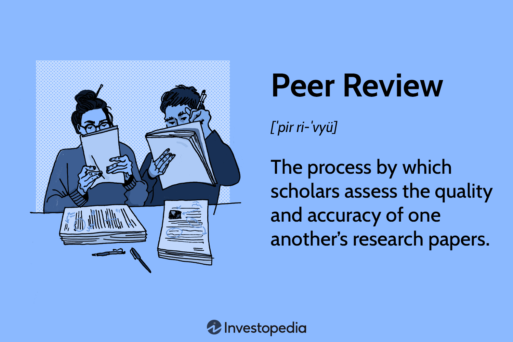

In today's fast-paced business environment, organizations are continually seeking effective tools and methodologies to enhance performance and productivity. As technology becomes an integral part of operations across industries, a significant area of focus is employee evaluation and development. Modern employee assessment has evolved beyond traditional top-down reviews, with peer evaluation and performance reviews becoming essential components that provide nuanced insights into employee capabilities. Unlike conventional methods, these approaches capture a comprehensive view of an individual's performance by incorporating feedback from colleagues who interact with them daily. This shift facilitates a more inclusive evaluation process that can identify strengths, areas for improvement, and behavioral aspects that might be overlooked by managerial reviews alone.

Simultaneously, in the financial sector, algorithmic trading, or algo trading, is gaining momentum. By employing advanced algorithms, this technique automates trading strategies, enabling decisions to be made at unprecedented speeds based on quantifiable data. The increasing reliance on algorithms emphasizes a departure from human intuition towards machine-based decision-making. 



This article explores the synergy between peer evaluation, performance reviews, employee assessment, and algorithmic trading. By converging these elements, organizations can build high-performing teams that capitalize on data-driven insights in technologically-advanced environments. This integration aims to harness the strengths of peer feedback and objective metrics to enhance team dynamics and individual performance in ways that align with organizational objectives.

## Table of Contents

## The Role of Peer Evaluation in Employee Assessment

Peer evaluations offer a comprehensive view of an employee's performance by collecting feedback from colleagues who directly interact with the individual. This method provides a balanced assessment that often reveals insights beyond what traditional top-down evaluations capture.

Unlike conventional appraisals, which may focus on meeting specific objectives set by supervisors, peer reviews incorporate diverse perspectives, allowing for the identification of both strengths and areas for improvement. This 360-degree feedback approach can reveal behavioral insights and skillsets that might not be apparent to managers, offering a more holistic view of an employee's contributions and potential.

The implementation of peer evaluations can significantly enhance team dynamics. By promoting open dialogue and fostering a culture of mutual respect and collaboration, these assessments create an environment where communication thrives. Insightful peer feedback can help identify hidden talents within the team and uncover developmental needs, enabling tailored professional growth opportunities.

Moreover, peer evaluations support a more equitable workplace, as they mitigate the biases inherent in top-down assessments. By distributing the evaluation process across multiple perspectives, organizations can ensure fairer, more objective assessments.

In conclusion, while peer evaluations bring nuanced insights into employee assessment, they also contribute to building cohesive teams that leverage collective strengths and address shared challenges. This enriched evaluation process ultimately aids organizations in developing a workforce that aligns with strategic goals and fosters an engaging and productive work environment.

## Performance Reviews: Driving Continuous Improvement

Regular performance reviews are crucial for fostering an organizational culture that prioritizes continuous improvement. These evaluations are designed to provide structured feedback, ensuring that employees remain aligned with the company's strategic objectives while promoting their personal and professional growth. Through the systematic analysis of performance, reviews act as a roadmap, offering employees clarity regarding their roles and expectations.

The process of performance reviews involves a comprehensive assessment of an employee's contributions, skills, and behaviors. By facilitating regular feedback, these reviews empower employees to take active roles in their development journey. This participatory approach encourages a sense of ownership, where individuals are not merely recipients of feedback but active contributors to the dialogue on performance and growth. The emphasis on accountability and transparency ensures that employees understand the metrics and criteria on which their performance is assessed, eliminating ambiguity.

Structured reviews typically involve a combination of qualitative and quantitative measures. Quantitative metrics may include job-specific KPIs (Key Performance Indicators) or sales targets, while qualitative assessments often cover behavioral aspects, teamwork, and problem-solving skills. The balance between these measures ensures a holistic evaluation, recognizing that high performance is not solely about meeting numerical targets but also about embodying the organization's values and effectively collaborating with colleagues.

Moreover, regular reviews facilitate the setting of SMART (Specific, Measurable, Achievable, Relevant, Time-bound) goals. These objectives are not only aligned with organizational priorities but are also tailored to the developmental needs of the employee, fostering a growth-oriented mindset. By aligning individual aspirations with the broader company mission, employees are motivated to engage in continuous learning and skill enhancement.

Performance reviews also encourage proactive discussions about career progression. Through open dialogue, managers and employees can identify opportunities for advancement, training, or role changes that align with the employee’s career goals and the organization's needs. This alignment enhances employee satisfaction and engagement, reducing turnover rates and cultivating a loyal workforce.

In summary, performance reviews are instrumental in driving continuous improvement by providing clear and actionable feedback. By aligning individual goals with organizational objectives, promoting accountability, and facilitating personal and professional development, these reviews create a dynamic environment where employees are empowered to excel and contribute to the long-term success of the organization.

## Integrating Algorithmic Trading into Employee Assessments

Algorithmic trading, commonly known as algo trading, has revolutionized the financial sector by employing sophisticated algorithms to automate trading decisions based on quantitative data. This approach significantly reduces the reliance on human intuition and introduces precision and speed into trading operations. By applying similar principles to employee assessments, businesses can enhance the objectivity and fairness of their evaluation processes.

**Data-Driven Evaluation**: The foundational idea behind leveraging algo trading methodologies in employee assessments is the transition towards data-driven decision-making. Traditional performance reviews can be subjective and susceptible to bias, whereas algorithmic assessments utilize predetermined metrics and analytics to provide an objective view of an employee’s performance and potential. This method relies on evaluating quantifiable indicators such as productivity metrics, the quality of completed tasks, and even peer feedback data, much like how trading algorithms evaluate market conditions through varied datasets.

**Metrics and Analytics**: The application of analytics in employee assessments can be implemented through various tools and techniques. For example, machine learning models can be developed to predict employee performance trends or identify potential areas for improvement. Consider the following Python code snippet as a simple illustration:

```python
from sklearn.linear_model import LinearRegression
import numpy as np

# Sample dataset: performance scores, peer ratings, project completion rates
X = np.array([[87, 4.5, 15], [92, 4.7, 17], [85, 4.3, 14], [90, 4.6, 16]])
y = np.array([88, 91, 84, 89])  # Overall performance evaluation

# Linear Regression Model
model = LinearRegression()
model.fit(X, y)

# Predicting performance for a new employee
new_employee_data = np.array([[90, 4.8, 16]])
predicted_performance = model.predict(new_employee_data)
print(predicted_performance)
```

In this example, a simple linear regression model is used to predict an employee’s performance score based on various performance indicators. The integration of such models allows organizations to conduct standardized and unbiased performance evaluations.

**Enhanced Objectivity and Insights**: By harnessing the capabilities of algo trading concepts, organizations gain deeper insights into workforce dynamics, identifying high performers and those requiring additional development. These insights help in making informed decisions regarding promotions, compensations, or designing targeted training programs. Moreover, it promotes a consistent criterion for evaluations, reducing discrepancies arising from subjective judgments.

However, while the benefits of integrating these algo trading principles into employee assessments are evident, it is crucial to consider potential challenges such as ensuring data privacy, addressing resistance to technologically-driven evaluations, and balancing qualitative aspects of employee performance that may not be easily quantifiable. Careful implementation and continuous refinement of these algorithmic evaluation methods can lead to a more engaged and high-performing workforce, aligned with organizational objectives.

## Using Technology to Enhance Peer Review and Performance Evaluation

Technological advancements have significantly enhanced the peer review and performance evaluation processes within organizations. Modern tools and platforms are providing streamlined mechanisms for real-time feedback and peer assessments, which are crucial in accommodating today's dynamic work environments. By leveraging technology, organizations can facilitate more comprehensive and efficient evaluation processes.

One of the most notable advancements is the integration of [artificial intelligence](/wiki/ai-artificial-intelligence) (AI) into performance evaluation systems. AI-driven insights and analytics are pivotal in ensuring consistency and accuracy in peer evaluations. These systems are designed to eliminate potential biases that might arise from human evaluators and provide a more objective assessment of employees' contributions. AI algorithms can analyze large volumes of data to identify patterns and trends in employee performance, enabling managers to make more informed decisions.

For example, [machine learning](/wiki/machine-learning) models can be employed to analyze employee interactions, extracting valuable information regarding collaboration levels, communication effectiveness, and contribution to team objectives. A Python-based approach to building such a model might include using a library like Scikit-learn to classify and predict behavioral patterns:

```python
from sklearn.model_selection import train_test_split
from sklearn.ensemble import RandomForestClassifier
from sklearn.metrics import classification_report

# Sample dataset containing employee interaction metrics
data = {"communication_score": [...], "collaboration_score": [...], "performance_label": [...]}
df = pd.DataFrame(data)

# Splitting data into training and testing sets
X = df[['communication_score', 'collaboration_score']]
y = df['performance_label']
X_train, X_test, y_train, y_test = train_test_split(X, y, test_size=0.2, random_state=42)

# Building a Random Forest model
model = RandomForestClassifier(n_estimators=100)
model.fit(X_train, y_train)

# Making predictions and evaluating the model
predictions = model.predict(X_test)
print(classification_report(y_test, predictions))
```

This approach demonstrates the applicability of AI in deriving meaningful insights from employee interaction data, which can then be used to enhance peer review processes.

Furthermore, digital platforms have improved the way feedback is collected and utilized. Real-time feedback applications allow employees to give and receive feedback instantaneously, thus promoting a culture of continuous improvement and engagement. This immediacy not only encourages open communication but also helps individuals to promptly address areas of improvement.

However, the adoption of technology in peer review and performance evaluations also presents challenges. Organizations must ensure robust data privacy measures are in place to protect sensitive employee information. Additionally, there is a need for careful management to prevent over-reliance on quantitative metrics, which might not fully capture the qualitative aspects of employee performance.

Overall, leveraging technological tools in peer reviews and performance evaluations offers significant benefits, enhancing the accuracy, transparency, and effectiveness of employee assessments.

## Advantages and Challenges of Combining These Approaches

The integration of peer evaluations, performance reviews, and [algorithmic trading](/wiki/algorithmic-trading) principles into employee assessments brings several key advantages. These methodologies collectively enhance the accuracy and transparency of employee evaluations, fostering an environment of continuous feedback. By incorporating multiple perspectives through peer evaluations, organizations can achieve a more comprehensive understanding of an employee's capabilities and performance. This multifaceted approach helps to highlight strengths and identify improvement areas that might be overlooked in traditional assessments, thereby promoting personal and organizational growth.

Algorithmic trading principles further refine this process by introducing data-driven insights. Through metrics and analytics, organizations can quantify employee performance in more objective terms. For instance, employee output or productivity can be tracked using standardized performance metrics, which reduces subjective bias and supports evidence-based decisions. Thus, combining these approaches aids in aligning employee objectives with broader organizational goals, enhancing workforce engagement.

Despite these considerable benefits, several challenges necessitate attention. One primary concern is data privacy. As organizations gather extensive data for algorithmic evaluations, the protection of personal information becomes critical. Compliance with data protection regulations such as the General Data Protection Regulation (GDPR) is essential to ensure that employee data is securely handled and privacy is maintained.

Another challenge is the resistance to adopting new technologies. Employees and management may be apprehensive about transitioning to a technology-driven evaluation system, fearing a loss of human judgment and subjectivity. Ensuring sufficient training and demonstrating how these tools can enhance rather than replace human insight is crucial to overcoming this resistance.

Furthermore, an over-reliance on quantitative data poses its own risks. While metrics provide valuable insights, they may not capture complex, qualitative aspects of performance, such as creativity and teamwork. Therefore, a balanced approach that combines quantitative metrics with qualitative assessments is essential.

In summary, while integrating these approaches into employee assessment offers clear advantages in accuracy and feedback culture, it is imperative to address challenges related to data privacy, technology adoption resistance, and the limitations of quantitative-only evaluations.

## Conclusion

The integration of peer evaluations, performance reviews, and algorithmic insights into employee assessments has transformative potential for businesses aiming to cultivate high-performing teams. By converging these methodologies, organizations can achieve a nuanced understanding of employee capabilities and foster a culture of continuous improvement. Peer evaluations contribute a comprehensive perspective on individual contributions, capturing qualitative feedback that might otherwise be overlooked.

Simultaneously, performance reviews keep employees aligned with organizational goals by systematically tracking progress and setting developmental benchmarks. When blended with algorithmic insights, derived from data analytics and automated processes, organizations can further refine these assessments. This combination not only offers a more objective evaluation but also mitigates biases inherent in human judgment.

Implementing these synergistic approaches is expected to enhance productivity through a workforce that is both accountable and engaged. Employees benefit from structured and transparent evaluations that drive personal and professional growth, while organizations benefit from improved alignment with strategic objectives. Utilizing such integrated techniques positions companies to harness the full potential of their human capital, thereby gaining a competitive edge in technologically-driven landscapes.

## References & Further Reading

[1]: Bergstra, J., Bardenet, R., Bengio, Y., & Kégl, B. (2011). ["Algorithms for Hyper-Parameter Optimization."](https://dl.acm.org/doi/10.5555/2986459.2986743) Advances in Neural Information Processing Systems 24.

[2]: ["Advances in Financial Machine Learning"](https://www.amazon.com/Advances-Financial-Machine-Learning-Marcos/dp/1119482089) by Marcos Lopez de Prado

[3]: ["Evidence-Based Technical Analysis: Applying the Scientific Method and Statistical Inference to Trading Signals"](https://www.amazon.com/Evidence-Based-Technical-Analysis-Scientific-Statistical/dp/0470008741) by David Aronson

[4]: ["Machine Learning for Algorithmic Trading"](https://github.com/stefan-jansen/machine-learning-for-trading) by Stefan Jansen

[5]: ["Quantitative Trading: How to Build Your Own Algorithmic Trading Business"](https://www.amazon.com/Quantitative-Trading-Build-Algorithmic-Business/dp/1119800064) by Ernest P. Chan