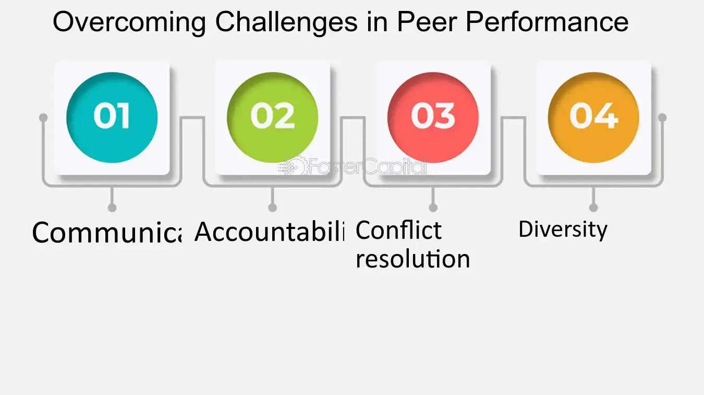

## Table of Contents

## What is Peer Perform in the context of stock analysis?

Peer Perform is a term used by stock analysts to describe a stock that is expected to perform about the same as other companies in its industry. When an analyst gives a stock a Peer Perform rating, they are saying that they think the stock will do as well as, but not better or worse than, its competitors. This rating is often used by analysts at firms like Wolfe Research to give investors an idea of how a stock might do compared to others in the same field.

This rating can be helpful for investors who want to know if a stock is likely to keep up with its peers. If a stock is rated Peer Perform, it means the analyst thinks it will grow at the same rate as the industry average. This can be useful information for someone deciding whether to buy, hold, or sell a stock, as it gives them a benchmark to compare against.

## How does Peer Perform differ from other stock ratings like Outperform or Underperform?

Peer Perform is different from other stock ratings like Outperform and Underperform because it means a stock is expected to do about the same as other companies in its industry. When a stock gets a Peer Perform rating, it means the analyst thinks it will grow at the same rate as the average company in its field. This is useful for investors who want to know if a stock will keep up with its competitors but not do better or worse.

Outperform, on the other hand, means the analyst believes the stock will do better than the average company in its industry. This rating suggests that the stock has the potential to grow more than its peers, which can be exciting for investors looking for stocks that might give them higher returns. Underperform, in contrast, means the analyst thinks the stock will do worse than the average company in its industry. This rating can be a warning sign for investors, indicating that the stock might not grow as much as others in the same field.

Understanding these ratings helps investors make better decisions. If someone is looking for a safe bet that will likely match the industry's performance, they might choose a stock rated as Peer Perform. If they are looking for something with more potential for growth, they might go for a stock rated as Outperform. And if they want to avoid a stock that might not do as well, they would steer clear of one rated as Underperform.

## What are the key metrics used to evaluate a stock's Peer Perform status?

To figure out if a stock is Peer Perform, analysts look at several important numbers. They check the company's earnings growth, which is how much money the company is making over time. They also look at the price-to-earnings (P/E) ratio, which compares the stock's price to its earnings per share. Another thing they consider is the company's revenue growth, which shows how much the company's sales are increasing. These numbers help analysts see if the company is doing as well as others in its industry.

Analysts also pay attention to the company's profit margins, which tell them how much money the company keeps after paying for everything. They might look at the return on equity (ROE), which shows how well the company is using the money shareholders have invested. By comparing these metrics to those of other companies in the same industry, analysts can decide if the stock is likely to perform about the same as its peers. This helps them give the stock a Peer Perform rating.

## Can you explain the process of conducting a Peer Perform analysis?

To do a Peer Perform analysis, analysts start by [picking](/wiki/asset-class-picking) a group of similar companies in the same industry. They look at important numbers like how much money these companies are making, their earnings growth, and their price-to-earnings ratio. They also check the company's revenue growth and profit margins. By comparing these numbers across the group, analysts can see if a company is doing about the same as its peers.

After gathering all this information, analysts use it to decide if a stock should get a Peer Perform rating. They look at how the company's numbers stack up against the industry average. If the company's earnings growth, revenue growth, and other key metrics are similar to the average of its peers, the stock might get a Peer Perform rating. This tells investors that the stock is expected to perform about the same as other companies in its industry.

## What are the benefits of using Peer Perform as a stock rating for investors?

Using Peer Perform as a stock rating helps investors know if a stock will likely do about the same as other companies in its industry. This is useful for investors who want to keep their money safe and not take big risks. If a stock gets a Peer Perform rating, it means the stock should grow at the same rate as the average company in its field. This can help investors decide if they want to buy, hold, or sell a stock based on how it compares to others.

Another benefit of the Peer Perform rating is that it gives investors a clear benchmark. They can see how a stock is doing compared to its competitors. This makes it easier to choose stocks that will likely keep up with the industry without standing out too much. For investors who are not looking for big gains but want steady growth, a Peer Perform rating can be a good guide.

## How can Peer Perform ratings influence investment decisions?

Peer Perform ratings can help investors make smart choices about their money. If a stock gets a Peer Perform rating, it means the stock should do about the same as other companies in its industry. This can be good for investors who don't want to take big risks. They might choose to buy or keep a stock with a Peer Perform rating if they want steady growth without big ups and downs.

These ratings also give investors a way to compare stocks easily. By knowing that a stock is expected to perform like its peers, investors can decide if they want to put their money in that stock or look for something else. If an investor is happy with the industry's average performance, a Peer Perform rating can make them feel confident about their choice.

## What are the common challenges faced when relying on Peer Perform ratings?

One challenge with Peer Perform ratings is that they can be too general. They tell you a stock will do about the same as others in its industry, but they don't give you details on why. This can make it hard to understand what's really going on with the company. Investors might miss important things like new products or changes in the market that could affect the stock's performance.

Another problem is that these ratings can change. What seems like a good Peer Perform rating today might not be the same tomorrow if the industry or the company changes. This means investors need to keep checking the ratings and the reasons behind them. It can be a lot of work to stay up to date and make sure the Peer Perform rating still makes sense for their investment choices.

## How do analysts determine if a stock should be rated as Peer Perform?

Analysts look at a bunch of numbers to decide if a stock should be rated as Peer Perform. They compare the company's earnings growth, which is how much money the company is making over time, with other companies in the same industry. They also check the price-to-earnings ratio, which shows how the stock's price compares to its earnings per share. Revenue growth, or how much the company's sales are increasing, is another important thing they look at. By seeing if these numbers are about the same as the industry average, analysts can tell if the stock is likely to perform like its peers.

If a company's key metrics like earnings growth, revenue growth, and profit margins are similar to the average of its industry, analysts might give it a Peer Perform rating. This means they think the stock will grow at the same rate as other companies in its field. But it's not just about the numbers. Analysts also think about things like the company's overall health and any big changes happening in the industry. All these pieces of information help them decide if a Peer Perform rating is the right fit for the stock.

## What role does market sector performance play in Peer Perform ratings?

The performance of the market sector is really important when analysts give a stock a Peer Perform rating. This rating means the stock should do about the same as other companies in its industry. So, analysts look at how the whole sector is doing to see if a stock fits in. If the sector is growing a lot, a stock with a Peer Perform rating should be growing at the same rate. If the sector is not doing well, a Peer Perform stock should also be struggling a bit.

Analysts compare a company's numbers like earnings growth and revenue growth to the average of its sector. If these numbers are similar to the sector's average, the stock gets a Peer Perform rating. This helps investors know if the stock will keep up with its industry. But if the sector's performance changes a lot, the Peer Perform rating might need to be updated. So, keeping an eye on the sector's performance is key to understanding if a Peer Perform rating still makes sense.

## How have Peer Perform ratings evolved over time in response to market changes?

Over time, Peer Perform ratings have changed to keep up with the market. When the market goes through big changes, like a financial crisis or a new technology boom, analysts have to look at different things to decide if a stock should get a Peer Perform rating. They might start paying more attention to new metrics or industry trends that weren't important before. For example, during the rise of tech companies, analysts might focus more on a company's innovation and growth potential rather than just traditional financial metrics.

These changes help make sure that Peer Perform ratings stay useful for investors. If the market shifts, the way analysts compare a stock to its peers needs to shift too. This means that what counts as "performing like its peers" can be different from one time to another. By adapting to these changes, Peer Perform ratings give investors a better idea of how a stock will do compared to others in its industry, even as the market evolves.

## What advanced techniques can be used to enhance the accuracy of Peer Perform analysis?

To make Peer Perform analysis more accurate, analysts can use advanced techniques like [machine learning](/wiki/machine-learning). Machine learning can look at a lot of data quickly and find patterns that might be hard for people to see. For example, it can look at how a company's stock price moves with things like news about the company or changes in the economy. By using this information, analysts can get a better idea of how a stock will do compared to its peers.

Another technique is to use more detailed industry benchmarks. Instead of just comparing a company to the average of its industry, analysts can break down the industry into smaller groups. This way, they can compare a company to others that are very similar in size, what they do, or where they sell their products. This can give a more accurate Peer Perform rating because it's based on a closer match to the company's situation.

## How do global economic factors impact the reliability of Peer Perform ratings?

Global economic factors can make Peer Perform ratings less reliable. When big things happen around the world, like a financial crisis or changes in trade rules, they can affect whole industries differently. A company might be doing well compared to its peers in one country, but if there's a global economic downturn, the whole industry might struggle. This means a stock that seemed like a Peer Perform might not keep up with its peers anymore because the industry's performance has changed.

To keep Peer Perform ratings useful, analysts need to watch these global economic changes closely. They have to think about how things like interest rates, currency values, and international trade might change the way a company does compared to others in its industry. If they don't, the ratings might not show the real picture of how a stock will do. By keeping an eye on these big global factors, analysts can make sure their Peer Perform ratings stay accurate and helpful for investors.

## References & Further Reading

[1]: Bergstra, J., Bardenet, R., Bengio, Y., & Kégl, B. (2011). ["Algorithms for Hyper-Parameter Optimization."](https://dl.acm.org/doi/10.5555/2986459.2986743) Advances in Neural Information Processing Systems 24.

[2]: ["Advances in Financial Machine Learning"](https://www.amazon.com/Advances-Financial-Machine-Learning-Marcos/dp/1119482089) by Marcos Lopez de Prado

[3]: ["Evidence-Based Technical Analysis: Applying the Scientific Method and Statistical Inference to Trading Signals"](https://www.amazon.com/Evidence-Based-Technical-Analysis-Scientific-Statistical/dp/0470008741) by David Aronson

[4]: ["Machine Learning for Algorithmic Trading"](https://github.com/stefan-jansen/machine-learning-for-trading) by Stefan Jansen

[5]: ["Quantitative Trading: How to Build Your Own Algorithmic Trading Business"](https://www.amazon.com/Quantitative-Trading-Build-Algorithmic-Business/dp/1119800064) by Ernest P. Chan