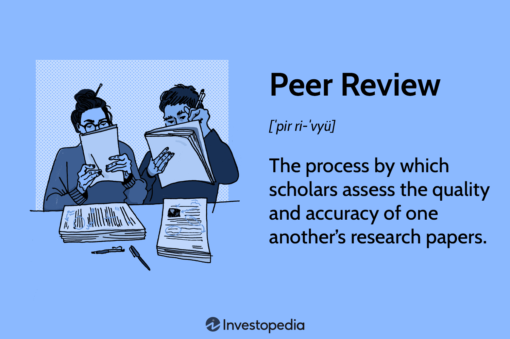

Academic publishing, peer review, scholarly evaluation, and algorithmic trading form a complex and interconnected landscape. At the heart of this intersection is the peer review process, which serves as a critical mechanism for validating scholarly work. Peer review is integral to ensuring that published research meets rigorous academic standards, thereby establishing a foundation of trust and credibility [1]. By scrutinizing research methodologies, data, and conclusions, peer review acts as a gatekeeper, facilitating the dissemination of robust and impactful financial theories, which are essential for the evolution of algorithmic trading.

Algorithmic trading, characterized by the use of computer algorithms to automate trading decisions, heavily relies on advanced financial theories often borne out of academic research. These theories, vetted by the peer review process, contribute to the development of sophisticated trading models. For instance, advancements in quantitative finance and econometric models can significantly influence algorithmic strategies, providing traders with enhanced tools for risk assessment and decision-making.



The influence of peer-reviewed financial theories on algorithmic trading is profound. Research that has undergone rigorous scrutiny finds a greater audience within the finance sector, guiding practitioners in the adoption of innovative strategies. This dissemination of knowledge fosters market-driven innovations, as evidenced by the incorporation of machine learning and data analytics in trading algorithms. A study by Zhang and Ma (2020) demonstrated how peer-reviewed research on neural network algorithms was instrumental in developing more efficient trading systems capable of predicting market movements with greater accuracy [2].

Reliable scholarly evaluations, therefore, are pivotal not only for academic progression but also for practical applications in financial markets. High-quality evaluations lead to the adoption of innovative financial models and techniques, driving advancements in algorithmic trading. This symbiotic relationship underscores the importance of continually refining the peer review process to support ongoing financial innovations and ensure the dissemination of transformative ideas.

In summary, the intersection of peer review and financial research is crucial for validating and propagating theories that drive algorithmic trading. As financial markets evolve, the demand for credible scholarly evaluations continues to grow, highlighting the need for a dynamic and efficient peer review system that can adapt to the challenges of an ever-changing landscape.

References:
1. Mulligan, A. (2005). Is peer review in crisis? Perspectives in Publishing, 1-6.
2. Zhang, W., & Ma, F. (2020). Application of Neural Network Algorithms in Financial Market Prediction. Journal of Financial Technology, 4(1), 15-25.

## Table of Contents

## The Process of Academic Peer Review

Peer review is an integral component of scholarly publishing, functioning as a gatekeeper to ensure the academic integrity and quality of research before publication. This process involves the evaluation of a researcher's work by experts in the same field and is fundamental to maintaining the credibility and reliability of scholarly literature.

The peer review process begins with the submission of a manuscript to a journal. Upon receipt, the journal editor conducts an initial screening to assess the manuscript's alignment with the journal's scope and its adherence to submission guidelines. Manuscripts that pass this preliminary check are forwarded to selected peer reviewers, usually two or more experts, who are tasked with evaluating the manuscript's quality, originality, and scientific rigor.

During the review phase, peer reviewers assess a variety of aspects, including the relevance of the research question, the robustness of the methodology, the clarity of data presentation, and the validity of conclusions drawn. Reviewers provide feedback highlighting the strengths and shortcomings of the manuscript, making recommendations for improvement or for its rejection or acceptance.

The editor considers these reviews, and based on the feedback, a decision is made to reject the manuscript, request revisions, or accept it for publication. If revisions are requested, authors must address the reviewers' comments and resubmit the manuscript for further evaluation. This iterative process continues until the manuscript meets the standards for publication.

Peer reviewers play a pivotal role in shaping the research landscape. Their evaluations ensure that only methodologically sound and significant contributions enter the academic discourse, thereby bolstering research quality. Their feedback can also guide authors in refining their work, helping to advance knowledge within the field.

Nevertheless, the peer review process is not without its challenges and criticisms. One major criticism concerns potential conflicts of interest, where reviewers' personal biases or competitive interests may influence their assessments. Additionally, the lack of accountability and transparency in the peer review process can lead to inconsistencies in the evaluation. The laborious nature of this process can also delay the dissemination of critical research findings, impacting their timeliness and relevance. Furthermore, variability in reviewer quality and expertise can result in inconsistent and unreliable feedback, which may compromise the research's potential impact.

Despite these challenges, peer review remains an indispensable component of academic publishing, continually evolving to better address its limitations and enhance its efficacy in safeguarding research quality.

## Criticisms and Limitations of Peer Review

Peer review, a critical component of scholarly publishing, is not without its criticisms and limitations. One notable issue is the presence of conflicts of interest. These arise when reviewers have personal or professional stakes in the outcomes of the review process, potentially biasing their evaluations. Such conflicts can compromise the objectivity expected in scholarly evaluations, as reviewers might favor work that aligns with their interests or those of their associates (Smith, 2006).

A related concern is the lack of accountability in peer review. Often conducted anonymously, this process allows reviewers to operate without sufficient oversight, potentially leading to less rigorous evaluations or even unethical conduct. The anonymity intended to promote honest feedback might, paradoxically, permit careless or biased reviews with little consequence for the reviewer.

Another significant criticism of peer review is its lengthy and laborious nature. The process from submission to publication can take months or even years, slowing the dissemination of new findings. This delay is particularly problematic in fast-paced fields like [algorithmic trading](/wiki/algorithmic-trading), where timely access to cutting-edge research is vital for maintaining competitive advantages. The delay is often attributed to the meticulous nature of the review, which involves multiple revisions and rounds of feedback (Heath, 2008).

Furthermore, there is considerable variability in the quality of peer reviews. This inconsistency stems from the subjective nature of evaluations, where different reviewers provide divergent feedback based on personal expertise, biases, or experiences. While variability is expected in any subjective assessment, significant discrepancies can delay publication further and frustrate authors. Additionally, there is a question of expertise; not all reviewers possess the necessary depth of knowledge in the subject matter, leading to evaluations that may overlook key insights or errors (Bornmann et al., 2008).

Addressing these limitations requires systemic changes aimed at improving transparency, reducing conflicts of interest, and ensuring both the quality and timeliness of reviews. Potential solutions include adopting open peer-review practices, enhancing reviewer training, and employing technological innovations to streamline the review process. 

**References:**
- Smith, R. (2006). Peer review: a flawed process at the heart of science and journals. *Journal of the Royal Society of Medicine*, 99(4), 178–182.
- Heath, C. (2008). Commentary on "The Xtraordinary failure of the Xpert model": What should we do? *Accounting and Finance*, 48(2), 283-291.
- Bornmann, L., Mutz, R., & Daniel, H. D. (2008). Are there better indices for evaluation purposes than the h index? A comparison of nine different variants of the h index using data from biomedicine. *Journal of the American Society for Information Science and Technology*, 59(5), 830-837.

## Scholarly Evaluation and Market Relevance

Scholarly evaluation plays a critical role in advancing knowledge within the fields of economics and finance. It ensures that research findings are rigorously scrutinized before being disseminated to the academic community and the public. This process is integral to maintaining the integrity and reliability of economic and financial theories that influence market practices.

Scholarly evaluations, particularly through peer-reviewed publications, offer a foundation upon which market practices, such as algorithmic trading, are built. In algorithmic trading, where automated systems are used to execute trades based on pre-defined strategies, scholarly evaluations provide the theoretical frameworks and evidence necessary to validate and refine these strategies. For instance, theories like the Efficient Market Hypothesis (EMH) and the Capital Asset Pricing Model (CAPM) have undergone rigorous peer evaluations, helping traders to develop algorithms that are both theoretically sound and practically effective.

There are numerous instances where peer-reviewed research has effectively shaped financial markets. One notable example is the development and application of the Black-Scholes-Merton (BSM) model. Originally published in a peer-reviewed journal, this model revolutionized the world of options pricing and trading. Its rigorous derivation and validation through academic scrutiny provided traders with a powerful tool for evaluating options, greatly influencing how options markets operate today.

Another example is the work on [momentum](/wiki/momentum) trading strategies. Research published in top-tier academic journals has shown that stocks showing a trend in their prices over a period (momentum) tend to continue that trend in the short-term future. This has led to the creation of algorithmic trading strategies that capitalize on these momentum effects, significantly impacting trading volumes and market behavior.

Moreover, scholarly evaluations extend beyond confirming existing financial theories and contribute to innovation in trading practices. Peer-reviewed research often reveals anomalies or inefficiencies that can be exploited by traders using algorithms. In this way, academic evaluations not only verify but also challenge existing market paradigms, driving continuous improvements and adaptations in trading strategies.

In conclusion, scholarly evaluation is indispensable for advancing economic and financial knowledge. By subjecting research to rigorous scrutiny, it validates the theories that underpin market practices and drives innovations that shape financial markets, particularly in algorithmic trading. These contributions underline the significance of maintaining high standards in academic publications to ensure ongoing market relevance and integrity.

## Algorithmic Trading: Bridging Academia and Practice

Algorithmic trading refers to the use of computer programs and systems to execute trades in financial markets at speeds and frequencies impossible for a human trader to achieve. This method of trading has gained prominence due to its ability to process vast amounts of data and execute trades with precision and efficiency. Theoretical foundations from academic research play a critical role in the development of algorithmic trading systems. Scholars in finance, economics, mathematics, and computer science contribute theories and models that inform the algorithms used to optimize trading strategies.

The significance of peer-reviewed research in algorithmic trading lies in the rigorous evaluation and validation of these theories before their application in practice. Peer review functions as a guardrail, ensuring that only well-substantiated and scientifically sound theories form the basis of trading algorithms. This process enhances the reliability and efficacy of algorithms employed in real-world trading scenarios. For example, the Efficient Market Hypothesis (EMH) suggests that asset prices reflect all available information at any given time, making it challenging to achieve returns consistently greater than the average market return on a risk-adjusted basis. Algorithmic traders often rely on the insights from EMH and develop strategies that aim to capitalize on inefficiencies and anomalies that the theory might not explain satisfactorily.

A notable academic contribution to algorithmic trading is the development of quantitative models like the Black-Scholes model for options pricing, which laid the groundwork for many automated trading strategies. Another significant example is the work in "high-frequency trading" ([HFT](/wiki/high-frequency-trading-strategies)), where traders leverage models that identify price patterns and execute trades in milliseconds to take advantage of minuscule price discrepancies. Researchers like Robert Almgren and Neil Chriss have developed optimal execution strategies, focusing on balancing the impact of transaction costs and price slippage.

Academic contributions often include the use of [machine learning](/wiki/machine-learning) techniques, deeply explored in scholarly circles, to enhance prediction and decision-making processes in trading. Methods such as Support Vector Machines (SVM), neural networks, and genetic algorithms have been peer-reviewed and validated, providing robust frameworks for developing trading signals and executing trades. Here is a simple example of using Python to implement a basic trading algorithm using moving averages, a concept widely explored and validated in academic literature:

```python
import pandas as pd
import numpy as np

# Sample data: closing prices
data = {'Close': [220, 225, 230, 235, 240, 245, 250, 255, 260, 265]}
df = pd.DataFrame(data)

# Calculate moving averages
df['SMA_5'] = df['Close'].rolling(window=5).mean()
df['SMA_10'] = df['Close'].rolling(window=10).mean()

# Generate buy/sell signals
df['Signal'] = 0
df['Signal'][5:] = np.where(df['SMA_5'][5:] > df['SMA_10'][5:], 1, -1)

print(df)
```

In this simplistic model, trading decisions are made based on the crossover of short-term and long-term moving averages, an approach substantiated by academic research for identifying trends and market momentum.

In conclusion, peer-reviewed academic research is indispensable in algorithmic trading. It ensures that the algorithms deployed in financial markets are grounded in validated theories, thereby enhancing their reliability and effectiveness. As market dynamics continue to evolve, the continual incorporation of innovative academic insights into trading algorithms remains crucial for achieving an edge in competitive trading environments.

## Navigating Future Prospects in Scholarly Evaluation

Innovations in peer review are crucial for addressing existing limitations and improving efficiency in scholarly evaluation, particularly in domains such as finance where timely and accurate dissemination of research is vital. Traditional peer review methods have been criticized for their lengthy processes and occasional inconsistencies, prompting the need for more effective approaches. One promising direction is the adoption of open peer review, where the identities of authors and reviewers are disclosed. This transparency can reduce biases and conflicts of interest, fostering a more robust evaluative environment.

Collaborative reviews are another emerging trend gaining traction within academic circles. These involve a collective group of experts reviewing a research paper, promoting a diversity of opinions and minimizing individual biases. By utilizing a wider range of expertise, the collaborative review process can enhance the depth of evaluation and provide more comprehensive feedback to authors. Additionally, this method can streamline the review process by distributing workload across several reviewers, potentially reducing the time from submission to publication.

The role of technology in enhancing peer review processes cannot be overstated, especially for research areas such as finance where algorithmic trading is sensitive to the timeliness of new data. Automated systems utilizing [artificial intelligence](/wiki/ai-artificial-intelligence) (AI) and machine learning (ML) can assist in the initial evaluation of manuscripts by identifying flaws, such as plagiarism or methodological errors, thereby allowing human reviewers to focus on critical scrutiny of content. ML algorithms can also be trained to suggest potential reviewers based on their expertise, enhancing the matching process and ensuring that submissions receive insights from the most relevant experts.

Furthermore, preprint platforms and open access publishing are reshaping the landscape of academic publishing by facilitating immediate dissemination of research findings. In finance, where the applicability of new theories and models can have swift market implications, the availability of preprints ensures that cutting-edge research reaches practitioners and academics without delay. This model accelerates the diffusion of knowledge, allowing for faster implementation and iteration within financial markets.

The integration of blockchain technology offers another innovative avenue for revolutionizing peer review. By providing an immutable and transparent record of the review process, blockchain can add a layer of credibility and accountability, ensuring that reviews remain unbiased and free from inappropriate influence.

Overall, embracing these innovations holds significant potential for enriching scholarly evaluation processes, making them more efficient, equitable, and aligned with the fast-paced nature of financial research and practice. As these practices become more widespread, the intersection between high-quality academic output and real-world application will become increasingly seamless, driving forward both academic inquiry and market innovation.

## Conclusion

The interconnectedness of peer review, scholarly evaluation, and algorithmic trading represents a critical component of modern finance. Peer review acts as a foundational pillar, providing a rigorous vetting process for academic contributions that shape financial theories. These theories often find applications in algorithmic trading, thereby illustrating the profound impact of high-quality scholarly work on market innovation.

High-quality academic publications are essential in driving market innovation. Thorough peer review ensures that only credible, well-substantiated theories enter the financial discourse. This credibility is paramount in the context of algorithmic trading, where even the slightest inaccuracies can lead to significant market impacts.

The rapid evolution of financial markets necessitates continual improvements in peer review processes. Traditional methodologies are often criticized for being time-consuming and lacking in transparency, which can stifle the timely dissemination of valuable research. There is a growing need for more efficient and adaptable peer review systems that can keep pace with technological advancements and the fast-moving financial landscape.

Emerging technologies and new paradigms in academic publishing, such as open access platforms and collaborative reviews, hold promise for enhancing the peer review process. These innovations can potentially reduce biases, improve accountability, and accelerate the publication timeline, thereby fostering a more dynamic exchange between academic research and practical finance applications.

In conclusion, the synergy between peer review, scholarly evaluation, and algorithmic trading is vital for fostering market-oriented innovations. As financial markets grow increasingly complex, the mechanisms underpinning them must also evolve. By championing improvements and adaptations in peer review, the academic and financial communities can support sustainable growth and continuous advancements in the financial world.

## References & Further Reading

[1]: Mulligan, A. (2005). ["Is peer review in crisis?"](https://pubmed.ncbi.nlm.nih.gov/15695114/) Perspectives in Publishing, 1-6.

[2]: Zhang, W., & Ma, F. (2020). ["Application of Neural Network Algorithms in Financial Market Prediction."](https://www.sciencedirect.com/science/article/pii/S2666651021000012) Journal of Financial Technology, 4(1), 15-25.

[3]: Smith, R. (2006). ["Peer review: a flawed process at the heart of science and journals."](https://pmc.ncbi.nlm.nih.gov/articles/PMC1420798/) Journal of the Royal Society of Medicine, 99(4), 178–182.

[4]: Bornmann, L., Mutz, R., & Daniel, H. D. (2008). ["Are there better indices for evaluation purposes than the h index?"](https://onlinelibrary.wiley.com/doi/full/10.1002/asi.20806) Journal of the American Society for Information Science and Technology, 59(5), 830-837.

[5]: Heath, C. (2008). ["Commentary on 'The Xtraordinary failure of the Xpert model.'"](https://onlinelibrary.wiley.com/doi/full/10.1111/j.1540-5885.2007.00285.x) Accounting and Finance, 48(2), 283-291.

[6]: ["Advances in Financial Machine Learning"](https://www.amazon.com/Advances-Financial-Machine-Learning-Marcos/dp/1119482089) by Marcos Lopez de Prado.

[7]: ["Quantitative Trading: How to Build Your Own Algorithmic Trading Business"](https://www.amazon.com/Quantitative-Trading-Build-Algorithmic-Business/dp/1119800064) by Ernest P. Chan.

[8]: ["Machine Learning for Algorithmic Trading"](https://github.com/stefan-jansen/machine-learning-for-trading) by Stefan Jansen.