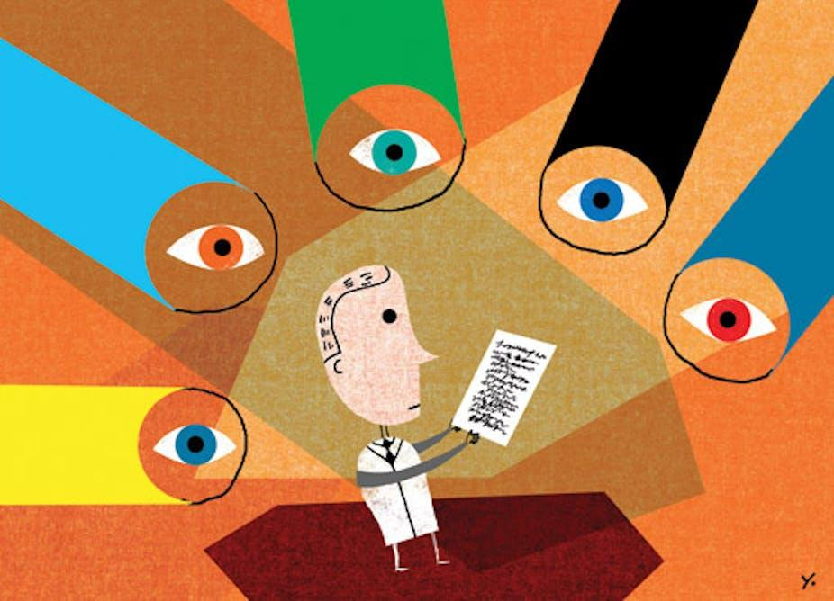

## Table of Contents

## What is peer review?

Peer review is a process where experts check the work of other experts before it is shared with everyone. This is common in science and research. When a scientist finishes a study, they write a paper about it and send it to a journal. The journal then asks other scientists, who are experts in the same field, to read the paper carefully. These experts, called peer reviewers, look for mistakes or things that could be better. They give their feedback to the journal, and the journal decides if the paper should be published or if the scientist needs to make changes first.

Peer review helps make sure that the information in the paper is correct and useful. It stops bad or wrong information from being shared. This makes people trust the research more because they know it has been checked by other experts. However, peer review is not perfect. Sometimes, reviewers might miss mistakes, or they might have different opinions about what is good research. Even with these problems, peer review is still very important for keeping the quality of scientific work high.

## Why is peer review important in academic and scientific research?

Peer review is important in academic and scientific research because it helps make sure that the information shared is correct and reliable. When scientists finish their studies, they write papers about what they found. Before these papers are published, other experts in the same field read them carefully. These experts, called peer reviewers, check for any mistakes or ways the paper could be better. If they find problems, they tell the journal, and the journal might ask the scientist to fix the paper before it can be published. This process helps stop wrong or bad information from being shared with everyone.

Another reason peer review is important is that it builds trust in the research. When people know that a paper has been checked by other experts, they are more likely to believe what it says. This is important because science and research are all about finding the truth and sharing it with others. Even though peer review is not perfect and sometimes reviewers might miss mistakes or have different opinions, it still plays a big role in keeping the quality of scientific work high. By making sure that research is checked and improved before it is shared, peer review helps make science better and more trustworthy.

## How does the peer review process work?

When a scientist finishes a research study, they write a paper about it and send it to a journal. The journal then sends the paper to other scientists who are experts in the same field. These experts are called peer reviewers. They read the paper carefully to check for any mistakes or things that could be better. They look at the research methods, the results, and how the paper is written. After reading, the peer reviewers write a report with their feedback and send it back to the journal.

The journal then reads the feedback from the peer reviewers. If the reviewers found problems, the journal might ask the scientist to fix the paper and send it back. This can happen a few times until the paper is good enough to be published. If the paper is good from the start, the journal might decide to publish it right away. Once the paper is published, it is shared with everyone, and other scientists can read it and use the information in their own research. This whole process helps make sure that the information in the paper is correct and useful.

## What are the different types of peer review?

There are a few different types of peer review. The first type is called single-blind review. In this type, the reviewers know who wrote the paper, but the author does not know who the reviewers are. This helps keep the reviewers' feedback honest and fair. Another type is double-blind review. In this type, neither the reviewers nor the author know each other's identities. This is done to make sure the review is as fair as possible and to avoid any bias.

The third type is open review. In open review, both the reviewers and the author know each other's identities. This can make the review process more open and honest, but it can also make reviewers less willing to give critical feedback. There is also a type called post-publication review. In this type, the paper is published first, and then other scientists can review it and give feedback after it is already out there. This can help catch any mistakes that were missed before the paper was published. Each type of peer review has its own benefits and challenges, and journals choose the type that works best for them.

## Who typically serves as a peer reviewer?

Peer reviewers are usually other scientists or experts who work in the same field as the person who wrote the paper. They know a lot about the topic and can tell if the research is good or if there are problems with it. Journals pick these reviewers because they want people who can give smart and helpful feedback. Sometimes, the reviewers are picked because they have done similar research before, so they know what to look for.

Being a peer reviewer is a big job. It takes time to read the paper carefully and write a good report about it. Reviewers do this work for free because they want to help make science better. They also know that other scientists will review their own papers, so it's a way of helping each other. Even though it's hard work, being a peer reviewer is important and respected in the world of science.

## What are the benefits of participating in peer review as a reviewer?

Participating in peer review as a reviewer has many benefits. One big benefit is that it helps you stay up-to-date with the latest research in your field. When you review papers, you get to read about new studies and ideas before they are published. This can help you learn more and keep your own research fresh and interesting. Another benefit is that it can make you a better writer and researcher. When you see what other people are doing right and wrong, you can use that to improve your own work.

Being a peer reviewer also helps you build a good reputation in your field. Other scientists will see that you are helping to make sure research is good and correct. This can lead to more opportunities, like being asked to speak at conferences or work on important projects. Plus, it feels good to help other scientists make their work better. Even though it takes time and effort, the benefits of being a peer reviewer make it worth it.

## What are common criticisms or limitations of the peer review system?

One common criticism of the peer review system is that it can be slow. It takes time for reviewers to read papers and give feedback, and sometimes this can delay important research from being shared. Another problem is that reviewers might miss mistakes or have different opinions about what is good research. This can lead to good papers being rejected or bad papers being published. Also, the system can be unfair because some people might know each other, and this can affect their reviews.

Another limitation is that peer review can be hard on new researchers. If they are not well-known, their papers might not get the same attention as those from famous scientists. This can make it harder for them to get their work published. Also, the process can be tough on reviewers. They do a lot of work for free, and this can be stressful and take time away from their own research. Even with these problems, peer review is still very important for making sure research is good and trustworthy.

## How can biases affect the peer review process?

Biases can affect the peer review process in many ways. One way is when reviewers know who wrote the paper. If they have a good or bad relationship with the author, this can change how they review the paper. They might be too nice or too hard on the work because of their feelings about the person, not the research. Another way is when reviewers have strong beliefs about a topic. If the paper goes against what they believe, they might not like it, even if the research is good. This can make it hard for new ideas to be shared.

Another problem is when reviewers come from the same group or place. If they all think the same way, they might miss important points or not see the value in different kinds of research. This can make the review process unfair to people from different backgrounds or with different ideas. Also, if reviewers are very busy or tired, they might not read the paper carefully enough. This can lead to mistakes or good research being missed. Even though peer review is important, these biases can make it less fair and less helpful.

## What steps can be taken to improve the peer review process?

One way to make the peer review process better is to use double-blind reviews more often. This means that neither the reviewers nor the authors know each other's names. This can help stop biases and make the review more fair. Another way is to train reviewers better. If reviewers know how to look for mistakes and give good feedback, the review will be more helpful. Journals can also use more than one reviewer for each paper. This way, if one reviewer misses something, another might catch it.

Another step is to make the review process faster. Journals can set time limits for reviewers and use technology to help them work more quickly. They can also give reviewers some reward for their hard work, like money or recognition. This can make more people want to be reviewers and help keep the quality high. Finally, journals can share the reviews with everyone after the paper is published. This way, other scientists can see the feedback and learn from it. All these steps can help make peer review better and more fair.

## How has technology influenced the peer review process?

Technology has made the peer review process easier and faster. Now, scientists can send their papers to journals online. This means they don't have to wait for the mail to send their work. Reviewers can also read and give feedback on papers from anywhere in the world. They can use special websites and tools to help them work together and share their thoughts. This makes the whole process quicker and helps catch mistakes faster.

Another way technology helps is by using computers to check papers. Some tools can look for mistakes in numbers or writing. This can save reviewers time and help them focus on the big ideas in the paper. Technology also lets journals keep track of reviews and make sure they are fair. They can use software to pick reviewers who don't know the author, which can stop biases. Overall, technology makes peer review better by making it faster, easier, and more fair.

## What ethical considerations should be taken into account during peer review?

When doing peer review, it's important to think about being fair and honest. Reviewers should not let their own feelings or beliefs affect how they look at a paper. They should judge the work based on how good the research is, not who wrote it. If a reviewer knows the author, they should tell the journal so someone else can review the paper instead. This helps stop any unfair treatment. Also, reviewers should keep the paper secret and not share it with anyone else. This protects the author's work until it is ready to be shared with everyone.

Another big thing to think about is giving helpful feedback. Reviewers should try to help the author make their paper better, not just say what is wrong. They should be kind and clear in their comments. It's also important for reviewers to do their job on time. If they take too long, it can slow down the whole process and make it harder for the author to share their work. By being fair, honest, and helpful, reviewers can make sure the peer review process works well and helps science move forward.

## How do open access and open peer review models change traditional peer review practices?

Open access and open peer review models change traditional peer review practices by making the process more open and clear. In traditional peer review, the paper and the reviews are usually kept secret until the paper is published. But with open access, anyone can read the paper for free once it is published. This means more people can see the research and give their own feedback. Open peer review goes even further by letting everyone see the reviews and who wrote them. This can make the review process more honest because reviewers know their comments will be public.

These changes can help make science better and more fair. When reviews are open, it can stop reviewers from being too harsh or unfair because they know others will see their comments. It also lets the scientific community talk about the paper and the reviews, which can lead to new ideas and better research. But open models can also be hard for reviewers. They might be less willing to give critical feedback if their names are public. Even with these challenges, open access and open peer review are important steps toward making science more open and trustworthy.

## References & Further Reading

[1]: Mulligan, A. (2005). ["Is peer review in crisis?"](https://pubmed.ncbi.nlm.nih.gov/15695114/) Perspectives in Publishing, 1-6.

[2]: Zhang, W., & Ma, F. (2020). ["Application of Neural Network Algorithms in Financial Market Prediction."](https://www.sciencedirect.com/science/article/pii/S2666651021000012) Journal of Financial Technology, 4(1), 15-25.

[3]: Smith, R. (2006). ["Peer review: a flawed process at the heart of science and journals."](https://pmc.ncbi.nlm.nih.gov/articles/PMC1420798/) Journal of the Royal Society of Medicine, 99(4), 178–182.

[4]: Bornmann, L., Mutz, R., & Daniel, H. D. (2008). ["Are there better indices for evaluation purposes than the h index?"](https://onlinelibrary.wiley.com/doi/full/10.1002/asi.20806) Journal of the American Society for Information Science and Technology, 59(5), 830-837.

[5]: Heath, C. (2008). ["Commentary on 'The Xtraordinary failure of the Xpert model.'"](https://onlinelibrary.wiley.com/doi/full/10.1111/j.1540-5885.2007.00285.x) Accounting and Finance, 48(2), 283-291.

[6]: ["Advances in Financial Machine Learning"](https://www.amazon.com/Advances-Financial-Machine-Learning-Marcos/dp/1119482089) by Marcos Lopez de Prado.

[7]: ["Quantitative Trading: How to Build Your Own Algorithmic Trading Business"](https://www.amazon.com/Quantitative-Trading-Build-Algorithmic-Business/dp/1119800064) by Ernest P. Chan.

[8]: ["Machine Learning for Algorithmic Trading"](https://github.com/stefan-jansen/machine-learning-for-trading) by Stefan Jansen.