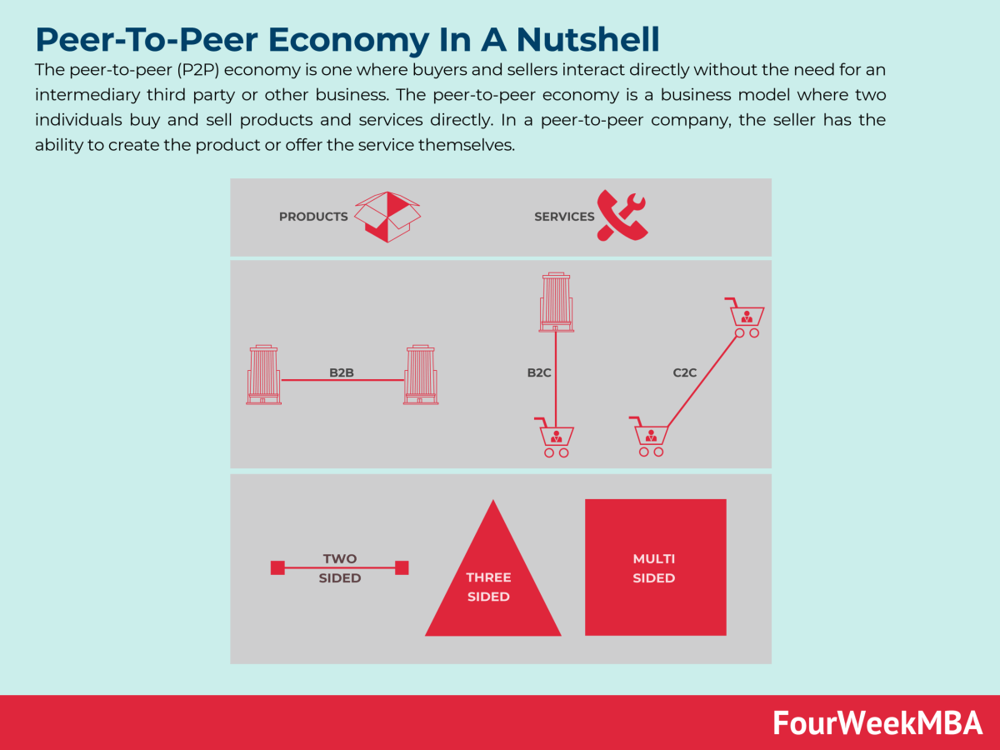

## Table of Contents

## What is the peer-to-peer economy?

The peer-to-peer economy is a way for people to share goods and services directly with each other, often using the internet. Instead of buying things from big companies, people can rent or borrow items from their neighbors or others in their community. This can include things like cars, tools, or even a spare room in someone's house. Websites and apps help connect people who have something to offer with those who need it.

This type of economy can save people money and help the environment by reducing waste. For example, if someone only needs a drill for one project, they can borrow it from someone nearby instead of buying a new one. It also helps build stronger communities because people get to know their neighbors better. However, there are challenges, like making sure transactions are safe and fair for everyone involved.

## How does the peer-to-peer economy differ from traditional economic models?

The peer-to-peer economy is different from traditional economic models because it focuses on people sharing things directly with each other, instead of buying from big companies. In traditional models, you usually go to a store or a business to get what you need. But in the peer-to-peer economy, you might use a website or an app to find someone nearby who has what you need and is willing to share it with you. This can be anything from a car to a spare room in someone's house.

Another big difference is that the peer-to-peer economy can be more about building community and helping the environment. When people share things, it can save money and reduce waste because fewer new things need to be made. In traditional models, the focus is often more on making profits for businesses. While the peer-to-peer economy can also make money for people, it's often more about helping each other out and using resources more efficiently.

## What are some examples of peer-to-peer platforms?

Some examples of peer-to-peer platforms are Airbnb and Uber. Airbnb lets people rent out their homes or spare rooms to others who need a place to stay. This way, travelers can find unique places to stay, and homeowners can make some extra money. Uber, on the other hand, connects people who need a ride with drivers who use their own cars. This makes it easier for people to get around without owning a car, and drivers can earn money in their free time.

Another example is TaskRabbit, which helps people find others to do small jobs or tasks. If you need help assembling furniture or running errands, you can find someone nearby who is willing to do it for a fee. Turo is another platform where people can rent out their cars to others who need a vehicle for a short time. These platforms show how the peer-to-peer economy can help people share resources and services directly with each other, making life easier and more connected.

## How does capitalism function in the context of the peer-to-peer economy?

Capitalism still plays a big role in the peer-to-peer economy. In capitalism, people own things and can make money by selling or renting them to others. In the peer-to-peer economy, people use websites and apps to share their things with others and make money. For example, someone can rent out their car on Turo or their home on Airbnb. This way, they are acting like small business owners, making money from what they own. The peer-to-peer economy fits into capitalism because it lets people use their own stuff to make money, just like in traditional businesses.

However, the peer-to-peer economy can also challenge some parts of capitalism. In traditional capitalism, big companies often control the market and make most of the profits. But in the peer-to-peer economy, regular people can make money too, without needing a big company to help. This can make things more fair and help more people earn a living. Still, the platforms that connect people, like Airbnb and Uber, are often big companies themselves and they take a cut of the money made. So, while the peer-to-peer economy can change how capitalism works, it still has some of the same problems, like big companies making a lot of the money.

## What are the benefits of the peer-to-peer economy for consumers?

The peer-to-peer economy offers many benefits for consumers. One big benefit is that it can save people money. Instead of buying something new, like a tool or a car, people can rent or borrow it from someone nearby. This means they don't have to spend a lot of money on things they might only use once or twice. For example, if you need a drill for a weekend project, you can borrow one from a neighbor instead of buying a new one.

Another benefit is that the peer-to-peer economy can help the environment. When people share things, fewer new things need to be made, which means less waste and pollution. It also helps build stronger communities because people get to know their neighbors better when they share things. For instance, renting a room from someone on Airbnb can lead to new friendships and a better understanding of different cultures. Overall, the peer-to-peer economy makes life easier and more connected for consumers.

## What challenges do businesses face in a peer-to-peer economy?

Businesses in a peer-to-peer economy face several challenges. One big challenge is competition. In a peer-to-peer economy, regular people can offer goods and services directly to others, which means businesses have to compete with these individuals. For example, a hotel might lose customers to someone renting out their home on Airbnb. This can make it harder for businesses to make money and stay successful.

Another challenge is trust and safety. When people share things directly with each other, it can be hard to make sure everything is safe and fair. Businesses need to find ways to make sure their customers feel safe using their platform. This might mean checking the people who use their service or making sure transactions are secure. If they don't do this well, people might not want to use their service, which can hurt their business.

Lastly, businesses in the peer-to-peer economy also have to deal with regulations. Governments might have rules about how these platforms can work, like making sure people pay taxes or follow safety rules. Businesses need to follow these rules, which can be complicated and expensive. If they don't, they could get in trouble with the law, which can be bad for their business.

## How does the peer-to-peer economy impact traditional industries?

The peer-to-peer economy can change how traditional industries work. For example, companies that rent cars might have fewer customers because people can now rent cars from other people on platforms like Turo. Hotels can also lose business to people renting out their homes on Airbnb. This means traditional businesses have to find new ways to keep their customers happy and stay competitive. They might need to offer better services or lower prices to keep up with the changes.

Another way the peer-to-peer economy impacts traditional industries is by making them rethink how they do business. For example, taxi companies have had to change how they work because of Uber. Some have started their own apps to make it easier for people to get rides. This shows that traditional businesses need to be ready to change and adapt to new ways of doing things. If they don't, they might lose customers and have a hard time staying in business.

## What role does technology play in facilitating the peer-to-peer economy?

Technology is very important for the peer-to-peer economy. It helps people connect with each other easily. Websites and apps like Airbnb and Uber let people share things like homes and rides. Without technology, it would be hard for people to find each other and make these deals. Technology makes it simple to see what people have to offer and to make payments safely.

Technology also helps keep the peer-to-peer economy running smoothly. It can check if people are trustworthy and make sure everyone follows the rules. For example, apps can show reviews from other users, so you know if someone is good to deal with. Technology also helps with things like making sure people pay the right taxes and follow safety rules. This makes the peer-to-peer economy safer and more reliable for everyone.

## How do regulations affect the growth and operation of peer-to-peer platforms?

Regulations can help the peer-to-peer economy grow by making it safe and fair for everyone. When governments set rules, it can make people feel more comfortable using these platforms. For example, rules might make sure that people pay taxes or follow safety guidelines. This can help platforms like Airbnb and Uber build trust with users. If people know that the government is watching and making sure things are done right, they are more likely to use these services.

However, regulations can also make it harder for peer-to-peer platforms to grow. Sometimes, the rules can be strict and hard to follow. This can make it expensive and complicated for these platforms to operate. For example, if a city has tight rules on short-term rentals, it might be hard for Airbnb hosts to rent out their homes. This can slow down the growth of the platform and make it harder for people to make money. So, while regulations are important for safety and fairness, they can also be a challenge for the peer-to-peer economy.

## What are the economic theories that support or critique the peer-to-peer economy within capitalism?

Economic theories that support the peer-to-peer economy within capitalism often focus on the idea of efficiency and resource allocation. These theories argue that the peer-to-peer economy allows for better use of resources because it lets people share things they already own instead of buying new ones. This can lead to less waste and more savings for consumers. For example, sharing economy platforms like Airbnb and Uber can be seen as a way to make markets more efficient by connecting people who have something to offer with those who need it. This aligns with capitalist principles of free markets and individual entrepreneurship, where people can make money by using their own assets.

On the other hand, some economic theories critique the peer-to-peer economy for creating new forms of inequality and instability. Critics argue that while these platforms can help some people make money, they often benefit the companies that run them more than the individuals using them. For instance, Airbnb and Uber take a cut of every transaction, which can lead to a lot of money going to these big companies instead of the people doing the work. Additionally, the gig economy, which is a big part of the peer-to-peer economy, can lead to unstable jobs without benefits, which can be hard for workers. These critiques suggest that while the peer-to-peer economy fits into capitalism, it can also worsen some of its problems.

## How does the peer-to-peer economy influence income inequality and wealth distribution?

The peer-to-peer economy can affect income inequality and wealth distribution in different ways. On one hand, it can help some people make extra money. For example, someone who rents out a room on Airbnb or drives for Uber can earn more money than they would with just one job. This can help people who need extra income to pay their bills or save for the future. In this way, the peer-to-peer economy can give more people a chance to earn money and improve their lives.

On the other hand, the peer-to-peer economy can also make income inequality worse. The big companies that run these platforms, like Airbnb and Uber, often make a lot of money from the fees they charge. This means that while some people are making a little extra money, a lot of the money is going to these big companies. Also, the jobs in the peer-to-peer economy can be unstable and don't always come with benefits like health insurance. This can make it hard for people to rely on these jobs for a steady income, which can increase inequality. So, while the peer-to-peer economy can help some people, it can also make the gap between rich and poor bigger.

## What future trends can we expect in the evolution of the peer-to-peer economy and its relationship with capitalism?

In the future, the peer-to-peer economy is likely to keep growing and changing. More people might start using these platforms to share things like cars, homes, and even skills. Technology will play a big role in making these platforms easier to use and more secure. We might see new apps and websites that help people share even more things, like tools or clothes. This could make life easier for people and help the environment by reducing waste. As the peer-to-peer economy grows, it will keep working within capitalism, letting people make money by sharing what they own.

However, the relationship between the peer-to-peer economy and capitalism might also face challenges. Big companies that run these platforms could become even more powerful, taking a bigger cut of the money people make. This might make income inequality worse, as more money goes to these companies instead of the people doing the work. Governments might also set new rules to make sure these platforms are fair and safe for everyone. These rules could help or hurt the growth of the peer-to-peer economy, depending on how they are made. Overall, the future of the peer-to-peer economy will depend on how it balances helping people make money with keeping things fair and sustainable.

## References & Further Reading

[1]: Yermack, D. (2017). "Corporate governance and blockchains." Review of Finance, 21(1), 7-31.

[2]: Biais, B., Foucault, T., & Moinas, S. (2015). "Equilibrium Fast Trading." Journal of Financial Economics, 116(2), 292-313.

[3]: Botsman, R., & Rogers, R. (2010). ["What's Mine Is Yours: The Rise of Collaborative Consumption."](https://www.amazon.com/Whats-Mine-Yours-Collaborative-Consumption/dp/0061963542) Harper Business.

[4]: Frankel, J. A. (2011). "A lesson from the South for fiscal policy in the US and other advanced countries." Comparative Economic Studies, 53(3), 407-430.

[5]: López de Prado, M. (2018). ["Advances in Financial Machine Learning."](https://www.amazon.com/Advances-Financial-Machine-Learning-Marcos/dp/1119482089) Wiley. 

[6]: Boesler, M. (2012). "[One of the Biggest Factors That Caused The Flash Crash Is Creeping Back into the Market](https://en.wikipedia.org/wiki/2010_Flash_Crash)," Business Insider. 

[7]: Gomber, P., Arndt, B., Lutat, M., & Uhle, T. (2011). "High-Frequency Trading." SSRN. 

[8]: Ormerod, P. (2005). ["Why Most Things Fail: Evolution, Extinction and Economics."](https://en.wikipedia.org/wiki/Why_most_things_fail) John Wiley & Sons.