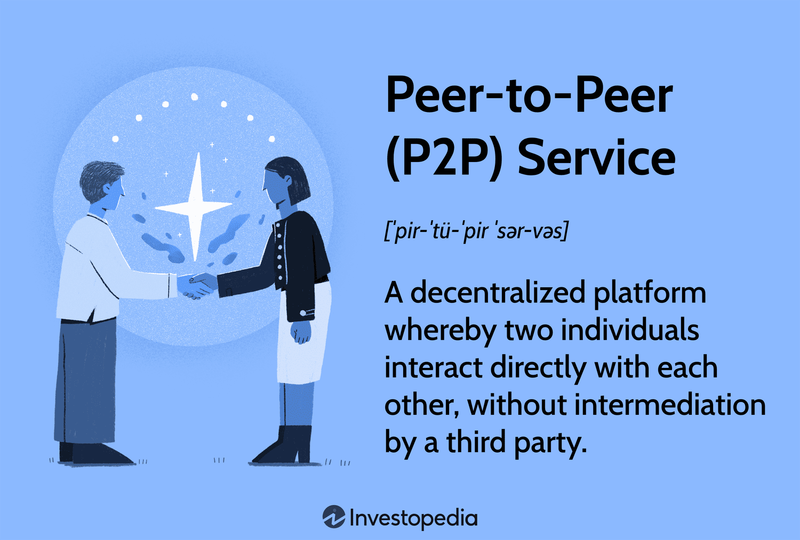

## Table of Contents

## What is a peer-to-peer (P2P) network?

A peer-to-peer (P2P) network is a type of computer network where each computer, or "peer," can share files directly with other peers without needing a central server. This means that each computer in the network acts both as a client and a server. For example, when you download a file from another user on a P2P network, you are also able to share your own files with others at the same time.

P2P networks are popular for sharing large files like movies, music, and software because they can handle a lot of data and traffic. They are often used for file-sharing programs like BitTorrent. One advantage of P2P networks is that they can be more resilient because there is no single point of failure like a central server. However, they can also be more difficult to control and monitor, which can lead to issues with illegal file sharing and security risks.

## How does a P2P network differ from a client-server network?

In a P2P network, all the computers are equal and can share files directly with each other. There is no central server controlling everything. This means that if you want to download a file, you can get it straight from another user's computer. It's like everyone is both giving and taking at the same time. P2P networks are good for sharing big files because many people can help share the load.

On the other hand, a client-server network has a central server that manages everything. The server stores all the files and the clients, which are the users' computers, ask the server for files. The server decides who gets what and when. This setup is easier to control and keep safe, but if the server goes down, nobody can get any files until it's fixed. It's like having one main library where everyone goes to borrow [books](/wiki/algo-trading-books), instead of everyone sharing books with each other directly.

## What are some common uses of P2P network services?

P2P networks are often used for sharing big files like movies, music, and software. People use programs like BitTorrent to download these files from other users. It's like borrowing a book from a friend instead of going to a library. This way, many people can help share the files, making it faster and easier to get what you need.

Another common use of P2P networks is for online gaming. Some games let players connect directly to each other's computers to play together. This can make the game run smoother because there's no middleman slowing things down. It's like playing a game at a friend's house instead of over the internet through a game server.

P2P networks are also used for things like [cryptocurrency](/wiki/cryptocurrency). Bitcoin, for example, uses a P2P network to let people send and receive money without a bank in the middle. It's like passing money directly to someone instead of using a bank to transfer it. This can make transactions faster and cheaper.

## What are the advantages of using P2P networks?

One big advantage of P2P networks is that they can handle a lot of data and traffic. When you're sharing big files like movies or music, many people can help share the load. This means you can download files faster because you're getting pieces from different people at the same time. It's like having lots of friends help you move a heavy couch instead of doing it alone. Also, P2P networks can keep working even if some computers stop working. There's no single point that can break everything, so the network is more reliable.

Another advantage is that P2P networks can be cheaper and easier to set up. You don't need to pay for a big server to store all the files. Everyone just shares what they have directly with others. This makes it good for things like online games or sharing cryptocurrencies like Bitcoin. You can send and receive money without a bank in the middle, which can save you money and make transactions faster. It's like passing money directly to a friend instead of going through a bank.

## What are the potential security risks associated with P2P networks?

One big security risk with P2P networks is that they can be used to spread harmful software like viruses or malware. When you download files from other people's computers, you might accidentally get something bad along with the file you wanted. It's like [picking](/wiki/asset-class-picking) up a hitchhiker who turns out to be a thief. Also, because P2P networks don't have a central server watching over everything, it's harder to stop bad people from sharing illegal or harmful stuff.

Another risk is that your personal information might not be safe. When you share files on a P2P network, other people can sometimes see what's on your computer. This means someone could find out private things about you or even steal your identity. It's like leaving your diary open where anyone can read it. Because of these risks, it's important to be careful and use good security software when using P2P networks.

## How does file sharing work in a P2P network?

In a P2P network, file sharing happens directly between users' computers. When you want to download a file, like a movie or a song, your computer connects to other computers on the network that have that file. Instead of getting the whole file from one place, your computer gets small pieces of the file from different computers at the same time. This makes the download faster because many people are helping out. Once your computer has all the pieces, it puts them together to make the complete file.

After you've downloaded the file, your computer starts sharing it with others on the network. This means that other people can get pieces of the file from your computer when they want to download it. By sharing the file, you're helping to keep the network running smoothly. It's like everyone is both borrowing and lending at the same time, which makes the whole system work better for everyone.

## What is the role of nodes in a P2P network?

In a P2P network, every computer is called a node. Each node can share files directly with other nodes without needing a central server. This means that when you want to download a file, your computer, which is a node, connects to other nodes that have the file you want. Your node gets small pieces of the file from different nodes at the same time, making the download faster. Once your node has all the pieces, it puts them together to make the complete file.

After downloading the file, your node starts sharing it with other nodes on the network. This helps keep the network running smoothly because more nodes are sharing the file. It's like everyone is both borrowing and lending at the same time. If one node goes offline, the network can still work because other nodes can share the file. This makes P2P networks more reliable and able to handle a lot of data and traffic.

## How can one set up a basic P2P network?

To set up a basic P2P network, you'll need at least two computers that are connected to the same network. Start by installing a P2P software program on each computer. Programs like BitTorrent or Shareaza are popular choices. Once the software is installed, you can set up a shared folder on each computer where you want to store the files you plan to share. Make sure the shared folder is accessible to the P2P software so that other computers on the network can see and download the files from it.

After setting up the shared folders, you can start sharing files. Open the P2P software on each computer and add the files you want to share to the shared folder. Other computers on the network can then search for and download these files directly from your computer. Remember to keep your computer's firewall and antivirus software updated to protect against security risks. With these steps, you'll have a basic P2P network up and running, allowing you to share files directly with other computers on the network.

## What are some popular P2P network protocols?

One popular P2P network protocol is BitTorrent. It's used a lot for sharing big files like movies and games. When you use BitTorrent, your computer gets small pieces of a file from different computers at the same time. This makes downloading faster because many people are helping out. After you download the file, your computer starts sharing it with others, which helps keep the network running smoothly.

Another common protocol is Gnutella. It's used in programs like LimeWire and Shareaza. Gnutella lets computers find and share files directly with each other without a central server. This makes the network more reliable because it can keep working even if some computers go offline. People use Gnutella to share all kinds of files, from music to software.

A third protocol to mention is eDonkey, which is used in programs like eMule. eDonkey is good for sharing large files and can handle a lot of traffic. Like the others, it lets users download files from multiple sources at once, making the process quicker. It's also known for its ability to resume downloads if they get interrupted, which is handy for big files that take a long time to download.

## How do P2P networks handle scalability and performance?

P2P networks handle scalability well because they don't rely on a single server. Instead, every computer in the network helps share files. This means that as more people join the network, more computers are available to share files, making the network bigger and stronger. If one computer goes offline, the network can still work because other computers can share the files. This makes P2P networks good at handling a lot of users and a lot of data without slowing down.

Performance in P2P networks can be really good because files are downloaded from many computers at the same time. When you want to download a file, your computer gets small pieces of it from different computers. This makes the download faster because many people are helping out. But, if too many people are trying to download the same file at the same time, it can slow down. Also, the speed can depend on how fast each computer's internet connection is. Overall, P2P networks can handle a lot of traffic and keep things moving quickly if set up right.

## What are some advanced P2P network architectures?

One advanced P2P network architecture is called Distributed Hash Tables (DHTs). DHTs help make P2P networks more organized and efficient. They work by spreading out the information about where files are stored across all the computers in the network. This way, when you want to find a file, you don't have to search every computer one by one. Instead, you can quickly find out which computer has the file you need. DHTs make P2P networks faster and more reliable because they help manage the network better, even when it gets really big.

Another advanced architecture is called Structured P2P networks. These networks use a specific way to organize the computers, often in a ring or a tree shape. This structure helps make searching for files quicker and more efficient. In a structured P2P network, each computer knows exactly where to look for a file based on the network's design. This can make the network perform better, especially when there are a lot of users and files. Structured P2P networks are good for applications that need fast and reliable file sharing, like some online games or big data sharing platforms.

## How can blockchain technology enhance P2P network services?

Blockchain technology can make P2P networks even better by adding a layer of security and trust. In a regular P2P network, you might not know if the files you're getting are safe or if they're really from the person they say they're from. But with blockchain, every file or piece of data is recorded on a public ledger that everyone can see. This makes it harder for someone to share bad files or pretend to be someone else. It's like having a big, open book where everyone can check what's being shared, making the network safer and more trustworthy.

Another way blockchain helps P2P networks is by making them more reliable and efficient. In a P2P network, if one computer goes offline, the network can still work because other computers can share the files. Blockchain takes this a step further by making sure that once a file is shared, it's recorded in a way that can't be changed. This means that even if some computers go offline, the information about the files stays the same. Plus, blockchain can help speed up the process of finding and sharing files because it uses smart ways to organize and track data. This makes P2P networks not just safer, but also faster and more dependable.

## References & Further Reading

[1]: Oram, A. (Ed.). (2001). ["Peer-to-Peer: Harnessing the Power of Disruptive Technologies."](https://dl.acm.org/doi/10.5555/558412) O'Reilly Media.

[2]: Nakamoto, S. (2008). ["Bitcoin: A Peer-to-Peer Electronic Cash System."](https://nakamotoinstitute.org/library/bitcoin/)

[3]: Botsman, R., & Rogers, R. (2010). ["What's Mine Is Yours: The Rise of Collaborative Consumption."](https://books.google.com/books/about/What_s_Mine_Is_Yours.html?id=LiC2foFeXQYC)

[4]: Tapscott, D., & Tapscott, A. (2016). ["Blockchain Revolution: How the Technology Behind Bitcoin is Changing Money, Business, and the World."](https://archive.org/details/blockchainrevolu0000taps)

[5]: Rysman, M. (2009). ["The Economics of Two-Sided Markets."](https://www.aeaweb.org/articles?id=10.1257/jep.23.3.125) The Journal of Economic Perspectives, 23(3), 125–143.