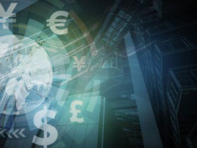

The world of digital finance continues to transform rapidly, marked by the increasing prevalence of concepts like virtual currency, cryptocurrency, and algorithmic trading. As these terms become more mainstream, their intertwined roles in reshaping financial landscapes are becoming more pronounced. Virtual currencies, representing value in a digital form, serve as media of exchange, while cryptocurrencies—distinguished by their operation on blockchain technology—are known for decentralization and security. By eliminating the need for intermediaries, peer-to-peer (P2P) cryptocurrency transactions add a layer of privacy and autonomy, aligning with the original vision for digital currencies. Algorithmic trading, on the other hand, employs automated programs to execute trades at speeds and efficiencies beyond human capability.

Together, P2P transactions and algo trading are not merely components of the digital finance ecosystem; they are its pivotal forces. Their ability to provide anonymity, combined with swift execution and continuous market engagement, positions them as powerful tools in the modern trader's arsenal. However, this evolution comes with its own challenges, such as security concerns and market volatility, which require careful navigation.



This article aims to clarify these transformative elements, examining how their coexistence is not only changing the way trading is conducted but also how financial markets operate at a broader level. By understanding their definitions, benefits, and challenges, we can grasp the full potential and implications of these advancements in digital trading.

## Table of Contents

## Understanding Virtual Currency and Cryptocurrency

Virtual currency refers to the digital manifestation of value, which can be utilized as a medium of exchange, a unit of account, or a store of value. These digital assets provide a modern alternative to physical currencies, with their functionality primarily rooted in electronic transactions. Virtual currencies encompass a wide range of digital assets, including credit card points, online game tokens, and digital currencies specifically designed for transactional purposes.

Cryptocurrency, a prominent subset of virtual currencies, relies predominantly on blockchain technology. Blockchain serves as a decentralized ledger, ensuring secure and transparent peer-to-peer transactions. Each block within a blockchain contains a cryptographic hash of the previous block, a timestamp, and transaction data, ensuring the immutability and chronological recording of every transaction. The decentralized nature of cryptocurrencies means they operate independently of any central authority, enhancing their appeal for global and digital transactions.

For instance, Bitcoin, one of the first and most well-known cryptocurrencies, employs blockchain technology to facilitate direct transactions without a centralized control mechanism. This decentralization provides significant advantages, such as reduced transaction fees and increased privacy, yet also poses challenges, such as volatility and the potential for use in illicit activities.

A fundamental difference between virtual currencies, such as cryptocurrencies, and traditional fiat currencies lies in their regulatory frameworks. Traditional currencies are issued and regulated by central banks or governmental authorities, providing a structured and controlled fiscal environment. In contrast, virtual currencies are typically unregulated, lacking centralized authority oversight, which contributes to their global acceptance and flexibility but also introduces risks related to security and valuation fluctuations.

In conclusion, the distinction between virtual currencies and traditional fiat currencies highlights the transformation that digital assets bring to financial systems worldwide. Their decentralized nature empowers users, but simultaneously necessitates careful consideration of associated risks.

## The Concept of Peer-to-Peer (P2P) Transactions in Cryptocurrency

Peer-to-peer (P2P) transactions in [cryptocurrency](/wiki/cryptocurrency) enable users to transfer digital assets directly to one another without the involvement of intermediaries such as banks or financial institutions. This decentralized nature is a foundational element of cryptocurrencies, encapsulating the core ethos of increased privacy and control over financial exchanges. Unlike traditional financial systems, where transactions require validation and facilitation by centralized entities, P2P transactions allow individuals to interact directly, thereby minimizing reliance on third parties.

Cryptocurrencies were conceived with P2P transactions in mind. Bitcoin, the first cryptocurrency, was introduced by Satoshi Nakamoto in 2008 as a decentralized digital currency intended to facilitate P2P transactions over the internet without the oversight or involvement of a central authority. This architecture provides significant privacy benefits, as the transactions on a blockchain can occur pseudonymously, with addresses serving as identifiers rather than personal data. Such a design reduces the potential exposure of sensitive financial information to external entities, aligning with the growing demand for privacy in digital exchanges.

However, the decentralized nature of P2P transactions also introduces a unique set of challenges. Centralized exchanges often offer a measure of security and ease-of-use by acting as an intermediary, providing a familiar interface and custodial services which help protect users against certain risks. These exchanges typically offer customer support, regulatory compliance, and security measures like insurance against hacks. Conversely, true P2P transactions, while offering heightened privacy, can expose users to risks such as fraud or security breaches, as they are responsible for safeguarding their funds without institutional recourse.

Moreover, P2P exchanges may lack the [liquidity](/wiki/liquidity-risk-premium) provided by centralized platforms, potentially leading to slower transaction execution or unfavorable exchange rates. Additionally, the onus of due diligence falls on users to verify the trustworthiness of their transaction counterparties, which can be daunting for inexperienced participants in the cryptocurrency market.

In conclusion, while P2P transactions in cryptocurrency allow for greater privacy and personal control over financial exchanges, users must navigate risks associated with the absence of intermediaries. Balancing privacy with security remains a critical consideration for individuals engaging in decentralized financial transactions.

## What is Algo Trading?

Algorithmic trading, commonly referred to as algo trading, involves the use of automated computer programs to execute financial trades based on a set of predetermined rules and criteria. These algorithms can scan various markets and execute orders at speeds and frequencies impossible for a human trader, leveraging mathematical models and statistical analyses to determine the most favorable times to make transactions.

The foundation of [algorithmic trading](/wiki/algorithmic-trading) is built on the capability to identify patterns or trends in historical and real-time market data. By doing so, it allows traders to capitalize on market inefficiencies. For instance, a simple moving average algorithm might buy a stock when the short-term average crosses above the long-term average, suggesting an upward trend, and sell when the reverse occurs.

Algo trading's utility is particularly evident in high-frequency trading ([HFT](/wiki/high-frequency-trading-strategies)), where millions of orders are executed in fractions of a second. This rapid execution reduces transaction costs and slippage, thus potentially maximizing profits.

Cryptocurrencies, characteristically volatile and operating 24/7, are particularly well-suited to algo trading. Unlike traditional markets, cryptocurrency exchanges do not close, providing continuous opportunity for algorithms to operate. For example, an algorithm might employ an [arbitrage](/wiki/arbitrage) strategy, simultaneously buying and selling an asset in different markets to exploit price differentials.

A simple Python example to demonstrate a basis of algo trading can be implemented using a moving average crossover strategy:

```python
import numpy as np
import pandas as pd

# Example data: this would normally be your real-time or historical market data
prices = pd.Series([10, 11, 11.5, 12, 12.5, 13, 14, 14.5, 15, 14.5])

# Calculate short and long-term moving averages
short_window = 3
long_window = 5

signals = pd.DataFrame(index=prices.index)
signals['price'] = prices
signals['short_mavg'] = prices.rolling(window=short_window, min_periods=1).mean()
signals['long_mavg'] = prices.rolling(window=long_window, min_periods=1).mean()

# Create signals
signals['signal'] = 0.0
signals['signal'][short_window:] = np.where(signals['short_mavg'][short_window:] 
                                         > signals['long_mavg'][short_window:], 1.0, 0.0)

signals['positions'] = signals['signal'].diff()

print(signals)
```

This simple example provides a basis for how an algorithm might generate buy and sell signals based on moving averages. In practice, the algorithms used in algo trading are much more sophisticated, often employing [machine learning](/wiki/machine-learning) models to predict complex patterns and trends.

As the cryptocurrency markets are relatively new and less regulated, they offer plentiful opportunities for algo trading, but they also come with heightened risk and potential for market manipulation. It is therefore essential for traders to continuously refine their algorithms and risk management strategies to navigate this unpredictable landscape effectively.

## Benefits and Risks of Combining P2P Cryptocurrency and Algo Trading

Combining peer-to-peer (P2P) cryptocurrency transactions with algorithmic trading offers a potent synergy that can enhance trading practices in the digital finance landscape. This blend promises several benefits, chief among them being reduced transaction costs, immediate trade execution, and the capability for incessant trading, operating beyond the limitations of human availability.

### Efficiency and Anonymity

By facilitating direct trades between individuals without intermediaries, P2P transactions inherently lower transaction costs associated with traditional financial systems. Algorithmic trading amplifies this efficiency by deploying automated scripts to recognize trading opportunities and execute trades at a speed that surpasses human traders. This accelerated execution is particularly advantageous in volatile cryptocurrency markets, where price movements occur rapidly.

The combination also boosts anonymity. Cryptocurrencies, by design, offer a degree of privacy. P2P transactions enhance this aspect by reducing reliance on centralized platforms that may require extensive personal information for account creation and trading. Algorithms can further obfuscate trading patterns by distributing trades across multiple networks and platforms, maintaining a higher degree of privacy for the trader.

### Operational Benefits

Algorithmic trading does not necessitate active human intervention, enabling trading operations to continue seamlessly around the clock. This 24/7 capability ensures that trading strategies can exploit global market dynamics without interruption, capturing opportunities as they emerge across different time zones.

Python code to automate such trading could look like this:

```python
import ccxt  # cryptocurrency trading library

def execute_trade(exchange_id, symbol, amount, order_type='market'):
    exchange = getattr(ccxt, exchange_id)()
    market_price = exchange.fetch_ticker(symbol)['last']
    order = exchange.create_order(symbol, order_type, 'buy', amount, market_price)
    return order

# Example usage: execute a market order on Binance
trade = execute_trade('binance', 'BTC/USDT', 0.01)
print(trade)
```

### Risks Involved

Despite the compelling advantages, this combination is not devoid of risks. Security vulnerabilities stand out, as P2P networks and the automated nature of algorithmic trading can be susceptible to hacking and unauthorized access. Ensuring robust security protocols and constant monitoring is essential to mitigate these risks.

Market manipulation and arbitrage are concerns, particularly in less liquid cryptocurrency markets. The ability of sophisticated algorithms to react to market signals can lead to unintended consequences, such as flash crashes or inflated trading volumes, potentially impacting a trader's portfolio adversely.

The inherent [volatility](/wiki/volatility-trading-strategies) of cryptocurrencies remains a significant challenge. While algorithms can swiftly adjust to price changes, the unpredictable nature of these markets means significant swings can result in substantial financial loss, especially if trading parameters are not meticulously set or if there is a lack of adequate stop-loss mechanisms.

In conclusion, the convergence of P2P cryptocurrency transactions and algorithmic trading presents a frontier of opportunity and threat. Leveraging this synergy requires not only technical proficiency but also a nuanced understanding of market dynamics and risk management strategies to fully harness its potential.

## Choosing the Right Platform for P2P Crypto and Algo Trading

Selecting the appropriate platform for peer-to-peer (P2P) cryptocurrency and algorithmic (algo) trading is a critical decision that influences the success and safety of your digital trading activities. A platform that provides robust security measures is fundamental to protect transactions and maintain anonymity for traders. These security protocols often include two-[factor](/wiki/factor-investing) authentication (2FA), end-to-end encryption, and cold storage of user funds, thereby minimizing the risk of hacking and unauthorized access.

Platforms such as KuCoin and Binance stand out due to their decentralized environments augmented with escrow services, a critical feature that instills trust and mitigates counterparty risk in P2P transactions. These platforms also facilitate algo trading by offering Application Programming Interfaces (APIs) that allow traders to implement automated trading strategies efficiently.

**Security Measures**: The choice of a trading platform should be guided by the security mechanisms it deploys. This includes examining the platform’s history concerning security breaches and its response to such incidents. Platforms that regularly conduct security audits and have a transparent incident response plan are preferable. 

**Cryptocurrency Support**: The platform should offer a wide range of cryptocurrencies to allow diversification of trading strategies. More currency options enable traders to explore different markets and capitalize on various opportunities.

**Transparent Fees**: Traders must understand the fee structure of their chosen platform, which often includes trading fees, withdrawal fees, and sometimes deposit fees. Transparent fee schedules without hidden charges are vital for accurate cost assessment. Platforms typically present their fee structures clearly on their websites, making it easier for users to compare and make informed decisions.

**User Interface and Experience**: A user-friendly interface simplifies the trading process, enabling quick execution of strategies and reducing errors. Platforms that offer customizable interfaces and tools such as chart analysis, market trend indicators, and real-time alerts are highly beneficial. 

**Customer Support**: The availability of responsive and effective customer support is essential, especially when addressing issues that might arise during trading. Platforms that offer round-the-clock support through multiple channels, such as live chat, email, and phone, enhance user trust and satisfaction.

In conclusion, the right platform combines strong security, a wide choice of cryptocurrencies, clear fee structures, efficient APIs for algorithmic trading, and reliable customer support. These factors collectively enhance the trader's ability to execute strategies successfully while managing risks effectively.

## Future Prospects of P2P Crypto Trades and Algo Trading

As the cryptocurrency ecosystem continues to evolve, the integration of [artificial intelligence](/wiki/ai-artificial-intelligence) (AI) and machine learning (ML) in refining algorithmic trading demonstrates significant potential. AI and ML algorithms can analyze vast datasets and identify complex patterns, making them invaluable in the fast-paced cryptocurrency markets. These technologies enable algorithms to self-optimize and adapt to changing market conditions, improving trade execution and predicting market movements with increased accuracy. The continuous learning capability of AI-driven systems is set to reduce human error and enhance decision-making processes in algorithmic trading.

Regulatory developments are poised to shape the future of peer-to-peer (P2P) cryptocurrency trades significantly. As governments and institutions worldwide study digital currencies more closely, regulations are expected to emerge that promote transparency and protect users while fostering innovation. These regulations will likely address issues such as anti-money laundering (AML) compliance, know your customer (KYC) requirements, and the establishment of legal frameworks for digital contracts. The intent is to integrate P2P trades more effectively into existing financial systems, which could enhance mainstream adoption by ensuring a secure and reliable trading environment.

Innovation in blockchain technology is another crucial factor that could further augment the security and efficiency of P2P cryptocurrency trades and algo trading. Developments such as layer 2 scaling solutions, sharding, and advanced consensus mechanisms aim to increase transaction speed and throughput while reducing costs. Enhanced smart contract capabilities could offer automated and trustless execution of trades, minimizing the need for intermediaries and reducing the risk of fraud. Moreover, interoperability protocols may allow different blockchain networks to communicate seamlessly, broadening the trading opportunities and liquidity accessible to users.

Collectively, these advancements could create a more robust, efficient, and secure infrastructure for P2P cryptocurrency and algorithmic trading, making these practices more appealing to a broader array of users. As technology and regulatory landscapes evolve, stakeholders in the crypto ecosystem must remain adaptive and innovative to leverage these opportunities effectively.

## Conclusion

P2P cryptocurrency trading and algorithmic trading together offer a unique blend of privacy, speed, and potential for profit. These methods provide traders with the ability to execute transactions without intermediaries, enhancing financial autonomy and control. Algorithmic strategies can rapidly identify and capitalize on market trends, offering an advantage over manual trading by executing trades swiftly and accurately. The integration of these approaches can optimize transaction costs, enabling 24/7 trading with reduced human intervention.

However, with these opportunities come inherent risks. The volatile nature of cryptocurrencies can lead to significant financial fluctuations, and the integration of algorithmic trading increases the complexity of managing potential security vulnerabilities and market manipulation. Fortunately, advancements in technology and evolving regulatory frameworks are available to mitigate these challenges. Innovations in blockchain technology continue to enhance security protocols, while regulatory efforts aim to create a safer trading environment by implementing measures that protect traders' interests without stifling market growth.

To effectively leverage these trading solutions, staying informed becomes imperative. Traders must continuously update their knowledge on technological advancements and regulatory changes while choosing trading platforms that align with their strategic goals and offer robust security features. Platforms that combine P2P capabilities with algo trading support, such as those offering transparent fee structures and comprehensive customer support, can greatly enhance the trading experience. By prioritizing informed decision-making and selecting the right tools, traders can navigate the evolving landscape of digital finance with confidence.

## References & Further Reading

[1]: Nakamoto, S. (2008). ["Bitcoin: A Peer-to-Peer Electronic Cash System."](https://nakamotoinstitute.org/library/bitcoin/)

[2]: Tsai, C. F., & Chen, M. Y. (2010). ["Credit scoring model based on neural networks with artificial variables."](https://agupubs.onlinelibrary.wiley.com/doi/epdf/10.1029/2009JA014943) Applied Soft Computing, 10(2), 374-380.

[3]: Narang, R. (2013). ["Inside the Black Box: A Simple Guide to Quantitative and High Frequency Trading."](https://onlinelibrary.wiley.com/doi/book/10.1002/9781118662717) Wiley.

[4]: De Filippi, P., & Wright, A. (2018). ["Blockchain and the Law: The Rule of Code."](https://www.jstor.org/stable/j.ctv2867sp) Harvard University Press.

[5]: Dwyer, G. P. (2015). ["The economics of Bitcoin and similar private digital currencies."](https://www.sciencedirect.com/science/article/pii/S1572308914001259) Journal of Financial Stability, 17, 81-91.