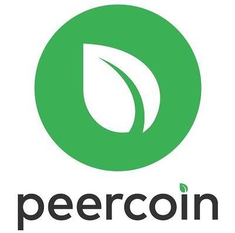

## Table of Contents

## What is Peercoin and when was it created?

Peercoin is a type of digital money, also called cryptocurrency, that you can use to buy things online. It was created to be a safer and more energy-efficient option compared to other cryptocurrencies like Bitcoin. Peercoin uses a special way to keep the money safe and to make new coins, which is called "proof of stake." This method uses less electricity than the method used by Bitcoin, which is called "proof of work."

Peercoin was created in 2012 by a person named Sunny King, along with another person named Scott Nadal. They wanted to make a cryptocurrency that would last a long time and be good for the environment. Since it started, Peercoin has been used by people all over the world who want to try out this new kind of money.

## How does Peercoin differ from Bitcoin in terms of its creation and purpose?

Peercoin and Bitcoin are both types of digital money, but they are made and used in different ways. Bitcoin uses a system called "proof of work" to create new coins and keep the network safe. This means that people use powerful computers to solve hard math problems, and when they solve them, they get new bitcoins. This process uses a lot of electricity, which can be bad for the environment. On the other hand, Peercoin uses a system called "proof of stake." With this system, people can create new coins and help keep the network safe just by holding onto their Peercoins. This way of making new coins uses much less electricity, making it better for the environment.

The purpose of Peercoin is also different from Bitcoin. Bitcoin was created to be a new kind of money that people could use without banks or governments controlling it. It was meant to be a way for people to send money to each other directly and safely. Peercoin, on the other hand, was created not just to be a new kind of money, but also to be more sustainable and long-lasting. The people who made Peercoin, Sunny King and Scott Nadal, wanted to make a cryptocurrency that would be good for the environment and could be used for a long time. So, while both aim to be useful digital currencies, Peercoin focuses more on being eco-friendly and sustainable.

## What is the consensus mechanism used by Peercoin, and how does it compare to Bitcoin's?

Peercoin uses a consensus mechanism called "proof of stake." This means that people who already have Peercoins can help keep the network safe and create new coins just by holding onto their Peercoins. The more Peercoins someone has, the more likely they are to be chosen to create a new block of transactions and earn a reward. This method uses much less electricity than other methods because it doesn't need powerful computers to solve hard math problems.

Bitcoin, on the other hand, uses a consensus mechanism called "proof of work." In this system, people use powerful computers to solve hard math problems. When someone solves a problem, they get to add a new block of transactions to the Bitcoin network and earn new bitcoins. This process, called mining, uses a lot of electricity because it requires a lot of computing power. So, while both Peercoin and Bitcoin aim to keep their networks safe and create new coins, they do it in very different ways, with Peercoin being much more energy-efficient.

## Can you explain the concept of Proof of Stake (PoS) as used in Peercoin?

Proof of Stake (PoS) is a way to keep a cryptocurrency network safe and create new coins. In Peercoin, instead of using powerful computers to solve hard math problems like Bitcoin does, people can help the network just by holding onto their Peercoins. The more Peercoins someone has, the more likely they are to be chosen to create a new block of transactions. When they create a new block, they get a reward in the form of new Peercoins. This method is called "minting" instead of "mining," and it uses much less electricity because it doesn't need a lot of computing power.

The idea behind Proof of Stake is to make the cryptocurrency more sustainable and fair. Since people who already have Peercoins are the ones who can create new blocks, it encourages them to keep their coins in the network instead of selling them. This helps keep the value of Peercoins stable. Also, because it uses less electricity, Proof of Stake is better for the environment than Proof of Work, which is what Bitcoin uses. So, Peercoin's use of Proof of Stake makes it a more eco-friendly and long-lasting cryptocurrency.

## How does Peercoin's energy consumption compare to Bitcoin's?

Peercoin uses a lot less energy than Bitcoin. This is because Peercoin uses a system called Proof of Stake, where people can help the network and create new coins just by holding onto their Peercoins. They don't need powerful computers to solve hard math problems like Bitcoin does. This means that Peercoin's way of keeping the network safe and making new coins uses much less electricity.

Bitcoin, on the other hand, uses a system called Proof of Work. In this system, people use powerful computers to solve hard math problems. When they solve a problem, they get to add a new block of transactions to the Bitcoin network and earn new bitcoins. This process, called mining, uses a lot of electricity because it needs a lot of computing power. So, while both Peercoin and Bitcoin aim to keep their networks safe and create new coins, Peercoin is much more energy-efficient.

## What are the key features of Peercoin that make it unique?

Peercoin has some special features that make it different from other cryptocurrencies like Bitcoin. One big feature is that it uses a system called Proof of Stake. This means that people can help the network and make new coins just by holding onto their Peercoins. They don't need powerful computers to solve hard math problems like Bitcoin does. This makes Peercoin use a lot less electricity, which is good for the environment. Another feature is that Peercoin was made to be a long-lasting and sustainable cryptocurrency. The people who made it, Sunny King and Scott Nadal, wanted it to be something that could be used for a long time without hurting the environment.

Another unique thing about Peercoin is that it has a special way to keep the money safe. It uses something called "coin age" to decide who gets to make new blocks of transactions. The longer someone holds onto their Peercoins without spending them, the more likely they are to be chosen to make a new block and get a reward. This encourages people to keep their Peercoins in the network, which can help keep the value of Peercoins stable. So, Peercoin's focus on being eco-friendly, sustainable, and using a fair system to keep the network safe makes it stand out from other cryptocurrencies.

## How does the inflation rate and coin supply of Peercoin differ from Bitcoin?

Peercoin and Bitcoin have different ways of handling their coin supply and inflation rates. Bitcoin has a fixed total supply of 21 million coins. This means that once all 21 million bitcoins are mined, no more will be created. Bitcoin's inflation rate starts high when it first began but goes down over time as fewer new bitcoins are made. On the other hand, Peercoin does not have a fixed total supply. Instead, it has a yearly inflation rate that stays around 1%. This means that the number of Peercoins keeps growing slowly over time, but the rate at which new coins are made stays the same.

The way Peercoin handles its inflation rate is different from Bitcoin because of how it makes new coins. Bitcoin uses a system called Proof of Work, where people use powerful computers to solve hard math problems to make new bitcoins. This process, called mining, gets harder over time, so fewer new bitcoins are made each year. Peercoin uses a system called Proof of Stake, where people can make new coins just by holding onto their Peercoins. This means that the rate at which new Peercoins are made stays steady at about 1% per year. So, while Bitcoin's supply will eventually stop growing, Peercoin's supply will keep growing slowly but steadily.

## What are the security considerations for Peercoin in comparison to Bitcoin?

Peercoin and Bitcoin both have ways to keep their networks safe, but they do it differently. Peercoin uses a system called Proof of Stake, where people who hold onto their Peercoins can help keep the network safe. The more Peercoins someone has, and the longer they hold onto them, the more likely they are to be chosen to make a new block of transactions. This means that people who already have a lot of Peercoins have a big role in keeping the network safe. If someone wanted to attack the Peercoin network, they would need to own a lot of Peercoins, which could be expensive and risky because it would mean they are attacking something they have a big stake in.

Bitcoin, on the other hand, uses a system called Proof of Work. In this system, people use powerful computers to solve hard math problems to make new bitcoins and keep the network safe. This means that to attack the Bitcoin network, someone would need a lot of computing power, which can be very expensive and hard to get. Both systems have their own ways to stay safe, but they also have different risks. Peercoin's system might be less safe if someone can get a lot of Peercoins without spending much money, but it's also more energy-efficient. Bitcoin's system is very secure because it's hard to get the computing power needed to attack it, but it uses a lot of electricity.

## How does the transaction speed and cost of Peercoin compare to Bitcoin?

Peercoin and Bitcoin have different speeds and costs for their transactions. Peercoin usually has faster transaction times than Bitcoin. This is because Peercoin uses a system called Proof of Stake, which can process transactions more quickly than Bitcoin's Proof of Work system. With Peercoin, transactions can be confirmed in just a few minutes, while Bitcoin transactions can take anywhere from 10 minutes to an hour or more to be confirmed. This makes Peercoin a good choice for people who want their transactions to go through quickly.

The cost of transactions is also different between Peercoin and Bitcoin. Bitcoin transactions often have higher fees, especially when the network is busy. These fees can change a lot and sometimes be pretty high, which can make it expensive to use Bitcoin for small transactions. On the other hand, Peercoin transactions usually have much lower fees. Because Peercoin uses Proof of Stake and doesn't need as much computing power, the cost to process a transaction is lower. This makes Peercoin a more affordable option for people who want to send money without paying a lot in fees.

## What is the current market position and adoption rate of Peercoin versus Bitcoin?

Peercoin is not as popular or widely used as Bitcoin. Bitcoin is the biggest and most well-known cryptocurrency, with a lot of people using it and a lot of places accepting it as payment. Peercoin, on the other hand, has a much smaller market and fewer people using it. This means that Peercoin is not as easy to buy, sell, or use to pay for things as Bitcoin is. The value of Peercoin is also a lot lower than Bitcoin, which makes it less attractive to people who want to invest in cryptocurrencies.

The adoption rate of Peercoin is slower than Bitcoin's. Bitcoin has been around since 2009 and has grown a lot over the years, with more and more people and businesses starting to use it. Peercoin, which was created in 2012, has not grown as quickly. It has a smaller community and fewer places where you can use it. While some people like Peercoin because it uses less energy and has a steady inflation rate, it hasn't caught on as much as Bitcoin has. So, while Peercoin has some good features, it is still far behind Bitcoin in terms of how many people use it and how widely it is accepted.

## What are some of the challenges Peercoin faces in competing with Bitcoin?

Peercoin faces several challenges when trying to compete with Bitcoin. One big challenge is that Bitcoin is much more popular and well-known. A lot more people use Bitcoin, and it's accepted in many more places. This makes it easier for people to buy, sell, and use Bitcoin. Peercoin, on the other hand, has a smaller community and fewer places where you can use it. This makes it harder for Peercoin to grow and become more popular.

Another challenge for Peercoin is that its value is a lot lower than Bitcoin's. This can make it less attractive to people who want to invest in cryptocurrencies. Bitcoin's higher value and bigger market make it a more appealing choice for investors. Also, because Bitcoin has been around longer and has a bigger network, it's seen as more secure and reliable. Peercoin, while it has some good features like using less energy and having a steady inflation rate, still has a long way to go to catch up with Bitcoin in terms of how many people use it and how widely it is accepted.

## How do the development communities and future roadmaps of Peercoin and Bitcoin compare?

Bitcoin has a big and active development community. A lot of people work on making Bitcoin better and fixing any problems it has. They meet often to talk about what they should do next and how to make Bitcoin even more useful and safe. Bitcoin's future roadmap includes things like making transactions faster and cheaper, and making it easier for more people to use Bitcoin. Because Bitcoin is so popular, it gets a lot of attention and money to help with these plans.

Peercoin's development community is smaller than Bitcoin's. There are fewer people working on Peercoin, but they still care a lot about making it better. They focus on things like making Peercoin more energy-efficient and keeping its inflation rate steady. Peercoin's future roadmap includes plans to make it easier to use and to add new features that could make it more popular. But because Peercoin is not as well-known as Bitcoin, it can be harder for them to get the attention and money they need to make these plans happen.

## References & Further Reading

[1]: King, S., & Nadal, S. (2012). ["PPCoin: Peer-to-Peer Crypto-Currency with Proof-of-Stake"](https://www.semanticscholar.org/paper/PPCoin%3A-Peer-to-Peer-Crypto-Currency-with-King-Nadal/0db38d32069f3341d34c35085dc009a85ba13c13)

[2]: Nakamoto, S. (2008). ["Bitcoin: A Peer-to-Peer Electronic Cash System"](https://nakamotoinstitute.org/library/bitcoin/)

[3]: Antonopoulos, A. M. (2017). ["Mastering Bitcoin: Unlocking Digital Cryptocurrencies"](https://books.google.com/books/about/Mastering_Bitcoin.html?id=IXmrBQAAQBAJ) O'Reilly Media.

[4]: Narayanan, A., Bonneau, J., Felten, E., Miller, A., & Goldfeder, S. (2016). ["Bitcoin and Cryptocurrency Technologies: A Comprehensive Introduction"](https://press.princeton.edu/books/hardcover/9780691171692/bitcoin-and-cryptocurrency-technologies) Princeton University Press.

[5]: Lopez de Prado, M. (2018). ["Advances in Financial Machine Learning"](https://www.amazon.com/Advances-Financial-Machine-Learning-Marcos/dp/1119482089) Wiley.

[6]: Jansen, S. (2018). ["Machine Learning for Algorithmic Trading: Predictive Models to Extract Signals from Market and Alternative Data for Systematic Trading Strategies with Python"](https://github.com/stefan-jansen/machine-learning-for-trading) Packt Publishing.