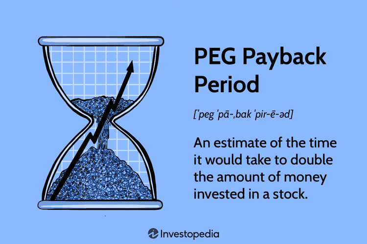

## Table of Contents

## What is the PEG Payback Period?

The PEG Payback Period is a way to figure out how long it will take for a company's earnings growth to make up for the price you pay for its stock. It uses the Price/Earnings to Growth (PEG) ratio, which compares the stock's price to how fast the company is growing its earnings. If a stock has a PEG ratio of 1, it means the stock's price is fair for its growth rate. The PEG Payback Period takes this a step further by calculating how many years it will take for the company's growth to "pay back" the price you paid for the stock.

To calculate the PEG Payback Period, you divide the stock's Price/Earnings (P/E) ratio by its expected earnings growth rate. For example, if a stock has a P/E ratio of 20 and an expected growth rate of 5%, the PEG Payback Period would be 20 divided by 5, which equals 4 years. This means it would take 4 years for the company's earnings growth to cover the cost of the stock. Investors use this to see if a stock is a good buy; a shorter payback period might mean the stock is a better value.

## How is the PEG Payback Period calculated?

The PEG Payback Period is a way to find out how many years it will take for a company's growth to make up for the price you paid for its stock. To calculate it, you need two things: the stock's Price/Earnings (P/E) ratio and the company's expected earnings growth rate. The P/E ratio is the stock's price divided by the company's earnings per share. The expected earnings growth rate is how fast the company's earnings are expected to grow each year.

To find the PEG Payback Period, you divide the P/E ratio by the expected earnings growth rate. For example, if a stock has a P/E ratio of 15 and an expected growth rate of 5%, you would divide 15 by 5. This gives you a PEG Payback Period of 3 years. This means it would take 3 years for the company's growth to cover the cost of the stock. A shorter PEG Payback Period might mean the stock is a better value for investors.

## Why is the PEG Payback Period important for investors?

The PEG Payback Period is important for investors because it helps them understand how long it will take for a company's growth to make up for the price they paid for its stock. This is useful because it gives investors a way to see if a stock is a good deal. If the PEG Payback Period is short, it means the stock's price might be a good value because the company's growth will quickly cover the cost of the stock. On the other hand, a long PEG Payback Period might mean the stock is overpriced for its growth rate.

Investors use the PEG Payback Period to compare different stocks and make better choices about where to put their money. By looking at this number, they can see which stocks might give them a quicker return on their investment. This can help them decide if a stock is worth buying or if they should look for other options. In simple terms, the PEG Payback Period is a tool that helps investors make smarter decisions by showing them how long it will take to get their money back through the company's growth.

## Can you explain the formula used to calculate the PEG Payback Period?

The formula to calculate the PEG Payback Period is pretty simple. You just take the stock's Price/Earnings (P/E) ratio and divide it by the company's expected earnings growth rate. The P/E ratio is how much you pay for each dollar of the company's earnings. The expected earnings growth rate is how fast the company's earnings are supposed to grow each year. So, if a stock has a P/E ratio of 20 and the company's earnings are expected to grow by 5% each year, you divide 20 by 5 to get a PEG Payback Period of 4 years.

This number tells you how many years it will take for the company's growth to make up for the price you paid for the stock. If the PEG Payback Period is short, like 2 or 3 years, it might mean the stock is a good deal because you'll get your money back quickly. If it's long, like 10 or more years, it might mean the stock is too expensive for how fast the company is growing. This helps investors figure out if a stock is worth buying or if they should look at other options.

## What are the key components needed to compute the PEG Payback Period?

To compute the PEG Payback Period, you need two main things: the stock's Price/Earnings (P/E) ratio and the company's expected earnings growth rate. The P/E ratio is how much you pay for each dollar of the company's earnings. You find it by dividing the stock's price by the company's earnings per share. The expected earnings growth rate is how fast the company's earnings are supposed to grow each year. This number is usually given as a percentage and can be found in financial reports or analyst forecasts.

Once you have these two numbers, you can calculate the PEG Payback Period by dividing the P/E ratio by the expected earnings growth rate. For example, if a stock has a P/E ratio of 15 and the company's earnings are expected to grow by 5% each year, you divide 15 by 5 to get a PEG Payback Period of 3 years. This tells you how many years it will take for the company's growth to make up for the price you paid for the stock. A shorter PEG Payback Period might mean the stock is a good deal because you'll get your money back quickly.

## How does the PEG Payback Period differ from the traditional Payback Period?

The PEG Payback Period and the traditional Payback Period are two different ways to figure out how long it will take to get your money back from an investment. The traditional Payback Period looks at how long it takes for the cash flows from a project or investment to cover the initial cost. It's often used for things like buying new equipment or starting a new project, where you can see the money coming in and out pretty clearly. It's a simple way to see if an investment will pay off quickly.

The PEG Payback Period, on the other hand, is used for stocks and looks at how long it will take for a company's earnings growth to make up for the price you paid for its stock. It uses the Price/Earnings (P/E) ratio and the expected earnings growth rate to figure this out. This method is more about understanding if a stock is a good value based on how fast the company is growing. While the traditional Payback Period focuses on cash flows, the PEG Payback Period focuses on earnings growth, making it more specific to stock investments.

## What are the limitations of using the PEG Payback Period as an investment metric?

The PEG Payback Period can be a useful tool, but it has some limitations. One big problem is that it depends on guesses about the future. The expected earnings growth rate is just a prediction, and if it's wrong, the PEG Payback Period won't be accurate. Companies can have ups and downs, and it's hard to know exactly how they'll do in the future. Also, the PEG Payback Period doesn't take into account other important things like how risky the stock is or how the whole market is doing. So, it might not give you the full picture of whether a stock is a good investment.

Another limitation is that the PEG Payback Period focuses only on earnings growth and ignores other ways a company might make money for investors. For example, a company might pay dividends or buy back its own stock, which can also affect how much money you get back from your investment. Plus, the PEG Payback Period doesn't consider changes in the stock's price, which can be just as important as earnings growth. So, while the PEG Payback Period can be a helpful tool, it's best used along with other ways of looking at a stock to make a well-rounded decision.

## How can the PEG Payback Period be used to compare different investment opportunities?

The PEG Payback Period can help you compare different stocks by showing how long it will take for each company's growth to pay back the price you paid for the stock. If one stock has a shorter PEG Payback Period than another, it might be a better deal because you'll get your money back faster. For example, if Stock A has a PEG Payback Period of 3 years and Stock B has a PEG Payback Period of 5 years, Stock A might be the better choice if you want to see your money come back quicker.

However, you can't just look at the PEG Payback Period alone. It's important to use it along with other information about the stocks. Things like how risky the stocks are, what the whole market is doing, and if the companies pay dividends can all affect whether a stock is a good investment. So, while the PEG Payback Period is a useful tool for comparing stocks, it's best to look at the whole picture before you decide where to put your money.

## What industries or types of companies are best suited for analysis using the PEG Payback Period?

The PEG Payback Period is best for looking at companies that are growing quickly, like those in the tech or healthcare industries. These companies often have high P/E ratios because people expect them to grow a lot. The PEG Payback Period helps you see if the stock's price is fair for how fast the company is growing. So, if you're thinking about buying stocks in these fast-growing industries, the PEG Payback Period can be a good tool to help you decide.

However, it's not so great for companies that don't grow much, like those in old industries like utilities or consumer goods. These companies might not have high growth rates, so the PEG Payback Period might not tell you much. It's also not the best for companies that pay a lot of dividends because it only looks at earnings growth and doesn't consider the money you get from dividends. So, it's best used for companies where growth is the main thing driving the stock's value.

## How does the PEG Payback Period account for growth in its calculations?

The PEG Payback Period looks at how long it will take for a company's growth to make up for the price you paid for its stock. It does this by using the Price/Earnings (P/E) ratio and the company's expected earnings growth rate. The P/E ratio tells you how much you're paying for each dollar of the company's earnings. The expected earnings growth rate is a guess about how fast the company's earnings will grow each year. To find the PEG Payback Period, you divide the P/E ratio by the expected growth rate. This gives you a number of years, showing how long it will take for the company's growth to cover the cost of the stock.

For example, if a stock has a P/E ratio of 20 and the company's earnings are expected to grow by 5% each year, the PEG Payback Period would be 20 divided by 5, which equals 4 years. This means it would take 4 years for the company's growth to pay back the price you paid for the stock. The PEG Payback Period is a helpful way to see if a stock is a good deal. If the PEG Payback Period is short, it might mean the stock is a better value because you'll get your money back quicker. But if it's long, the stock might be too expensive for its growth rate.

## Are there any common mistakes investors make when using the PEG Payback Period?

One common mistake investors make when using the PEG Payback Period is relying too much on the expected earnings growth rate. This number is just a guess about how fast the company's earnings will grow in the future. If the guess is wrong, the PEG Payback Period won't be accurate. Companies can have good years and bad years, so it's hard to predict exactly how they'll do. Investors need to remember that the PEG Payback Period is based on predictions and not sure things.

Another mistake is not looking at the whole picture. The PEG Payback Period only focuses on how long it will take for earnings growth to pay back the stock's price. It doesn't consider other important things like how risky the stock is, what the whole market is doing, or if the company pays dividends. These things can also affect how good an investment a stock is. So, while the PEG Payback Period can be a helpful tool, it's best to use it along with other ways of looking at a stock to make a smart decision.

## How can the PEG Payback Period be integrated with other financial metrics for a more comprehensive analysis?

The PEG Payback Period is a great tool to see how long it will take for a company's growth to pay back the price you paid for its stock. But to get a full picture of whether a stock is a good investment, you need to look at other financial metrics too. One important metric is the Price/Earnings (P/E) ratio, which shows how much you're paying for each dollar of the company's earnings. Another is the Dividend Yield, which tells you how much money you can get back from dividends each year. By looking at the PEG Payback Period along with these other metrics, you can see if a stock is a good deal and if it fits your investment goals.

For example, if a stock has a short PEG Payback Period, it might seem like a good deal because you'll get your money back quickly. But if the stock also has a high P/E ratio, it might be too expensive compared to other stocks. And if the company pays a high dividend, that could make the stock more attractive even if the PEG Payback Period is longer. By combining the PEG Payback Period with other metrics like the P/E ratio, Dividend Yield, and even the company's debt levels, you can make a smarter decision about where to put your money. This way, you're not just looking at one part of the picture, but the whole thing.

## What is the Payback Period and How Can It Be Understood?

The payback period is a fundamental financial metric employed to ascertain the duration necessary to recoup an initial investment in a project or venture. This metric provides investors with a straightforward understanding of when an investment reaches its breakeven point—the moment when initial expenditures are fully recovered through generated cash inflows. Calculating the payback period involves dividing the initial investment cost by the annual cash inflow, assuming consistent yearly returns:

$$
\text{Payback Period} = \frac{\text{Initial Investment}}{\text{Annual Cash Inflow}}
$$

This formula assumes a uniform cash inflow over the years, making it less applicable to projects with varying annual returns. The simplicity of the payback period is particularly advantageous for assessing investment opportunities at a glance, especially in environments where speed is critical, such as fast-paced financial markets or rapidly changing industries.

The emphasis on shorter payback periods stems from their ability to reduce risk. Investments that recuperate their initial costs swiftly are perceived as less risky, as they are exposed to financial uncertainties for a reduced duration. Such projects enhance [liquidity](/wiki/liquidity-risk-premium) by freeing up capital quickly, allowing businesses and investors to reinvest funds into new opportunities or safeguard against unforeseen expenses.

Moreover, the focus on liquidity is crucial in capital-intensive sectors where ongoing investment is necessary to sustain operational and competitive viability. Investors often favor projects with shorter payback periods in these sectors because they provide quicker returns, facilitating sustained cash flow management.

However, while the payback period offers a simplistic approach, its reliance on basic cash flow calculations does not account for the time value of money. This oversight can result in a skewed assessment of the project's true value, especially if the project yields returns over a significant period. Despite this, the payback period remains an essential tool at the preliminary stage of investment analysis, valued for its directness and utility in filtering potential projects swiftly.

## What is the Role of Payback Period in Investment Analysis?

The payback period is a fundamental financial metric in investment analysis, providing an effective initial screening tool for potential projects. Its primary function is to determine how quickly an investment can recoup its initial costs, offering an immediate glimpse into a project's short-term profitability. In essence, the payback period is the time it takes for an investment to generate an amount of cash equal to the initial investment outlay.

This metric proves particularly useful in capital budgeting, a process that involves the assessment and selection of projects that will generate the highest return over time. By calculating the payback period, companies can maintain liquidity, ensuring that investments do not tie up resources for extended periods. This focus on liquidity is crucial in fluctuating market conditions where rapid access to cash can provide a competitive edge.

To illustrate this, consider a simple formula for calculating the payback period:

$$
\text{Payback Period} = \frac{\text{Initial Investment}}{\text{Annual Cash Inflows}}
$$

For example, if a project requires an initial investment of $100,000 and is expected to generate $25,000 annually, the payback period would be:

$$
\text{Payback Period} = \frac{100,000}{25,000} = 4 \text{ years}
$$

This straightforward approach allows investors to quickly weed out less promising projects. Those with longer payback periods might indicate higher risk or reduced liquidity potential, prompting decision-makers to prioritize projects with shorter timelines.

The simplicity and efficiency of the payback period make it a popular choice among financial analysts and managers. It allows for swift comparisons between competing projects, helping firms to allocate their resources more effectively. However, it is important to note that while the payback period is helpful for initial screenings, it does not account for the longer-term profitability or cash flows beyond the breakeven point. Therefore, it is most effective when used in conjunction with more comprehensive tools to perform a thorough investment analysis.

## What are the limitations of the Payback Period?

The payback period is a straightforward financial metric that offers a quick snapshot of the time needed to recoup an initial investment. However, its simplicity comes with significant limitations. One core drawback is its disregard for the time value of money (TVM). The TVM concept posits that a dollar available today is worth more than a dollar in the future due to its potential [earning](/wiki/earning-announcement) capacity. The traditional payback period does not account for this principle, potentially leading to suboptimal investment decisions where future cash flows are undervalued.

In practice, this means that while an investment may have a short payback period, it might not necessarily offer the best value in the long term if it doesn't generate substantial returns beyond this period. Therefore, relying solely on the payback period can lead to an oversight of long-term cash flows, causing investors to favor projects with quick but potentially lower returns rather than those offering greater cumulative value over time.

To address these shortcomings, the payback period should be used in tandem with other financial metrics like Net Present Value (NPV) and Internal Rate of Return (IRR). NPV provides a method for evaluating the profitability of an investment by considering the present value of all future cash flows, thus incorporating the time value of money. The formula for NPV is:

$$
\text{NPV} = \sum \frac{C_t}{(1 + r)^t} - C_0
$$

where $C_t$ is the cash inflow during the period $t$, $r$ is the discount rate, and $C_0$ is the initial investment.

Similarly, the IRR is the discount rate that makes the net present value of all cash flows from an investment zero. It provides a percentage return expected from the investment, allowing for a more comprehensive comparison of different projects. These metrics offer a more detailed and accurate assessment of an investment's potential because they account for both the magnitude and timing of cash inflows.

Incorporating advanced metrics alongside the payback period enables a balanced approach to investment analysis, mitigating the risk of overlooking significant financial factors and improving overall decision-making effectiveness. By integrating these measures, investors can better assess both short-term recoveries and long-term gains, achieving a more holistic evaluation of potential investments.

## What are the applications in algorithmic trading?

Algorithmic trading leverages advanced computation to execute trading strategies at speeds that far surpass human capabilities. Within this framework, the payback period becomes a critical tool for evaluating the recovery time of trading investments. This metric's application is particularly beneficial in rapidly changing market environments where swift decision-making is crucial.

By quantifying the time required to recoup an initial investment, the payback period serves as a practical measure for prioritizing strategies that offer quick returns. Algorithmic systems can incorporate this metric effectively, allowing traders to adjust their strategies based on real-time data. This real-time adaptability is essential for maintaining optimal performance in volatile market conditions.

For algorithmic traders, defining and simulating a payback period involves calculating the time it takes for a trading strategy to generate sufficient returns to cover its costs. The core goal is to identify strategies that can swiftly recover investments, thereby minimizing potential losses. For instance, if a trading strategy involves a significant initial outlay, its payback period can be assessed through simulation models to ensure it aligns with the trader’s risk tolerance and expected market dynamics.

Implementation Example: Suppose an algorithmic trader is interested in a strategy with an initial cost of $100,000. If the expected daily profit is $1,000, the payback period can be estimated as:

$$
\text{Payback Period} = \frac{\text{Initial Investment}}{\text{Daily Profit}} = \frac{100,000}{1,000} = 100 \text{ days}
$$

This straightforward calculation allows the trader to assess how quickly the strategy can generate sufficient returns, thus aiding in strategic decision-making processes.

In practice, algorithmic systems can automate this evaluation, running multiple scenarios and adjusting parameters to optimize the payback period. This capability enables traders to continually refine their strategies, ensuring that only the most financially viable options are pursued.

Ultimately, integrating the payback period into [algorithmic trading](/wiki/algorithmic-trading) systems enhances financial performance by emphasizing strategies that offer rapid return on investment, contributing to more resilient and adaptive trading portfolios.

## What is the PEG Ratio and how do we understand it?

The PEG (Price/Earnings-to-Growth) ratio advances the concept of the traditional P/E (Price/Earnings) ratio by integrating the growth rate of a company's earnings into the valuation analysis. This enhancement serves to provide a more detailed portrayal of a stock's potential worth, especially when predicting future performance.

The PEG ratio is calculated using the formula:

$$

\text{PEG Ratio} = \frac{\text{P/E Ratio}}{\text{Earnings Growth Rate (\%)}}
$$

By dividing the P/E ratio by the expected growth rate of earnings, the PEG ratio accounts for how quickly a company is anticipated to grow. A lower PEG ratio may indicate that a stock is undervalued given its earnings growth potential, whereas a higher PEG ratio suggests the stock might be overvalued relative to its growth prospects.

The merit of the PEG ratio lies in its ability to reconcile the P/E ratio's simplicity with the dynamic reality of earnings growth. Traditional P/E ratios often overlook growth rates, which can lead to skewed interpretations. The PEG ratio addresses this gap by linking current valuation to future growth expectations, thus offering a more comprehensive stock evaluation framework.

Investors utilize the PEG ratio to sift through the vast array of stock options, striving to identify those that are undervalued with respectable growth potential. A key assumption here is the reliability of earnings growth forecasts, which necessitates careful analysis and frequent updates to maintain accuracy. This metric is especially advantageous during periods of market [volatility](/wiki/volatility-trading-strategies), where rapid changes in growth expectations can significantly impact valuations. 

In summary, the PEG ratio stands out as a vital tool for investors aiming to understand not just the current valuation of a stock, but its prospective trajectory based on growth projections. As such, it is integral in formulating more nuanced investment strategies that acknowledge both present and anticipated market dynamics.

## How do you calculate and interpret the PEG Ratio?

The PEG (Price/Earnings-to-Growth) ratio is a fundamental tool in investment analysis that enhances the traditional P/E (Price/Earnings) ratio by factoring in earnings growth. It provides a more comprehensive view of a stock’s valuation by considering both current earnings and future growth prospects. 

**Calculation of the PEG Ratio**

The PEG ratio is calculated using the formula:

$$
\text{PEG Ratio} = \frac{\text{P/E Ratio}}{\text{Earnings Growth Rate}}
$$

Where:
- The P/E ratio is the ratio of a company’s current share price to its earnings per share (EPS).
- The Earnings Growth Rate is usually expressed as a percentage reflecting the anticipated growth in EPS over a future period, typically one to five years.

**Importance of Accurate EPS Growth Forecasts**

Accurate predictions of the Earnings Growth Rate are crucial for meaningful PEG ratio calculations. Investors often rely on historical growth rates, consensus estimates from financial analysts, or projected company earnings reports. Given the inherent uncertainty in forecasting, particularly under volatile market conditions, it is essential to regularly update these predictions to maintain reliable valuations.

**Interpreting the PEG Ratio**

The PEG ratio provides insights into whether a stock is overvalued, undervalued, or fairly priced relative to its growth potential:
- A PEG ratio of 1 suggests a stock is fairly valued, with the earnings growth adequately justifying the price.
- A PEG ratio less than 1 indicates that a stock may be undervalued, implying that its growth prospects are not fully reflected in the current price.
- A PEG ratio greater than 1 suggests that a stock might be overvalued, as the price may not be justified solely by growth expectations.

Investors must consider industry norms and economic conditions when interpreting the PEG ratio. Different industries have varying growth trajectories, meaning a "normal" PEG ratio could differ significantly from one sector to another. For instance, high-growth technology companies typically bear higher PEG ratios compared to more stable, mature industries like utilities.

Moreover, during economic downturns or periods of inflation, growth forecasts might require adjustments to reflect broader economic impacts. Therefore, a nuanced understanding of both sector-specific conditions and macroeconomic variables is crucial for astute interpretation and application of the PEG ratio in investment strategies.

In summary, while the PEG ratio is a valuable metric for assessing stock valuations relative to growth expectations, its effectiveness heavily relies on the precision of growth forecasts and contextual evaluation against industry standards and economic trends.

## References & Further Reading

[1]: Bergstra, J., Bardenet, R., Bengio, Y., & Kégl, B. (2011). ["Algorithms for Hyper-Parameter Optimization."](https://dl.acm.org/doi/10.5555/2986459.2986743) Advances in Neural Information Processing Systems 24.

[2]: ["Advances in Financial Machine Learning"](https://www.amazon.com/Advances-Financial-Machine-Learning-Marcos/dp/1119482089) by Marcos Lopez de Prado

[3]: ["Evidence-Based Technical Analysis: Applying the Scientific Method and Statistical Inference to Trading Signals"](https://www.amazon.com/Evidence-Based-Technical-Analysis-Scientific-Statistical/dp/0470008741) by David Aronson

[4]: ["Machine Learning for Algorithmic Trading"](https://github.com/stefan-jansen/machine-learning-for-trading) by Stefan Jansen

[5]: ["Quantitative Trading: How to Build Your Own Algorithmic Trading Business"](https://www.amazon.com/Quantitative-Trading-Build-Algorithmic-Business/dp/1119800064) by Ernest P. Chan