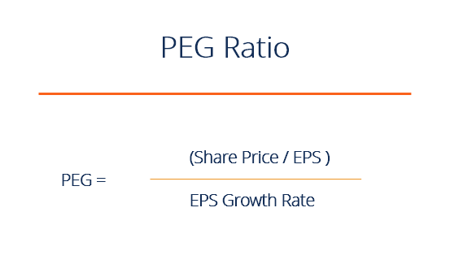

## Table of Contents

## What is the PEG Ratio and how is it calculated?

The PEG Ratio, or Price/Earnings to Growth Ratio, is a financial metric used to assess the value of a company's stock while considering its expected earnings growth. It helps investors determine if a stock is overvalued or undervalued by comparing the stock's price-to-earnings (P/E) ratio with its projected earnings growth rate. A lower PEG Ratio might indicate that a stock is undervalued, suggesting it could be a good investment, whereas a higher PEG Ratio might mean the stock is overvalued.

To calculate the PEG Ratio, you start with the P/E ratio, which is the current stock price divided by the earnings per share (EPS). Then, you divide this P/E ratio by the company's expected earnings growth rate over a specific period, usually the next three to five years. For example, if a company has a P/E ratio of 20 and an expected growth rate of 10%, the PEG Ratio would be 20 divided by 10, which equals 2. A PEG Ratio of less than 1 is often considered a sign that the stock may be undervalued, while a ratio above 1 might suggest it's overvalued.

## Why is the PEG Ratio important for investors?

The PEG Ratio is important for investors because it helps them see if a stock is a good buy or not. It takes the P/E ratio, which shows how much investors are willing to pay for a company's earnings, and makes it better by adding in how fast the company's earnings are expected to grow. This way, investors can tell if a stock is cheap or expensive when you think about its future growth. If a company is growing fast, it might be okay to pay more for its stock, but if it's not growing much, you might want to look elsewhere.

Using the PEG Ratio can help investors make smarter choices. If the PEG Ratio is low, it might mean the stock is undervalued, which could be a good chance to buy. On the other hand, a high PEG Ratio might mean the stock is overvalued, and it could be risky to buy it. By looking at the PEG Ratio, investors can compare different companies and find the ones that might give them the best return on their money.

## How does the PEG Ratio differ from the P/E Ratio?

The PEG Ratio and the P/E Ratio are both ways to see if a company's stock is a good buy, but they look at different things. The P/E Ratio, or Price-to-Earnings Ratio, tells you how much you're paying for each dollar of the company's earnings. It's simple: you take the stock price and divide it by the earnings per share. This can show if a stock is cheap or expensive compared to its earnings right now. But, the P/E Ratio doesn't tell you about the company's future growth.

That's where the PEG Ratio comes in. The PEG Ratio, or Price/Earnings to Growth Ratio, adds in the company's expected growth rate to the P/E Ratio. You take the P/E Ratio and divide it by the expected growth rate of the company's earnings. This helps you see if a stock is a good deal when you think about how fast the company is growing. So, the PEG Ratio gives you a fuller picture by mixing in future growth, while the P/E Ratio just looks at the present.

## What is considered a good PEG Ratio?

A good PEG Ratio is usually thought to be 1 or less. This means that the stock's price is fair when you think about how fast the company is growing. If the PEG Ratio is less than 1, it might mean the stock is a good deal because the price is low compared to the company's growth. Investors often look for stocks with a PEG Ratio under 1 because they think these stocks could give them a good return on their money.

But, what's considered a good PEG Ratio can change depending on the industry and what's happening in the market. Some industries might have higher growth rates, so a PEG Ratio a bit above 1 could still be okay. It's also important to compare the PEG Ratio with other companies in the same industry to see if it's really a good deal. So, while a PEG Ratio of 1 or less is a good starting point, you should look at other things too before deciding to buy a stock.

## How can the PEG Ratio be used to compare companies within the same industry?

The PEG Ratio is a useful tool for comparing companies within the same industry because it takes into account both the price of the stock and the company's expected growth. When you compare the PEG Ratios of different companies, you can see which ones might be a better value. For example, if Company A has a PEG Ratio of 0.8 and Company B has a PEG Ratio of 1.2, Company A might be a better buy because its price is lower compared to its growth.

However, it's important to remember that the PEG Ratio is just one piece of the puzzle. You should also look at other things like the company's financial health, the overall market conditions, and what's happening in the industry. By using the PEG Ratio along with other information, you can make smarter choices about which stocks to buy.

## What are the limitations of using the PEG Ratio?

The PEG Ratio can be a helpful tool, but it has some problems. One big issue is that it relies on guesses about future growth. If these guesses are wrong, the PEG Ratio can be way off. Also, different people might have different ideas about how fast a company will grow, so the PEG Ratio can change a lot depending on who's making the guess. Another problem is that the PEG Ratio doesn't work well for companies that aren't growing or are losing money. If a company's growth rate is zero or negative, the PEG Ratio can't be calculated or becomes meaningless.

Another limitation is that the PEG Ratio doesn't take into account other important things about a company, like how much debt it has or how well it's run. Just because a company has a low PEG Ratio doesn't mean it's a good investment if it has a lot of other problems. Also, the PEG Ratio can be hard to use for comparing companies in different industries because growth rates can be very different from one industry to another. So, while the PEG Ratio can give you a quick idea about a stock's value, you need to look at other things too before making a decision.

## How does the company's earnings growth rate affect the PEG Ratio?

The company's earnings growth rate is a big part of the PEG Ratio. When you calculate the PEG Ratio, you take the P/E Ratio and divide it by the earnings growth rate. So, if a company is expected to grow its earnings a lot, the PEG Ratio will be lower. This makes the stock look like a better deal because the price seems low compared to how fast the company is growing.

On the other hand, if a company's earnings growth rate is low or not growing at all, the PEG Ratio will be higher. A higher PEG Ratio might make the stock seem expensive, even if the P/E Ratio is not that high. This is why the earnings growth rate is so important. It helps investors see if a stock's price is fair when you think about the company's future.

## What methods can be used to forecast a company's earnings growth rate?

To forecast a company's earnings growth rate, analysts often look at the company's past performance. They study how the company's earnings have grown over the last few years and use this information to guess how it might grow in the future. They also look at things like the company's plans for new products, how much they're spending on research and development, and any big changes in the industry. This helps them make a more accurate guess about future earnings growth.

Another way to forecast earnings growth is by using economic models and industry trends. Analysts might look at how the whole economy is doing and how the company's industry is expected to grow. They can use special formulas and computer programs to make these predictions. Sometimes, they also talk to the company's leaders to get their thoughts on future growth. By putting all this information together, analysts can come up with a good estimate of the company's earnings growth rate.

## How do different growth rate assumptions impact the PEG Ratio?

Different growth rate assumptions can really change the PEG Ratio. If you think a company will grow a lot, you'll use a higher growth rate in your calculation. This makes the PEG Ratio smaller because you're dividing the P/E Ratio by a bigger number. A smaller PEG Ratio can make the stock look like a better deal. But, if you guess wrong and the company doesn't grow as much as you thought, the stock might not be as good a buy as you thought.

On the other hand, if you think a company won't grow much, you'll use a lower growth rate. This makes the PEG Ratio bigger because you're dividing the P/E Ratio by a smaller number. A bigger PEG Ratio can make the stock look more expensive. If the company ends up growing more than you expected, the stock might actually be a better deal than you thought. So, it's really important to think carefully about the growth rate you use because it can make a big difference in how you see the value of a stock.

## Can the PEG Ratio be applied to companies with negative earnings?

The PEG Ratio can't be used for companies with negative earnings because it needs the P/E Ratio, which you can't find if earnings are negative. The P/E Ratio is the stock price divided by earnings per share. If earnings are negative, the P/E Ratio becomes a negative number or undefined, and you can't use it to calculate the PEG Ratio.

Instead of the PEG Ratio, investors might look at other things to figure out if a company with negative earnings is a good investment. They might check the company's plans for the future, how much money it's losing, and if it has enough cash to keep going. By looking at these other pieces of information, investors can still make smart choices about companies that aren't making money right now.

## How does the PEG Ratio account for cyclical companies and their earnings fluctuations?

The PEG Ratio can be tricky to use for cyclical companies because their earnings go up and down a lot. Cyclical companies are businesses that do well when the economy is good but struggle when things get tough. Because their earnings change so much, it's hard to guess what their growth rate will be. If you use a growth rate that's too high or too low, the PEG Ratio won't give you a good idea of whether the stock is a good deal or not.

To make the PEG Ratio work better for cyclical companies, you might want to look at their earnings over a longer time, like several years, to smooth out the ups and downs. This can give you a better idea of their average growth rate. But even then, you need to be careful because the future might not be the same as the past. So, while the PEG Ratio can be a helpful tool, it's important to use it along with other information to make the best decisions about investing in cyclical companies.

## What advanced metrics can be combined with the PEG Ratio for deeper investment analysis?

To get a deeper look at a company's value, you can use the PEG Ratio along with other advanced metrics. One useful metric is the Price-to-Book (P/B) Ratio, which shows how much the market value of a company is compared to its book value. This can tell you if a company's stock is priced high or low compared to what it's really worth. Another good metric to use is the Return on Equity (ROE), which shows how well a company is using the money its shareholders have invested to make profits. A high ROE might mean the company is good at making money from its investments.

You can also look at the Debt-to-Equity (D/E) Ratio, which tells you how much debt a company has compared to its equity. A high D/E Ratio might mean the company is risky because it has a lot of debt. Another helpful metric is the Free Cash Flow (FCF) Yield, which shows how much cash a company has left after it pays for everything it needs to run. A high FCF Yield might mean the company is in a good spot to grow or pay dividends. By using these metrics with the PEG Ratio, you can get a fuller picture of a company's health and whether its stock is a good buy.

## What is the PEG Ratio and how do we understand it?

The PEG ratio is a valuable financial metric that goes beyond the traditional price-to-earnings (P/E) ratio by incorporating the company's earnings growth rate into the assessment. This integration allows investors to obtain a more comprehensive and dynamic view of a stock's valuation. Unlike the P/E ratio, which provides a static evaluation by comparing the current market price to the earnings per share, the PEG ratio adjusts this calculation by dividing the P/E ratio by the expected annual growth rate of the company's earnings. Mathematically, the PEG ratio can be expressed as:

$$
\text{PEG Ratio} = \frac{\text{P/E Ratio}}{\text{Earnings Growth Rate (\%)}}
$$

A PEG ratio of 1.0 is typically interpreted as the stock being fairly valued, which suggests that the stock's market price adequately reflects its earnings growth potential. A PEG ratio below 1.0 can indicate potential undervaluation, signaling that the stock may be priced lower relative to its expected earnings growth, presenting a potentially attractive opportunity for investors.

The adaptability of the PEG ratio makes it useful across various industries with differing growth rates. It provides a versatile framework to evaluate stocks beyond just the current earnings, accounting for future growth prospects. For instance, in sectors with high growth trajectories, such as technology or biotechnology, the PEG ratio can offer a nuanced perspective that balances the present-day valuation with aggressive growth forecasts. 

Understanding how to calculate and interpret the PEG ratio is crucial for investors aiming to accurately assess a stock's future value. This understanding aids in making more precise investment choices that consider both immediate financial health and long-term growth potential. However, it's important to acknowledge that the effectiveness of the PEG ratio is contingent upon the reliability of growth estimates, which can vary depending on market conditions and company-specific factors. Therefore, while the PEG ratio is a powerful tool, it should ideally be used alongside other financial metrics and analyses for a holistic evaluation.

## What is the Calculation and Interpretation of the PEG Ratio?

The calculation of the PEG ratio begins with identifying the two components involved: the price-to-earnings (P/E) ratio and the earnings growth rate. The basic formula for the PEG ratio can be expressed as:

$$
\text{PEG Ratio} = \frac{\text{P/E Ratio}}{\text{Earnings Growth Rate}}
$$

The P/E ratio itself is calculated by dividing the market price per share by the earnings per share (EPS). Calculating the PEG ratio involves determining which growth rate to use—historical, trailing, or forward-looking. Each option offers different perspectives:

1. **Historical Growth Rate**: Utilizes past performance data. This provides a backward-looking view of the company’s growth trajectory and is less speculative since it is based on actual results.

2. **Trailing Growth Rate**: Considers the recent past, typically the last few quarters or years. This can offer insights into more recent trends in a company's growth pattern.

3. **Forward-Looking Growth Rate**: Based on analysts’ projections of future earnings growth. This approach anticipates how the company will perform, though it can be susceptible to optimism or bias in forecasts.

Interpreting the PEG ratio requires understanding the context of the stock relative to its industry peers or historical benchmarks. A key interpretation guideline is:

- **PEG Ratio of 1.0**: Generally suggests that a stock is fairly valued concerning its growth prospects.
- **PEG Ratio < 1.0**: May indicate undervaluation, implying that a stock’s price could potentially rise as it reflects strong growth relative to its current P/E ratio.
- **PEG Ratio > 1.0**: Could signal overvaluation, suggesting potential caution, as the stock's price may not fully justify its growth expectations.

The accuracy of the PEG ratio is largely dependent on the reliability of the earnings growth estimates. Precise forecasting of future earnings growth is crucial because any significant deviation in expectations can skew the PEG analysis. Investors need to critically assess the assumptions underlying these growth estimates.

While insightful, the PEG ratio should not be used in isolation. It is one among many tools that investors employ to obtain a comprehensive view of a stock's valuation. Incorporating other metrics and contextual market analysis ensures a well-rounded investment strategy, mitigating the risks associated with relying on singular valuations. Thus, a balanced view that integrates PEG ratio calculations with broader financial analysis techniques aids investors in making more informed and strategic decisions.

## What are the pros and cons of using the PEG Ratio?

The PEG ratio provides a comprehensive perspective in stock evaluations by incorporating growth forecasts into traditional valuation metrics, such as the price-to-earnings (P/E) ratio. This integration enables investors to discern between stocks that may appear overvalued or undervalued when solely considering static valuation measures. In growth investing, the PEG ratio's ability to highlight stocks with substantial growth potential is particularly advantageous. It accomplishes this by evaluating whether a stock's price is justified not only by its current earnings but also by its anticipated earnings growth.

However, some challenges warrant consideration. The PEG ratio's effectiveness is contingent on the accuracy of growth forecasts, which are susceptible to variability and potential errors. Inaccurate or overly optimistic growth predictions can skew the ratio, leading to misguided investment decisions. Furthermore, the calculation of the PEG ratio can differ based on whether historical, trailing, or forward growth rates are used, resulting in diverse interpretations. For instance, the formula for the PEG ratio is:

$$
\text{PEG Ratio} = \frac{\text{P/E Ratio}}{\text{Earnings Growth Rate}}
$$

Choosing different growth rates for the denominator can yield varying values:

- Historical growth rates use past earnings data.
- Trailing growth rates consider recently observed growth.
- Forward-looking rates rely on projected future growth. 

These approaches can result in distinct PEG ratios for the same stock, complicating interpretation.

Despite these limitations, the PEG ratio remains an invaluable component within a comprehensive investment strategy. Its role in emphasizing growth prospects alongside traditional valuation metrics helps investors identify stocks with genuine growth potential, thereby enhancing decision-making. Investors should view the PEG ratio as part of a broader analytical toolkit, complementing other financial metrics and insights to form a well-rounded evaluation strategy. By doing so, they can better navigate the complexities of market valuation and growth potential.

## References & Further Reading

[1]: Estrada, J. (2005). ["The Price/Earnings-Growth (PEG) Ratio: Ratio or Rate?"](https://www.investopedia.com/terms/p/pegratio.asp) International Review of Financial Analysis.

[2]: Lynch, P. (1989). ["One Up On Wall Street: How To Use What You Already Know To Make Money In The Market"](https://www.amazon.com/One-Up-Wall-Street-Already/dp/0743200403). Simon & Schuster.

[3]: Damodaran, A. (2012). ["Investment Valuation: Tools and Techniques for Determining the Value of Any Asset (3rd Edition)"](https://www.wiley.com/en-us/Investment+Valuation%3A+Tools+and+Techniques+for+Determining+the+Value+of+Any+Asset%2C+3rd+Edition-p-9781118206560). John Wiley & Sons.

[4]: Andreou, P. C., CharalamBous, C., & Martzoukos, S. H. (2019). ["Algorithmic Trading: Review and Challenges."](https://www.researchgate.net/profile/Panayiotis-Andreou-2/publication/5144627_Robust_Artificial_Neural_Networks_for_Pricing_of_European_Options/links/0c960528cbb859e805000000/Robust-Artificial-Neural-Networks-for-Pricing-of-European-Options.pdf) Journal of Economics and Business.

[5]: ["The Little Book That Still Beats the Market"](https://www.amazon.com/Little-Book-Still-Beats-Market/dp/0470624159) by Joel Greenblatt