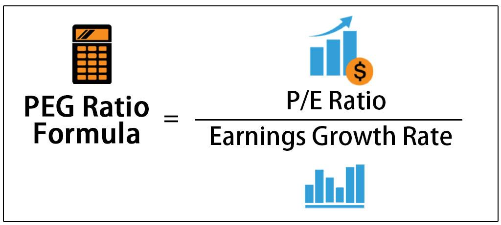

In the dynamic world of investment, understanding key valuation metrics is crucial for making informed decisions. One important metric is the Price/Earnings to Growth (PEG) ratio, which integrates the price-to-earnings (P/E) ratio with the company's earnings growth rate. By considering both current earnings valuation and future growth potential, the PEG ratio offers a more nuanced view of a stock's true value.

The usefulness of the PEG ratio extends significantly in earnings growth investment analysis as it offers investors a refined tool to assess how a stock is valued in light of its growth prospects. This can be particularly beneficial in identifying growth stocks that may be undervalued when traditional valuation methods are applied.



Algorithmic trading, which utilizes mathematical models and computer algorithms to execute stock trades, can greatly benefit from the integration of the PEG ratio. By incorporating this metric, trading algorithms can improve their accuracy in stock selection, focusing on securities that not only show favorable current valuation but also significant growth potential. This integration aids in the creation of more sophisticated and responsive trading strategies, offering investors a competitive edge in rapidly changing markets.

The focus of this article will be on providing insights into how the PEG ratio can be used to enhance decision-making in modern trading environments. By understanding and leveraging this metric, investors can improve their ability to evaluate stock stocks against growth potential, a critical aspect in formulating effective algorithmic trading strategies and achieving optimal portfolio performance.

## Table of Contents

## Understanding the PEG Ratio

The PEG ratio is a valuable financial metric that goes beyond the traditional price-to-earnings (P/E) ratio by incorporating the company's earnings growth rate into the assessment. This integration allows investors to obtain a more comprehensive and dynamic view of a stock's valuation. Unlike the P/E ratio, which provides a static evaluation by comparing the current market price to the earnings per share, the PEG ratio adjusts this calculation by dividing the P/E ratio by the expected annual growth rate of the company's earnings. Mathematically, the PEG ratio can be expressed as:

$$
\text{PEG Ratio} = \frac{\text{P/E Ratio}}{\text{Earnings Growth Rate (\%)}}
$$

A PEG ratio of 1.0 is typically interpreted as the stock being fairly valued, which suggests that the stock's market price adequately reflects its earnings growth potential. A PEG ratio below 1.0 can indicate potential undervaluation, signaling that the stock may be priced lower relative to its expected earnings growth, presenting a potentially attractive opportunity for investors.

The adaptability of the PEG ratio makes it useful across various industries with differing growth rates. It provides a versatile framework to evaluate stocks beyond just the current earnings, accounting for future growth prospects. For instance, in sectors with high growth trajectories, such as technology or biotechnology, the PEG ratio can offer a nuanced perspective that balances the present-day valuation with aggressive growth forecasts. 

Understanding how to calculate and interpret the PEG ratio is crucial for investors aiming to accurately assess a stock's future value. This understanding aids in making more precise investment choices that consider both immediate financial health and long-term growth potential. However, it's important to acknowledge that the effectiveness of the PEG ratio is contingent upon the reliability of growth estimates, which can vary depending on market conditions and company-specific factors. Therefore, while the PEG ratio is a powerful tool, it should ideally be used alongside other financial metrics and analyses for a holistic evaluation.

## Calculation and Interpretation of the PEG Ratio

The calculation of the PEG ratio begins with identifying the two components involved: the price-to-earnings (P/E) ratio and the earnings growth rate. The basic formula for the PEG ratio can be expressed as:

$$
\text{PEG Ratio} = \frac{\text{P/E Ratio}}{\text{Earnings Growth Rate}}
$$

The P/E ratio itself is calculated by dividing the market price per share by the earnings per share (EPS). Calculating the PEG ratio involves determining which growth rate to use—historical, trailing, or forward-looking. Each option offers different perspectives:

1. **Historical Growth Rate**: Utilizes past performance data. This provides a backward-looking view of the company’s growth trajectory and is less speculative since it is based on actual results.

2. **Trailing Growth Rate**: Considers the recent past, typically the last few quarters or years. This can offer insights into more recent trends in a company's growth pattern.

3. **Forward-Looking Growth Rate**: Based on analysts’ projections of future earnings growth. This approach anticipates how the company will perform, though it can be susceptible to optimism or bias in forecasts.

Interpreting the PEG ratio requires understanding the context of the stock relative to its industry peers or historical benchmarks. A key interpretation guideline is:

- **PEG Ratio of 1.0**: Generally suggests that a stock is fairly valued concerning its growth prospects.
- **PEG Ratio < 1.0**: May indicate undervaluation, implying that a stock’s price could potentially rise as it reflects strong growth relative to its current P/E ratio.
- **PEG Ratio > 1.0**: Could signal overvaluation, suggesting potential caution, as the stock's price may not fully justify its growth expectations.

The accuracy of the PEG ratio is largely dependent on the reliability of the earnings growth estimates. Precise forecasting of future earnings growth is crucial because any significant deviation in expectations can skew the PEG analysis. Investors need to critically assess the assumptions underlying these growth estimates.

While insightful, the PEG ratio should not be used in isolation. It is one among many tools that investors employ to obtain a comprehensive view of a stock's valuation. Incorporating other metrics and contextual market analysis ensures a well-rounded investment strategy, mitigating the risks associated with relying on singular valuations. Thus, a balanced view that integrates PEG ratio calculations with broader financial analysis techniques aids investors in making more informed and strategic decisions.

## The Role of PEG Ratio in Investment Analysis

The PEG ratio is an integral metric for earnings growth investment analysis, providing a more nuanced evaluation of stock value by incorporating growth prospects alongside traditional valuation measures. Unlike the static P/E ratio, which assesses stock value based only on current earnings, the PEG ratio integrates growth predictions, allowing investors to identify stocks that may be undervalued when considering their potential earnings trajectory. 

For growth-oriented investors, the PEG ratio offers a comprehensive assessment that balances both present earnings and anticipated growth. By incorporating growth rates, this metric highlights stocks that might be inaccurately assessed as overvalued through a traditional P/E lens but are justifiable with strong future growth expectations. This aspect is particularly crucial in sectors where rapid growth is a characteristic feature, and traditional valuation models might not accurately reflect true potential.

Using the PEG ratio, investors can more effectively differentiate between speculative stocks and those with solid growth prospects. Stocks with a PEG ratio less than 1 often signal an undervaluation in relation to expected earnings growth, making them attractive targets for growth-focused investors. Moreover, the PEG ratio helps in identifying companies that, despite high current valuations, maintain a favorable risk-reward profile due to robust growth forecasts.

Incorporating the PEG ratio into investment analysis encourages a more refined perspective that considers both current performance metrics and future potential. This balanced approach aids investors in making informed decisions, focusing on sustainable growth rather than short-term gains. For those seeking to harness growth investments efficiently, the PEG ratio acts as a crucial tool, offering insights that extend beyond conventional evaluation methods.

## Algorithmic Trading and the PEG Ratio

Algorithmic trading utilizes mathematical and statistical models to automate the process of buying and selling stocks, with the aim of executing trades at optimal prices. Integrating the Price/Earnings to Growth (PEG) ratio into these models can enhance their efficiency and effectiveness. The PEG ratio adds a layer of depth to the evaluation of stocks by incorporating growth prospects into the traditional P/E analysis. This capability allows algorithms to make more nuanced stock selections by identifying equities with favorable valuations and growth potential.

By including the PEG ratio in trading algorithms, these systems can be programmed to scan the market for stocks that demonstrate high earnings growth potential yet are undervalued. This is achieved by setting a threshold for the PEG ratio, typically looking for values less than 1.0 which suggest undervaluation in the context of expected growth. The algorithm can be designed to automatically rebalance investment portfolios in response to changes in stock valuation, ensuring that they remain aligned with the criteria set by the PEG ratio.

Incorporating growth-focused metrics like the PEG ratio can also aid in filtering out short-term market volatilities. These fluctuations may not accurately reflect a stock’s long-term potential due to transient market conditions or speculative trading. By focusing on sustained growth indicators, algorithms can mitigate the noise from these anomalies and concentrate on fundamentally solid investment opportunities.

Here is a simple Python example to illustrate how an algorithm might employ the PEG ratio for stock screening:

```python
def filter_stocks_by_peg(stocks):
    undervalued_stocks = []
    for stock in stocks:
        pe_ratio = stock['pe_ratio']
        growth_rate = stock['growth_rate']
        if growth_rate > 0:  # To prevent division by zero
            peg_ratio = pe_ratio / growth_rate
            if peg_ratio < 1.0: # Threshold for identifying undervalued stocks
                undervalued_stocks.append(stock)
    return undervalued_stocks

# Example stocks data
stocks_data = [
    {'ticker': 'AAPL', 'pe_ratio': 17.5, 'growth_rate': 20.0},
    {'ticker': 'GOOGL', 'pe_ratio': 29.2, 'growth_rate': 15.0},
    {'ticker': 'MSFT', 'pe_ratio': 23.1, 'growth_rate': 10.0}
]

undervalued_stocks = filter_stocks_by_peg(stocks_data)
```

In this algorithm, stocks are screened based on their PEG ratio, and those with PEG ratios below 1.0 are identified as undervalued considering their growth projections. Such algorithms can continuously monitor the market and provide updates, enabling investors to dynamically adjust their strategies and optimize for long-term gains. Through the intelligent integration of the PEG ratio in [algorithmic trading](/wiki/algorithmic-trading) frameworks, investors can enhance their decision-making processes to capture opportunities that balance valuation and growth potential effectively.

## Pros and Cons of Using the PEG Ratio

The PEG ratio provides a comprehensive perspective in stock evaluations by incorporating growth forecasts into traditional valuation metrics, such as the price-to-earnings (P/E) ratio. This integration enables investors to discern between stocks that may appear overvalued or undervalued when solely considering static valuation measures. In growth investing, the PEG ratio's ability to highlight stocks with substantial growth potential is particularly advantageous. It accomplishes this by evaluating whether a stock's price is justified not only by its current earnings but also by its anticipated earnings growth.

However, some challenges warrant consideration. The PEG ratio's effectiveness is contingent on the accuracy of growth forecasts, which are susceptible to variability and potential errors. Inaccurate or overly optimistic growth predictions can skew the ratio, leading to misguided investment decisions. Furthermore, the calculation of the PEG ratio can differ based on whether historical, trailing, or forward growth rates are used, resulting in diverse interpretations. For instance, the formula for the PEG ratio is:

$$
\text{PEG Ratio} = \frac{\text{P/E Ratio}}{\text{Earnings Growth Rate}}
$$

Choosing different growth rates for the denominator can yield varying values:

- Historical growth rates use past earnings data.
- Trailing growth rates consider recently observed growth.
- Forward-looking rates rely on projected future growth. 

These approaches can result in distinct PEG ratios for the same stock, complicating interpretation.

Despite these limitations, the PEG ratio remains an invaluable component within a comprehensive investment strategy. Its role in emphasizing growth prospects alongside traditional valuation metrics helps investors identify stocks with genuine growth potential, thereby enhancing decision-making. Investors should view the PEG ratio as part of a broader analytical toolkit, complementing other financial metrics and insights to form a well-rounded evaluation strategy. By doing so, they can better navigate the complexities of market valuation and growth potential.

## Conclusion

Understanding and applying the PEG ratio is essential for investors aiming to make growth-centric investment decisions. This metric serves as a vital tool in evaluating stock valuation while factoring in growth potential. The integration of the PEG ratio into algorithmic trading provides investors with a competitive advantage. By refining stock selection, algorithms can target undervalued stocks poised for growth, thereby optimizing investment portfolios.

However, it is important to recognize that the PEG ratio should not be used in isolation. As with any financial metric, it requires support from a variety of tools and analysis methods to ensure a comprehensive evaluation. For instance, combining the PEG ratio with other metrics like return on equity (ROE), debt-to-equity ratio, and revenue growth can result in a holistic view of a stock's potential.

Investors should continually enhance their understanding of both the advantages and limitations inherent to the PEG ratio. While it offers insights into growth and valuation, its reliance on growth forecasts can be a double-edged sword if projections are inaccurate. By maintaining an awareness of these factors and incorporating other analytical tools, investors can navigate the complexities of stock valuation more effectively.

Ultimately, the strategic use of the PEG ratio enables investors to make more informed decisions that align with both short-term objectives and long-term financial goals. This balance between immediate gains and sustainable growth is crucial for successful investment strategies. As market conditions and valuation tactics evolve, so too should the investor's approach to leveraging the PEG ratio in pursuit of financial success.

## References & Further Reading

[1]: Estrada, J. (2005). ["The Price/Earnings-Growth (PEG) Ratio: Ratio or Rate?"](https://www.investopedia.com/terms/p/pegratio.asp) International Review of Financial Analysis.

[2]: Lynch, P. (1989). ["One Up On Wall Street: How To Use What You Already Know To Make Money In The Market"](https://www.amazon.com/One-Up-Wall-Street-Already/dp/0743200403). Simon & Schuster.

[3]: Damodaran, A. (2012). ["Investment Valuation: Tools and Techniques for Determining the Value of Any Asset (3rd Edition)"](https://www.wiley.com/en-us/Investment+Valuation%3A+Tools+and+Techniques+for+Determining+the+Value+of+Any+Asset%2C+3rd+Edition-p-9781118206560). John Wiley & Sons.

[4]: Andreou, P. C., CharalamBous, C., & Martzoukos, S. H. (2019). ["Algorithmic Trading: Review and Challenges."](https://www.researchgate.net/profile/Panayiotis-Andreou-2/publication/5144627_Robust_Artificial_Neural_Networks_for_Pricing_of_European_Options/links/0c960528cbb859e805000000/Robust-Artificial-Neural-Networks-for-Pricing-of-European-Options.pdf) Journal of Economics and Business.

[5]: ["The Little Book That Still Beats the Market"](https://www.amazon.com/Little-Book-Still-Beats-Market/dp/0470624159) by Joel Greenblatt