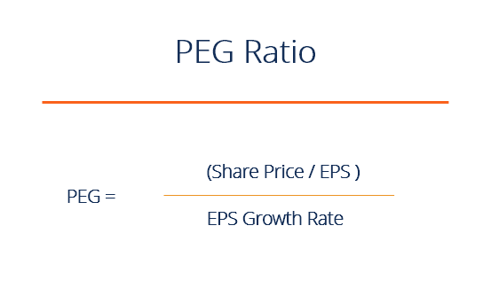

## Table of Contents

## What is the PEG Ratio?

The PEG Ratio, or Price/Earnings to Growth Ratio, is a way to measure a company's stock price. It takes the regular P/E (Price to Earnings) ratio and adds in the company's expected growth rate. This helps investors see if a stock is a good value when you think about how fast the company is growing.

A lower PEG Ratio can mean the stock is undervalued and might be a good buy. If the PEG Ratio is high, it might mean the stock is overvalued. But, the PEG Ratio isn't perfect. It relies on predictions about future growth, which can be wrong. So, it's best to use the PEG Ratio along with other ways to check a stock's value.

## How is the PEG Ratio calculated?

The PEG Ratio is calculated by dividing the P/E ratio of a company by its expected earnings growth rate. The P/E ratio is found by taking the current stock price and dividing it by the earnings per share (EPS). The expected earnings growth rate is usually given as a percentage and comes from what analysts think the company's earnings will grow over the next few years.

For example, if a company has a P/E ratio of 20 and its expected earnings growth rate is 10%, the PEG Ratio would be 20 divided by 10, which equals 2. A PEG Ratio of less than 1 is often seen as a sign that the stock might be undervalued, meaning it could be a good buy. But if the PEG Ratio is more than 1, it might mean the stock is overvalued, and you might want to be careful about buying it. Remember, the PEG Ratio is just one tool, and it's good to use it with other ways to check if a stock is a good investment.

## Why is the PEG Ratio important for investors?

The PEG Ratio is important for investors because it helps them figure out if a stock is a good buy. It's like a special tool that takes the P/E ratio and adds in how fast the company is growing. By looking at the PEG Ratio, investors can see if a stock's price is fair when you think about the company's future. If the PEG Ratio is low, it might mean the stock is undervalued and could be a good investment. But if it's high, it might mean the stock is overvalued and you might want to be careful.

Using the PEG Ratio can help investors make smarter choices. It's not perfect because it depends on guesses about future growth, which can be wrong. But it's still a helpful way to compare different stocks, especially when you're looking at companies that are growing at different speeds. By using the PEG Ratio along with other tools, investors can get a better idea of whether a stock is worth buying or not.

## What does a PEG Ratio of less than 1 indicate?

A PEG Ratio of less than 1 means that the stock might be a good buy. It suggests that the stock's price is low compared to how fast the company is growing. When the PEG Ratio is below 1, it tells investors that they might be getting a good deal because the stock's price isn't too high for the company's expected future growth.

But, it's important to remember that the PEG Ratio is just one tool. It relies on guesses about how the company will grow in the future, and these guesses can be wrong. So, while a PEG Ratio of less than 1 can be a good sign, it's best to use it along with other ways to check if a stock is a good investment.

## How does the PEG Ratio differ from the P/E Ratio?

The PEG Ratio and the P/E Ratio are both ways to check if a stock is a good buy, but they look at different things. The P/E Ratio, or Price to Earnings Ratio, compares a company's stock price to its earnings per share. It tells you how much you're paying for each dollar of the company's earnings. A low P/E Ratio might mean the stock is a good deal, but it doesn't think about how fast the company is growing.

The PEG Ratio, or Price/Earnings to Growth Ratio, takes the P/E Ratio and adds in the company's expected growth rate. This gives you a better idea of whether the stock's price is fair when you think about how fast the company is growing. If a company is growing quickly, a higher P/E Ratio might be okay, but the PEG Ratio helps you see if it's really a good value. So, the PEG Ratio is more complete because it thinks about growth, while the P/E Ratio just looks at the price and earnings.

## What are the limitations of using the PEG Ratio?

The PEG Ratio has some problems that investors should know about. One big problem is that it depends on guesses about how fast a company will grow in the future. These guesses can be wrong, and if they are, the PEG Ratio won't be very helpful. Also, different people might use different time periods to guess the growth rate, which can make the PEG Ratio different for the same company.

Another issue is that the PEG Ratio doesn't work well for all kinds of companies. For example, it's hard to use the PEG Ratio for companies that don't have steady earnings or that are losing money. These companies might have negative earnings, and you can't divide by a negative number to find the PEG Ratio. So, the PEG Ratio is best for companies that are growing and making money.

Because of these problems, it's a good idea to use the PEG Ratio along with other tools when you're trying to figure out if a stock is a good buy. It can help you see if a stock is a good value when you think about the company's growth, but it shouldn't be the only thing you look at. Using the PEG Ratio with other ways to check a stock's value can give you a better idea of whether it's a smart investment.

## Can the PEG Ratio be used for all types of companies?

The PEG Ratio is a helpful tool, but it doesn't work well for all types of companies. It's best for companies that are growing and making money. If a company has steady earnings and a clear growth path, the PEG Ratio can give you a good idea of whether the stock is a good value. But, if a company's earnings are up and down or if it's losing money, the PEG Ratio can be hard to use. That's because you need a positive earnings growth rate to calculate the PEG Ratio, and companies that are losing money can't give you that.

Also, the PEG Ratio depends a lot on guesses about how fast a company will grow in the future. If these guesses are wrong, the PEG Ratio won't be very helpful. Different people might use different time periods to guess the growth rate, which can make the PEG Ratio different for the same company. So, while the PEG Ratio can be a good tool for some companies, it's not perfect for all of them. It's best to use the PEG Ratio along with other ways to check a stock's value to get a full picture of whether it's a smart investment.

## How does growth rate affect the PEG Ratio?

The growth rate is super important for the PEG Ratio. It's like the secret sauce that makes the PEG Ratio work. The PEG Ratio is found by taking the P/E ratio and dividing it by the expected growth rate. So, if the growth rate is high, it makes the PEG Ratio smaller. A smaller PEG Ratio can mean the stock is a good buy because it's not too expensive for how fast the company is growing. But if the growth rate is low, the PEG Ratio gets bigger, which might mean the stock is too pricey for the company's future.

The tricky part is that the growth rate is just a guess about the future. If people guess wrong, the PEG Ratio won't be very helpful. Also, different people might use different time periods to guess the growth rate, which can make the PEG Ratio different for the same company. That's why it's smart to use the PEG Ratio along with other ways to check a stock's value. It can give you a good idea of whether a stock is a good deal when you think about the company's growth, but it's not the only thing you should look at.

## What is considered a good PEG Ratio?

A good PEG Ratio is usually less than 1. This means the stock's price is low compared to how fast the company is growing. When the PEG Ratio is below 1, it tells investors that they might be getting a good deal because the stock's price isn't too high for the company's expected future growth. But, what's considered good can change depending on the industry and the company's situation. Some industries might have higher growth rates, so a PEG Ratio a bit above 1 might still be okay.

It's important to remember that the PEG Ratio is just one tool. It relies on guesses about how the company will grow in the future, and these guesses can be wrong. So, while a PEG Ratio of less than 1 can be a good sign, it's best to use it along with other ways to check if a stock is a good investment. Looking at other things like the company's financial health, the industry it's in, and other valuation metrics can give you a better idea of whether the stock is really a good buy.

## How can the PEG Ratio be used in conjunction with other financial metrics?

The PEG Ratio is a helpful tool, but it works best when you use it with other financial metrics. For example, you can look at the company's P/E Ratio to see how much you're paying for each dollar of earnings. Then, use the PEG Ratio to see if that price is fair when you think about the company's growth. You can also look at the company's debt levels and cash flow to see if it's in good financial health. By using the PEG Ratio along with these other metrics, you get a fuller picture of whether the stock is a good buy.

Another way to use the PEG Ratio with other metrics is to compare it to the industry average. If a company's PEG Ratio is lower than the industry average, it might be a better deal than other companies in the same field. You can also look at the company's return on equity (ROE) to see how well it's using its money to make profits. By combining the PEG Ratio with these other metrics, you can make smarter choices about which stocks to buy. Remember, no single metric tells the whole story, so it's good to look at everything together.

## What are some real-world examples of PEG Ratio analysis?

Let's look at how the PEG Ratio can be used in real life. Imagine you're thinking about buying stock in a company called TechGrow Inc. TechGrow has a P/E Ratio of 30, which might seem high. But, analysts think TechGrow's earnings will grow by 20% each year. When you use the PEG Ratio, you divide the P/E Ratio by the growth rate: 30 divided by 20 equals 1.5. Even though the P/E Ratio is high, the PEG Ratio of 1.5 tells you that the stock might be a fair price when you think about how fast the company is growing. It's not a screaming deal, but it's not too expensive either.

Now, let's compare TechGrow to another company, SteadyCorp. SteadyCorp has a P/E Ratio of 15, and its expected growth rate is 5%. When you calculate the PEG Ratio for SteadyCorp, you get 15 divided by 5, which equals 3. Even though SteadyCorp's P/E Ratio is lower than TechGrow's, its PEG Ratio is higher. This means that SteadyCorp's stock might be overvalued compared to its growth. By looking at the PEG Ratio, you can see that TechGrow might be a better buy than SteadyCorp, even though its P/E Ratio is higher. This shows how the PEG Ratio can help you make smarter choices about which stocks to invest in.

## How do analysts adjust the PEG Ratio for different industries?

Analysts adjust the PEG Ratio for different industries because what's considered a good PEG Ratio can change depending on the industry. Some industries, like tech, usually grow faster than others, like utilities. So, a PEG Ratio that's a bit above 1 might still be okay in a fast-growing industry. But in a slower-growing industry, a PEG Ratio of less than 1 might be more important. Analysts look at the average PEG Ratio for companies in the same industry to see if a stock is a good deal compared to others in its field.

When analysts adjust the PEG Ratio, they also think about other things that might affect a company's growth, like the economy or new rules in the industry. They might use different time periods to guess the growth rate, too. For example, they might look at the next year's growth or the next five years' growth. By doing this, analysts can get a better idea of whether a stock's PEG Ratio is really a good value for that industry. This helps them give better advice to investors about which stocks might be good buys.

## What is the PEG Ratio?

The PEG ratio stands for Price/Earnings-to-Growth ratio and serves as a refinement of the Price-to-Earnings (P/E) ratio by incorporating earnings growth expectations. While the P/E ratio is calculated simply as a stock's market price per share divided by its earnings per share (EPS), the PEG ratio goes a step further by including the earnings growth rate in its calculation.

Mathematically, the PEG ratio is expressed as:

$$
\text{PEG Ratio} = \frac{\text{P/E Ratio}}{\text{EPS Growth Rate}}
$$

Where:
- **P/E Ratio** is the price of the stock divided by the earnings per share.
- **EPS Growth Rate** represents the expected rate of growth in the company's earnings.

Incorporating the EPS growth rate allows the PEG ratio to provide a more comprehensive assessment of a stock's value. It is especially useful in evaluating whether a stock is overvalued or undervalued in relation to its potential for earnings growth. Despite its comparative complexity over the P/E ratio, the PEG ratio offers a clearer perspective on valuation, particularly in environments where growth features prominently in investment evaluations. This makes it a more nuanced metric favored by many analysts and investors for assessing a stock's potential value.

## How do you calculate the PEG Ratio?

To calculate the PEG ratio, begin with the Price-to-Earnings (P/E) ratio, which is obtained by dividing the stock's current market price per share by its earnings per share (EPS). The formula to determine the P/E ratio is:

$$
\text{P/E Ratio} = \frac{\text{Price per Share}}{\text{Earnings per Share (EPS)}}
$$

Following this, identify the expected earnings growth rate. This growth rate reflects the anticipated percentage increase in a company's earnings over a specified period, often derived from analyst forecasts or company projections.

Once both the P/E ratio and the expected growth rate are available, calculate the PEG ratio using the following formula:

$$
\text{PEG Ratio} = \frac{\text{P/E Ratio}}{\text{EPS Growth Rate}}
$$

It is important to express the EPS growth rate in percentage terms when applying this formula. For example, if a company's earnings are expected to grow at 15% annually, use 15 as the growth rate in the PEG ratio calculation. A precise calculation of the PEG ratio requires accurate inputs; therefore, the reliability of analyst estimates for growth plays a significant role in determining this metric's accuracy.

## What is an Example of Using the PEG Ratio?

Consider two hypothetical companies, A and B, which are both evaluated based on their Price-to-Earnings (P/E) ratios and projected earnings growth rates. 

Company A has a P/E ratio of 20 and an expected earnings growth rate of 15% per year. Meanwhile, Company B exhibits a P/E ratio of 18 but has a higher anticipated growth rate of 20% annually. To calculate the PEG (Price/Earnings-to-Growth) ratio for these companies, we use the formula:

$$
\text{PEG Ratio} = \frac{\text{P/E Ratio}}{\text{EPS Growth Rate}}
$$

For Company A:
$$
\text{PEG Ratio for A} = \frac{20}{15} = 1.33
$$

For Company B:
$$
\text{PEG Ratio for B} = \frac{18}{20} = 0.90
$$

In this example, Company A has a higher PEG ratio of 1.33 compared to Company B’s lower PEG ratio of 0.90. Despite Company A's lower P/E ratio, its higher PEG ratio suggests it is less attractive as an investment when growth potential is factored into the assessment. 

The example underscores the significance of considering both growth expectations and valuation metrics to obtain a clearer understanding of a stock’s value. A lower PEG ratio like that of Company B generally signals a more favorable investment opportunity, reflecting a stock that is undervalued relative to its growth prospects. Thus, the PEG ratio can be a valuable tool for investors seeking to balance valuation with anticipated growth in their investment decisions.

## References & Further Reading

[1]: ["One Up On Wall Street: How To Use What You Already Know To Make Money In The Market"](https://www.amazon.com/One-Up-Wall-Street-Already/dp/0743200403) by Peter Lynch

[2]: Damodaran, A. (2012). ["Investment Valuation: Tools and Techniques for Determining the Value of Any Asset."](https://books.google.com/books/about/Investment_Valuation.html?id=5SRHAAAAQBAJ) John Wiley & Sons.

[3]: ["Valuation: Measuring and Managing the Value of Companies"](https://www.amazon.com/Valuation-Measuring-Managing-Companies-Finance/dp/1119610885) by McKinsey & Company Inc.

[4]: Basu, S. (1977). ["Investment performance of common stocks in relation to their price-earnings ratios: A test of the efficient market hypothesis."](https://www.semanticscholar.org/paper/Investment-Performance-of-Common-Stocks-in-Relation-Basu/44633e88f0bb1a068b07f5a90e111c4eb971a5a3) The Journal of Finance, 32(3), 663-682.

[5]: ["The Dhandho Investor: The Low-Risk Value Method to High Returns"](https://www.amazon.com/Dhandho-Investor-Low-Risk-Method-Returns/dp/047004389X) by Mohnish Pabrai

[6]: Fabozzi, F. J., Focardi, S. M., & Rachev, S. T. (2007). ["The Basics of Financial Econometrics."](https://onlinelibrary.wiley.com/doi/book/10.1002/9781118856406) John Wiley & Sons.