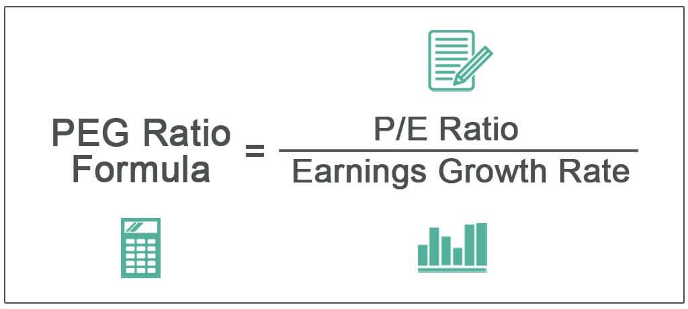

Investment analysis is a domain filled with complexity, where various metrics serve pivotal roles in evaluating stock value. Among these, the Price/Earnings-to-Growth (PEG) ratio stands out as a significant measure. This metric not only incorporates the essential Price-to-Earnings (P/E) ratio but also factors in expected earnings growth, offering a more holistic view of a stock's potential value. Consequently, the PEG ratio emerges as a critical tool for investors seeking to navigate the complexities of the market with greater precision.

As we examine the intricacies of the PEG ratio, this article dissects its calculation, interpretation, and application in algorithmic trading. The traditional P/E ratio, while useful, often falls short by overlooking future growth prospects. In contrast, the PEG ratio offers an expanded perspective by seamlessly integrating growth forecasts, making it an essential component in the valuation toolkit of modern investors.



In today's fast-paced financial markets, where rapid information dissemination profoundly influences investment decisions, the PEG ratio's capacity to provide a nuanced understanding of stock value becomes invaluable. This understanding is vital for investors aiming to make informed, strategic decisions based on comprehensive analyses, rather than relying on singular metrics. As financial platforms and automated trading systems increasingly incorporate sophisticated valuation indicators, the PEG ratio's relevance underscores the importance of a balanced approach that considers both growth and current valuation metrics.

## Table of Contents

## What is the PEG Ratio?

The PEG ratio stands for Price/Earnings-to-Growth ratio and serves as a refinement of the Price-to-Earnings (P/E) ratio by incorporating earnings growth expectations. While the P/E ratio is calculated simply as a stock's market price per share divided by its earnings per share (EPS), the PEG ratio goes a step further by including the earnings growth rate in its calculation.

Mathematically, the PEG ratio is expressed as:

$$
\text{PEG Ratio} = \frac{\text{P/E Ratio}}{\text{EPS Growth Rate}}
$$

Where:
- **P/E Ratio** is the price of the stock divided by the earnings per share.
- **EPS Growth Rate** represents the expected rate of growth in the company's earnings.

Incorporating the EPS growth rate allows the PEG ratio to provide a more comprehensive assessment of a stock's value. It is especially useful in evaluating whether a stock is overvalued or undervalued in relation to its potential for earnings growth. Despite its comparative complexity over the P/E ratio, the PEG ratio offers a clearer perspective on valuation, particularly in environments where growth features prominently in investment evaluations. This makes it a more nuanced metric favored by many analysts and investors for assessing a stock's potential value.

## Calculating the PEG Ratio

To calculate the PEG ratio, begin with the Price-to-Earnings (P/E) ratio, which is obtained by dividing the stock's current market price per share by its earnings per share (EPS). The formula to determine the P/E ratio is:

$$
\text{P/E Ratio} = \frac{\text{Price per Share}}{\text{Earnings per Share (EPS)}}
$$

Following this, identify the expected earnings growth rate. This growth rate reflects the anticipated percentage increase in a company's earnings over a specified period, often derived from analyst forecasts or company projections.

Once both the P/E ratio and the expected growth rate are available, calculate the PEG ratio using the following formula:

$$
\text{PEG Ratio} = \frac{\text{P/E Ratio}}{\text{EPS Growth Rate}}
$$

It is important to express the EPS growth rate in percentage terms when applying this formula. For example, if a company's earnings are expected to grow at 15% annually, use 15 as the growth rate in the PEG ratio calculation. A precise calculation of the PEG ratio requires accurate inputs; therefore, the reliability of analyst estimates for growth plays a significant role in determining this metric's accuracy.

## Interpreting the PEG Ratio

A lower PEG (Price/Earnings-to-Growth) ratio could suggest that a stock is undervalued in relation to its growth prospects. This metric is particularly insightful because it adjusts the Price-to-Earnings (P/E) ratio by factoring in the expected earnings growth, offering a broader perspective on a stock's valuation. A PEG ratio less than 1.0 is generally attractive, as it indicates that the stock might be undervalued compared to its anticipated growth rate. Conversely, a PEG ratio greater than 1.0 may imply overvaluation, signaling that the stock price might not justify the expected growth.

Despite the attractiveness of using a single numerical value to gauge valuation, interpreting the PEG ratio requires context. Industry norms can significantly affect the benchmark for an acceptable PEG ratio. For instance, high-growth sectors like technology may naturally exhibit higher PEG ratios due to robust growth expectations, making ratios slightly above 1.0 potentially acceptable. On the other hand, in more mature industries with stable but slow growth, even a PEG ratio less than 1.0 might warrant caution.

Additionally, specific company growth rates play a crucial role in determining the appropriateness of the PEG ratio. Analysts' growth forecasts, which form the basis of the PEG calculation, can be prone to inaccuracies; hence, it's essential to assess the reliability of these predictions. The ratio should not be used in isolation but rather as one component of a comprehensive analysis that includes a company's financial health, industry position, and broader economic factors. Understanding and acknowledging these factors can lead to more nuanced and informed investment decisions.

## Example of Using the PEG Ratio

Consider two hypothetical companies, A and B, which are both evaluated based on their Price-to-Earnings (P/E) ratios and projected earnings growth rates. 

Company A has a P/E ratio of 20 and an expected earnings growth rate of 15% per year. Meanwhile, Company B exhibits a P/E ratio of 18 but has a higher anticipated growth rate of 20% annually. To calculate the PEG (Price/Earnings-to-Growth) ratio for these companies, we use the formula:

$$
\text{PEG Ratio} = \frac{\text{P/E Ratio}}{\text{EPS Growth Rate}}
$$

For Company A:
$$
\text{PEG Ratio for A} = \frac{20}{15} = 1.33
$$

For Company B:
$$
\text{PEG Ratio for B} = \frac{18}{20} = 0.90
$$

In this example, Company A has a higher PEG ratio of 1.33 compared to Company B’s lower PEG ratio of 0.90. Despite Company A's lower P/E ratio, its higher PEG ratio suggests it is less attractive as an investment when growth potential is factored into the assessment. 

The example underscores the significance of considering both growth expectations and valuation metrics to obtain a clearer understanding of a stock’s value. A lower PEG ratio like that of Company B generally signals a more favorable investment opportunity, reflecting a stock that is undervalued relative to its growth prospects. Thus, the PEG ratio can be a valuable tool for investors seeking to balance valuation with anticipated growth in their investment decisions.

## Applying PEG Ratio in Algorithmic Trading

The PEG ratio serves as a valuable tool in [algorithmic trading](/wiki/algorithmic-trading), offering a way to enhance investment strategies by integrating stock valuation with growth potential. By using this ratio, algorithmic trading systems can automate the process of identifying stocks that are potentially undervalued when accounting for future growth. The fundamental concept is to refine portfolio selection by considering both current valuation and prospective performance.

To operationalize the PEG ratio in automatic trading systems, traders often incorporate it into their algorithmic filters. This process involves programming the trading algorithms to assess the PEG ratios of stocks continuously, alongside other relevant quantitative metrics. The goal is to identify stocks with low PEG ratios, which may indicate an undervaluation relative to their expected growth prospects.

For instance, a Python-based trading algorithm could be designed to continuously query financial data APIs for P/E ratios and forecasted growth rates. The algorithm might be structured to compute the PEG ratio using the formula:

```python
def calculate_peg_ratio(pe_ratio, growth_rate):
    try:
        peg = pe_ratio / growth_rate
    except ZeroDivisionError:
        peg = float('inf')  # Handling division by zero if growth rate is zero
    return peg
```

Once the PEG ratio is computed, the algorithm can rank stocks based on their ratios and identify target stocks trading with a PEG ratio below a predetermined threshold. Additionally, to increase trading strategy robustness, the algorithm can be supplemented with other financial metrics such as debt ratios, dividends, or cash flows.

This multi-dimensional approach allows for a more nuanced assessment of investment opportunities. By integrating PEG ratios within sophisticated trading models, investors can refine their strategies to better align with growth-adjusted values. Consequently, this approach aligns the dual objectives of maximizing returns and managing risks, thereby positioning investors to capitalize on growth opportunities efficiently. Ultimately, the incorporation of the PEG ratio in trading algorithms exemplifies a modern, systematic investment approach empowered by quantitative financial analysis.

## Challenges and Considerations

The PEG ratio, although a powerful tool for evaluating stock potential, relies heavily on accurate growth estimates, which are subject to inherent uncertainties. The reliability of these estimates is crucial, as the growth rate directly influences the PEG ratio's output. Financial analysts typically base these growth projections on historical data, market trends, and macroeconomic factors, but various elements can cause deviations, such as sudden economic shifts or company-specific events. Consequently, investors must approach these estimates with caution and routinely update them to reflect the most current information.

The variability across different industries further complicates the application of the PEG ratio. Industries characterized by rapid technological advancements or cyclical growth, like technology or energy, may exhibit distinct growth patterns compared to more stable sectors like utilities. Therefore, it is inappropriate to apply a universal PEG threshold across all industries. Investors should tailor PEG benchmarks to align with industry-specific growth trajectories, ensuring a fair comparison.

Moreover, while the PEG ratio offers valuable insights, it should not be the sole determinant of investment decisions. A comprehensive analysis combining qualitative and quantitative factors is necessary for robust decision-making. Qualitative aspects such as management quality, competitive positioning, and regulatory environment should complement quantitative measures. For instance, conducting a SWOT analysis (Strengths, Weaknesses, Opportunities, Threats) can provide additional context that balances the numerical insights provided by the PEG ratio. Integrating these diverse aspects creates a well-rounded view, mitigating the risks associated with reliance on a single metric.

In summary, while the PEG ratio is an effective tool for stock valuation, its accuracy is contingent upon precise growth estimates and contextual industry application. By combining it with broader analyses, investors can enhance their investment strategies, ensuring that decisions are informed by a complete financial landscape view.

## Conclusion

The PEG ratio stands as a vital metric in the financial analysis landscape, providing a more comprehensive valuation of a stock by accounting for its growth prospects. Contrary to traditional valuation metrics like the Price-to-Earnings (P/E) ratio, the inclusion of earnings growth rates in the PEG ratio offers investors a dynamic perspective on a company's potential. This enhanced view aids in identifying stocks that are undervalued relative to their growth, thereby facilitating more informed investment choices.

In the context of automated trading, the PEG ratio adds a new layer of precision to investment strategies. By balancing valuation with growth, algorithmic systems can be programmed to target stocks with favorable PEG values, thus optimizing portfolios for long-term gains. Integrating the PEG ratio into algorithmic trading frameworks allows for the development of strategies that are finely tuned to market adjustments, potentially increasing returns while managing risk more effectively.

Ultimately, a nuanced understanding of the PEG ratio unlocks sharper, data-driven decisions in today's volatile financial markets. It enables investors to deploy capital more strategically, ensuring investment choices are aligned with both current market conditions and prospective growth opportunities. As the financial environment becomes increasingly complex and competitive, mastering the insights provided by the PEG ratio can significantly enhance an investor's ability to achieve sustained success.

## References & Further Reading

[1]: ["One Up On Wall Street: How To Use What You Already Know To Make Money In The Market"](https://www.amazon.com/One-Up-Wall-Street-Already/dp/0743200403) by Peter Lynch

[2]: Damodaran, A. (2012). ["Investment Valuation: Tools and Techniques for Determining the Value of Any Asset."](https://books.google.com/books/about/Investment_Valuation.html?id=5SRHAAAAQBAJ) John Wiley & Sons.

[3]: ["Valuation: Measuring and Managing the Value of Companies"](https://www.amazon.com/Valuation-Measuring-Managing-Companies-Finance/dp/1119610885) by McKinsey & Company Inc.

[4]: Basu, S. (1977). ["Investment performance of common stocks in relation to their price-earnings ratios: A test of the efficient market hypothesis."](https://www.semanticscholar.org/paper/Investment-Performance-of-Common-Stocks-in-Relation-Basu/44633e88f0bb1a068b07f5a90e111c4eb971a5a3) The Journal of Finance, 32(3), 663-682.

[5]: ["The Dhandho Investor: The Low-Risk Value Method to High Returns"](https://www.amazon.com/Dhandho-Investor-Low-Risk-Method-Returns/dp/047004389X) by Mohnish Pabrai

[6]: Fabozzi, F. J., Focardi, S. M., & Rachev, S. T. (2007). ["The Basics of Financial Econometrics."](https://onlinelibrary.wiley.com/doi/book/10.1002/9781118856406) John Wiley & Sons.